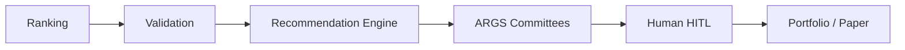

# ADR-021: Recommendation Platform Architecture (Phase 2)

**Status:** Accepted (PO sign-off 2026-06-04)  
**Date:** 2026-06-05  
**Deciders:** Product Owner, Phase 2 PRD review  
**Supersedes:** N/A — new governing document for Phase 2 implementation  
**Related:** [PO_SIGNOFF_2026_06_04.md](../po/PO_SIGNOFF_2026_06_04.md), [14_ARCHITECTURE_IMPACT_ANALYSIS.md](../product/14_ARCHITECTURE_IMPACT_ANALYSIS.md)

---

## Context

Pi-PM has mature **deterministic ranking** and **validation** but no unified **recommendation** layer between validation and ARGS. Stakeholders conflate rankings with trade actions. Phase 2 introduces a Recommendation Platform governed by product PRDs in `context/canonical/product/`.

---

## Decision

Adopt a **Recommendation Platform** with:

1. **Recommendation Engine** — deterministic actions (`BUY`, `WATCH`, `HOLD`, `EXIT_APPROVED`, `REJECT`)
2. **Conviction scoring** — deterministic 0–100, five inputs only (no committee)
3. **RecommendationOutcome** — post-hoc performance tracking
4. **Human-in-the-loop** — mandatory approval for entries and exits
5. **ARGS advisory** — research governance parallel to machine decisions
6. **Portfolio + paper** — capital simulation before live broker

---

## 1. Why the Recommendation Engine exists

| Problem | Resolution |
|---------|------------|
| Rankings are not actions | Explicit `action` enum with audit trail |
| Validation IC not wired to UX | Validation strength feeds conviction and reason codes |
| Exit research is analytics-only | Live `EXIT_APPROVED` with human confirm |
| ARGS labels confused with trades | Machine action separate from committee advisory |

The engine is the **only** component authorized to emit trade-oriented actions for the swing book ([01_RECOMMENDATION_ENGINE_PRD.md](../product/01_RECOMMENDATION_ENGINE_PRD.md)).

---

## 2. Why it sits between Validation and ARGS

| Ordering | Rationale |
|----------|-----------|
| After validation | Statistical evidence gates and caps conviction |
| Before ARGS | Packets include deterministic `recommendation` block; committees **review** a proposal, not invent it |
| Before portfolio | Slots and limits constrain `BUY`; portfolio reads machine state |

**Violation:** Running ARGS before recommendation for trade decisions — **rejected**.

---

## 3. Why conviction is deterministic

| Requirement | Reason |
|-------------|--------|
| No LLM in conviction | Prevents indirect LLM influence on capital decisions |
| No committee weight | Committee labels are LLM-produced narratives; even deterministic mapping of labels was removed (PO 2026-06-04) |
| Five inputs only | Ranking quality, validation strength, factor analytics, regime alignment, exit health |

Conviction influences **sorting and band caps** within the top pool — it must replay byte-stable ([02_CONVICTION_SCORING_PRD.md](../product/02_CONVICTION_SCORING_PRD.md)).

---

## 4. Why committees are advisory

| ARGS may | ARGS may not |
|----------|--------------|
| Store, display, explain research | Change `conviction_score`, `conviction_band`, `action` |
| Emit `APPROVE` / `WATCH` / `REJECT` / `EXIT_APPROVED` / `HIGH_CONCERN` advisory | Size positions, approve trades, rerank |
| Disagree with machine in UI | Override `REJECT` → `BUY` without human |

Committee effectiveness is **measured** in [16_RECOMMENDATION_PERFORMANCE_PRD.md](../product/16_RECOMMENDATION_PERFORMANCE_PRD.md) — never fed back into generation.

---

## 5. Why human approval is mandatory

| Transition | Human |
|------------|-------|
| CANDIDATE → APPROVED (entry) | Required |
| EXIT_APPROVED → CLOSED (exit) | Required |
| Broker / paper fill | Confirms execution |

Machines **propose**; humans **commit capital** ([11_HUMAN_IN_LOOP_EXECUTION_PRD.md](../product/11_HUMAN_IN_LOOP_EXECUTION_PRD.md)).

---

## 6. Why portfolio construction is separated

| Concern | Owner |
|---------|-------|
| What to recommend | Recommendation Engine |
| How much capital | Portfolio Engine (deterministic sizing) |
| Whether filled | Paper / broker execution |

Portfolio enforces slots, sector limits, and cash — returns `PORTFOLIO_FULL` / `SECTOR_LIMIT_REACHED` reason codes ([16_WHY_NOT_RECOMMENDED_FRAMEWORK.md](../product/16_WHY_NOT_RECOMMENDED_FRAMEWORK.md)). LLMs do not size positions (MVP or future formula in [05](../product/05_PORTFOLIO_ENGINE_PRD.md) §10).

---

## 7. Why paper trading precedes live investing

| Stage | Purpose |
|-------|---------|
| Paper | Reconcile fills → positions → `RecommendationOutcome` without capital risk |
| Live | Broker adapter after HITL + attribution prove book integrity |

Populates trust metrics and [17_TRUST_DASHBOARD_VISION.md](../product/17_TRUST_DASHBOARD_VISION.md) before real money.

---

## Consequences

### Positive

- Clear separation: rank → validate → recommend → research → human → portfolio
- Full traceability and why-not explainability
- Performance loop via `RecommendationOutcome` without contaminating deterministic core

### Negative / cost

- New tables, batch phase, APIs (P1–P2)
- ARGS packet builder and mobile DTO extensions
- Team discipline to block PRs that import LLM into conviction/ranking

---

## Compliance checklist (implementation PRs)

- [ ] No OpenAI in `app/recommendation/` conviction path
- [ ] Committee fields not read in conviction calculator
- [ ] `reason_codes` populated for non-BUY outcomes
- [ ] Human approval enforced on state transitions
- [ ] Lineage: `ranking_run_id` on every recommendation row

---

## References

- [GOVERNANCE_DESIGN.md](../AI/03_DESIGN/GOVERNANCE_DESIGN.md)
- [01_RECOMMENDATION_ENGINE_PRD.md](../product/01_RECOMMENDATION_ENGINE_PRD.md)
- [PO_SIGNOFF_2026_06_04.md](../po/PO_SIGNOFF_2026_06_04.md)
