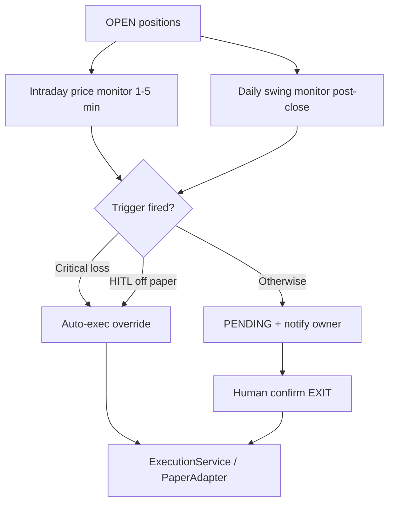

# ADR-033: Intraday Exit Monitor, Stop Override & Notifications

**Status:** Proposed  
**Date:** 2026-06-05  
**Deciders:** Product Owner (required), Principal Quant Platform Engineer, Risk Owner  
**Supersedes:** N/A — extends and qualifies ADR-028, ADR-030, ADR-031  
**Related:** [ADR-030](./ADR-030-Live-Investing-Architecture.md), [ADR-031](./ADR-031-Unified-Execution-Architecture.md), [07_EXIT_DECISION_FRAMEWORK.md](../product/07_EXIT_DECISION_FRAMEWORK.md), [18_HUMAN_IN_LOOP_LIVE_INVESTING_PRD.md](../product/18_HUMAN_IN_LOOP_LIVE_INVESTING_PRD.md), [21_EXECUTION_WORKFLOW_PRD.md](../product/21_EXECUTION_WORKFLOW_PRD.md), [LIVE_TRADING_SAFETY_CHECKLIST.md](../runbooks/LIVE_TRADING_SAFETY_CHECKLIST.md)

---

## Context

`ExitMonitorService` today evaluates **OPEN** positions only (`portfolio_positions` where `position_status=OPEN` and `is_current=true`). It runs:

| Invocation | Cadence | Price input |
|------------|---------|-------------|
| `PaperPilotOps.run()` inside daily batch | **Once per trading day** (when `phases.portfolio=true` and paper pilot flags allow) | Latest **daily close** from `market_data` |
| `POST /api/v1/portfolio/exits/run` | Manual | Same |
| Historical replay | Once per simulated day | Same |

Triggers include rank deterioration, alpha decay, regime change, time stop (30 sessions), **stop loss (−8% unrealized)**, and trailing stop (5% from peak). Fired triggers create **`portfolio_exit_recommendations`** rows (`PENDING`) for human confirmation before sell — except when `pilot_auto_execute=true` in unattended paper mode.

**ADR-030 invariant:** “Stages S1–S2 never bypass human approval for entries or exits.”

**Observed gap (stakeholder concern):** A position can lose **10–12% intraday** while the monitor runs only **post-close or next day**, using **EOD close** only. Loss can deepen overnight and across sessions before `EXIT_STOP_LOSS` surfaces and before the owner confirms. This is unacceptable for **live capital protection** even if tolerable for **swing research** and **paper simulation**.

---

## Problem

| Risk | Today | Impact |
|------|-------|--------|
| **Intraday drawdown** | Monitor sees close, not session low | −12% at 14:00, −5% at close → **no stop fired** |
| **Next-day batch** | Exit signal delayed to T+1 | Additional gap/session loss before alert |
| **HITL confirm delay** | PENDING exit until owner acts | Price moves further after −8% signal |
| **No notifications** | Dashboard `pending_exits` only | Owner must poll UI |
| **No broker stop** | App-level advisory only | No exchange/broker hard floor |

Exit Monitor is correctly scoped to **OPEN positions** (not WATCH recommendations). The failure mode is **cadence, price granularity, and execution latency** — not scope.

---

## Decision (proposed)

Adopt a **two-tier exit monitor** with **optional HITL bypass on critical loss**, **owner notifications**, and **broker stop as primary live protection**.

### 1. Two-tier monitor (split responsibilities)

Do **not** rerun the full daily trigger set every minute. Split by data dependency:

| Tier | Name | Cadence | Triggers | Data source |
|------|------|---------|----------|-------------|
| **T1** | **Intraday price monitor** | Configurable: default **every 1–5 minutes** during NSE cash session (09:15–15:30 IST) | `EXIT_STOP_LOSS`, `EXIT_TRAILING_STOP`, optional **gap** rule | **Live or delayed LTP** (broker feed / Kite quote API) |
| **T2** | **Daily swing monitor** | **Once post-close** (existing batch) | `EXIT_RANK_DROP`, `EXIT_ALPHA_DECAY`, `EXIT_REGIME`, `EXIT_TIME`, concentration, liquidity | Daily `market_data` close + ranking runs |

T1 and T2 both write to the **same** `portfolio_exit_recommendations` table (or unified exit queue per ADR-030), with a new field `monitor_tier: INTRADAY | DAILY` for audit.

### 2. Stop-loss policy (PO-tunable)

| Threshold | Default | Behaviour (proposed) |
|-----------|---------|----------------------|
| **Advisory stop** | **−8%** unrealized vs `avg_cost` | Create/update `PENDING` exit (`EXIT_STOP_LOSS`, urgency `HIGH`); **notify** owner |
| **Critical stop (auto override)** | **−10%** unrealized | **Bypass HITL** → immediate SELL intent (see §3) |
| **Broker GTC stop (live S1+)** | **−8%** (PO) | Placed at fill via `BrokerAdapter`; **primary** intraday protection |

**Note:** Code today uses **−8%** in `exit_monitor/service.py`; PRD 07 cites **−6%**. PO must pick one **advisory** threshold and one **auto-override** threshold at sign-off.

### 3. HITL bypass rules (qualified ADR-030)

ADR-030’s “no bypass” rule is amended **only** for exits meeting **all** of:

| Condition | Auto-exec allowed? |
|-----------|-------------------|
| `execution_mode=PAPER` and `HITL_ENABLED=false` | **Yes** (existing paper pilot — unchanged) |
| `unrealized_pnl_pct <= critical_stop_pct` (default **−10%**) | **Yes** — **risk circuit breaker** |
| `urgency=CRITICAL` and trigger ∈ `{EXIT_STOP_LOSS, EXIT_TRAILING_STOP}` | **Yes** (same episode, idempotent) |
| All other exits (rank, regime, time, −8% advisory) | **No** — HITL confirm required in S1/S2 |

**Live S1+ additional requirements before auto-exec:**

- `ENABLE_LIVE_TRADING=true` and explicit PO flag `AUTO_EXIT_ON_CRITICAL_STOP=true`
- `RiskControlService` pre-trade check (allow SELL even when entries blocked)
- Full `execution_events` audit: `actor_id=system`, `reason=AUTO_EXIT_RISK_OVERRIDE`
- **Kill switch** (`ENABLE_LIVE_TRADING=false`) blocks auto-exec same as manual

**Entries are never auto-bypassed.**

### 4. Notifications (owner awareness)

When a trigger fires and auto-exec **does not** run, notify the owner:

| Urgency | Channels (proposed) | Content |
|---------|---------------------|---------|
| `CRITICAL` | In-app banner + push (optional email) | Symbol, trigger, unrealized %, “Auto-exit executed” or “Confirm within N min” |
| `HIGH` | In-app + EXIT tab badge + dashboard `pending_exits` | Stop / rank exit candidate |
| `NORMAL` | In-app digest (batch) | Time stop approaching, etc. |

**Rules:**

- Notify on **new** trigger or **severity upgrade** only — not every minute with unchanged state.
- Deduplicate per `(position_id, trigger_code, trading_session_date)`.
- Notification does **not** replace audit rows in `portfolio_exit_recommendations`.

### 5. Live: broker stop as primary

For **S1 live**, intraday app polling is **backup**, not the only guard:

1. On **BUY fill confirm**, `BrokerAdapter` places **GTC stop-loss** at PO % (default −8% from `avg_cost`).
2. Intraday T1 monitor reconciles broker stop vs app state; escalates if broker order missing/rejected.
3. Auto-exec at −10% remains **last-resort** if broker stop failed.

Paper (S0) may simulate broker stops without real orders.

### 6. Scheduling & ops

| Job | Schedule | Enabled when |
|-----|----------|--------------|
| `intraday_exit_monitor` | Cron/worker every **N minutes** (PO default: 5) within NSE session | `INTRADAY_EXIT_MONITOR_ENABLED=true` |
| `daily_exit_monitor` | Existing daily batch post-close | `exit_monitor=true` in portfolio phases (always recommended) |

**Calendar:** NSE holidays skipped; no runs outside cash session unless PO enables pre-market/post-market later.

**HITL_ENABLED=true:** Daily batch should **still** run T2; T1 runs via separate scheduler (today T1/T2 are bundled only inside `PaperPilotOps` when paper auto-execute is on — see Implementation gap).

### 7. Non-goals

- Monitoring **WATCH** / **BUY** candidates (no open position).
- Intraday **rank/regime** recomputation every minute (stays on T2).
- LLM-generated exit decisions.
- Replacing human exit for **discretionary** swing exits (rank decay, time stop) in S1 — notification + HITL remain default.

---

## Consequences

### Positive

- Closes intraday loss gap between **−8% policy** and **next-day discovery**.
- Clear **circuit breaker** at −10% without abandoning HITL for normal exits.
- Notifications reduce reliance on polling Recommendations / Dashboard.
- Broker stop + app monitor **defense in depth** for live.

### Negative / cost

- **Live quote dependency** (Kite/broker API uptime, rate limits).
- **ADR-030 invariant** must be documented as **qualified** — PO and legal/compliance review for auto-sell.
- Idempotency complexity: minute cadence + auto-exec must not double-sell.
- Operational burden: on-call for failed broker stops, stale quotes, notification delivery.
- Paper pilot metrics change if intraday stops fire more often than daily close model.

### Risks if not implemented

- Live positions may exceed PO stop policy before owner sees EXIT tab.
- Stakeholder loss of trust in “stop loss” messaging when only EOD advisory exists.

---

## Current implementation gaps (as-is, 2026-06-05)

| Gap | Location |
|-----|----------|
| Single daily cadence | `ExitMonitorService.run()`; batch-only invocation |
| EOD close price only | `_build_position_context` → `get_latest_market_data` (no `as_of`, no LTP) |
| Exit monitor skipped when `HITL_ENABLED=true` | `daily_batch_service.py` — `PaperPilotOps` only if `should_execute_paper_trades` |
| `stop_loss_price` on DB model; not exposed on position API/UI | `portfolio_positions` schema |
| No notification service | Alerts framework pilot-only (`app/ops/pilot/alerting.py`) |
| Dedup one PENDING per position **per calendar day** | May block legitimate intraday re-alert — needs session-aware dedup |

**No code change required** until PO accepts this ADR.

---

## Implementation checklist (if PO accepts)

| # | Item | Tier |
|---|------|------|
| 1 | `portfolio_config` or env: `intraday_exit_monitor_enabled`, `intraday_interval_sec`, `advisory_stop_pct`, `critical_stop_pct`, `auto_exit_on_critical_stop` | Config |
| 2 | `IntradayExitMonitorService` — price triggers only; inject `QuoteProvider` | T1 |
| 3 | Refactor `ExitMonitorService` → T2 daily swing; shared trigger eval | T2 |
| 4 | Run T2 from daily batch **independent** of `should_execute_paper_trades` | Ops |
| 5 | `QuoteProvider` adapter (Kite quote / paper last-close fallback) | Data |
| 6 | Auto-exec path in `ExecutionService` with `AUTO_EXIT_RISK_OVERRIDE` audit | Exec |
| 7 | Broker GTC stop on BUY fill (`BrokerAdapter.place_stop_order`) | Live |
| 8 | Notification service + subscription prefs; wire to `urgency` | UX |
| 9 | Frontend: stop price display on open positions; critical alert banner | UX |
| 10 | Idempotency keys: `intraday-exit:{position_id}:{trigger}:{session_date}` | Safety |
| 11 | Tests: minute dedup, −9% notify only, −10% auto-exec, HITL on rank exit | QA |
| 12 | Update ADR-030 §1 invariant footnote; LIVE_TRADING_SAFETY_CHECKLIST | Docs |

---

## PO decision required

- [ ] **A.** Reject intraday monitor — reaffirm **daily EOD only** + broker stop mandatory for live.
- [ ] **B.** Accept **T1 intraday (price triggers only)** at interval: _____ minutes (default 5).
- [ ] **C.** Accept **critical auto-exec** at _____ % loss (default **−10%**) for S1 live.
- [ ] **D.** Accept **advisory stop** at _____ % (default **−8%**) with notification + HITL.
- [ ] **E.** Require **broker GTC stop** at entry for live (recommended regardless of B/C).
- [ ] **F.** Notification channels: in-app only / push / email.
- [ ] **G.** Paper pilot: enable T1 with simulated quotes before live.

**Sign-off:** _________________ Date: _________

---

## References

- `app/portfolio/exit_monitor/service.py` — daily monitor, −8% hardcoded
- `app/portfolio/exit_monitor/triggers.py` — `EXIT_STOP_LOSS`, `EXIT_TRAILING_STOP`
- `app/ops/daily_batch/paper_pilot_ops.py` — batch invocation
- `app/ops/hitl/gate.py` — `should_execute_paper_trades`
- `context/canonical/product/07_EXIT_DECISION_FRAMEWORK.md` — trigger catalogue
- `context/canonical/runbooks/LIVE_TRADING_SAFETY_CHECKLIST.md` — go-live gates
