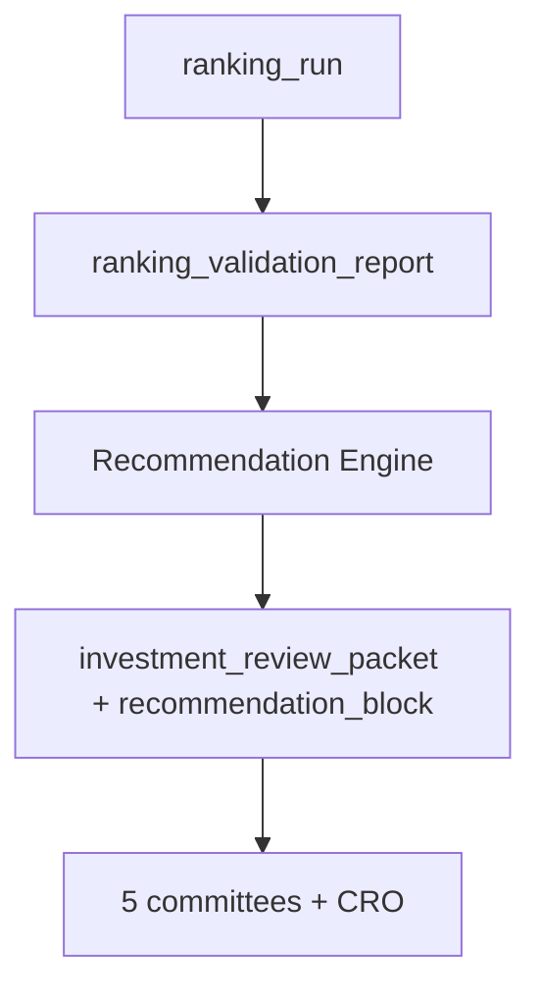

# Recommendation Engine — Product Requirements

**Version:** Phase 2.1 (PO sign-off 2026-06-04)  
**Date:** 2026-06-05  
**Status:** Not implemented — gap confirmed in [10_RECOMMENDATION_ENGINE_GAP_ANALYSIS.md](../po-discovery/10_RECOMMENDATION_ENGINE_GAP_ANALYSIS.md)

---

## 1. Purpose

Transform **validated ranked stocks** into **auditable product recommendations** with explicit actions. The Recommendation Engine is the **only** system component authorized to emit `BUY`, `WATCH`, `HOLD`, `EXIT_APPROVED`, or `REJECT` for the swing book.

It sits **after Validation** and **before ARGS** so committees review packets that already include a deterministic recommendation stub and conviction score ([04_RECOMMENDATION_LIFECYCLE.md](../product/04_RECOMMENDATION_LIFECYCLE.md)).

**Not in scope:** LLM-generated actions, position sizing, broker orders.

---

## 2. Problem statement

| Today | Gap |
|-------|-----|
| `GET /api/v1/rankings/{run_id}/top` returns ordered scores | No action enum |
| Validation reports IC/deciles | Not wired to per-stock action |
| Exit research APIs are analytics | No live `exit_signal` |
| ARGS emits `supportive/neutral/cautious` | Not trade actions ([`CommitteeResearchLabel`](../../app/workspace_args/constants.py)) |

---

## 3. Pipeline position



**Batch integration (target):** New phase after `VALIDATION`, before optional `ARGS` trigger in daily batch ([`daily_batch_service.py`](../../app/services/daily_batch_service.py) — product insertion point only).

---

## 4. Inputs

| Input | Source module / API | Required | Notes |
|-------|---------------------|----------|-------|
| Ranking run + results | `app/ranking/`, `GET /rankings/*` | Yes | Strategies: `momentum_v1`, `breakout_v1` only ([registry](../../app/ranking/registry.py)) |
| Validation report | `app/validation/`, per `ranking_run_id` | Yes | Status `completed` or `insufficient_data` — latter caps conviction ([02](../product/02_CONVICTION_SCORING_PRD.md)) |
| Regime snapshot | `GET /observability/regime/current`, `regime_policy_decisions` | Yes | Gates max new BUYs ([05](../product/05_PORTFOLIO_ENGINE_PRD.md)) |
| Factor IC context | `app/factor_analytics/` | Optional | Strategy-day factor health |
| Exit research thresholds | `app/workspace_exit_research/` reports | For ACTIVE positions | Rank deterioration, alpha decay, regime transition |
| Portfolio positions | `portfolio_positions` (future) | For HOLD/EXIT | Today stub — [11_PORTFOLIO](../po-discovery/11_PORTFOLIO_ENGINE_GAP_ANALYSIS.md) |
| ARGS prior run | `research_runs` | Optional | Prior committee output — **store/display/explain only**; **must not** affect conviction or `action` |
| Recommendation config | PO-tuned versioned JSON | Yes | Version string on each `recommendation_run` |

---

## 5. Outputs

### 5.1 Action enum

| Action | Meaning | Human required |
|--------|---------|----------------|
| `BUY` | Eligible new swing entry from top pool | Yes — promotes to APPROVED |
| `WATCH` | Top pool but gates not met (regime, conviction band, slot limit) | No |
| `HOLD` | Existing ACTIVE position; no exit trigger | No |
| `EXIT_APPROVED` | Deterministic exit trigger fired; awaits human confirm | Yes |
| `REJECT` | Failed validation tail, universe block, or explicit block rules | No |

### 5.2 Per-stock record (logical)

| Field | Type | Description |
|-------|------|-------------|
| `recommendation_id` | UUID | Stable id |
| `stock_id`, `symbol` | FK | NSE symbol |
| `ranking_run_id` | UUID | Provenance |
| `rank`, `composite_score` | int, decimal | From `ranking_results` — **not** reinterpreted by LLM |
| `action` | enum | Above |
| `conviction_score` | 0–100 | [02_CONVICTION_SCORING_PRD.md](../product/02_CONVICTION_SCORING_PRD.md) |
| `conviction_band` | enum | e.g. HIGH / MEDIUM / LOW / BLOCKED |
| `reason_codes` | string[] | Machine-readable — canonical codes in [16_WHY_NOT_RECOMMENDED_FRAMEWORK.md](../product/16_WHY_NOT_RECOMMENDED_FRAMEWORK.md) |
| `lifecycle_state` | enum | [04](../product/04_RECOMMENDATION_LIFECYCLE.md) |
| `as_of_date` | date | Session date |
| `strategy_name` | string | `momentum_v1` \| `breakout_v1` |
| `config_version` | string | Recommendation rules version |

### 5.3 ARGS packet block (deterministic)

Inject into `investment_review_packet.payload`:

```json
{
  "recommendation": {
    "action": "WATCH",
    "conviction_score": 62,
    "conviction_band": "MEDIUM",
    "reason_codes": ["RANK_POOL_TOP20", "VALIDATION_TAIL_PENDING"],
    "engine_version": "rec_v1.0.0",
    "ranking_run_id": "<uuid>"
  }
}
```

Replaces implicit interpretation of rank as buy. **Does not** change committee enum values.

---

## 6. Business rules (deterministic)

### 6.1 Entry (universe → BUY candidate)

| Rule ID | Condition | Outcome |
|---------|-----------|---------|
| R-ENTRY-01 | `rank` ≤ 20 AND validation `completed` | Eligible for scoring |
| R-ENTRY-02 | validation `insufficient_data` | Max action `WATCH`; reason `VALIDATION_PENDING` |
| R-ENTRY-03 | conviction_band = `BLOCKED` | `REJECT` |
| R-ENTRY-04 | conviction_band ≥ `MEDIUM` AND regime allows new risk AND slots available | `BUY` |
| R-ENTRY-05 | conviction_band = `LOW` OR slots full | `WATCH` |
| R-ENTRY-06 | Raw rank ≤ 5 AND calibration flag `rank_v2_promoted=false` | Cap conviction band at `MEDIUM` (rank inversion guard per [calibration root cause](../ranking-calibration-root-cause.md)) |

### 6.2 Hold

| Rule ID | Condition | Outcome |
|---------|-----------|---------|
| R-HOLD-01 | `lifecycle_state=ACTIVE` AND no exit trigger | `HOLD` |

### 6.3 Exit

| Rule ID | Condition | Outcome |
|---------|-----------|---------|
| R-EXIT-01 | ACTIVE + rank deterioration > PO threshold | `EXIT_APPROVED` |
| R-EXIT-02 | ACTIVE + alpha decay curve breach | `EXIT_APPROVED` |
| R-EXIT-03 | ACTIVE + regime transition to defensive | `EXIT_APPROVED` or `WATCH` per config |
| R-EXIT-04 | Swing holding period > 30 sessions | `EXIT_APPROVED` (time stop) |

Thresholds sourced from [07_EXIT_DECISION_FRAMEWORK.md](./07_EXIT_DECISION_FRAMEWORK.md) and exit research APIs (`/api/v1/analytics/exit/*`).

### 6.4 ARGS interaction

| Rule ID | Rule |
|---------|------|
| R-ARGS-01 | ARGS output **cannot** upgrade `REJECT` → `BUY` |
| R-ARGS-02 | ARGS may add `advisory_flags` on packet; human sees both |
| R-ARGS-03 | CRO synthesis never sets `action` field — [08](../product/08_AI_INVESTMENT_COMMITTEE_PRD.md) |
| R-ARGS-04 | Committee labels and `HIGH_CONCERN` never change `conviction_score`, `conviction_band`, or `action` |

---

## 7. Acceptance criteria

| ID | Criterion |
|----|-----------|
| AC-RE-01 | Given identical inputs (ranking_run, validation, regime, config), recommendation output is byte-stable (deterministic replay test). |
| AC-RE-02 | No recommendation record exists without `ranking_run_id` lineage. |
| AC-RE-03 | LLM committee run does not mutate `recommendation.action` or `conviction_score`. |
| AC-RE-04 | `BUY` count ≤ regime-based max slots ([05](../product/05_PORTFOLIO_ENGINE_PRD.md)). |
| AC-RE-05 | Every `EXIT_APPROVED` includes ≥1 `reason_code` mapped to exit research metric family. |
| AC-RE-06 | API exposes latest recommendations per strategy/as-of. |
| AC-RE-07 | Packet builder includes `recommendation` block when ARGS runs after RE phase. |

---

## 8. Workflows

### 8.1 Daily batch (happy path)

1. Ingest completes.
2. Ranking run completes (`ranking_runs.status=completed`).
3. Validation report attached.
4. **Recommendation run** executes for each strategy → N rows (top 20 + ACTIVE positions).
5. ARGS triggered for `BUY` + `WATCH` top-N subset (PO config).
6. Owner reviews mobile/HITL queue.

### 8.2 Owner approval

See [04_RECOMMENDATION_LIFECYCLE.md](../product/04_RECOMMENDATION_LIFECYCLE.md) and [11_HUMAN_IN_LOOP_EXECUTION_PRD.md](../product/11_HUMAN_IN_LOOP_EXECUTION_PRD.md).

### 8.3 Rejection audit

All `REJECT` and downgrades logged with `reason_codes` + input snapshot hash.

---

## 9. APIs (proposed)

| Method | Path | Purpose |
|--------|------|---------|
| POST | `/api/v1/recommendations/run` | Trigger for `ranking_run_id`(s) |
| GET | `/api/v1/recommendations/latest` | Latest by strategy/universe |
| GET | `/api/v1/recommendations/{run_id}` | Full run |
| GET | `/api/v1/recommendations/{run_id}/stocks/{symbol}` | Single card |
| GET | `/api/v1/recommendations/why-not/{symbol}` | Deterministic why-not-BUY ([16](../product/16_WHY_NOT_RECOMMENDED_FRAMEWORK.md)) |
| GET | `/api/v1/recommendations/queue` | Human approval queue (BUY + EXIT_APPROVED) |
| POST | `/api/v1/recommendations/{id}/approve` | Human promote CANDIDATE→APPROVED |
| POST | `/api/v1/recommendations/{id}/reject` | Human reject with note |

**Auth:** Required before external/mobile use ([12_MOBILE](../po-discovery/12_MOBILE_READINESS_ASSESSMENT.md)).

---

## 10. Dependencies

| Dependency | Status | Blocker level |
|------------|--------|---------------|
| Ranking + validation | Shipped | — |
| Conviction PRD | This pack | M1 |
| Data model + migrations | Spec [03](../product/03_RECOMMENDATION_DATA_MODEL.md) | M1 |
| Portfolio positions API | Missing | M2 for position-aware HOLD/EXIT |
| Exit threshold PO sign-off | Research APIs exist | M2 |
| Ranking v2 calibration | Research only | Soft gate for HIGH band |
| ARGS packet builder change | Shipped — extend payload | M1 |

---

## 11. Risks & mitigations

| Risk | Mitigation |
|------|------------|
| Users equate BUY with guaranteed return | UX copy + conviction band + validation status badge |
| Rank #1 overconfidence | R-ENTRY-06 cap until calibration promoted |
| ARGS “supportive” confusion | Separate labels; [08](../product/08_AI_INVESTMENT_COMMITTEE_PRD.md) |
| Validation tail | Show `insufficient_data` on card; block BUY |

---

## 12. References

- [10_RECOMMENDATION_ENGINE_GAP_ANALYSIS.md](../po-discovery/10_RECOMMENDATION_ENGINE_GAP_ANALYSIS.md)
- [VALIDATION_DESIGN.md](../design/VALIDATION_DESIGN.md)
- [EXIT_RESEARCH_DESIGN.md](../AI/03_DESIGN/EXIT_RESEARCH_DESIGN.md)
- [outcome-attribution-report.md](../outcome-attribution-report.md)
- [16_WHY_NOT_RECOMMENDED_FRAMEWORK.md](../product/16_WHY_NOT_RECOMMENDED_FRAMEWORK.md)
- [PO_SIGNOFF_2026_06_04.md](../po/PO_SIGNOFF_2026_06_04.md)
- [ADR-021-Recommendation-Platform-Architecture.md](../decisions/ADR-021-Recommendation-Platform-Architecture.md)
