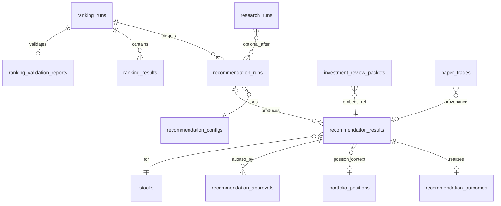

# Recommendation Data Model

**Version:** Phase 2.1 (PO sign-off 2026-06-04)  
**Date:** 2026-06-05  
**Extends:** [po-discovery 03_DOMAIN_MODEL.md](../po-discovery/03_DOMAIN_MODEL.md), [DATABASE_SCHEMA.md](../AI/08_DATA_MODEL/DATABASE_SCHEMA.md)

---

## 1. New entities overview

| Entity | Table | Purpose |
|--------|-------|---------|
| RecommendationRun | `recommendation_runs` | One execution per strategy/as-of (or per ranking_run) |
| RecommendationResult | `recommendation_results` | Per-stock action + conviction |
| RecommendationApproval | `recommendation_approvals` | Human HITL audit |
| RecommendationOutcome | `recommendation_outcomes` | Realized performance per recommendation (WIN/LOSS/BREAKEVEN/OPEN) |
| RecommendationConfig | `recommendation_configs` | Versioned rule weights (JSONB) |
| WatchlistItem | `watchlist_items` | Owner symbols (mobile) — optional M4 |

**Reuses (existing):** `ranking_runs`, `ranking_results`, `ranking_validation_reports`, `stocks`, `portfolio_positions`, `paper_trades`, ARGS tables.

---

## 2. ER diagram

---

## 3. Entity definitions

### 3.1 `recommendation_runs`

| Field | Type | Constraints | Description |
|-------|------|-------------|-------------|
| `id` | UUID | PK | |
| `ranking_run_id` | UUID | FK → `ranking_runs`, NOT NULL | Lineage |
| `strategy_name` | varchar(64) | NOT NULL | |
| `universe_code` | varchar(32) | NOT NULL | e.g. `NIFTY_500` |
| `as_of_date` | date | NOT NULL | |
| `status` | varchar(32) | NOT NULL | `pending`, `completed`, `failed` |
| `config_version` | varchar(32) | NOT NULL | e.g. `rec_v1.0.0` |
| `config_snapshot` | JSONB | NOT NULL | Frozen weights at run time |
| `regime_snapshot` | JSONB | | Regime id + policy decision refs |
| `input_hash` | varchar(64) | NOT NULL | SHA-256 of canonical inputs |
| `created_at` | timestamptz | NOT NULL | |
| `completed_at` | timestamptz | | |

**Indexes:**

- `ix_recommendation_runs_as_of_strategy` (`as_of_date`, `strategy_name`)
- `uq_recommendation_runs_ranking_run` UNIQUE (`ranking_run_id`)

### 3.2 `recommendation_results`

| Field | Type | Constraints | Description |
|-------|------|-------------|-------------|
| `id` | UUID | PK | |
| `recommendation_run_id` | UUID | FK, NOT NULL | |
| `stock_id` | UUID | FK → `stocks`, NOT NULL | |
| `rank` | int | | From ranking_results |
| `composite_score` | numeric(18,8) | | Copy for audit |
| `action` | varchar(32) | NOT NULL | BUY, WATCH, HOLD, EXIT_APPROVED, REJECT |
| `lifecycle_state` | varchar(32) | NOT NULL | See [04](../product/04_RECOMMENDATION_LIFECYCLE.md) |
| `conviction_score` | smallint | NOT NULL | 0–100 |
| `conviction_band` | varchar(16) | NOT NULL | |
| `conviction_components` | JSONB | NOT NULL | Sub-scores [02](../product/02_CONVICTION_SCORING_PRD.md) |
| `reason_codes` | JSONB | NOT NULL | string array — see [16_WHY_NOT_RECOMMENDED_FRAMEWORK.md](../product/16_WHY_NOT_RECOMMENDED_FRAMEWORK.md) |
| `portfolio_position_id` | UUID | FK nullable | When ACTIVE |
| `prior_recommendation_id` | UUID | FK self nullable | Chain for same symbol |
| `args_research_run_id` | UUID | FK nullable | Post-ARGS linkage |
| `updated_at` | timestamptz | NOT NULL | |

**Indexes:**

- `ix_rec_results_run_action` (`recommendation_run_id`, `action`)
- `ix_rec_results_stock_lifecycle` (`stock_id`, `lifecycle_state`)
- `uq_rec_results_run_stock` UNIQUE (`recommendation_run_id`, `stock_id`)

### 3.3 `recommendation_approvals`

| Field | Type | Constraints | Description |
|-------|------|-------------|-------------|
| `id` | UUID | PK | |
| `recommendation_result_id` | UUID | FK, NOT NULL | |
| `approval_type` | varchar(32) | NOT NULL | `ENTRY`, `EXIT` |
| `decision` | varchar(32) | NOT NULL | `APPROVED`, `REJECTED`, `DEFERRED` |
| `actor_id` | varchar(128) | NOT NULL | Owner user id (future auth) |
| `note` | text | | |
| `decided_at` | timestamptz | NOT NULL | |
| `idempotency_key` | varchar(64) | UNIQUE | |

### 3.4 `recommendation_outcomes`

One row per `recommendation_result` tracking realized performance. Populated on fill/close (paper or live). Foundation for [16_RECOMMENDATION_PERFORMANCE_PRD.md](../product/16_RECOMMENDATION_PERFORMANCE_PRD.md) and trust metrics.

| Field | Type | Constraints | Description |
|-------|------|-------------|-------------|
| `id` | UUID | PK | |
| `recommendation_result_id` | UUID | FK → `recommendation_results`, UNIQUE, NOT NULL | Lineage to machine recommendation |
| `entry_date` | date | NOT NULL | First fill date |
| `exit_date` | date | nullable | Flat date; null while open |
| `entry_price` | numeric(18,8) | NOT NULL | Fill price |
| `exit_price` | numeric(18,8) | nullable | Exit fill |
| `max_gain_pct` | numeric(10,4) | | Peak favorable move while open |
| `max_drawdown_pct` | numeric(10,4) | | Peak adverse move while open |
| `days_held` | int | | Session days entry→exit |
| `exit_reason` | varchar(64) | | e.g. rank_deterioration, time_stop, human_exit |
| `benchmark_return_pct` | numeric(10,4) | | Nifty or strategy benchmark over hold |
| `alpha_pct` | numeric(10,4) | | Position return − benchmark |
| `target_hit` | boolean | NOT NULL default false | ~10% swing target |
| `stop_hit` | boolean | NOT NULL default false | PO stop policy |
| `outcome_status` | varchar(16) | NOT NULL | `WIN`, `LOSS`, `BREAKEVEN`, `OPEN` |
| `created_at` | timestamptz | NOT NULL | |
| `updated_at` | timestamptz | NOT NULL | |

**Indexes:**

- `uq_recommendation_outcomes_result` UNIQUE (`recommendation_result_id`)
- `ix_recommendation_outcomes_status` (`outcome_status`, `exit_date`)
- `ix_recommendation_outcomes_entry` (`entry_date`)

**Status rules:**

| `outcome_status` | Condition |
|------------------|-----------|
| `OPEN` | Position active; `exit_date` null |
| `WIN` | Closed; `alpha_pct` > PO win threshold (default > 0) |
| `LOSS` | Closed; `alpha_pct` < PO loss threshold (default < 0) |
| `BREAKEVEN` | Closed; within symmetric dead band around 0 |

### 3.5 `recommendation_configs`

| Field | Type | Description |
|-------|------|-------------|
| `id` | UUID | PK |
| `version` | varchar(32) | UNIQUE |
| `payload` | JSONB | Weights, thresholds, band cuts |
| `effective_from` | date | |
| `approved_by` | varchar(128) | PO |
| `created_at` | timestamptz | |

---

## 4. State enums

### 4.1 `recommendation_results.action`

`BUY` | `WATCH` | `HOLD` | `EXIT_APPROVED` | `REJECT`

### 4.2 `recommendation_results.lifecycle_state`

`CANDIDATE` | `APPROVED` | `ACTIVE` | `EXIT_APPROVED` | `CLOSED`

See [04_RECOMMENDATION_LIFECYCLE.md](../product/04_RECOMMENDATION_LIFECYCLE.md).

### 4.3 `recommendation_runs.status`

`pending` | `completed` | `failed`

---

## 5. Integration with existing models

| Existing | Integration |
|----------|-------------|
| `investment_review_packets.payload` | Add `recommendation` object referencing `recommendation_result_id` |
| `paper_trades.ranking_run_id` | Add optional `recommendation_result_id` FK (product) |
| `paper_trades.metadata` | Store `conviction_score`, `action` at fill time |
| `portfolio_positions` | `is_current=true` rows drive HOLD/EXIT rules |

**ARGS placeholder today:** `portfolio_context.existing_position: false` — [`investment_review_packet_builder.py:171`](../../app/args/builders/investment_review_packet_builder.py) must read live positions when portfolio ships.

---

## 6. Lineage & audit

| Record | Lineage API |
|--------|-------------|
| `recommendation_runs` | Extend `run_lineage_records.entity_type=recommendation_run` |
| Per result | `input_hash` + `config_snapshot` + ranking_run_id |

---

## 7. Data volume estimates (NIFTY 500 daily)

| Table | Rows/day/strategy |
|-------|-------------------|
| `recommendation_runs` | 2 |
| `recommendation_results` | ~25 (top 20 + ~5 ACTIVE) |
| `recommendation_outcomes` | ~5–8 (OPEN + newly closed) |

Retention: align with ranking runs (PO policy).

---

## 8. Migration notes (for engineering — out of scope here)

- New migration after head `20260609_0018` per [po-discovery INDEX](../po-discovery/INDEX.md)
- No changes to frozen ranking/validation tables without PO gate

---

## 9. References

- [03_DOMAIN_MODEL.md](../po-discovery/03_DOMAIN_MODEL.md)
- [11_PORTFOLIO_ENGINE_GAP_ANALYSIS.md](../po-discovery/11_PORTFOLIO_ENGINE_GAP_ANALYSIS.md)
- [16_RECOMMENDATION_PERFORMANCE_PRD.md](../product/16_RECOMMENDATION_PERFORMANCE_PRD.md)
- [PO_SIGNOFF_2026_06_04.md](../po/PO_SIGNOFF_2026_06_04.md)
