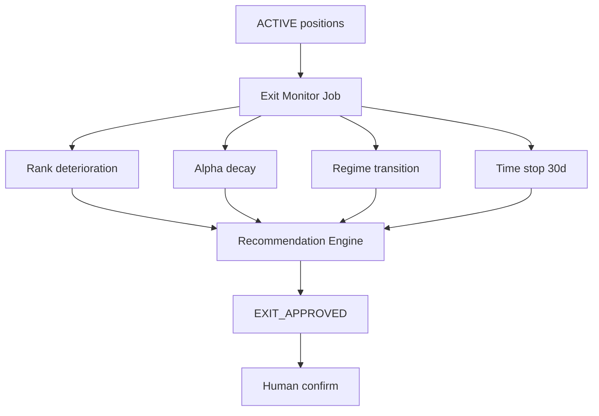

# Exit Decision Framework

**Version:** Phase 2.0  
**Date:** 2026-06-05  
**Research baseline:** [`app/workspace_exit_research/`](../../app/workspace_exit_research/) — production analytics, not live exits ([10_RECOMMENDATION](../po-discovery/10_RECOMMENDATION_ENGINE_GAP_ANALYSIS.md))

---

## 1. Purpose

Convert exit **research** into **live deterministic triggers** that set recommendation `EXIT_APPROVED`, requiring **human confirmation** before any sell ([01](../product/01_RECOMMENDATION_ENGINE_PRD.md), [11](../product/11_HUMAN_IN_LOOP_EXECUTION_PRD.md)).

Swing horizon: **15–30 sessions**; ~10% target is aspirational — exits protect capital when edge decays.

---

## 2. Research inputs (shipped)

| Report | API path | Use in live framework |
|--------|----------|----------------------|
| Exit policy comparison | `/analytics/exit/reports/exit-policy-comparison` | PO picks default policy id |
| Alpha decay | `.../alpha-decay` | Trailing alpha vs entry threshold |
| Rank deterioration | `.../rank-deterioration` | Rank drop from entry rank |
| Regime transition | `.../regime-transition` | Defensive regime while ACTIVE |
| Trend failure | `.../trend-failure` | Technical break (SEE/TARC aligned) |
| Recommended policy | `.../recommended-exit-policy` | Default thresholds seed |

**Simulators:** [`policy_simulators.py`](../../app/workspace_exit_research/policy_simulators.py) — fixed hold, rank exit, ATR trail ([EXIT_RESEARCH_DESIGN.md](../AI/03_DESIGN/EXIT_RESEARCH_DESIGN.md)).

---

## 3. Live monitor architecture (product)

**Schedule:** Daily post-ranking (same session as recommendation re-run).

---

## 4. Trigger definitions (PO defaults — tunable)

| Trigger ID | Condition | Default threshold |
|------------|-----------|-------------------|
| `EXIT_RANK_DROP` | Current rank > entry_rank + 15 OR fell out of top 40 | rank deterioration report percentile |
| `EXIT_ALPHA_DECAY` | 10d forward alpha vs entry benchmark < −2% | alpha decay curve |
| `EXIT_REGIME` | Regime → defensive while position P&L < 5% | regime transition report |
| `EXIT_TIME` | Sessions held ≥ 30 | swing max hold |
| `EXIT_TARGET` | Unrealized gain ≥ 10% AND rank quality declining | optional take-profit |
| `EXIT_STOP` | Unrealized loss ≤ −6% | hard stop (PO risk) |

Any **one** trigger fires `EXIT_APPROVED` unless config requires 2-of-N for marginal triggers.

---

## 5. Human confirmation

| Rule | Description |
|------|-------------|
| H-EXIT-01 | No paper/live sell without `recommendation_approvals` EXIT APPROVED |
| H-EXIT-02 | UI shows trigger evidence chart (link to analytics report slice) |
| H-EXIT-03 | Defer records `DEFERRED` + optional note; max 3 defers per position |
| H-EXIT-04 | ARGS RC caution on exit does **not** block confirmed human exit |

---

## 6. Interaction with conviction

`S_exit_health` in [02](../product/02_CONVICTION_SCORING_PRD.md) drops to 15–20 when triggers fire, reinforcing EXIT_APPROVED.

---

## 7. Acceptance criteria

| ID | Criterion |
|----|-----------|
| AC-EX-01 | Each EXIT_APPROVED has ≥1 `reason_code` mapped to trigger ID |
| AC-EX-02 | Backtest replay: live triggers match policy_simulator on historical fixture (±1 session) |
| AC-EX-03 | No auto-sell API in v1 |
| AC-EX-04 | Exit monitor runs only when `portfolio_positions.is_current=true` exists |

---

## 8. PO gate

Portfolio construction deferred until exit policy selected ([ROADMAP.md](../ROADMAP.md), po-discovery P2.1). **This document** is the PO selection record pending sign-off on default policy from `recommended-exit-policy` report.

---

## 9. References

- [10_RECOMMENDATION_ENGINE_GAP_ANALYSIS.md](../po-discovery/10_RECOMMENDATION_ENGINE_GAP_ANALYSIS.md) § Exit
- [05_DATA_PIPELINE](../po-discovery/05_DATA_PIPELINE_INVENTORY.md) — EXIT_RESEARCH batch phase
