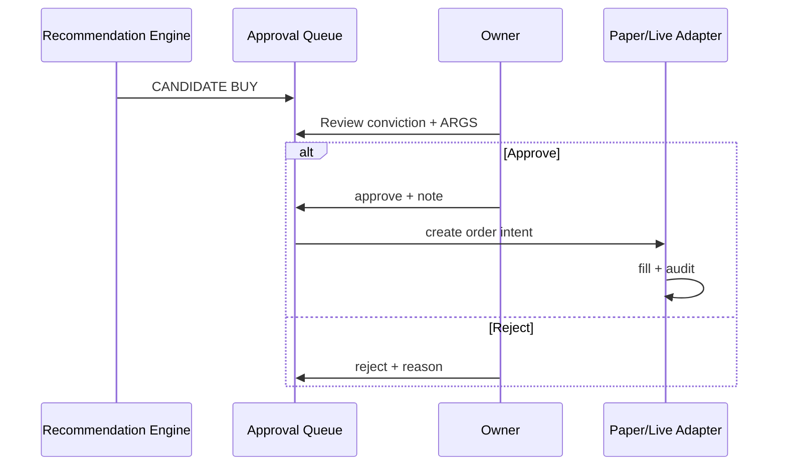

# Human-in-the-Loop Execution — Product Requirements

**Version:** Phase 2.0  
**Date:** 2026-06-05  
**Principle:** Machines recommend; **human approves**; system records; broker optional later.

---

## 1. Purpose

Define approval workflows, audit, and **broker integration points** for Indian equities swing trades without auto-execution in v1.

---

## 2. Approval types

| Type | Trigger | Human action | System result |
|------|---------|--------------|---------------|
| `ENTRY` | `action=BUY`, `lifecycle=CANDIDATE` | Approve / Reject / Defer | APPROVED → paper/live fill |
| `EXIT` | `action=EXIT_APPROVED` | Confirm / Defer | CLOSED on fill |
| `CONFIG` | Portfolio config change | Approve | Updated limits |

---

## 3. Entry workflow

**SLA (product):** Owner notified within 15 min of session close; queue cleared within 24h.

---

## 4. Exit workflow

1. Exit monitor sets `EXIT_APPROVED`.
2. Push/email (M4) optional.
3. Owner confirms → sell intent.
4. Attribution on `CLOSED` ([06](./06_PAPER_TRADING_PRD.md)).

**Defer:** Max 3 per position; RC advisory logged.

---

## 5. Idempotency & safety

| Rule | Implementation |
|------|----------------|
| Duplicate approve | `idempotency_key` on approval + paper trade ([`paper_trade.py`](../../app/models/paper_trade.py)) |
| Stale candidate | Auto-expire 2 sessions |
| Partial broker fill | v2 — v1 reject partial |

---

## 6. Broker integration points (future)

**Out of scope PRD G8 live broker** — document integration surface only:

| Point | Direction | Data |
|-------|-----------|------|
| `BrokerAdapter.place_order` | Outbound | symbol, side, qty, limit, client_order_id |
| `BrokerAdapter.get_order_status` | Inbound | fill_price, fill_qty, status |
| `BrokerAdapter.get_positions` | Inbound | Reconciliation vs `portfolio_positions` |
| `BrokerAdapter.cancel_order` | Outbound | — |

**Supported brokers (PO TBD):** Zerodha Kite / Angel One / ICICI — no code preference in product doc.

**Paper adapter (M2):** Internal — implements same interface as broker for testing.

**Compliance:** Owner retains full responsibility; Pi-PM disclaimer on every approval screen.

---

## 7. APIs

| Method | Path | Purpose |
|--------|------|---------|
| GET | `/api/v1/approvals/queue` | Alias of recommendations queue |
| POST | `/api/v1/approvals/{id}/approve` | |
| POST | `/api/v1/approvals/{id}/reject` | |
| POST | `/api/v1/approvals/{id}/defer` | |
| GET | `/api/v1/approvals/history` | Audit trail |

---

## 8. Acceptance criteria

| ID | Criterion |
|----|-----------|
| AC-HITL-01 | No fill without APPROVED approval row |
| AC-HITL-02 | Approval audit export CSV for date range |
| AC-HITL-03 | Broker adapter mock passes contract test without live keys |
| AC-HITL-04 | ARGS disagreement shown but does not block approved entry |

---

## 9. References

- [04_RECOMMENDATION_LIFECYCLE.md](../product/04_RECOMMENDATION_LIFECYCLE.md)
- [context/canonical/phase1/PRD.md](../phase1/PRD.md) — live broker out of scope
- [11_PORTFOLIO_ENGINE_GAP_ANALYSIS.md](../po-discovery/11_PORTFOLIO_ENGINE_GAP_ANALYSIS.md)
