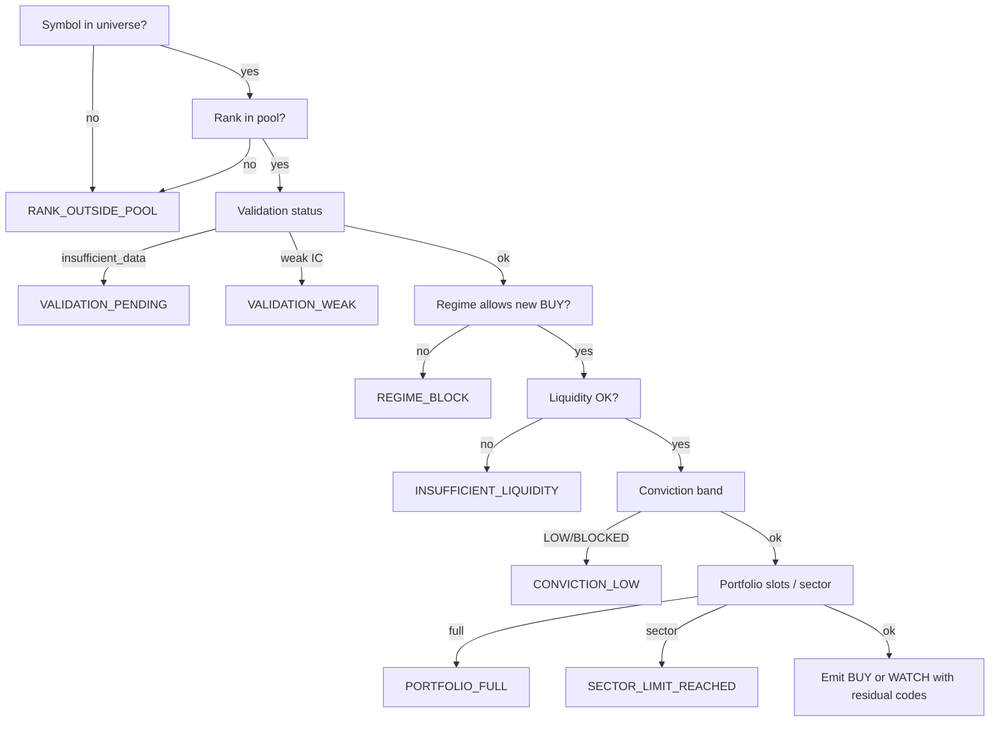

# Why Not Recommended — Deterministic Framework

**Version:** Phase 2.1 (PO sign-off 2026-06-04)  
**Date:** 2026-06-05  
**Related:** [01_RECOMMENDATION_ENGINE_PRD.md](../product/01_RECOMMENDATION_ENGINE_PRD.md), [03_RECOMMENDATION_DATA_MODEL.md](../product/03_RECOMMENDATION_DATA_MODEL.md)

---

## 1. Purpose

Explain **why a stock was not recommended** (or not promoted to `BUY`) using **platform evidence only** — no LLM inference. Complements entry rules in the Recommendation Engine.

Answers questions such as: *“Why was HFCL not recommended today?”*

---

## 2. Design principles

| Principle | Rule |
|-----------|------|
| Deterministic | Same ranking run + validation + regime + portfolio snapshot → same codes |
| Evidence-backed | Every code maps to stored metrics or rule evaluation |
| Append-only | `reason_codes` on `recommendation_results` never silently overwritten |
| Copilot-safe | Copilot may **cite** codes and linked fields; must not invent reasons |

---

## 3. Rejection reason codes (v1)

| Code | Meaning | Typical trigger |
|------|---------|-----------------|
| `REGIME_BLOCK` | Regime policy blocks new risk | Defensive/crisis; max new BUY/day = 0 |
| `VALIDATION_WEAK` | Validation completed but IC/spread below threshold | `S_validation` low; R-ENTRY-02 |
| `VALIDATION_PENDING` | Validation `insufficient_data` | Tail ingest; max action WATCH |
| `CONVICTION_LOW` | Band `LOW` or `BLOCKED` | [02](../product/02_CONVICTION_SCORING_PRD.md) |
| `PORTFOLIO_FULL` | No open slots for new BUY | [05](../product/05_PORTFOLIO_ENGINE_PRD.md) |
| `SECTOR_LIMIT_REACHED` | Sector NAV cap breached | GICS headroom = 0 |
| `EXIT_RISK` | Active position with exit trigger; not a new BUY | Rank deterioration / alpha decay |
| `RANK_OUTSIDE_POOL` | Rank > 20 (or PO pool threshold) | Not eligible for entry scoring |
| `INSUFFICIENT_LIQUIDITY` | ADV / volume below PO floor | Ingest liquidity gate |

**Storage:** `recommendation_results.reason_codes` — JSON string array, ordered by evaluation priority.

**Aliases (legacy in 01):** Map `VALIDATION_INSUFFICIENT` → `VALIDATION_PENDING`; `REGIME_REDUCE` → `REGIME_BLOCK` in APIs for backward compatibility during M1.

---

## 4. Evaluation order (deterministic)



Multiple codes may apply (e.g. `CONVICTION_LOW` + `PORTFOLIO_FULL`); UI shows primary code first.

---

## 5. API exposure

| Method | Path | Behavior |
|--------|------|----------|
| GET | `/api/v1/recommendations/{run_id}/stocks/{symbol}` | Returns `action`, `reason_codes`, `conviction_*`, evidence refs |
| GET | `/api/v1/recommendations/why-not/{symbol}` | Latest run: why not `BUY` (even if `WATCH`/`REJECT`) |
| GET | `/api/v1/recommendations/{run_id}` | Bulk cards include `reason_codes` |

**Response shape (logical):**

```json
{
  "symbol": "HFCL",
  "as_of_date": "2026-06-04",
  "action": "WATCH",
  "primary_reason_code": "CONVICTION_LOW",
  "reason_codes": ["CONVICTION_LOW", "PORTFOLIO_FULL"],
  "evidence": {
    "rank": 14,
    "validation_status": "completed",
    "conviction_band": "LOW",
    "conviction_score": 44,
    "regime": "neutral",
    "slots_available": 0
  }
}
```

---

## 6. Mobile UI

| Screen | Display |
|--------|---------|
| Stock detail | “Not recommended because:” + human label per code |
| Watchlist compare | Badge per code (max 2 visible) |
| Queue | Only `BUY` / `EXIT_APPROVED`; why-not on non-queue symbols via search |

Copy templates (PO-approved):

| Code | User-facing label |
|------|-------------------|
| `REGIME_BLOCK` | Market regime limits new positions |
| `VALIDATION_PENDING` | Forward-return validation still accumulating |
| `CONVICTION_LOW` | Conviction below buy threshold |
| `PORTFOLIO_FULL` | Portfolio at maximum active positions |

---

## 7. AI Copilot

| Capability | Constraint |
|------------|------------|
| “Why not HFCL today?” | Retrieve latest `recommendation_results` + ranking/validation/regime rows |
| Narrative | Template fill from `evidence` object — no new codes |
| Citations | `ranking_run_id`, `validation_report_id`, `reason_codes[]` |

**Forbidden:** Copilot must not use committee sentiment to explain why-not (committee is parallel advisory only).

---

## 8. Example narrative — HFCL (pattern)

**Question:** Why was HFCL not recommended today?

**Deterministic answer (illustrative):**

> On 2026-06-04, HFCL (rank 14 in `momentum_v1`, NIFTY_500) received **WATCH**, not **BUY**. Primary reason: **CONVICTION_LOW** (score 44, band LOW). Validation completed with 20d IC in the neutral bucket (S_validation = 52). Regime was **neutral** (new entries allowed). Portfolio had **0 slots available** (secondary code **PORTFOLIO_FULL**). Committee research, if run, is shown separately and did not affect this decision.

---

## 9. Acceptance criteria

| ID | Criterion |
|----|-----------|
| AC-WNR-01 | Every `REJECT` and non-`BUY` top-pool row has ≥1 reason code |
| AC-WNR-02 | `why-not` API returns stable JSON for replay fixture |
| AC-WNR-03 | Copilot answer for fixture symbol matches API evidence fields |
| AC-WNR-04 | No reason code derived from ARGS/LLM output |

---

## 10. References

- [01_RECOMMENDATION_ENGINE_PRD.md](../product/01_RECOMMENDATION_ENGINE_PRD.md) §6
- [PO_SIGNOFF_2026_06_04.md](../po/PO_SIGNOFF_2026_06_04.md)
- [10_AI_COPILOT_PRD.md](./10_AI_COPILOT_PRD.md)
