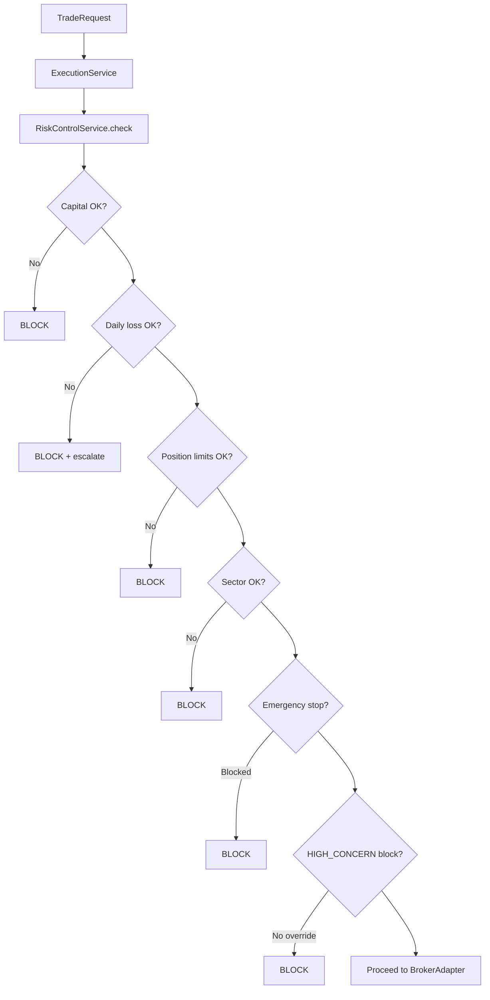

# Risk Control — Product Requirements

**Version:** Track I — Phase 3.0  
**Date:** 2026-06-05  
**Status:** Design approved (ADR-030)  
**Principle:** Risk gates wrap execution; they do not alter ranking, conviction, or sizing formulas.  
**Related:** [05_PORTFOLIO_ENGINE_PRD.md](../product/05_PORTFOLIO_ENGINE_PRD.md), [ADR-024](../decisions/ADR-024-Portfolio-State-Source-Of-Truth.md)

---

## 1. Purpose

Define pre-trade and intraday risk controls for live investing. Controls **block or escalate** order intents at the `ExecutionService` layer without modifying portfolio calculation logic.

---

## 2. Control catalog

### 2.1 Max capital

| Control | Description | Default | Breach |
|---------|-------------|---------|--------|
| `max_deployable_capital` | Sum of open position notional ≤ `total_equity × deploy_pct` | From config | Block BUY |
| `cash_floor` | Cash ≥ `total_equity × cash_floor_pct` | 15% | Block BUY |
| `reserve_pct` | Undeployed reserve maintained | 2% | Block BUY |

**Source:** `portfolio_configs` (existing). Gate reads config; formulas unchanged.

### 2.2 Daily loss limits

| Control | Description | Default | Breach |
|---------|-------------|---------|--------|
| `daily_loss_limit_pct` | Day P&L vs opening NAV | −2% | WARN at 80%, BLOCK at 100% |
| `daily_loss_limit_inr` | Absolute INR cap | Optional | BLOCK |
| `consecutive_loss_days` | N days negative | 3 | WARN |

**Measurement:** `portfolio_nav_history` day-over-day.

### 2.3 Position limits

| Control | Description | Default | Breach |
|---------|-------------|---------|--------|
| `max_positions` | Regime slot table | risk_on: 8 | Block BUY |
| `max_buy_per_day` | Daily entry count | risk_on: 2 | Block BUY |
| `single_name_cap_pct` | Max weight per symbol | 18% | Block or reduce qty |
| `sector_cap_pct` | Max sector weight | 30% | Block BUY |

**Source:** Existing `PortfolioService` regime slots and caps.

### 2.4 Sector limits

Enforced via `sector_cap_pct` and sector map on `portfolio_positions.sector`. Pre-trade check before `TradeRequest` submission.

### 2.5 Emergency stop

| State | Behavior |
|-------|----------|
| `OFF` | Normal |
| `ENTRIES_BLOCKED` | No new BUY; SELL allowed |
| `ALL_BLOCKED` | No orders except cancel |
| `LIQUIDATE_ONLY` | SELL only; owner-initiated |

**Activation:** Owner or ADMIN via `POST /portfolio/risk/emergency-stop`. Requires JWT + audit row.

**Auto-trigger (optional v2):** Daily loss limit hard breach → `ENTRIES_BLOCKED`.

### 2.6 Manual override

| Field | Requirement |
|-------|-------------|
| Who | OWNER or ADMIN only |
| Scope | Single order or 24h window |
| Proof | Reason text (min 20 chars) + optional PIN |
| Audit | `risk_override` row with expiry |

Override bypasses soft limits only — never bypasses emergency `ALL_BLOCKED` without ADMIN.

---

## 3. Risk check flow

---

## 4. Risk events (audit)

| Event type | Logged when |
|------------|-------------|
| `LIMIT_WARN` | 80% threshold |
| `LIMIT_BREACH` | Hard block |
| `EMERGENCY_STOP_ON` | Stop activated |
| `EMERGENCY_STOP_OFF` | Stop cleared |
| `OVERRIDE_GRANTED` | Manual override |
| `HIGH_CONCERN_BLOCK` | Entry blocked pending override |

---

## 5. Configuration

| Store | Contents |
|-------|----------|
| `portfolio_configs` | Capital, deploy, caps (existing) |
| `risk_limits` (future table) | Daily loss %, emergency state, overrides |
| `portfolio_configs.regime_slots` | Position limits (existing) |

---

## 6. Acceptance criteria

| ID | Criterion |
|----|-----------|
| AC-RISK-01 | No live BUY passes risk gate when over deployable capital |
| AC-RISK-02 | Daily loss hard breach blocks new entries |
| AC-RISK-03 | Emergency stop blocks within 1 API call |
| AC-RISK-04 | Manual override produces audit row |
| AC-RISK-05 | SELL orders allowed under ENTRIES_BLOCKED |
| AC-RISK-06 | Risk checks do not modify conviction or ranking |

---

## 7. Out of scope

- VaR / CVaR modeling
- Options greeks
- Margin/leverage (cash equity only v1)
- Regulatory capital requirements
