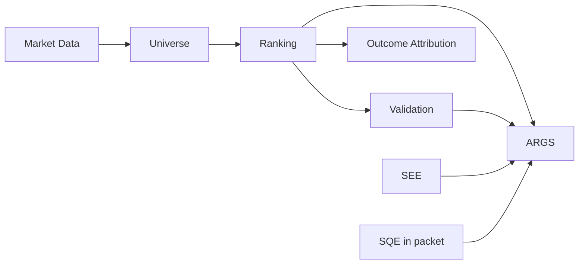

# Domain Model

---

## Core entities

| Entity | Table(s) | Description |
|--------|----------|-------------|
| Stock | `stocks` | NSE symbol registry |
| Universe | `stock_universes`, `universe_memberships` | Named investable sets |
| Market bar | `market_data` | Daily OHLCV per stock |
| Ranking run | `ranking_runs`, `ranking_results` | One strategy execution at `as_of_date` |
| Validation | `ranking_validation_reports`, `ranking_performance_snapshots` | Forward-return metrics |
| Full-universe campaign | `full_universe_validation_*` | Pooled validation across many runs |
| Traceability | `ranking_factor_contributions`, `validation_horizon_metrics`, `run_lineage_records` | Audit trail |
| Regime policy | `regime_policy_configs`, `regime_policy_decisions`, `regime_backtest_runs` | Research policy layer |
| Factor analytics | `factor_performance_runs`, `factor_daily_metrics` | IC time series |
| Exit research | `exit_research_*` (see migrations 11–14) | Simulated exit policies |
| Daily batch | `daily_batch_runs`, `daily_batch_run_artifacts` | Orchestration parent/child |
| ARGS research | `args_research_runs`, packets, `committee_reviews` | Governance workflow |
| SEE | `stock_setup_research_*`, SEE metrics on runs | Setup evidence |
| Paper trade (stub) | `paper_trades`, `portfolio_positions` | Not wired to services |

---

## Bounded contexts

**Rule:** Ranking never imports ARGS; ARGS reads ranking outputs as evidence.

---

## Strategy versions

| Code | Version | History window |
|------|---------|----------------|
| `momentum_v1` | 1.0.0 | 201 days, 4 factors |
| `breakout_v1` | 1.0.0 | 252 days, 8 factors |

---

## Regime taxonomy

`{BULL|BEAR}_{LOW_VOL|HIGH_VOL}` from MA200 + realized vol vs `VALIDATION_HIGH_VOL_THRESHOLD` (default 0.20).

---

## Related

- [ENTITY_RELATIONSHIP_GUIDE.md](../08_DATA_MODEL/ENTITY_RELATIONSHIP_GUIDE.md)
- [DATABASE_SCHEMA.md](../08_DATA_MODEL/DATABASE_SCHEMA.md)
