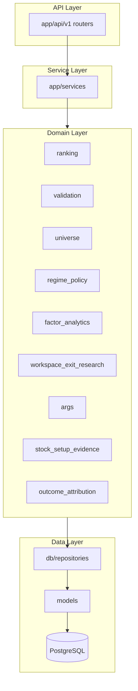

# System Architecture

Synthesized from [architecture.md](../../architecture.md) and [PLATFORM-HANDOFF-2026.md](../../PLATFORM-HANDOFF-2026.md).

---

## Layered architecture

---

## Principles

1. **Deterministic core** — ranking, validation, position logic (future) in pure Python.
2. **LLM boundary** — ARGS committees consume packets; they do not write `ranking_results`.
3. **Policy after ranking** — regime policy and ARGS sit downstream; no factor changes in policy layer.
4. **Repository pattern** — services orchestrate; repositories persist.

---

## Request flow (ranking)

1. Client `POST /api/v1/rankings/run` with `universe_code`, `strategy`, `as_of_date`.
2. `RankingService` loads universe, market data, runs `RankingEngine`.
3. Persists `ranking_runs` + `ranking_results` (+ factor contributions if traceability on).
4. Optional `POST /validation/runs/{id}/compute` for forward metrics.

---

## Daily batch flow

`DailyBatchService` plans trading days → ingest gap → rankings (both strategies) → validation → factor/exit artifacts. See [06_OPERATIONS/RUNBOOK.md](../06_OPERATIONS/RUNBOOK.md).

---

## Experimental vs production boundaries

| Layer | Production | Research |
|-------|------------|----------|
| Ranking factors | Frozen | `ranking_research/` reports only |
| Regime policy | API + replay tables | Not live trading |
| ARGS QRC SQE flag | Default false | A/B scripts |
| Calibration | — | `run_calibrated_ranking_backtest.py` |

---

## Related

- [DOMAIN_MODEL.md](./DOMAIN_MODEL.md)
- [SERVICE_MAP.md](./SERVICE_MAP.md)
- [REPOSITORY_STRUCTURE.md](./REPOSITORY_STRUCTURE.md)
- [domain-boundaries.md](../../domain-boundaries.md)
