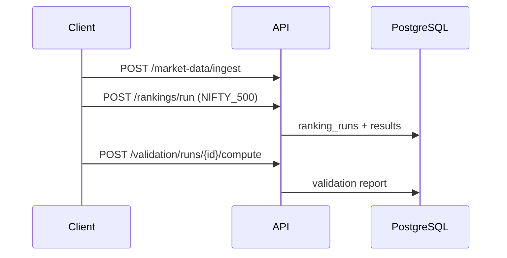
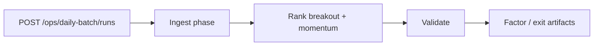
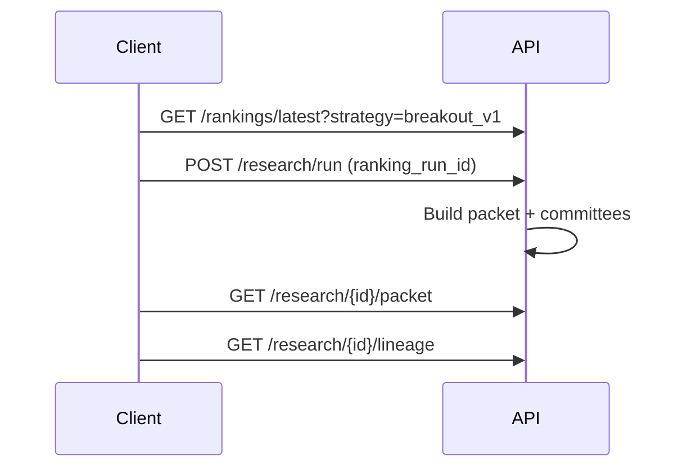

# API Workflows

Common end-to-end flows using `/api/v1`. See [API_REFERENCE.md](./API_REFERENCE.md) for paths.

---

## 1. Single-day ranking + validation

**Universe:** Always specify `universe_code: NIFTY_500` (not default `PI_PM_CORE`).

---

## 2. Daily batch (orchestrated)

Poll: `GET /ops/daily-batch/runs/{id}` · Debug: `GET .../trace`

CLI equivalent: `scripts/run_daily_nifty500_batch.py`

---

## 3. ARGS research run

**Env:** `ARGS_QRC_USE_SQE=false` unless A/B experiment.

Optional: `POST /research/stock-setup/runs/{ranking_run_id}/generate` before or as part of packet pipeline.

---

## 4. Full-universe validation campaign

1. `POST /validation/backfill` (or service-driven backfill)
2. Create campaign via full-universe endpoints
3. `GET /validation/full-universe/summary`
4. `GET /validation/full-universe/deciles`

**Warning:** Large pooled aggregation — avoid O(n²) paths ([HANDOFF.md](../../HANDOFF.md)).

---

## 5. Regime policy backtest (research)

1. `POST /regime-policy/configs/presets/load`
2. `POST /regime-policy/configs/{id}/activate`
3. `POST /regime-policy/backtest/run`
4. `GET /regime-policy/backtest/runs`

---

## 6. Factor IC backfill + read

1. `POST /analytics/factors/backfill`
2. `GET /analytics/factors/runs/{run_id}`
3. `GET /analytics/factors/leaderboard`

---

## 7. Traceability / score reconstruction

1. `GET /observability/rankings/runs`
2. `GET /observability/rankings/{run_id}/stocks/{stock_id}/score-reconstruction`
3. `GET /observability/lineage/ranking_run/{uuid}`

---

## 8. Exit research

1. `POST /analytics/exit/backfill`
2. Poll `GET /analytics/exit/runs`
3. `GET /analytics/exit/reports/recommended-exit-policy`

Legacy workflows: [API_REFERENCE.md](../../API_REFERENCE.md), [daily-nifty500-batch-runbook.md](../../daily-nifty500-batch-runbook.md).
