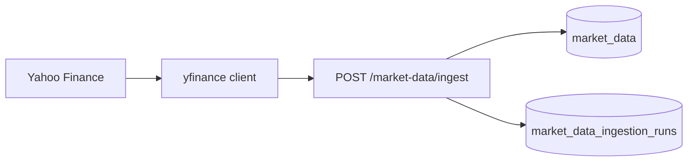
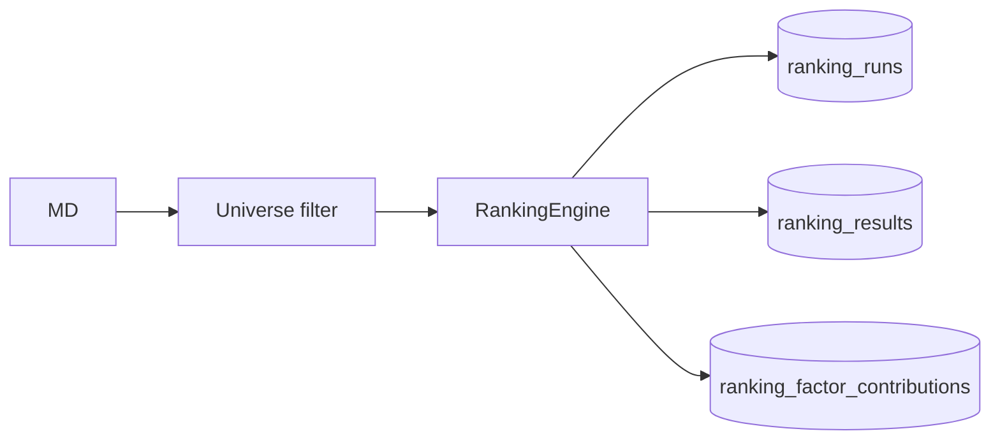
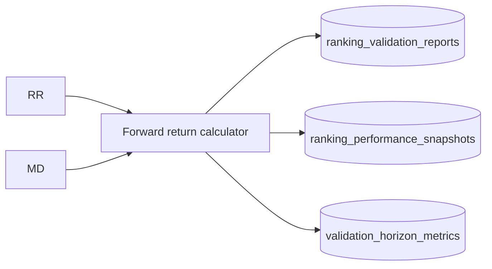

# Data Lineage

How data flows from external source to consumable artifacts.

---

## Market data

**Benchmark:** `^NSEI` must reach through each `as_of_date` used for ranking.

---

## Ranking lineage

**Immutability:** New run = new `ranking_runs.id`; do not mutate historical results.

---

## Validation lineage

**Tail gap:** Last ~5 trading days may lack forward horizon → `insufficient_data`.

---

## Daily batch lineage

`daily_batch_runs` → artifacts linking ingestion batch, ranking runs, validation reports, factor/exit runs (`daily_batch_run_artifacts`).

API: `GET /ops/daily-batch/runs/{id}/trace`

---

## ARGS lineage

Ranking run + validation + SEE/SQE → packet → committee reviews → `args_research_runs`

API: `GET /research/{run_id}/lineage`  
DB: `run_lineage_records` (Sprint 7)

---

## Research analytics lineage

| Output | Source runs |
|--------|-------------|
| Factor IC tables | Historical ranking + market data backfill |
| Exit reports | Ranking paths + simulators |
| Outcome attribution | Many `ranking_runs` pooled (read-only) |
| Ranking research MD | DB snapshots via generator scripts |

---

## Scripts that write docs (not DB)

| Script | Output doc |
|--------|------------|
| `generate_outcome_attribution_report.py` | `outcome-attribution-report.md` |
| `generate_ranking_root_cause_reports.py` | five ranking MD files |

Lineage for **markdown reports** is git + script version + DB snapshot date in report header.
