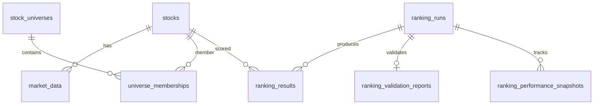
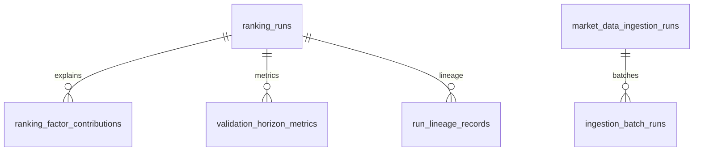
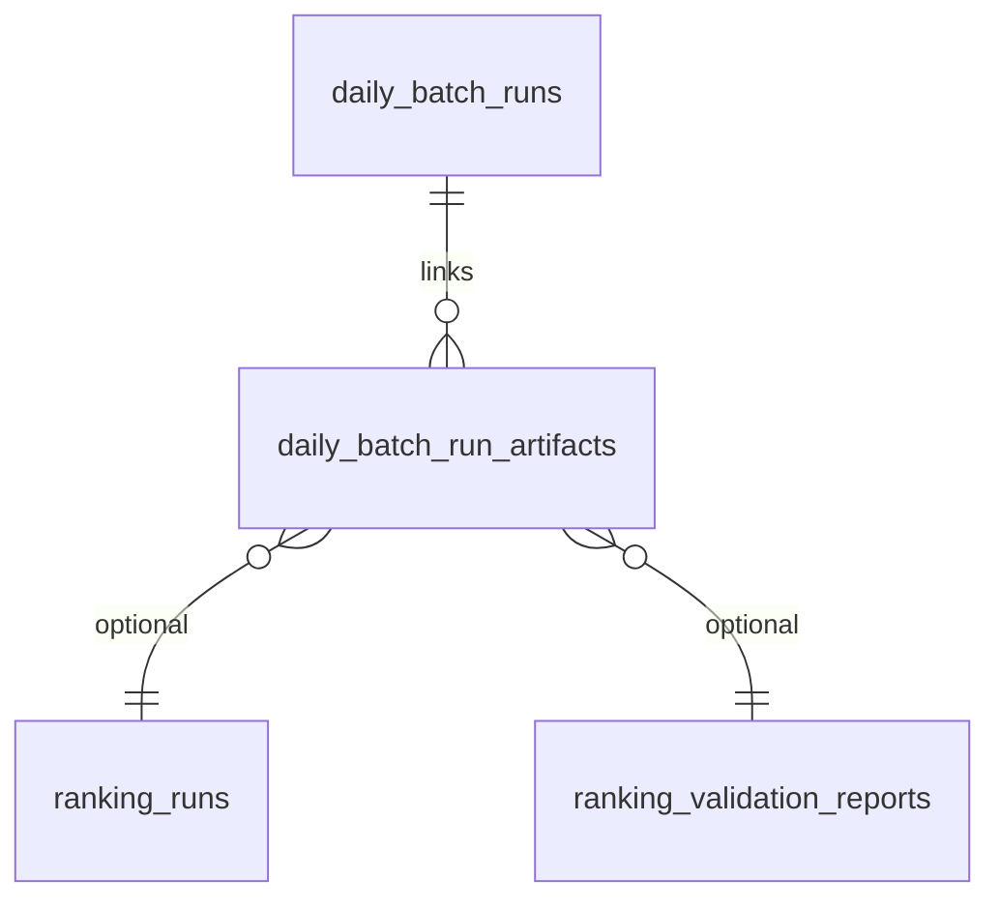
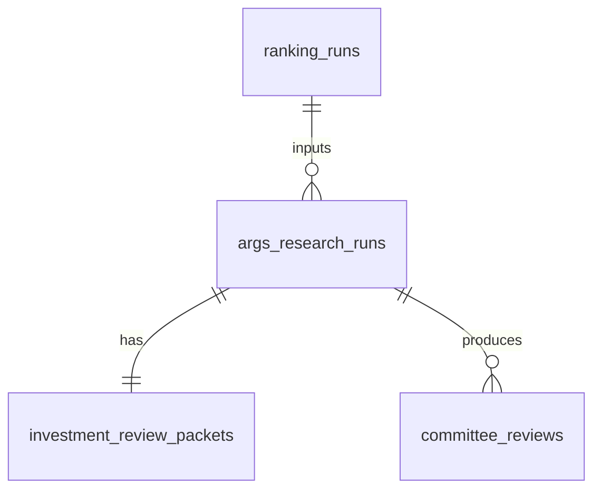

# Entity Relationship Guide

---

## Core path (ranking day)

---

## Traceability extension

---

## Daily batch

---

## ARGS

(Exact table names in migration `20260608_0016` — see `app/models/args.py`.)

---

## Analytics (read-mostly)

| Parent | Children |
|--------|----------|
| `factor_performance_runs` | `factor_daily_metrics`, `factor_performance_metrics` |
| Exit research run | Phase progress + report aggregates |
| `full_universe_validation_campaigns` | runs, metrics, deciles |

---

## Foreign key discipline

- UUID PKs throughout
- `stock_id` CASCADE on market data
- JSONB for `score_components`, `horizon_metrics`, `plan_snapshot`, packet extensions

Full ER diagram: [DATABASE_SCHEMA.md](./DATABASE_SCHEMA.md) and [../../DATABASE_SCHEMA.md](../../DATABASE_SCHEMA.md).
