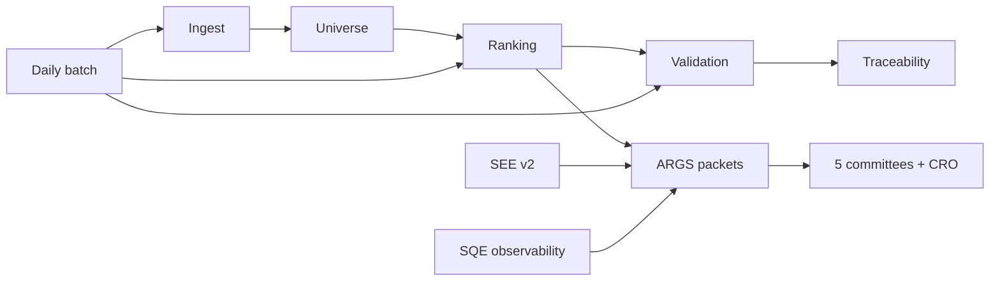

# AI Agent Handover — Pi-PM

**Date:** 2026-06-04  
**Repo:** `/Users/kalyancb/pi-pm`  
**Branch:** `feature/see-v2` · **Migration:** `20260609_0018` · **Tests:** 312 passed

---

## 60-second summary

Pi-PM is a FastAPI/PostgreSQL system for **deterministic** ranking and validation of Indian NSE equities, plus research layers (regime, factor IC, exit, ARGS committees, SEE v2, SQE observability). **Rankings generate selective alpha**; **rank ordering within top-20 is not calibrated** (score compression). **Validation tail** (~2026-05-27+) is `insufficient_data` until forward bars exist. **`ARGS_QRC_USE_SQE=false`** in production. **Committee independence Phase 2** complete (~79% effective); Phase 3 TBD.

---

## Read order (30 min)

| # | Document |
|---|----------|
| 1 | This file |
| 2 | [PROJECT_STATE_2026_06_04.md](./PROJECT_STATE_2026_06_04.md) |
| 3 | [../PLATFORM-HANDOFF-2026.md](../../PLATFORM-HANDOFF-2026.md) (legacy, deep) |
| 4 | [../HANDOFF.md](../../HANDOFF.md) (gotchas) |
| 5 | [../02_ARCHITECTURE/SYSTEM_ARCHITECTURE.md](../02_ARCHITECTURE/SYSTEM_ARCHITECTURE.md) |
| 6 | [../07_API/API_REFERENCE.md](../07_API/API_REFERENCE.md) |
| 7 | [../08_DATA_MODEL/DATABASE_SCHEMA.md](../08_DATA_MODEL/DATABASE_SCHEMA.md) |
| 8 | [../06_OPERATIONS/RUNBOOK.md](../06_OPERATIONS/RUNBOOK.md) |

Inventory: [../09_HANDOVER/DOCUMENT_INVENTORY.md](../09_HANDOVER/DOCUMENT_INVENTORY.md).

---

## Pipeline



---

## Key findings (must internalize)

| Finding | Detail | Evidence |
|---------|--------|----------|
| Rankings generate alpha | Top-20 buckets often beat benchmark; verdict `partial` | [outcome-attribution-report.md](../../outcome-attribution-report.md) |
| Rank ordering not calibrated | Non-monotonic rank bands; compression in composite scores | [ranking-calibration-root-cause.md](../../ranking-calibration-root-cause.md) |
| Validation pending tail | Latest days `insufficient_data` until ≥5d forward from ~2026-05-27 | [HANDOFF.md](../../HANDOFF.md), [dailyruns/04-jun-2026/03-validation.md](../../dailyruns/04-jun-2026/03-validation.md) |
| ARGS_QRC_USE_SQE=false | Default in `app/core/config.py`; SQE on packets for observability only | [qrc-sqe-ab-test-report.md](../../qrc-sqe-ab-test-report.md) |
| Committee independence Phase 2 | ~14% → ~79% effective independence; Phase 3 not started | [committee-independence-phase2-results.md](../../committee-independence-phase2-results.md) |

---

## What you may change vs not

| Safe (documentation-only handover) | Requires explicit scope |
|-----------------------------------|-------------------------|
| Docs under `docs/AI/` | `app/ranking/`, `app/validation/` factor math |
| Scripts for reports | Committee prompt defaults without PO sign-off |
| Tests for new behavior | Enabling `ARGS_QRC_USE_SQE` globally |

---

## Quick commands

```bash
cd /Users/kalyancb/pi-pm
git checkout feature/see-v2
alembic upgrade head
pytest tests/ -q
python scripts/run_daily_nifty500_batch.py --dry-run
ARGS_QRC_USE_SQE=false python scripts/run_args_top20.py --as-of-date 2026-06-04
```

---

## Package index

See [../README.md](../README.md). Completeness: [DOCUMENTATION_COMPLETENESS_REPORT.md](./DOCUMENTATION_COMPLETENESS_REPORT.md).
