# Pi-PM — Database Schema

**Last updated:** 2026-05-31  
**Migration head:** `20260530_0006`  
**Total tables:** 16

---

## Entity Relationship Diagram

```mermaid
erDiagram
    stocks ||--o{ market_data : has
    stocks ||--o{ universe_memberships : belongs
    stock_universes ||--o{ universe_memberships : contains
    stocks ||--o{ ranking_results : ranked_in
    ranking_runs ||--o{ ranking_results : produces
    ranking_runs ||--o{ ranking_performance_snapshots : tracks
    stocks ||--o{ ranking_performance_snapshots : for
    ranking_runs ||--o| ranking_validation_reports : validates
    ranking_runs ||--o{ paper_trades : triggers
    stocks ||--o{ paper_trades : traded
    stocks ||--o{ portfolio_positions : held
    stocks ||--o{ research_reports : researched

    full_universe_validation_campaigns ||--o{ full_universe_validation_runs : contains
    full_universe_validation_campaigns ||--o{ full_universe_validation_metrics : summarizes
    full_universe_validation_campaigns ||--o{ full_universe_validation_deciles : analyzes
    ranking_runs ||--o{ full_universe_validation_runs : validated_in
```

---

## Migration History

| Revision | Sprint | Tables Created / Altered |
|----------|--------|--------------------------|
| `20260530_0001` | 1 | `stocks`, `ranking_runs`, `market_data`, `portfolio_positions`, `ranking_results`, `research_reports`, `paper_trades` |
| `20260530_0002` | 2 | `stock_universes`, `universe_memberships`, `market_data_ingestion_runs`; alters `stocks`, `market_data` |
| `20260530_0003` | 3 | `ranking_performance_snapshots`; alters `ranking_runs` |
| `20260530_0004` | 3.1 | Alters `ranking_runs.inputs_hash` → nullable |
| `20260530_0005` | 4.2 | `ranking_validation_reports` |
| `20260530_0006` | 6.1 | `full_universe_validation_campaigns`, `_runs`, `_metrics`, `_deciles` |

---

## Table Reference

### `stocks`

Master security registry.

| Column | Type | Nullable | Notes |
|--------|------|----------|-------|
| `id` | UUID | NO | PK |
| `symbol` | VARCHAR(32) | NO | Unique, e.g. `RELIANCE.NS` |
| `name` | VARCHAR(255) | NO | |
| `exchange` | VARCHAR(32) | NO | e.g. `NSE` |
| `sector` | VARCHAR(64) | YES | |
| `industry` | VARCHAR(128) | YES | |
| `is_active` | BOOLEAN | NO | |
| `data_status` | VARCHAR(32) | NO | `ACTIVE`, `INACTIVE`, `ERROR` (Sprint 2) |
| `created_at` | TIMESTAMPTZ | NO | |
| `updated_at` | TIMESTAMPTZ | NO | |

**Indexes:** `ix_stocks_symbol` (unique), `ix_stocks_active_exchange`

---

### `market_data`

Daily OHLCV bars.

| Column | Type | Nullable | Notes |
|--------|------|----------|-------|
| `id` | UUID | NO | PK |
| `stock_id` | UUID | NO | FK → `stocks.id` CASCADE |
| `date` | DATE | NO | |
| `open`, `high`, `low` | NUMERIC(18,6) | YES | |
| `close` | NUMERIC(18,6) | NO | |
| `adj_close` | NUMERIC(18,6) | YES | |
| `volume` | BIGINT | YES | |
| `dividend` | NUMERIC(18,8) | YES | Sprint 2 |
| `split_factor` | NUMERIC(18,8) | YES | Sprint 2 |
| `source` | VARCHAR(64) | NO | e.g. `yahoo` |
| `ingested_at` | TIMESTAMPTZ | NO | |

**Constraints:** UNIQUE (`stock_id`, `date`, `source`)  
**Indexes:** `ix_market_data_stock_date`

---

### `stock_universes`

Named investable universes.

| Column | Type | Nullable | Notes |
|--------|------|----------|-------|
| `id` | UUID | NO | PK |
| `code` | VARCHAR(32) | NO | Unique, e.g. `NIFTY_500` |
| `name` | VARCHAR(255) | NO | |
| `is_active` | BOOLEAN | NO | |

**Seeded:** `NIFTY_50`, `NIFTY_100`, `NIFTY_500`, `PI_PM_CORE`

---

### `universe_memberships`

Stock ↔ universe many-to-many with soft removal.

| Column | Type | Nullable | Notes |
|--------|------|----------|-------|
| `id` | UUID | NO | PK |
| `universe_id` | UUID | NO | FK → `stock_universes.id` CASCADE |
| `stock_id` | UUID | NO | FK → `stocks.id` CASCADE |
| `added_at` | TIMESTAMPTZ | NO | |
| `removed_at` | TIMESTAMPTZ | YES | NULL = active member |

---

### `market_data_ingestion_runs`

Batch ingest audit log.

| Column | Type | Nullable | Notes |
|--------|------|----------|-------|
| `id` | UUID | NO | PK |
| `period` | VARCHAR(16) | NO | e.g. `5y` |
| `status` | VARCHAR(32) | NO | |
| `symbols_requested` | INTEGER | NO | |
| `symbols_succeeded` | INTEGER | NO | |
| `symbols_failed` | INTEGER | NO | |
| `started_at` | TIMESTAMPTZ | NO | |
| `completed_at` | TIMESTAMPTZ | YES | |

---

### `ranking_runs`

One row per ranking execution (live or historical).

| Column | Type | Nullable | Notes |
|--------|------|----------|-------|
| `id` | UUID | NO | PK |
| `strategy_name` | VARCHAR(64) | NO | e.g. `breakout_v1` |
| `strategy_version` | VARCHAR(32) | NO | e.g. `1.0.0` |
| `as_of_date` | DATE | NO | Ranking date |
| `inputs_hash` | VARCHAR(64) | YES | SHA-256; NULL while pending/failed |
| `universe_code` | VARCHAR(32) | NO | Sprint 3 |
| `benchmark_symbol` | VARCHAR(32) | NO | Sprint 3 |
| `filter_config_hash` | VARCHAR(64) | NO | Sprint 3 |
| `normalization_method` | VARCHAR(32) | NO | e.g. `percentile` |
| `status` | VARCHAR(32) | NO | `pending`, `completed`, `failed` |
| `error_message` | TEXT | YES | Sprint 3 |
| `started_at` | TIMESTAMPTZ | NO | |
| `completed_at` | TIMESTAMPTZ | YES | |
| `metadata` | JSONB | YES | Exclusions, benchmark info, weights |
| `created_at` | TIMESTAMPTZ | NO | |
| `updated_at` | TIMESTAMPTZ | NO | |

**Indexes:** `ix_ranking_runs_as_of_date`

---

### `ranking_results`

Per-stock scores and ranks for a run.

| Column | Type | Nullable | Notes |
|--------|------|----------|-------|
| `id` | UUID | NO | PK |
| `ranking_run_id` | UUID | NO | FK → `ranking_runs.id` CASCADE |
| `stock_id` | UUID | NO | FK → `stocks.id` CASCADE |
| `rank` | INTEGER | NO | 1 = highest score |
| `score` | NUMERIC(18,8) | NO | Normalized composite |
| `score_components` | JSONB | YES | Per-factor raw/normalized values |
| `created_at` | TIMESTAMPTZ | NO | |

**Constraints:** UNIQUE (`ranking_run_id`, `rank`), UNIQUE (`ranking_run_id`, `stock_id`)  
**Indexes:** `ix_ranking_results_run_rank`

---

### `ranking_performance_snapshots`

Forward return placeholders and computed values per stock per run.

| Column | Type | Nullable | Notes |
|--------|------|----------|-------|
| `id` | UUID | NO | PK |
| `ranking_run_id` | UUID | NO | FK → `ranking_runs.id` CASCADE |
| `stock_id` | UUID | NO | FK → `stocks.id` CASCADE |
| `return_5d` | NUMERIC(18,8) | YES | |
| `return_10d` | NUMERIC(18,8) | YES | |
| `return_20d` | NUMERIC(18,8) | YES | |
| `return_60d` | NUMERIC(18,8) | YES | |
| `captured_at` | TIMESTAMPTZ | NO | |

**Constraints:** UNIQUE (`ranking_run_id`, `stock_id`)  
**Indexes:** `ix_ranking_performance_run`

---

### `ranking_validation_reports`

Per-run validation summary (1:1 with ranking run).

| Column | Type | Nullable | Notes |
|--------|------|----------|-------|
| `id` | UUID | NO | PK |
| `ranking_run_id` | UUID | NO | FK → `ranking_runs.id` CASCADE, UNIQUE |
| `status` | VARCHAR(32) | NO | `completed`, `insufficient_data`, `failed` |
| `validation_hash` | VARCHAR(64) | YES | |
| `regime_label` | VARCHAR(32) | YES | e.g. `BULL_LOW_VOL` |
| `trend_regime` | VARCHAR(16) | YES | `BULL` / `BEAR` |
| `vol_regime` | VARCHAR(16) | YES | `HIGH_VOL` / `LOW_VOL` |
| `horizon_metrics` | JSONB | YES | IC, deciles, hit rates per horizon |
| `sample_summary` | JSONB | YES | Ranked count, valid counts |
| `computed_at` | TIMESTAMPTZ | YES | |
| `error_message` | TEXT | YES | |

**Indexes:** `ix_ranking_validation_reports_status`, `ix_ranking_validation_reports_regime`

---

### `full_universe_validation_campaigns`

Batch validation job tracking (Sprint 6.1).

| Column | Type | Nullable | Notes |
|--------|------|----------|-------|
| `id` | UUID | NO | PK |
| `universe_code` | VARCHAR(32) | NO | Default `NIFTY_500` |
| `strategy_name` | VARCHAR(64) | NO | Default `breakout_v1` |
| `strategy_version` | VARCHAR(32) | NO | |
| `start_date` | DATE | NO | |
| `end_date` | DATE | NO | |
| `status` | VARCHAR(32) | NO | `pending`, `running`, `completed`, `failed` |
| `ranking_runs_created` | INTEGER | NO | |
| `ranking_runs_reused` | INTEGER | NO | |
| `validation_days_completed` | INTEGER | NO | |
| `validation_days_failed` | INTEGER | NO | |
| `started_at` | TIMESTAMPTZ | YES | |
| `completed_at` | TIMESTAMPTZ | YES | |
| `error_message` | TEXT | YES | |

**Indexes:** `ix_full_universe_validation_campaigns_status`, `ix_full_universe_validation_campaigns_dates`

---

### `full_universe_validation_runs`

Per ranking date within a campaign.

| Column | Type | Nullable | Notes |
|--------|------|----------|-------|
| `id` | UUID | NO | PK |
| `campaign_id` | UUID | NO | FK → campaigns CASCADE |
| `ranking_run_id` | UUID | NO | FK → `ranking_runs.id` CASCADE |
| `validation_date` | DATE | NO | |
| `status` | VARCHAR(32) | NO | `completed`, `failed` |
| `error_message` | TEXT | YES | |
| `created_at` | TIMESTAMPTZ | NO | |

**Constraints:** UNIQUE (`campaign_id`, `ranking_run_id`)  
**Indexes:** `ix_full_universe_validation_runs_campaign`

---

### `full_universe_validation_metrics`

Pooled campaign metrics per horizon.

| Column | Type | Nullable | Notes |
|--------|------|----------|-------|
| `id` | UUID | NO | PK |
| `campaign_id` | UUID | NO | FK → campaigns CASCADE |
| `horizon` | INTEGER | NO | 5, 10, 20, or 60 |
| `ic_pearson` | NUMERIC(18,8) | YES | |
| `rank_ic_spearman` | NUMERIC(18,8) | YES | |
| `hit_rate` | NUMERIC(18,8) | YES | |
| `directional_hit_rate` | NUMERIC(18,8) | YES | |
| `top_decile_return` | NUMERIC(18,8) | YES | |
| `bottom_decile_return` | NUMERIC(18,8) | YES | |
| `spread` | NUMERIC(18,8) | YES | Top − bottom decile |
| `top_20_return` | NUMERIC(18,8) | YES | |
| `top_50_return` | NUMERIC(18,8) | YES | |
| `sample_size` | INTEGER | NO | Pooled observations |
| `ranked_days` | INTEGER | NO | Validated ranking dates |
| `is_monotonic` | BOOLEAN | NO | D1 ≥ D2 ≥ … ≥ D10 |

**Constraints:** UNIQUE (`campaign_id`, `horizon`)

---

### `full_universe_validation_deciles`

Per-decile statistics per horizon per campaign.

| Column | Type | Nullable | Notes |
|--------|------|----------|-------|
| `id` | UUID | NO | PK |
| `campaign_id` | UUID | NO | FK → campaigns CASCADE |
| `horizon` | INTEGER | NO | |
| `decile` | INTEGER | NO | 1 = top 10%, 10 = bottom 10% |
| `count` | INTEGER | NO | |
| `avg_return` | NUMERIC(18,8) | YES | |
| `median_return` | NUMERIC(18,8) | YES | |
| `win_rate` | NUMERIC(18,8) | YES | Fraction with return > 0 |

**Constraints:** UNIQUE (`campaign_id`, `horizon`, `decile`)

---

### `portfolio_positions` (Future)

| Column | Type | Notes |
|--------|------|-------|
| `id` | UUID | PK |
| `stock_id` | UUID | FK → stocks CASCADE |
| `quantity`, `avg_cost`, `market_value`, `weight_pct` | NUMERIC | |
| `as_of` | TIMESTAMPTZ | |
| `is_current` | BOOLEAN | |

**Indexes:** `ix_portfolio_positions_current`, `ix_portfolio_positions_stock_as_of`

---

### `paper_trades` (Future)

| Column | Type | Notes |
|--------|------|-------|
| `id` | UUID | PK |
| `stock_id` | UUID | FK → stocks CASCADE |
| `ranking_run_id` | UUID | FK → ranking_runs (optional) |
| `side`, `status` | VARCHAR | |
| `quantity`, `price` | NUMERIC | |
| `executed_at` | TIMESTAMPTZ | |

---

### `research_reports` (Future — LLM)

| Column | Type | Notes |
|--------|------|-------|
| `id` | UUID | PK |
| `stock_id` | UUID | FK → stocks CASCADE |
| `title`, `summary`, `content` | TEXT | |
| `sources` | JSONB | |
| `model_id`, `prompt_version` | VARCHAR | |
| `status` | VARCHAR | |
| `superseded_by_id` | UUID | Self-referential FK |

---

## Important Indexes Summary

| Table | Index | Purpose |
|-------|-------|---------|
| `stocks` | `ix_stocks_symbol` | Symbol lookup |
| `market_data` | `ix_market_data_stock_date` | Bar range queries |
| `ranking_runs` | `ix_ranking_runs_as_of_date` | Backtest date range |
| `ranking_results` | `ix_ranking_results_run_rank` | Top-N queries |
| `ranking_performance_snapshots` | `ix_ranking_performance_run` | Validation joins |
| `ranking_validation_reports` | `ix_ranking_validation_reports_status` | Summary aggregation |
| `full_universe_validation_campaigns` | `ix_..._status`, `ix_..._dates` | Latest campaign lookup |

---

## ORM Model Files

| Model | File |
|-------|------|
| `Stock` | `app/models/stock.py` |
| `MarketData` | `app/models/market_data.py` |
| `StockUniverse` | `app/models/stock_universe.py` |
| `UniverseMembership` | `app/models/universe_membership.py` |
| `MarketDataIngestionRun` | `app/models/market_data_ingestion_run.py` |
| `RankingRun` | `app/models/ranking_run.py` |
| `RankingResult` | `app/models/ranking_result.py` |
| `RankingPerformanceSnapshot` | `app/models/ranking_performance_snapshot.py` |
| `RankingValidationReport` | `app/models/ranking_validation_report.py` |
| `FullUniverseValidation*` | `app/models/full_universe_validation.py` |
| `PortfolioPosition` | `app/models/portfolio_position.py` |
| `PaperTrade` | `app/models/paper_trade.py` |
| `ResearchReport` | `app/models/research_report.py` |

Base mixins: `app/db/base.py` — `UUIDPrimaryKeyMixin`, timestamps
