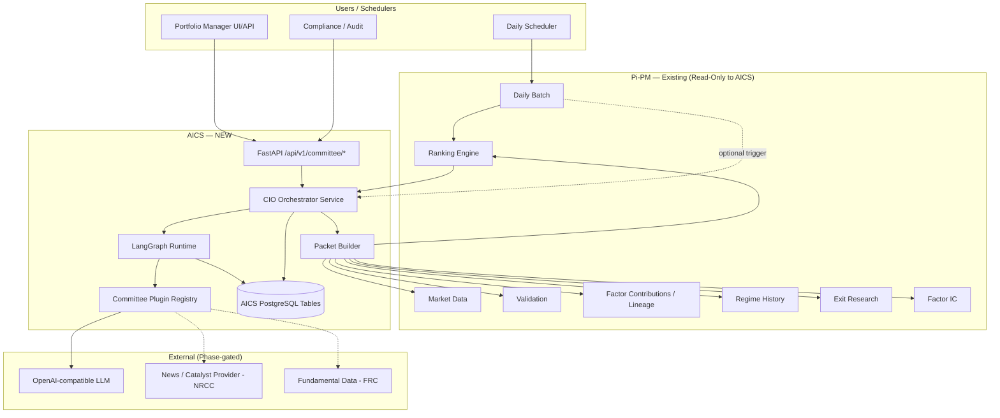
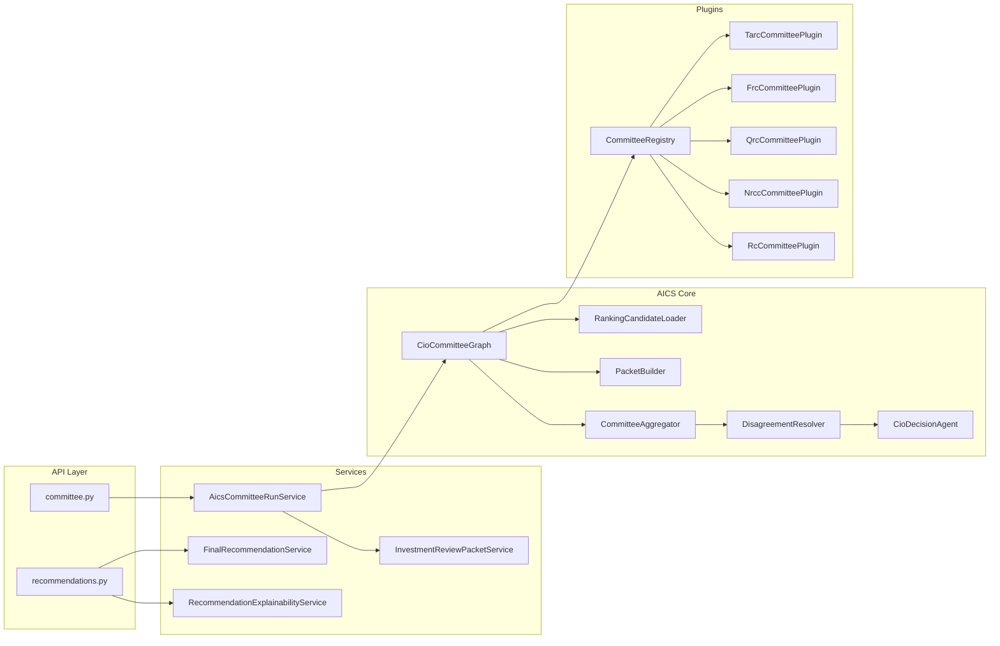
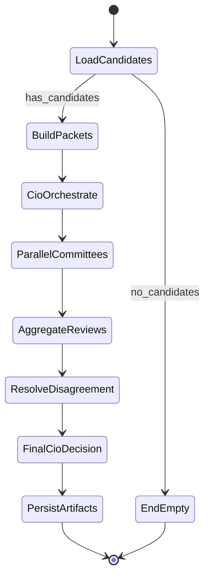
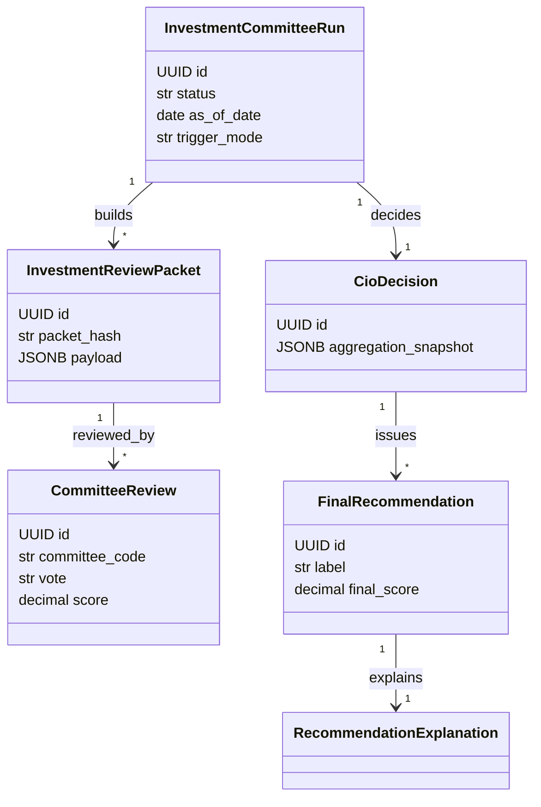
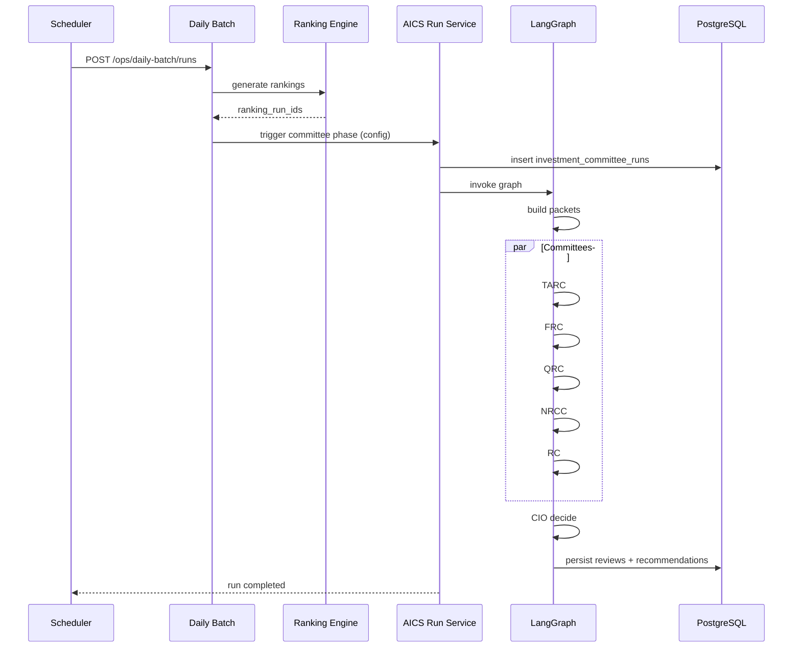
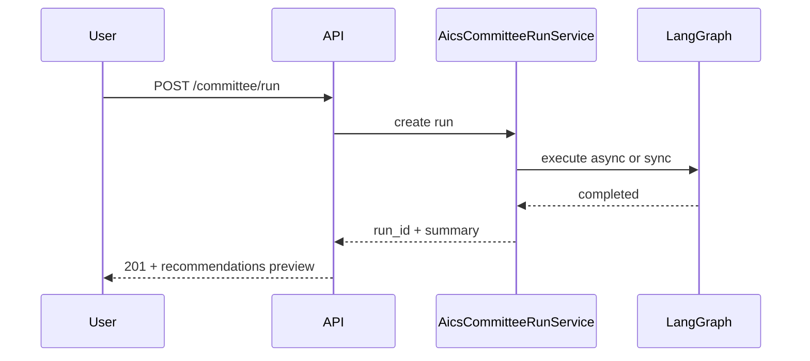
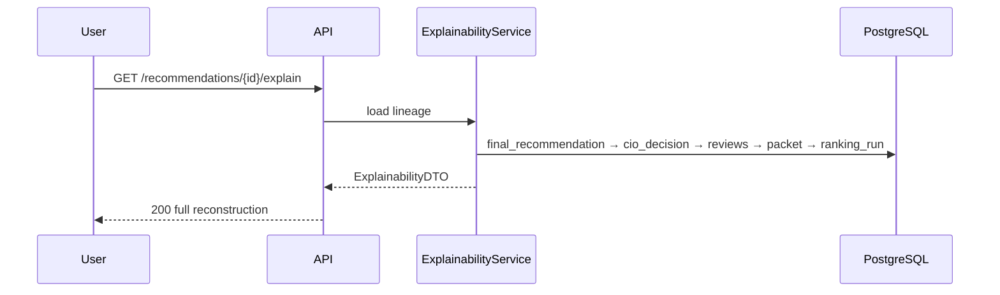
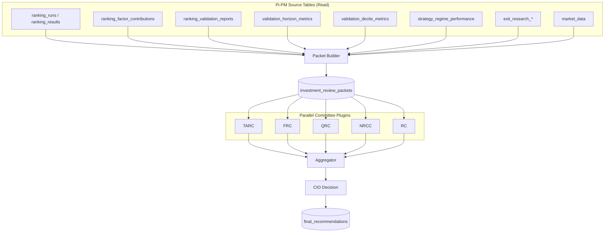
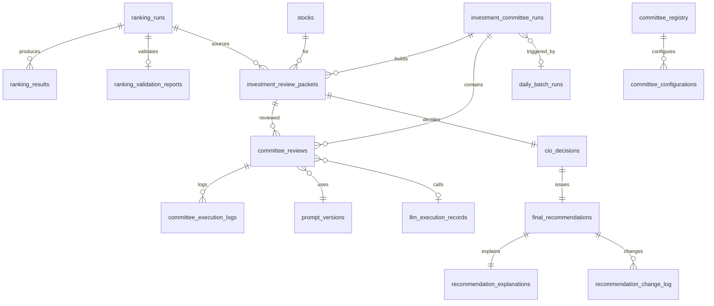

# Pi-PM AI Investment Committee System (AICS) — Architecture & Implementation Design

**Status:** Architecture & implementation planning only (no application code)  
**Authoring date:** 2026-06-07  
**Codename:** AICS (AI Investment Committee System)  
**Pi-PM context:** Post Sprint 8.6 (`feature/sprint-8.6-daily-ingestion`); builds on ranking, validation, traceability, exit research, daily batch  
**Related (superseded in scope for LLM committees):** `docs/tarc-architecture-design.md` (rule-based TARC prototype — retain for technical scoring patterns only)

**Stack (assumed):** Python 3.12+, FastAPI, PostgreSQL 16, SQLAlchemy 2.0, Alembic, LangChain, LangGraph, OpenAI-compatible LLMs

---

## Table of Contents

1. [Executive Summary](#1-executive-summary)  
2. [Detailed PRD](#2-detailed-prd)  
3. [Functional Requirements](#3-functional-requirements)  
4. [Non-Functional Requirements](#4-non-functional-requirements)  
5. [System Context Diagram](#5-system-context-diagram)  
6. [Component Architecture](#6-component-architecture)  
7. [LangGraph Architecture](#7-langgraph-architecture)  
8. [Agent Architecture](#8-agent-architecture)  
9. [Domain Model](#9-domain-model)  
10. [Sequence Diagrams](#10-sequence-diagrams)  
11. [Data Flow Diagrams](#11-data-flow-diagrams)  
12. [Database Design](#12-database-design)  
13. [ERD](#13-erd)  
14. [API Design](#14-api-design)  
15. [Traceability Architecture](#15-traceability-architecture)  
16. [Audit Architecture](#16-audit-architecture)  
17. [Observability Architecture](#17-observability-architecture)  
18. [Security Architecture](#18-security-architecture)  
19. [Plugin Architecture](#19-plugin-architecture)  
20. [Failure Handling Strategy](#20-failure-handling-strategy)  
21. [Workspace Structure](#21-workspace-structure)  
22. [Package Structure](#22-package-structure)  
23. [Implementation Plan](#23-implementation-plan)  
24. [Sprint Plan](#24-sprint-plan)  
25. [Risks and Open Questions](#25-risks-and-open-questions)  
26. [Future Evolution Strategy](#26-future-evolution-strategy)

---

## 1. Executive Summary

AICS transforms Pi-PM from a **ranking platform** into an **institutional investment research workflow**: deterministic engines produce candidates; a **CIO Agent** orchestrates **five specialized committees** (Technical, Fundamental, Quant, News/Catalyst, Risk) that review **identical investment packets**; only the CIO Agent may emit **final recommendations** with full lineage, explainability, and audit.

**Critical governance:**

| Rule | Enforcement |
|------|-------------|
| Rankings remain deterministic | `app/ranking/` unchanged; AICS reads only |
| Committees never issue final recommendations | Schema + API + CIO graph terminal node |
| CIO is sole recommender | `final_recommendations` FK → `cio_decisions` only |
| Same packet for all committees | Content-addressed `packet_hash`; immutable snapshot |
| Full reconstructability | Lineage chain + prompt/LLM audit + checkpoints |

**Execution modes:** daily batch (post-ranking), on-demand run, explainability query.

**Implementation approach:** LangGraph state machine with parallel committee subgraphs, PostgreSQL persistence, registry-driven committee plugins, extension of existing `run_lineage_records`.

---

## 2. Detailed PRD

### 2.1 Problem statement

Portfolio managers receive ranked stock lists with rich quantitative evidence but lack a **governed, multi-disciplinary review process** that:

- Applies consistent institutional review across technical, fundamental, quant, catalyst, and risk lenses  
- Preserves **why** each name was approved or rejected  
- Supports **daily delta** (“what changed since yesterday?”)  
- Scales to NIFTY_500 top-N without manual committee meetings  

### 2.2 Product goals

| Goal | Success metric |
|------|----------------|
| Governed recommendations | 100% of `final_recommendations` linked to `cio_decisions` + ≥5 committee reviews |
| Explainability | P95 explain API < 2s (cached packet + reviews) |
| Reproducibility | Re-run with frozen `packet_hash` + `prompt_version_id` yields auditable diff |
| Operational fit | Daily batch completes within SLA after ranking (target: 30 min for top-20 × 5 committees) |
| Extensibility | New committee = registry entry + plugin class, no graph rewrite |

### 2.3 Personas

| Persona | Needs |
|---------|--------|
| Portfolio Manager | Latest recommendations, CIO rationale, dissent summary |
| Quant Researcher | QRC scores tied to validation/decile/regime artifacts |
| Compliance / Audit | Immutable audit trail, prompt versions, who/what/when |
| Platform Engineer | Observable runs, retries, partial failure policies |
| AI Engineer | LangGraph checkpoints, agent contracts, eval harness |

### 2.4 Out of scope (V1–V2)

- Autonomous order placement (paper/live) without human gate  
- Modifying ranking factors, validation math, or exit simulators  
- Committee-specific packet variants  
- Multi-tenant fund isolation (single-tenant Pi-PM V1)  

### 2.5 In scope

- Packet builder from existing Pi-PM tables  
- Five committees + CIO LangGraph workflow  
- Persistence, API, lineage, observability per this document  

---

## 3. Functional Requirements

### 3.1 Ranking integration

| ID | Requirement |
|----|-------------|
| FR-01 | Load candidates from `ranking_runs` + `ranking_results` for configured strategy/universe/as_of_date |
| FR-02 | Support `breakout_v1` and `momentum_v1` (extensible strategy list) |
| FR-03 | Configurable top-N per run (default 20) |
| FR-04 | Reject candidates without `ranking_validation_reports.status = completed` when `require_completed_validation = true` |

### 3.2 Investment review packet

| ID | Requirement |
|----|-------------|
| FR-10 | Build canonical `InvestmentReviewPacket` per (ranking_run_id, stock_id) |
| FR-11 | Packet includes symbol, rank, score, factor breakdown, strategy metadata, validation, regime, market snapshot, portfolio context, research context |
| FR-12 | Serialize packet to JSONB; compute SHA-256 `packet_hash` |
| FR-13 | Persist immutable packet row before any committee execution |
| FR-14 | All committees receive byte-identical `packet_payload` |

### 3.3 Committees

| ID | Requirement |
|----|-------------|
| FR-20 | TARC, FRC, QRC, NRCC, RC implemented as registered plugins |
| FR-21 | Each committee returns structured output matching committee contract (vote, score, confidence, rationale, risks, committee-specific fields) |
| FR-22 | QRC MUST consume Pi-PM validation/decile/regime/exit artifacts (no external quant fabrications) |
| FR-23 | NRCC may return `degraded` when news feed unavailable (see failure handling) |
| FR-24 | Parallel execution of committees per packet |

### 3.4 CIO Agent

| ID | Requirement |
|----|-------------|
| FR-30 | CIO distributes packets, collects reviews, aggregates, resolves disagreement, scores, decides |
| FR-31 | Only CIO writes `final_recommendations` |
| FR-32 | CIO produces `recommendation_explanations` (human-readable + structured) |
| FR-33 | CIO logs dissent matrix and per-committee influence weights |

### 3.5 Execution modes

| ID | Requirement |
|----|-------------|
| FR-40 | **Daily batch:** trigger after daily ranking (hook from `daily_batch_runs` phase or separate scheduler) |
| FR-41 | **On demand:** `POST /committee/run` with parameters |
| FR-42 | **Explainability:** `GET /recommendations/{id}/explain` reconstructs full chain |

### 3.6 Traceability & audit

| ID | Requirement |
|----|-------------|
| FR-50 | Lineage: Recommendation → CIO Decision → Committee Reviews → Packet → Ranking Run → source data |
| FR-51 | Store `prompt_version_id`, model id, token usage per LLM call |
| FR-52 | `recommendation_change_log` for day-over-day delta |
| FR-53 | Immutable committee reviews after `status = completed` |

---

## 4. Non-Functional Requirements

| Category | Requirement |
|----------|-------------|
| **Availability** | API 99.5%; committee run retryable from LangGraph checkpoint |
| **Latency** | On-demand top-5: < 3 min; top-20 batch: < 30 min (parallel committees, model-dependent) |
| **Throughput** | 20 candidates × 5 committees = 100 LLM calls/run (budget controls) |
| **Consistency** | Same packet_hash + prompt versions → deterministic temperature 0 where configured |
| **Durability** | All artifacts in PostgreSQL; no orphan in-memory-only decisions |
| **Security** | RBAC on run/explain; audit append-only; secrets via env |
| **Cost** | Per-run token budget cap; committee-level timeout |
| **Compliance** | 7-year retention policy (configurable); PII none in V1 |
| **Testability** | Mock LLM + golden packets; graph unit tests without network |

---

## 5. System Context Diagram



---

## 6. Component Architecture

### 6.1 Layering (aligns with `docs/domain-boundaries.md`)

| Layer | Responsibility | Must NOT |
|-------|----------------|----------|
| `app/workspace_aics/` | Domain types, packet schema, committee contracts, graph state | SQL, HTTP, LLM client |
| `app/aics/` | LangGraph graphs, agents, checkpointer adapters | Direct ranking mutations |
| `app/services/aics_*` | Orchestration, transactions, API-facing use cases | Factor formulas |
| `app/db/repositories/aics_*` | Persistence | Business rules |
| `app/api/v1/committee.py` | REST | Orchestration logic |
| `app/schemas/aics.py` | Pydantic API DTOs | — |

### 6.2 Component diagram



---

## 7. LangGraph Architecture

### 7.1 Graph topology



### 7.2 LangGraph implementation pattern

- **Parent graph:** `CioCommitteeWorkflowGraph`  
- **Subgraph per committee:** `CommitteeReviewSubgraph` (invoked via `Send` API for map-reduce over committees)  
- **Parallelism:** `parallel_committee_node` fans out fixed committee codes from registry for active run config  
- **Checkpointing:** `PostgresSaver` (LangGraph) + mirror summary in `investment_committee_runs.checkpoint_ref`  

### 7.3 State schema (`CioWorkflowState`)

| Field | Type | Description |
|-------|------|-------------|
| `run_id` | UUID | `investment_committee_runs.id` |
| `run_config` | dict | Strategy, universe, as_of_date, top_n, committee_codes |
| `ranking_run_ids` | list[UUID] | Source ranking runs |
| `candidate_ids` | list[UUID] | `(ranking_run_id, stock_id)` pairs |
| `packets` | list[PacketRef] | Built packet ids + hashes |
| `committee_codes` | list[str] | Active committees |
| `reviews` | list[CommitteeReviewResult] | Accumulated from parallel node |
| `aggregation` | CommitteeAggregation | Weighted scores, dissent flags |
| `cio_decision` | CioDecisionDraft | Pre-persist decision |
| `errors` | list[WorkflowError] | Non-fatal per committee |
| `phase` | str | Current node name |
| `started_at` | datetime | |
| `token_usage_total` | int | Budget tracking |

### 7.4 Transitions & guards

| From | To | Guard |
|------|-----|-------|
| LoadCandidates | BuildPackets | `len(candidates) > 0` |
| ParallelCommittees | AggregateReviews | All committees terminal OR timeout policy satisfied |
| ResolveDisagreement | FinalCioDecision | Always (CIO applies policy) |
| Any node | FailureHandler | Uncaught exception → persist failed run |

### 7.5 Retries

| Node | Retry policy |
|------|----------------|
| LLM committee call | 3× exponential backoff (1s, 4s, 16s); schema validation failure → 1 repair call |
| Packet build | 0 retry (deterministic); fail run |
| DB persist | 2× on deadlock |

### 7.6 Checkpoints & replay

- Checkpoint after: `BuildPackets`, `ParallelCommittees`, `PersistArtifacts`  
- **Replay:** `POST /committee/runs/{id}/replay?from_checkpoint=parallel_committees`  
- Replay uses frozen `packet_hash` + stored prompts (no re-fetch ranking)  

### 7.7 Observability hooks

- OpenTelemetry spans: `aics.graph.node.{node_name}`  
- Structured logs: `committee_code`, `stock_symbol`, `run_id`, `latency_ms`, `model`  
- Emit metrics: `aics_committee_duration_seconds`, `aics_llm_tokens_total`  

---

## 8. Agent Architecture

### 8.1 Agent roles

| Agent | Type | LLM? | Responsibility |
|-------|------|------|----------------|
| **RankingCandidateLoader** | Deterministic | No | SQL load top-N from ranking |
| **PacketBuilder** | Deterministic | No | Assemble canonical packet |
| **CIO Orchestrator** | LangGraph coordinator | Optional narrative only | Fan-out/fan-in, no vote |
| **TARC Agent** | Committee plugin | Yes | Technical interpretation |
| **FRC Agent** | Committee plugin | Yes | Fundamental interpretation |
| **QRC Agent** | Committee plugin | Yes (grounded) | Quant evidence from Pi-PM tables only |
| **NRCC Agent** | Committee plugin | Yes | News/catalyst (tool calls) |
| **RC Agent** | Committee plugin | Yes | Risk / sizing |
| **CIO Decision Agent** | Synthesizer | Yes | Final score, label, explanation |
| **Disagreement Resolver** | Hybrid | Optional | Rule-based weights + LLM summary |

### 8.2 Committee agent contract

```python
# Conceptual — not implementation code
class CommitteePlugin(Protocol):
    committee_code: str  # e.g. "TARC"
    version: str

    def build_prompt(self, packet: InvestmentReviewPacket, prompt_version: PromptVersion) -> list[Message]: ...

    def parse_response(self, raw: str) -> CommitteeReviewOutput: ...  # Pydantic validated

    def execute(self, packet: InvestmentReviewPacket, ctx: CommitteeExecutionContext) -> CommitteeReviewOutput: ...
```

### 8.3 QRC grounding rules (mandatory)

QRC agent **must** receive:

- `validation_horizon_metrics` / `validation_decile_metrics` for ranking_run  
- `strategy_regime_performance` for strategy + regime_label  
- `exit_research_policy_metrics` / alpha decay when available  
- Factor IC summaries from `factor_performance_metrics`  

QRC prompt includes: *“Use only evidence in packet.quant_evidence. Do not invent statistics.”*

### 8.4 CIO Decision Agent

**Inputs:** aggregated committee reviews, disagreement matrix, packet, run config  
**Outputs:** `CioDecision` + `FinalRecommendation` fields:

- `recommendation_label`: `STRONG_BUY | BUY | HOLD | WATCHLIST | REJECT`  
- `final_score`: 0–100  
- `confidence`: 0–1  
- `position_size_pct` (from RC, adjusted by CIO policy)  
- `rationale` (markdown + structured JSON)  
- `dissent_summary`  

**Hard rule:** Graph edge from `FinalCioDecision` is the **only** path that creates `final_recommendations`.

---

## 9. Domain Model

### 9.1 Core aggregates



### 9.2 Value objects

| Object | Fields |
|--------|--------|
| `CommitteeVote` | `APPROVE`, `NEUTRAL`, `REJECT` |
| `CommitteeReviewOutput` | vote, score, confidence, rationale, risks, recommendation, extensions |
| `InvestmentReviewPacket` | See §9.3 |
| `DisagreementMatrix` | pairwise variance, outliers, veto flags |
| `InfluenceWeights` | committee_code → weight (sum = 1) |

### 9.3 Canonical packet schema (JSON)

```json
{
  "packet_version": "1.0.0",
  "symbol": "WOCKPHARMA.NS",
  "stock_id": "uuid",
  "ranking": {
    "ranking_run_id": "uuid",
    "strategy_name": "breakout_v1",
    "strategy_version": "1.0.0",
    "universe_code": "NIFTY_500",
    "as_of_date": "2026-06-01",
    "rank": 3,
    "composite_score": 0.847,
    "score_components": {},
    "inputs_hash": "..."
  },
  "technical_factors": {
    "breakout_quality": {},
    "momentum": {},
    "volume_confirmation": {},
    "relative_strength": {}
  },
  "validation": {
    "report_id": "uuid",
    "status": "completed",
    "horizon_metrics": [],
    "decile_metrics": [],
    "regime_label": "BULL_LOW_VOL"
  },
  "regime": {
    "regime_label": "BULL_LOW_VOL",
    "regime_history_id": "uuid"
  },
  "quant_evidence": {
    "factor_ic": {},
    "exit_research": {},
    "expected_return_prior": null
  },
  "market_snapshot": {
    "last_close": 482.5,
    "last_date": "2026-06-01",
    "adv_inr": 125000000,
    "sector": "Pharma"
  },
  "portfolio_context": {
    "existing_position": false,
    "portfolio_weight_pct": 0
  },
  "research_context": {
    "research_intelligence_report_id": null,
    "notes": []
  },
  "fundamental_snapshot": {},
  "news_snapshot": {},
  "packet_built_at": "2026-06-01T16:00:00Z",
  "source_lineage": {
    "ranking_run_id": "uuid",
    "validation_report_id": "uuid",
    "market_data_through": "2026-06-01"
  }
}
```

**Invariant:** `packet_hash = SHA256(canonical_json(payload))` with sorted keys.

---

## 10. Sequence Diagrams

### 10.1 Daily batch mode



### 10.2 On-demand



### 10.3 Explainability



---

## 11. Data Flow Diagrams



---

## 12. Database Design

### 12.1 Table summary

| Table | Purpose |
|-------|---------|
| `committee_registry` | Catalog of committee plugins (code, version, active) |
| `committee_configurations` | Weights, thresholds, model per committee per environment |
| `prompt_versions` | Immutable prompt templates + hash |
| `investment_committee_runs` | Top-level workflow run |
| `investment_review_packets` | Immutable packet snapshots |
| `committee_reviews` | One row per (packet, committee_code, run) |
| `committee_votes` | Normalized vote detail (optional 1:1 with reviews) |
| `committee_execution_logs` | Per-invocation logs (latency, errors) |
| `cio_decisions` | CIO aggregation + decision per run (or per packet batch) |
| `final_recommendations` | **Only CIO output** — tradeable recommendation |
| `recommendation_explanations` | Structured + narrative explainability |
| `recommendation_change_log` | Day-over-day deltas |
| `agent_execution_audit` | High-level audit events |
| `llm_execution_records` | Token, model, request/response refs per call |

### 12.2 `investment_committee_runs`

| Column | Type | Notes |
|--------|------|-------|
| `id` | UUID PK | |
| `status` | VARCHAR(16) | pending, running, completed, failed, partial |
| `trigger_mode` | VARCHAR(16) | daily_batch, on_demand, replay |
| `universe_code` | VARCHAR(64) | |
| `strategy_name` | VARCHAR(64) | |
| `strategy_version` | VARCHAR(16) | |
| `as_of_date` | DATE | |
| `top_n` | INT | |
| `committee_codes` | JSONB | e.g. `["TARC","FRC","QRC","NRCC","RC"]` |
| `config_snapshot` | JSONB | Frozen committee_configurations |
| `ranking_run_ids` | JSONB | Array of UUID |
| `daily_batch_run_id` | UUID NULL | FK optional → daily_batch_runs |
| `checkpoint_ref` | VARCHAR(128) | LangGraph thread id |
| `phase` | VARCHAR(32) | |
| `error_message` | TEXT | |
| `started_at` | TIMESTAMPTZ | |
| `completed_at` | TIMESTAMPTZ | |
| `duration_seconds` | NUMERIC | |

**Indexes:** `(status, started_at)`, `(as_of_date, strategy_name)`, `(daily_batch_run_id)`

### 12.3 `investment_review_packets`

| Column | Type | Notes |
|--------|------|-------|
| `id` | UUID PK | |
| `committee_run_id` | UUID FK | |
| `ranking_run_id` | UUID FK | |
| `stock_id` | UUID FK | |
| `symbol` | VARCHAR(32) | Denormalized |
| `packet_version` | VARCHAR(16) | |
| `packet_hash` | VARCHAR(64) | UNIQUE per run |
| `payload` | JSONB | Full canonical packet |
| `built_at` | TIMESTAMPTZ | |

**Indexes:** UNIQUE (`committee_run_id`, `ranking_run_id`, `stock_id`), `(packet_hash)`

### 12.4 `committee_reviews`

| Column | Type | Notes |
|--------|------|-------|
| `id` | UUID PK | |
| `committee_run_id` | UUID FK | |
| `packet_id` | UUID FK | |
| `committee_code` | VARCHAR(16) | TARC, FRC, ... |
| `committee_version` | VARCHAR(16) | |
| `status` | VARCHAR(16) | pending, completed, failed, degraded, timeout |
| `vote` | VARCHAR(16) | approve, neutral, reject |
| `score` | NUMERIC(8,4) | 0–100 |
| `confidence` | NUMERIC(6,4) | 0–1 |
| `recommendation` | VARCHAR(32) | committee-level label |
| `rationale` | TEXT | |
| `risks` | JSONB | array |
| `extensions` | JSONB | committee-specific fields |
| `prompt_version_id` | UUID FK | |
| `llm_execution_id` | UUID FK NULL | |
| `influence_weight` | NUMERIC(6,4) | Post-aggregation |
| `created_at` | TIMESTAMPTZ | |

**Indexes:** UNIQUE (`packet_id`, `committee_code`), `(committee_run_id, committee_code)`

### 12.5 `committee_votes` (optional normalization)

| Column | Type | Notes |
|--------|------|-------|
| `id` | UUID PK | |
| `committee_review_id` | UUID FK | |
| `vote_dimension` | VARCHAR(32) | e.g. trend_quality |
| `vote_value` | VARCHAR(16) | |
| `score` | NUMERIC | |

### 12.6 `committee_execution_logs`

| Column | Type | Notes |
|--------|------|-------|
| `id` | UUID PK | |
| `committee_review_id` | UUID FK | |
| `event_type` | VARCHAR(32) | started, llm_call, parse_ok, failed |
| `message` | TEXT | |
| `metadata` | JSONB | |
| `created_at` | TIMESTAMPTZ | |

### 12.7 `cio_decisions`

| Column | Type | Notes |
|--------|------|-------|
| `id` | UUID PK | |
| `committee_run_id` | UUID FK | |
| `packet_id` | UUID FK | |
| `aggregation_snapshot` | JSONB | scores, weights, dissent |
| `final_score` | NUMERIC(8,4) | |
| `confidence` | NUMERIC(6,4) | |
| `recommendation_label` | VARCHAR(16) | |
| `position_size_pct` | NUMERIC(8,4) NULL | |
| `stop_loss_pct` | NUMERIC(8,4) NULL | |
| `rationale` | TEXT | |
| `dissent_summary` | JSONB | |
| `prompt_version_id` | UUID FK | |
| `llm_execution_id` | UUID FK | |
| `created_at` | TIMESTAMPTZ | |

### 12.8 `final_recommendations`

| Column | Type | Notes |
|--------|------|-------|
| `id` | UUID PK | |
| `cio_decision_id` | UUID FK UNIQUE | **Only path to recommendations** |
| `committee_run_id` | UUID FK | |
| `stock_id` | UUID FK | |
| `symbol` | VARCHAR(32) | |
| `as_of_date` | DATE | |
| `label` | VARCHAR(16) | |
| `final_score` | NUMERIC(8,4) | |
| `is_active` | BOOLEAN | latest for symbol/date |
| `supersedes_id` | UUID NULL | prior recommendation |
| `signed_hash` | VARCHAR(64) | integrity |
| `created_at` | TIMESTAMPTZ | |

**Indexes:** `(as_of_date, is_active)`, `(symbol, as_of_date DESC)`, UNIQUE partial `(symbol, as_of_date) WHERE is_active`

### 12.9 Supporting tables (abbreviated)

- **`recommendation_explanations`:** `recommendation_id`, `structured` JSONB, `narrative_md` TEXT  
- **`recommendation_change_log`:** `symbol`, `prev_recommendation_id`, `new_recommendation_id`, `diff` JSONB  
- **`prompt_versions`:** `committee_code`, `version`, `template` TEXT, `template_hash`, `created_at`  
- **`llm_execution_records`:** `model`, `provider`, `input_tokens`, `output_tokens`, `request_ref`, `response_ref` (S3 or JSONB blob ref), `latency_ms`  
- **`agent_execution_audit`:** `entity_type`, `entity_id`, `actor`, `action`, `payload` JSONB  

### 12.10 Lineage integration

Extend `LineageEntityType`:

- `investment_committee_run`  
- `investment_review_packet`  
- `committee_review`  
- `cio_decision`  
- `final_recommendation`  

Extend `LineageRelationshipType`:

- `ranking_produces_packet`  
- `packet_reviewed_by_committee`  
- `reviews_aggregated_to_cio`  
- `cio_issues_recommendation`  
- `recommendation_supersedes`  

Link upstream: `final_recommendation` → `ranking_run` (transitive via packet).

---

## 13. ERD



---

## 14. API Design

**Prefix:** `/api/v1`  
**Tags:** `committee`, `recommendations`

### 14.1 `POST /api/v1/committee/run`

Start committee workflow (sync V1 or async V1.1 with `202`).

**Request:**

```json
{
  "universe_code": "NIFTY_500",
  "strategy_name": "breakout_v1",
  "strategy_version": "1.0.0",
  "as_of_date": "2026-06-01",
  "ranking_run_id": null,
  "top_n": 20,
  "committee_codes": ["TARC", "FRC", "QRC", "NRCC", "RC"],
  "trigger_mode": "on_demand",
  "require_completed_validation": true,
  "dry_run": false,
  "idempotency_key": "committee-2026-06-01-breakout"
}
```

**Response `201`:**

```json
{
  "run_id": "uuid",
  "status": "completed",
  "as_of_date": "2026-06-01",
  "candidates_reviewed": 20,
  "recommendations_issued": 8,
  "recommendations_rejected": 12,
  "partial_committee_failures": [],
  "duration_seconds": 1240.5,
  "recommendation_preview": [
    {
      "recommendation_id": "uuid",
      "symbol": "WOCKPHARMA.NS",
      "label": "BUY",
      "final_score": 78.4
    }
  ]
}
```

### 14.2 `GET /api/v1/recommendations/latest`

**Query:** `as_of_date`, `strategy_name`, `universe_code`, `label_in=BUY,STRONG_BUY`

**Response `200`:** list of `FinalRecommendationRead`

### 14.3 `GET /api/v1/recommendations/{recommendation_id}`

Full recommendation + CIO summary.

### 14.4 `GET /api/v1/recommendations/{recommendation_id}/explain`

**Response `200`:**

```json
{
  "recommendation_id": "uuid",
  "symbol": "WOCKPHARMA.NS",
  "label": "BUY",
  "final_score": 78.4,
  "cio_rationale": "...",
  "dissent_summary": { "against": ["RC"], "for": ["TARC", "QRC"] },
  "committee_reviews": [
    {
      "committee_code": "TARC",
      "vote": "approve",
      "score": 82,
      "confidence": 0.91,
      "rationale": "..."
    }
  ],
  "influence_weights": { "TARC": 0.22, "QRC": 0.28 },
  "packet_snapshot": { },
  "ranking_snapshot": { "rank": 3, "composite_score": 0.847 },
  "lineage": {
    "ranking_run_id": "uuid",
    "committee_run_id": "uuid",
    "packet_id": "uuid",
    "packet_hash": "..."
  },
  "change_since_prior": null
}
```

### 14.5 `GET /api/v1/recommendations/{recommendation_id}/lineage`

Returns `run_lineage_records` chain + AICS-native lineage DTO.

### 14.6 `GET /api/v1/committee-runs/{run_id}`

Run status, phase, counts, errors.

### 14.7 `GET /api/v1/committee-runs/{run_id}/audit`

`agent_execution_audit` + `llm_execution_records` summary (RBAC: auditor).

### 14.8 `GET /api/v1/committee-runs/{run_id}/reviews`

All `committee_reviews` grouped by symbol.

### 14.9 `POST /api/v1/committee-runs/{run_id}/replay`

**Query:** `from_checkpoint`, `committee_codes` (optional subset)

---

## 15. Traceability Architecture

### 15.1 Reconstruction queries

| Question | Resolution path |
|----------|-----------------|
| Why recommended? | `final_recommendations` → `cio_decisions.rationale` + `recommendation_explanations` |
| Why rejected? | Same chain; `label = REJECT` |
| Who voted for? | `committee_reviews` where `vote = approve` |
| Who voted against? | `committee_reviews` where `vote = reject` |
| Who influenced most? | `cio_decisions.aggregation_snapshot.influence_weights` |
| What changed since yesterday? | `recommendation_change_log` |
| Which ranking run? | `investment_review_packets.ranking_run_id` |
| Which packet? | `packet_id` + `packet_hash` |
| Which prompts? | `committee_reviews.prompt_version_id` → `prompt_versions` |
| Which model? | `llm_execution_records.model` |

### 15.2 Immutability rules

| Artifact | Mutable after complete? |
|----------|-------------------------|
| `investment_review_packets` | **Never** |
| `committee_reviews` | **Never** (new run = new rows) |
| `cio_decisions` | **Never** |
| `final_recommendations` | Supersede only via new row + `supersedes_id` |
| `prompt_versions` | Append-only |

### 15.3 Content addressing

- `packet_hash` verified on committee load  
- `signed_hash` on recommendation = HMAC(config secret, canonical decision fields)  

---

## 16. Audit Architecture

| Layer | Mechanism |
|-------|-----------|
| **Application audit** | `agent_execution_audit` for user/API actions |
| **LLM audit** | `llm_execution_records` + optional object storage for raw payloads |
| **Prompt governance** | `prompt_versions.template_hash` required before run |
| **DB audit** | Append-only triggers on `committee_reviews`, `cio_decisions`, `final_recommendations` (no UPDATE/DELETE for app role) |
| **Run export** | `GET /committee-runs/{id}/audit` produces compliance bundle JSON |

---

## 17. Observability Architecture

### 17.1 Dashboard 1 — Committee execution

| Panel | Metric |
|-------|--------|
| Runs by status | `investment_committee_runs.status` |
| Duration P50/P95 | `duration_seconds` |
| Failures by committee | `committee_reviews.status = failed` |
| Retry count | `committee_execution_logs` |
| Token burn | `sum(llm_execution_records tokens)` |

### 17.2 Dashboard 2 — Recommendations

| Panel | Metric |
|-------|--------|
| Labels distribution | BUY / HOLD / REJECT counts |
| Score histogram | `final_score` |
| Committee score heatmap | avg score by committee_code |
| Approval rate | approve votes / total |

### 17.3 Dashboard 3 — Explainability

| Panel | Metric |
|-------|--------|
| Dissent rate | runs with any reject vote |
| Top influence committee | weight from aggregation |
| Change log volume | new/changed/removed symbols |

### 17.4 Alerts

- Run `failed` > 0 in daily batch  
- Partial committee failure > 2 committees  
- Token budget exceeded  
- P95 latency > SLA  

---

## 18. Security Architecture

| Control | Design |
|---------|--------|
| **RBAC** | Roles: `viewer`, `analyst`, `committee_operator`, `auditor`, `admin` |
| | `committee_operator`: POST run; `auditor`: audit endpoints; `viewer`: read recommendations |
| **Immutable audit** | DB policies + no app-level delete |
| **Prompt versioning** | Only `admin` publishes `prompt_versions` |
| **Recommendation signing** | HMAC-SHA256 `signed_hash` with key rotation |
| **Lineage verification** | API recomputes `packet_hash` and `signed_hash` on explain |
| **Secrets** | LLM API keys in env; not in `config_snapshot` |
| **LLM data** | Packets may contain public market data only V1; no PII |

---

## 19. Plugin Architecture

### 19.1 Registry

```text
committee_registry
  committee_code (PK)
  display_name
  plugin_entrypoint  # e.g. "app.aics.plugins.tarc:TarcCommitteePlugin"
  default_version
  is_active
  capabilities JSONB  # requires_news, requires_fundamentals, etc.
```

### 19.2 Configuration

```text
committee_configurations
  committee_code
  environment  # dev, prod
  version
  model_name
  temperature
  timeout_seconds
  weight  # CIO aggregation
  prompt_version_id
  extensions JSONB
```

### 19.3 Adding a committee (e.g. ESG)

1. Implement `CommitteePlugin` subclass  
2. Register in `committee_registry` (migration seed)  
3. Add `committee_configurations` row  
4. Add prompt to `prompt_versions`  
5. Enable in run config `committee_codes` — **no graph code change** (dynamic fan-out from registry)

---

## 20. Failure Handling Strategy

| Scenario | Committee behavior | CIO behavior |
|----------|-------------------|--------------|
| **Committee timeout** | `status=timeout`; no review row or partial with error | Weight = 0; proceed if ≥3 committees succeeded |
| **Partial failures** | Per-committee `failed` | `investment_committee_runs.status=partial`; issue recommendations with `confidence` penalty |
| **Stale data** | Packet builder detects `market_data_through < as_of_date` | Fail run OR flag `stale_data_warning` in explanation |
| **Missing news (NRCC)** | `status=degraded`; neutral vote + rationale | Reduce NRCC weight 50% |
| **LLM failure** | Retry 3×; then `failed` | Same as partial |
| **Malformed review** | Repair prompt once; else `failed` | Exclude committee |
| **Inconsistent ranking** | Packet builder validation error | Fail run pre-committee |
| **QRC missing validation** | QRC `failed` hard | CIO may abort symbol if quant is required |

**Minimum committees for decision:** configurable `min_successful_committees` (default 3 of 5).

**CIO veto policy:** RC `reject` with confidence > 0.85 → max label `HOLD` regardless of other votes (configurable).

---

## 21. Workspace Structure

```text
app/workspace_aics/
  __init__.py
  constants.py           # Committee codes, vote enums, labels
  models.py              # Domain dataclasses (packet, reviews, CIO)
  packet_schema.py       # JSON schema version + validation
  committee_contracts.py # Per-committee output TypedDicts / Pydantic
  aggregation.py         # Weighted scoring, dissent detection
  policies.py            # CIO policies (RC veto, min committees)
```

---

## 22. Package Structure

```text
app/aics/
  __init__.py
  graph/
    state.py
    cio_workflow.py      # Main LangGraph definition
    nodes/
      load_candidates.py
      build_packets.py
      parallel_committees.py
      aggregate.py
      resolve_disagreement.py
      final_cio_decision.py
      persist.py
    checkpoints.py       # PostgresSaver wiring
  agents/
    cio_decision_agent.py
    disagreement_resolver.py
  plugins/
    base.py
    registry.py
    tarc.py
    frc.py
    qrc.py              # Grounded quant - reads packet only
    nrcc.py
    rc.py
  loaders/
    ranking_candidate_loader.py
  builders/
    investment_review_packet_builder.py
  llm/
    factory.py          # LangChain chat model
    structured_output.py
  observability/
    metrics.py
    spans.py

app/services/
  aics_committee_run_service.py
  aics_packet_service.py
  aics_recommendation_service.py
  aics_explainability_service.py

app/db/repositories/
  aics_committee_run_repository.py
  aics_packet_repository.py
  aics_committee_review_repository.py
  aics_cio_decision_repository.py
  aics_final_recommendation_repository.py
  aics_prompt_version_repository.py
  aics_llm_execution_repository.py

app/api/v1/
  committee.py
  recommendations.py

app/schemas/
  aics.py

migrations/versions/
  20260608_0016_aics_committee_framework.py  # example revision

tests/
  unit/aics/
  integration/aics/
  fixtures/packets/
```

---

## 23. Implementation Plan

| Step | Deliverable | Depends on |
|------|-------------|------------|
| 1 | Schema migration + repositories | — |
| 2 | Packet builder + golden tests | ranking/validation repos |
| 3 | Committee registry + stub plugins | — |
| 4 | LangGraph skeleton + checkpoint | 1–3 |
| 5 | TARC + QRC plugins (LLM) | 4 |
| 6 | CIO decision + persistence | 4–5 |
| 7 | API run + latest recommendations | 6 |
| 8 | FRC + NRCC + RC plugins | 6 |
| 9 | Explainability + lineage | 6 |
| 10 | Daily batch integration | daily_batch_runs |
| 11 | Observability + RBAC | 7–10 |

---

## 24. Sprint Plan

### Phase 1 — Committee Framework (Sprints 9.1–9.2, ~4 weeks)

| Item | Detail |
|------|--------|
| **Objectives** | DB schema, packet builder, registry, LangGraph skeleton, stub committees |
| **Deliverables** | Migration `0016`, `InvestmentReviewPacketBuilder`, empty graph E2E, `POST /committee/run` (dry_run) |
| **Dependencies** | Pi-PM 8.6 merged |
| **Risks** | LangGraph checkpoint ops complexity |
| **Acceptance** | Packet hash stable; graph persists run; 50 unit tests |

### Phase 2 — Technical + Quant Committees (Sprints 9.3–9.4, ~4 weeks)

| Item | Detail |
|------|--------|
| **Objectives** | TARC + QRC LLM plugins with grounded quant |
| **Deliverables** | TARC/QRC agents, prompt_versions, committee_reviews persistence |
| **Dependencies** | Phase 1 |
| **Risks** | LLM hallucination on QRC — mitigated by schema validation |
| **Acceptance** | QRC cites only packet IDs; 10 golden packet integration tests |

### Phase 3 — Fundamental + News + Risk (Sprints 9.5–9.6, ~4 weeks)

| Item | Detail |
|------|--------|
| **Objectives** | FRC, NRCC (degraded mode), RC + RC veto policy |
| **Deliverables** | Full 5-committee parallel graph |
| **Dependencies** | Phase 2; news provider adapter (NRCC) |
| **Risks** | News API availability |
| **Acceptance** | Partial NRCC degradation does not block run |

### Phase 4 — Explainability + Audit (Sprints 9.7–9.8, ~3 weeks)

| Item | Detail |
|------|--------|
| **Objectives** | Explain API, lineage, change log, audit export, signing |
| **Deliverables** | `/explain`, `/lineage`, `/audit`, `recommendation_change_log` |
| **Dependencies** | Phase 3 |
| **Risks** | Large payload sizes — mitigated by pagination |
| **Acceptance** | Audit reconstructs 100% of fields for sample runs |

### Phase 5 — Advanced Committees (Sprints 10+, backlog)

| Item | Detail |
|------|--------|
| **Objectives** | ESG, Macro, Options, Valuation plugins via registry |
| **Deliverables** | 1–2 new plugins + config only |
| **Dependencies** | Phase 4 |
| **Risks** | Scope creep |
| **Acceptance** | New committee added without graph rewrite |

---

## 25. Risks and Open Questions

| Risk | Impact | Mitigation |
|------|--------|------------|
| LLM cost at NIFTY scale | High OPEX | top-N cap; batch only top-20; cheaper models for NRCC |
| Validation `insufficient_data` on latest day | QRC weak | Committee run requires `completed` validation; lag T+5 |
| Hallucinated fundamentals | Bad FRC | Phase 3 gated on data provider; degraded without data |
| TARC doc overlap | Confusion | Deprecate rule-only TARC path; AICS supersedes for LLM |
| Graph complexity | Ops burden | Checkpoint + replay; strong integration tests |
| Regulatory perception | Compliance | Human-in-loop before paper trade; audit bundle |

**Open questions:**

1. Single CIO decision per symbol vs batch-level CIO narrative?  
2. Async `202` + poll vs sync for V1 API?  
3. Store raw LLM payloads in DB vs object storage?  
4. Integrate AICS as phase 8 of `daily_batch_runs` or separate scheduler?  
5. Multi-strategy merge (breakout + momentum) — one CIO run or two?  

---

## 26. Future Evolution Strategy

| Horizon | Capability |
|---------|------------|
| **H1** | Human approval workflow → `paper_trades` with FK to `final_recommendations` |
| **H2** | Committee eval harness (golden packets, expected vote ranges) |
| **H3** | Model routing (small model for NRCC, large for CIO) |
| **H4** | Retrieval-augmented NRCC with vector store |
| **H5** | Multi-portfolio context (position limits across book) |
| **H6** | Real-time intraday committee refresh (event-driven) |

**Principle:** Ranking and validation remain deterministic; AICS remains an advisory governance layer until explicit human or policy promotion.

---

## Appendix A — Committee output schemas

### TARC

```json
{
  "vote": "approve",
  "score": 82.0,
  "confidence": 0.91,
  "rationale": "...",
  "risks": ["..."],
  "recommendation": "BUY",
  "breakout_quality": 0.88,
  "trend_quality": 0.85,
  "momentum_quality": 0.79,
  "volume_confirmation": 0.81,
  "relative_strength": 0.76
}
```

### FRC

```json
{
  "vote": "neutral",
  "score": 65.0,
  "confidence": 0.72,
  "rationale": "...",
  "risks": ["..."],
  "recommendation": "HOLD",
  "revenue_growth": "moderate",
  "eps_growth": "strong",
  "roce": "high",
  "debt_quality": "acceptable"
}
```

### QRC

```json
{
  "vote": "approve",
  "score": 79.0,
  "confidence": 0.88,
  "expected_return": 0.042,
  "expected_holding_period_days": 20,
  "rationale": "...",
  "evidence_refs": ["validation:horizon:20d", "decile:top"]
}
```

### NRCC

```json
{
  "vote": "approve",
  "score": 70.0,
  "confidence": 0.65,
  "catalysts": ["earnings beat"],
  "risks": ["regulatory headline risk"],
  "rationale": "..."
}
```

### RC

```json
{
  "vote": "neutral",
  "score": 60.0,
  "confidence": 0.80,
  "position_size": 0.02,
  "stop_loss": 0.08,
  "risks": ["high beta"],
  "rationale": "..."
}
```

---

## Appendix B — Relationship to existing `tarc-architecture-design.md`

| Aspect | TARC doc (2026-06) | AICS (this doc) |
|--------|-------------------|-----------------|
| Scope | Single “Trading AI Review Committee” rule scorers | Five committees + CIO + LLM |
| Recommender | Recommendation engine (advisory) | **CIO only** |
| LLM | Phase 3 optional | Core to committees |
| Reuse | Technical scoring ideas | QRC/TARC **evidence** patterns |

**Recommendation:** Mark TARC doc as **superseded by AICS** for product workflow; salvage technical factor mapping for `PacketBuilder.technical_factors`.

---

## Appendix C — Daily batch integration hook

Extend `DailyBatchPhaseFlags`:

```json
{
  "investment_committee": false
}
```

When `true`, after rankings + validation (and optionally after forward data available):

```text
daily_batch_run → investment_committee_run (FK daily_batch_run_id)
```

Configurable lag: `committee_min_validation_status = completed`.

---

*End of document.*
