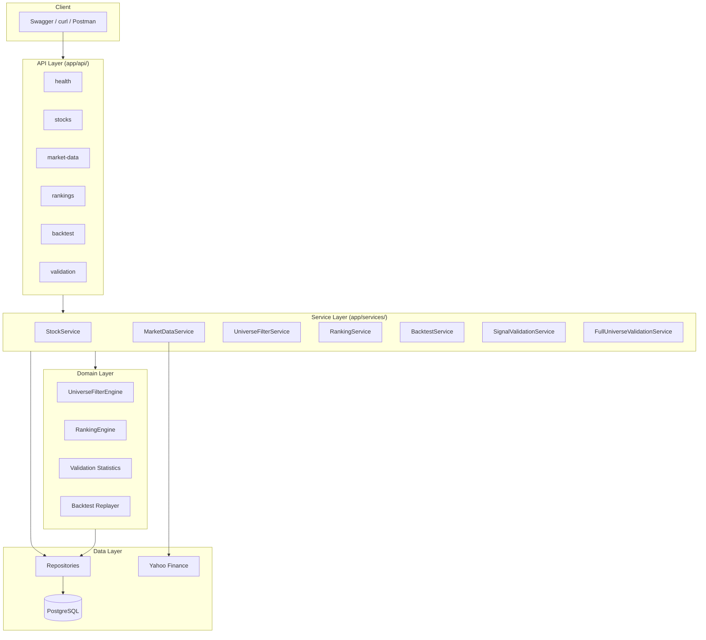
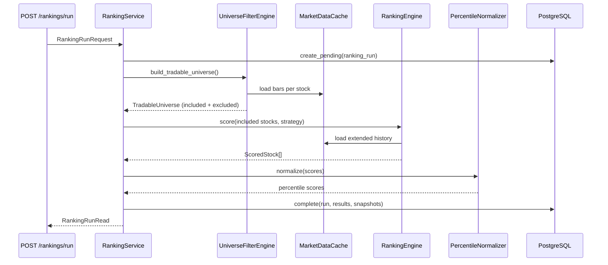
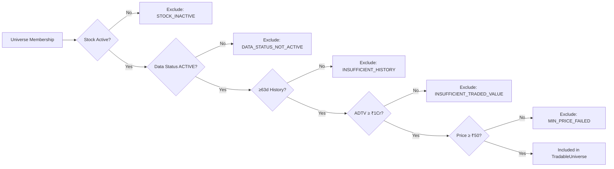
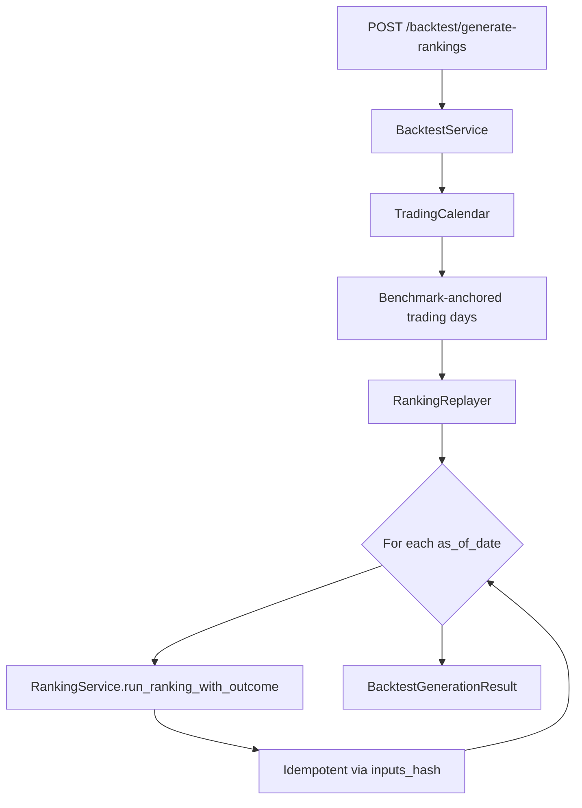
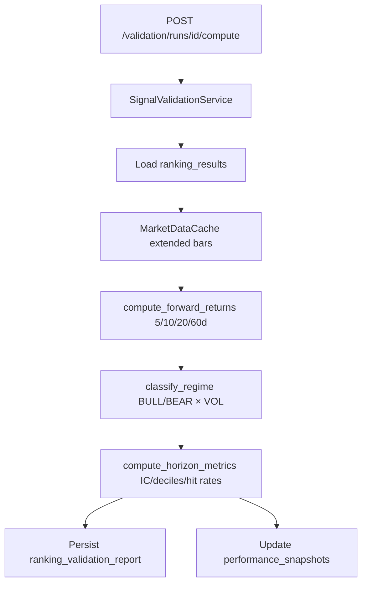
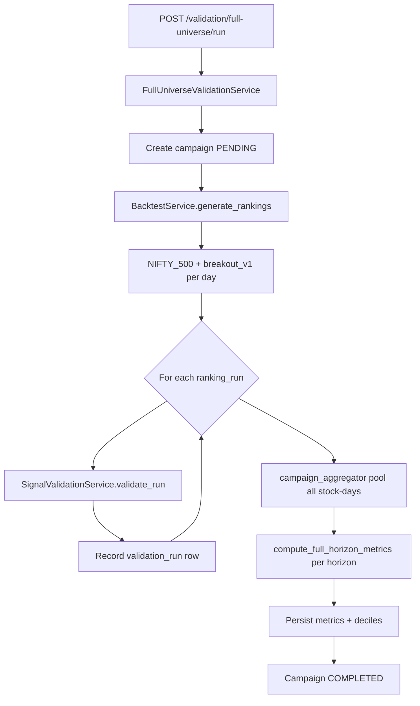
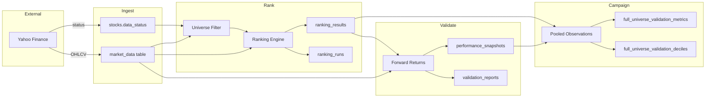
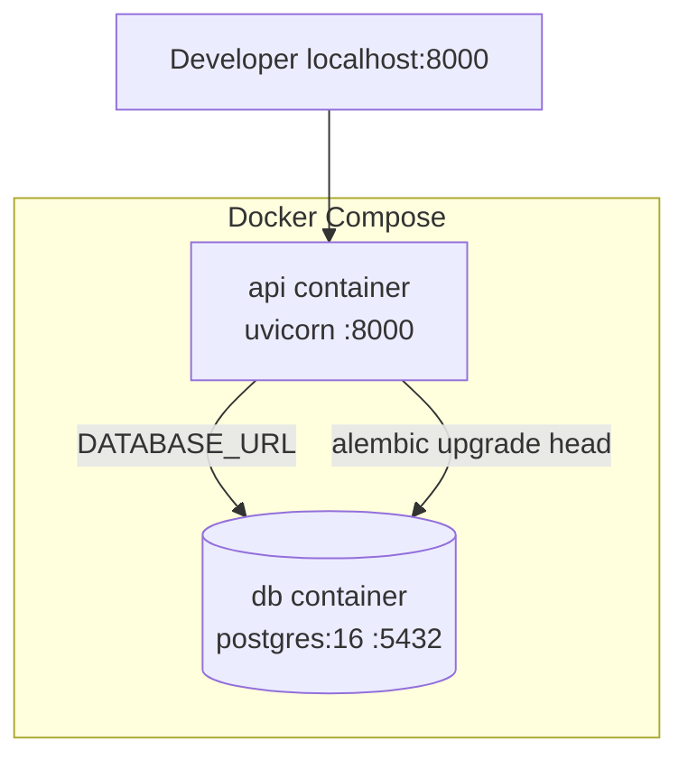

# Pi-PM — Architecture

**Last updated:** 2026-05-31

---

## System Overview

Pi-PM is a layered monolith: a single FastAPI application with strict domain separation, PostgreSQL persistence, and deterministic quant pipelines. Future LLM agents will sit adjacent to — not inside — the ranking and portfolio layers.



---

## Core Principles

1. **LLMs never rank securities**
2. **LLMs never determine position sizes**
3. **LLMs never approve trades**
4. **LLMs never override risk controls**
5. **All money-related decisions must be deterministic**

---

## Layer Responsibilities

| Layer | Package | Responsibility |
|-------|---------|----------------|
| API | `app/api/` | HTTP contracts, query params, status codes |
| Services | `app/services/` | Transactions, orchestration, config defaults |
| Universe | `app/universe/` | Pre-ranking eligibility filters |
| Ranking | `app/ranking/` | Factor computation, normalization, scoring |
| Validation | `app/validation/` | Forward returns, IC, deciles, campaigns |
| Backtest | `app/backtest/` | Trading calendar, historical replayer |
| Market data | `app/market_data/` | Session-scoped bar cache |
| Providers | `app/providers/` | External data sources (Yahoo) |
| Repositories | `app/db/repositories/` | CRUD, queries |
| Models | `app/models/` | SQLAlchemy ORM (system of record) |

### Stub Packages (Future)

`app/agents/`, `app/workflows/`, `app/portfolio/`, `app/risk/`, `app/execution/`, `app/research/`, `app/monitoring/` — contain `__init__.py` only.

---

## Ranking Pipeline



### Ranking Properties

- **Deterministic:** Same inputs → same `inputs_hash` → same scores and ranks
- **Idempotent:** Completed runs with matching hash are reused
- **Auditable:** `score_components` JSONB per result; exclusion reasons in metadata
- **Versioned:** Strategy name + version in every run

---

## Universe Filter Pipeline



Strategy-phase exclusions (applied inside `RankingEngine`):
- `INSUFFICIENT_STRATEGY_HISTORY` — e.g. 252 days for `breakout_v1`
- `FACTOR_COMPUTATION_FAILED`

---

## Backtest Pipeline (Sprint 4.1)



Output: one `ranking_runs` row per trading day in range.

---

## Validation Pipeline (Sprint 4.2)



### Regime Classification

| Dimension | Rule |
|-----------|------|
| Trend | BULL if close > SMA200; else BEAR |
| Volatility | HIGH_VOL if 20d annualized vol > threshold (default 20%); else LOW_VOL |
| Label | `{trend}_{vol}` e.g. `BULL_LOW_VOL` |

---

## Full-Universe Validation Campaign (Sprint 6.1)



Pooled metrics aggregate **all stock-day observations** across validated days — not per-day averages of IC.

---

## Data Flow — End to End



---

## Dependency Injection

FastAPI `Depends()` in `app/api/deps.py` wires:

```
get_db → Session
get_*_repository → Repository(db)
get_ranking_service → RankingService(db, settings, repos, registry)
get_backtest_service → BacktestService(db, ranking_service, ...)
get_signal_validation_service → SignalValidationService(...)
get_full_universe_validation_service → FullUniverseValidationService(...)
```

---

## Configuration Resolution

API request fields are optional; services resolve from `Settings`:

```
universe_code  → ranking_default_universe_code  (default: PI_PM_CORE ⚠️)
strategy_name  → ranking_default_strategy         (default: momentum_v1)
strategy_version → ranking_default_strategy_version
benchmark_symbol → ranking_default_benchmark      (default: ^NSEI)
```

Full-universe validation **overrides** defaults to `NIFTY_500` + `breakout_v1`.

---

## Error Handling

| Exception | HTTP Status |
|-----------|-------------|
| `NotFoundError` | 404 |
| `ValidationError` | 422 |
| `InvalidSymbolError` | 422 |
| `StrategyNotFoundError` | 422 |
| `ProviderError` | 502 |
| `RankingError` | 500 |
| `PiPMError` | 400 |

---

## Deployment Architecture



- **Production compose:** `docker/docker-compose.yml` — code baked into image at build time
- **Dev compose:** `docker/docker-compose.dev.yml` — volume mount `..:/app`, requires container restart for code changes (no `--reload` in entrypoint)
- **Local dev:** `uvicorn app.main:app --reload` against Docker DB only

Entrypoint: `scripts/entrypoint.sh` → migrate → uvicorn

---

## Testing Architecture

- **Integration tests:** SQLite in-memory with PostgreSQL type compilers (JSONB, UUID)
- **Unit tests:** Pure domain logic (statistics, factors, filters)
- **Fixtures:** `tests/conftest.py` — db session, FastAPI TestClient, mock Yahoo provider
- **Count:** 121 tests across 39 modules

---

## Related Documentation

- `docs/domain-boundaries.md` — Original domain boundary spec
- `docs/architecture.md` — Legacy sprint-focused architecture (superseded in part by this doc)
- `docs/DATABASE_SCHEMA.md` — Table definitions
- `docs/API_REFERENCE.md` — Endpoint catalog
