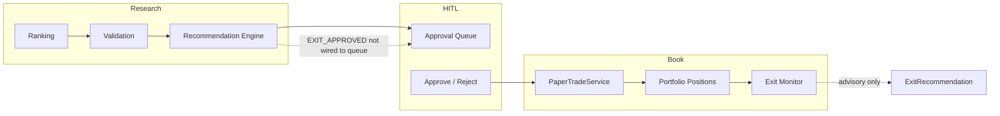
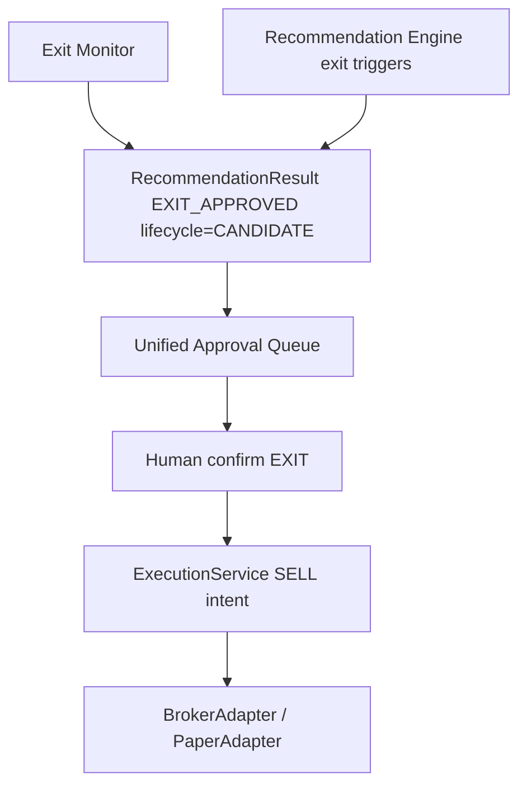
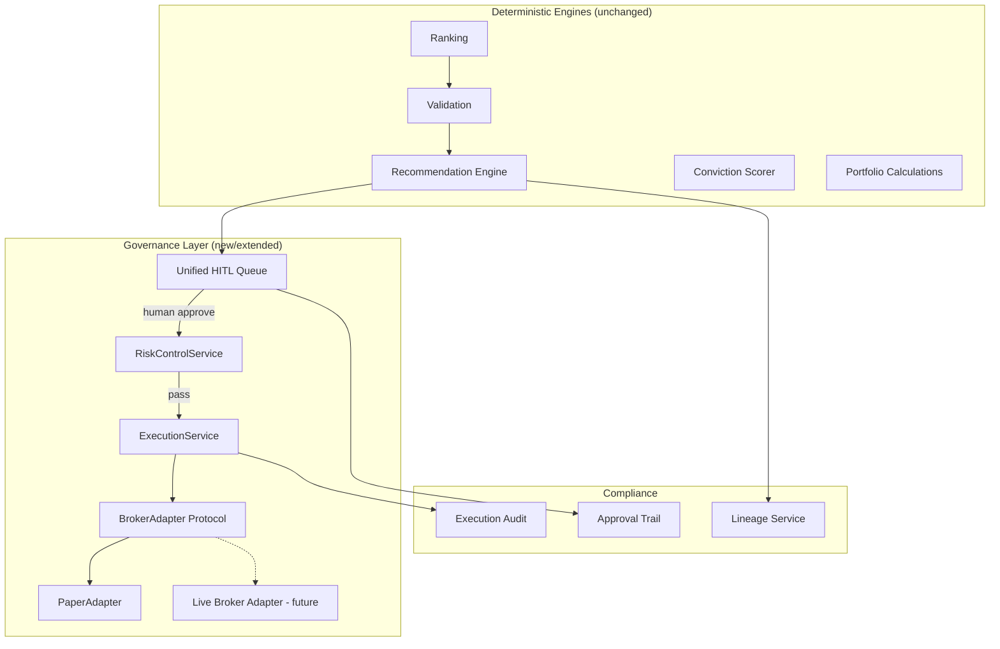

# ADR-030: Live Investing Architecture

**Status:** Accepted  
**Date:** 2026-06-05  
**Deciders:** Principal Product Architect, Product Owner, Platform Engineering  
**Supersedes:** N/A — extends ADR-024, ADR-027, ADR-028  
**Related:** [ADR-024](./ADR-024-Portfolio-State-Source-Of-Truth.md), [ADR-027](./ADR-027-Authentication-And-MultiTenant-Architecture.md), [ADR-028](./ADR-028-Paper-Trading-Readiness.md), [18_HUMAN_IN_LOOP_LIVE_INVESTING_PRD.md](../product-next/18_HUMAN_IN_LOOP_LIVE_INVESTING_PRD.md)

---

## Context

Pi-PM today operates a **paper-trading pilot** with deterministic recommendations, JWT-authenticated HITL approval, and simulated fills via `PaperTradeService`. ADR-028 enabled 90-day unattended paper orchestration. Track E added authentication and portfolio ownership.

The product goal is a **documented, governed path** from paper trading → human-approved live investing → future broker integration — **without modifying ranking, validation, recommendation engine logic, conviction scoring, portfolio calculation formulas, or committee LLM workflows**.

### Current flow analysis (as-is)



**Known gaps (documented, not fixed in this ADR):**

| Gap | Impact on live path |
|-----|---------------------|
| Dual exit paths (`ExitRecommendation` vs `RecommendationResult.EXIT_APPROVED`) | Human must use two UIs; no unified sell intent |
| Active positions not fed to recommendation engine on batch re-run | HOLD / EXIT_APPROVED from engine incomplete |
| `approve()` missing EXIT lifecycle transitions | Exit HITL incomplete |
| No `BrokerAdapter` implementation | Cannot route real orders |
| HIGH_CONCERN advisory unreachable / non-blocking | Governance gap for live capital |
| Manual `POST /trades/entry` after approve | Approval ≠ execution |

This ADR defines the **target architecture** and governance layer. Implementation is phased; investment engines remain unchanged.

---

## Decision

### 1. Three-stage maturity model

| Stage | Name | Execution | Human role | Broker |
|-------|------|-----------|------------|--------|
| **S0** | Paper (current) | `PaperTradeService` simulation | Approve + optional pilot auto | None |
| **S1** | Human-approved live | `BrokerAdapter` behind execution port | Approve every entry/exit; confirm fills | Manual/semi-auto via adapter |
| **S2** | Broker-integrated live | Same adapter; reconciliation sync | Approve intent; system places orders | Full integration |

**Invariant:** Stages S1–S2 never bypass human approval for entries or exits. No auto-trading.

### 2. Unified execution port

Introduce `BrokerAdapter` protocol (`app/execution/adapter.py`) as the **only** path from approved recommendation to position change:

```
Human APPROVED → ExecutionService → BrokerAdapter.place_order() → TradeConfirmation → Portfolio ledger
```

`PaperTradeService` becomes the **paper implementation** of the same contract (future refactor; engines untouched).

### 3. Unified exit authority

Merge dual exit paths into one HITL queue:



`ExitRecommendation` rows become **advisory precursors** that materialize as `RecommendationResult` candidates — not a parallel confirm path.

### 4. Human-in-the-loop workflows (governance)

| Workflow | Trigger | Human action | System outcome |
|----------|---------|--------------|----------------|
| **Entry Approval** | `BUY` + `CANDIDATE` | Approve / Reject / Defer | `APPROVED` → execution intent |
| **Exit Approval** | `EXIT_APPROVED` + `CANDIDATE` | Confirm / Defer / Reject | `APPROVED` → SELL intent |
| **Portfolio Review** | Daily post-batch | Review NAV, recon, limits | Sign-off logged; no trade |
| **Risk Escalation** | Limit breach | Acknowledge / reduce / stop | `risk_events` audit; optional block |
| **HIGH_CONCERN Escalation** | ARGS `HIGH_CONCERN` | Explicit override or reject | `committee_overrides` audit row |

See [21_EXECUTION_WORKFLOW_PRD.md](../product-next/21_EXECUTION_WORKFLOW_PRD.md).

### 5. Risk controls (pre-trade gates)

All live execution intents pass **RiskControlService** before `BrokerAdapter`:

| Control | Type | Action on breach |
|---------|------|------------------|
| Max deployable capital | Hard | Block order |
| Daily loss limit | Hard | Block + escalate |
| Max positions / regime slots | Hard | Block |
| Single-name / sector caps | Hard | Block or reduce qty |
| Emergency stop | Hard | Block all orders |
| Manual override | Soft | Owner PIN + audit; allows single order |

Configuration in `portfolio_configs` + new `risk_limits` table (future). **Formulas unchanged** — gates wrap execution only.

See [20_RISK_CONTROL_PRD.md](../product-next/20_RISK_CONTROL_PRD.md).

### 6. Compliance & lineage

Every live-bound action produces immutable audit:

| Trail | Entities |
|-------|----------|
| **Approval trail** | `recommendation_approvals` (actor_id, decision, timestamp) |
| **Decision lineage** | ranking_run → recommendation_run → result → approval |
| **Trade lineage** | approval → execution_audit → paper_trade / broker_fill |
| **Committee lineage** | research_run → packet → committee_reviews → CRO |

New entity: `execution_audits` — broker order id, client_order_id, status transitions, fill details.

### 7. HIGH_CONCERN policy (live)

Per ADR-023, committee output is **advisory only** — it must not mutate conviction or ranking.

For **live investing (S1+)**:

- `HIGH_CONCERN` on any committee → **soft block** on entry execution until owner explicit override
- Override requires `OwnerUser` + reason note → `committee_override` audit row
- Exit recommendations unaffected (capital protection priority)

Engine logic unchanged; block is at **ExecutionService** layer.

---

## Architecture (target state)



---

## Consequences

### Positive

- Clear paper → live → broker path without engine changes
- Single exit authority and execution port
- Risk gates and audit trails defined before broker selection
- HIGH_CONCERN governance explicit for real money

### Negative / deferred

- `PaperTradeService` refactor to `PaperAdapter` deferred to implementation track
- Broker vendor selection PO TBD (Zerodha / Angel One / ICICI)
- Partial fills, market hours, GTT orders — v2
- Regulatory disclaimer and client agreement — legal track
- `ExitRecommendation` → `RecommendationResult` bridge — implementation track

---

## Non-goals (explicit)

- Broker API integration or live order placement
- Auto-trading or algorithmic execution without human approve
- Changes to ranking, validation, recommendation rules, conviction formula
- Changes to committee LLM prompts or ARGS workflow logic
- Mobile push notifications (M4)

---

## Implementation phases (reference)

| Phase | Deliverable | Touches engines? |
|-------|-------------|------------------|
| I-a | ADR-030 + PRDs + Go-Live Checklist | No |
| I-b | `BrokerAdapter` protocol + `ExecutionService` shell | No |
| I-c | Wire active book → RE; unify exit queue | Orchestration only |
| I-d | RiskControlService gates | Execution wrapper |
| I-e | First broker adapter (PO choice) | Adapter only |
| I-f | Broker reconciliation | Portfolio read path |

---

## Acceptance

Pi-PM has a documented path:

**Paper Trading (S0)** → **Human Approved Investing (S1)** → **Future Broker Integration (S2)**

without changing investment engines.
