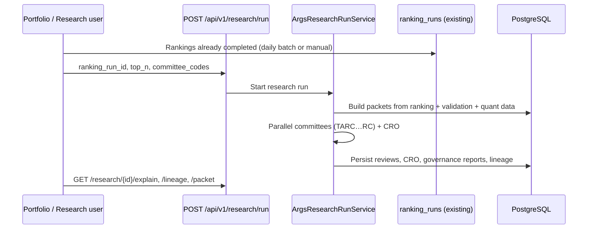

# ARGS Design & Integration Summary (PO Review)

**Product:** Pi-PM — ARGS (AI Research & Governance System)  
**Status:** Phase 1 **shipped** on branch `feature/args-phase1` (commits `04fb536`, `2f16492`)  
**Last updated:** 2026-06-08  
**Audience:** Product Owner, engineering leads  
**Deep references:**

- Architecture (source design): `docs/aics-ai-investment-committee-architecture.md`
- Implementation status: `docs/args-implementation-plan.md`
- Engineering audit: `docs/args-phase1-audit-report.md`

---

## 1. Executive summary

ARGS is a **research and explainability layer** on top of Pi-PM’s deterministic ranking engine. It does **not** make investment decisions.

After rankings are produced, ARGS:

1. Builds an immutable **Investment Review Packet** per top-ranked stock.
2. Runs five **research committees** (TARC, FRC, QRC, NRCC, RC) in parallel.
3. Aggregates committee output via a **CRO** (Chief Research Officer agent).
4. Persists a **governance research report** with evidence and full **lineage** back to the ranking run.

**PO takeaway:** ARGS helps analysts and PMs **understand why names ranked highly** and **what committees agree or disagree on** — without replacing the ranking engine or emitting buy/sell/hold.

---

## 2. Product principles (non-negotiable)

| Rule | Product meaning |
|------|-----------------|
| LLMs never rank securities | Rank comes only from `ranking_runs` / `ranking_results` |
| LLMs never emit trade actions | No BUY/SELL/HOLD, sizing, or stop-loss in ARGS outputs |
| Deterministic engines decide | Rankings, validation, factor IC, exit research remain source of truth |
| Research labels only | Committees may use `supportive` / `neutral` / `cautious` — not trade labels |
| Evidence required | Committee findings must cite packet fields (`supporting_evidence`) |

These are enforced in schema, prompts, runtime validation, and tests.

---

## 3. Naming: AICS → ARGS

| Original architecture (AICS) | ARGS (implemented) | Notes |
|-------------------------------|-------------------|--------|
| `investment_committee_runs` | `research_runs` | Top-level workflow run |
| CIO Agent | **CRO Agent** | Summarize / aggregate / dissent only |
| `cio_decisions` | `cro_reviews` | No trade recommendation fields |
| `final_recommendations` | `governance_research_reports` | Research narrative, not orders |
| `/api/v1/committee/*` | `/api/v1/research/*` | Public API prefix |

**Important:** Legacy table `research_reports` (per-stock equity notes) is **unchanged**. ARGS output lives in `governance_research_reports`.

---

## 4. User journey (Phase 1)



**Prerequisite:** A **completed** `ranking_run_id`. Optionally completed validation (`require_completed_validation: true` by default).

---

## 5. What Pi-PM already provides (reused)

| Capability | Pi-PM source | ARGS packet / workflow use |
|------------|--------------|----------------------------|
| Rankings | `ranking_runs`, `ranking_results` | Packet `ranking` block; workflow entry |
| Validation | `ranking_validation_reports`, horizon/decile metrics | Packet `validation`; QRC input |
| Factor IC | `factor_performance_metrics` | Packet `quant_evidence.factor_ic`; QRC input |
| Exit research | `exit_research_policy_metrics` | Packet `quant_evidence.exit_research`; QRC input |
| Regime | Validation regime + `strategy_regime_performance` | Packet `regime`; TARC/QRC input |
| Historical returns | `ranking_performance_snapshots` | Packet `historical_performance`; RC input |
| Market data | `market_data` | Packet `market_snapshot`; FRC input |
| Lineage | `run_lineage_records` | Extended entity types for ARGS chain |

**No duplicate ranking or validation engines** — ARGS reads upstream artifacts only.

---

## 6. What ARGS adds (new)

| Component | Purpose | Phase 1 status |
|-----------|---------|----------------|
| `research_runs` | Orchestration run metadata | **Shipped** |
| `investment_review_packets` | Immutable JSONB snapshot + content hash | **Shipped** |
| `committee_reviews` | Per-committee LLM research output | **Shipped** |
| `cro_reviews` | Aggregated committee synthesis | **Shipped** |
| `governance_research_reports` | Final research artifact per symbol | **Shipped** |
| `governance_research_report_evidence` | Structured evidence refs | **Shipped** |
| `prompt_versions`, `llm_execution_records` | Prompt + model audit | **Shipped** |
| `/api/v1/research/*` | Run, explain, lineage APIs | **Shipped** |
| LangGraph workflow | Parallel committees → CRO | **Shipped** (minimal 2-node graph) |
| Per-agent LLM routing | Provider/model/key per committee | **Shipped** |

---

## 7. Committee design (Phase 1)

| Committee | Role | Data allowed | LLM | Phase 1 status |
|-----------|------|--------------|-----|----------------|
| **TARC** | Technical interpretation | Ranking, score components, technical factors, regime | Yes | **Implemented** |
| **FRC** | Fundamental context | Market snapshot, fundamental snapshot, research context | Yes | **Implemented** (fundamental block empty until data feed) |
| **QRC** | Quant / validation grounding | Validation, decile, factor IC, exit research, regime | Yes | **Implemented** |
| **NRCC** | News / catalysts | `news_snapshot` only | Yes | **Implemented** (degraded mode when news feed empty) |
| **RC** | Risk research | Ranking, validation, historical performance, regime, portfolio context | Yes | **Implemented** (no sizing/stops) |
| **CRO** | Synthesis | Committee outputs only | Yes | **Implemented** |

**NRCC degraded behavior:** If `news_snapshot.items` is empty, NRCC returns `status=degraded` with neutral research label — run continues.

---

## 8. Investment Review Packet (canonical input)

All committees receive the **same byte-identified packet** (`packet_hash` = SHA-256 of canonical JSON, excluding `packet_built_at`).

| Packet section | Source | Phase 1 |
|----------------|--------|---------|
| `ranking` | `ranking_runs` + `ranking_results` | Populated |
| `technical_factors` | Score components | Populated |
| `validation` | Horizon + decile metrics | Populated when validation exists |
| `regime` | Validation + strategy regime performance | Populated |
| `quant_evidence.factor_ic` | Factor performance metrics | Populated when metrics exist |
| `quant_evidence.exit_research` | Exit policy metrics | Populated when metrics exist |
| `historical_performance` | Ranking performance snapshots | Populated when snapshots exist |
| `market_snapshot` | Latest market bar + sector | Populated |
| `fundamental_snapshot` | — | **Empty placeholder** (Phase 2 data feed) |
| `news_snapshot` | — | **Empty** → NRCC degraded |
| `source_lineage` | IDs for ranking, validation, quant runs | Populated |

---

## 9. Lineage chain (explainability)

Persisted edges (via `run_lineage_records`):

```text
governance_research_report
  → cro_review
  → committee_review(s)
  → investment_review_packet
  → ranking_result
  → ranking_run
  (+ validation_report where applicable)
```

API: `GET /api/v1/research/{id}/lineage` and `GET /api/v1/research/{id}/explain`.

---

## 10. LLM flexibility (loosely coupled)

Each agent (TARC, FRC, QRC, NRCC, RC, CRO) resolves its own:

- **Provider** (`mock`, `openai`, `openai_compatible`, or custom via `register_llm_provider`)
- **Model**
- **API key**
- **Base URL**
- **Timeout**

Global env defaults with per-agent overrides. See `docs/args-implementation-plan.md` § LLM configuration.

**Default in dev/test:** `ARGS_LLM_PROVIDER=mock` (no external API calls).

---

## 11. Gaps deferred to Phase 2

| Item | Why deferred | PO impact |
|------|--------------|-----------|
| Daily batch auto-trigger after rankings | Ops integration | Manual/on-demand research runs only |
| `fundamental_snapshot` data provider (FRC) | External data contract | FRC uses sector/market context only |
| `news_snapshot` feed (NRCC) | News API contract | NRCC runs in degraded mode |
| Postgres LangGraph checkpoint / replay | Ops complexity | Re-run = new `research_run` |
| `committee_registry` DB table | In-code registry sufficient for Phase 1 | Config via env, not admin UI |
| Daily batch `research_intelligence` phase hook | Separate sprint | No automatic nightly ARGS yet |
| Production hardening (50+ tests, RBAC, audit export) | Phase 2 quality gate | See audit report |

---

## 12. PO acceptance checklist (Phase 1)

| # | Criterion | Status |
|---|-----------|--------|
| 1 | ARGS does not emit trade recommendations | **Pass** |
| 2 | Research run requires existing ranking run | **Pass** |
| 3 | Packet hash stable for same inputs | **Pass** |
| 4 | Five committees + CRO execute end-to-end | **Pass** |
| 5 | Explain + lineage APIs return persisted data | **Pass** |
| 6 | Evidence validation on committee output | **Pass** |
| 7 | Per-agent LLM configuration | **Pass** |
| 8 | NRCC graceful degradation without news | **Pass** |
| 9 | Factor/exit blocks in packet when upstream data exists | **Pass** (empty when no upstream runs) |
| 10 | Automated daily ARGS after NIFTY batch | **Deferred Phase 2** |
| 11 | Full fundamental + news data feeds | **Deferred Phase 2** |

**Recommended PO decision:** **Accept Phase 1** for internal pilot / mock-LLM demo and **OpenAI pilot** with per-agent keys. **Defer production sign-off** until Phase 2 daily-batch hook and external data feeds are scoped.

---

## 13. Related documents

| Document | Use |
|----------|-----|
| `docs/aics-ai-investment-committee-architecture.md` | Full technical architecture (AICS origin) |
| `docs/args-implementation-plan.md` | Shipped files, APIs, env vars, verification |
| `docs/args-phase1-audit-report.md` | Engineering audit scores and defect list |
| `docs/tarc-architecture-design.md` | Historical TARC reference (superseded for workflow by ARGS) |
