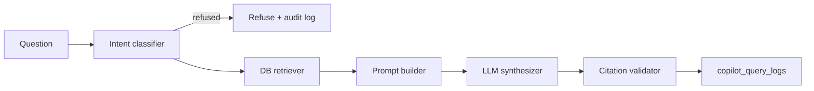

# Copilot Grounding Strategy

**Track:** Pi-PM Copilot & Explainability  
**Date:** 2026-06-05  
**Principle:** Retrieval-first, cite-every-claim, refuse when corpus is empty.

---

## Architecture



Copilot sits **downstream** of all decision engines. It never calls `RankingService`, `RecommendationService`, or portfolio mutation APIs.

---

## Grounding rules (GR-01..06)

| ID | Rule | Enforcement |
|----|------|-------------|
| GR-01 | Every numeric claim has `[source: table.field = value]` | `app/copilot/citations.py` post-validation |
| GR-02 | Missing data → "not in the corpus" | Prompt + empty retriever `note` |
| GR-03 | Committee findings quoted verbatim | Prompt instruction |
| GR-04 | Actions/conviction only from context JSON | Prompt hard rule #2 |
| GR-05 | Concise bullet answers | Prompt format |
| GR-06 | Lineage IDs in answer when present | Prompt + `source_refs` audit |

---

## Corpus by domain

### Recommendations (read-only)

| Table | Fields exposed | Intents |
|-------|----------------|---------|
| `recommendation_runs` | id, strategy, as_of_date, status | why_*, conviction, exit |
| `recommendation_results` | action, conviction_*, reason_codes, lifecycle | why_*, conviction, exit, risk |

**Never exposed for mutation.** Copilot does not invoke recommendation generation.

### Portfolio (read-only)

| Table | Fields exposed | Intents |
|-------|----------------|---------|
| `portfolio_configs` | equity, deploy_pct, regime_slots | explain_portfolio |
| `portfolio_positions` | quantity, weight, pnl | explain_portfolio, explain_risk |
| `portfolio_nav_history` | returns, alpha, cash | explain_portfolio, explain_performance |
| `portfolio_exit_recommendations` | triggers, urgency | explain_risk, explain_exit |

### Committee / ARGS (read-only)

| Table | Fields exposed | Intents |
|-------|----------------|---------|
| `investment_review_packets` | symbol, packet_id | explain_committee |
| `committee_reviews` | findings, risks, high_concern | explain_committee, explain_risk |
| `cro_reviews` | rationale, summary | explain_committee |

### Analytics / attribution (read-only)

| Table | Fields exposed | Intents |
|-------|----------------|---------|
| `recommendation_outcomes` | pnl_pct, alpha, exit_reason | explain_performance |
| `ranking_validation_reports` | IC, horizons, status | explain_validation |
| `ranking_results` | rank, score_components | explain_rank |
| `daily_batch_runs` | phase_results, status | ops_status |

---

## Lineage & auditability

Every retrieval appends structured refs via `app/copilot/lineage.py`:

```json
{
  "table": "recommendation_results",
  "id": "<uuid>",
  "recommendation_run_id": "<uuid>",
  "recommendation_id": "<uuid>",
  "portfolio_position_id": "<uuid|null>",
  "committee_review_id": "<uuid|null>"
}
```

Persisted in `copilot_query_logs.retrieved_ids`. API response includes `lineage` summary bucket.

---

## Anti-hallucination controls

| Control | Layer |
|---------|-------|
| Rule-based intent (no LLM classify) | `intent.py` |
| Refuse-before-retrieve | `classify()` |
| Structured JSON context only | `retriever.py` |
| Hard rules in system prompt | `prompt_builder.py` |
| Citation validator | `citations.py` |
| Full query audit | `copilot_query_logs` |

---

## Out-of-corpus behaviour

When retriever returns `{"note": "No ... found"}`:

1. LLM must state information is not in the corpus
2. Must not invent conviction, rank, or action
3. Query still logged with empty/partial `retrieved_ids`

---

## Future readiness (design only)

| Surface | Grounding approach | Architecture impact |
|---------|-------------------|---------------------|
| Mobile copilot | Same retriever + API; mobile passes `session_id` | None — client only |
| Voice assistant | STT text → existing `classify()`; optional shorter prompt variant | Optional `copilot_v1_voice` prompt template |
| Portfolio coaching | Multi-turn via `session_id`; filter intents to portfolio/risk/performance | None — audit groups by session |

No vector DB required for MVP; optional M4 hybrid search documented in `docs/product-next/10_AI_COPILOT_PRD.md`.

---

## Files

| Module | Role |
|--------|------|
| `app/copilot/intent.py` | Classifier |
| `app/copilot/retriever.py` | DB grounding |
| `app/copilot/lineage.py` | Audit refs |
| `app/copilot/prompt_builder.py` | LLM instructions |
| `app/copilot/citations.py` | Post-validation |
| `app/services/copilot_service.py` | Orchestration |
