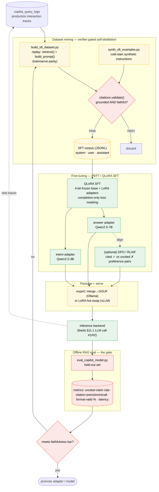

# Local LLM for Copilot — Feasibility, Design & Implementation Plan

**Status:** DRAFT (planning only — nothing implemented)
**Scope:** Run the Pi-PM Copilot (grounded Q&A) against a locally-hosted open-weight
LLM instead of (or alongside) a hosted cloud model.
**Author:** AI session
**Date:** 2026-06-09

---

## 1. Executive summary

**Verdict: Feasible, and the codebase is already ~80% ready.** The LLM layer is
abstracted behind a narrow `LlmPort` protocol with a pluggable provider factory, and
the copilot already resolves its own dedicated routing slot (`agent_code="copilot"`).
Every mainstream local-serving stack (Ollama, llama.cpp `llama-server`, vLLM, LM
Studio, TGI) exposes an **OpenAI-compatible `/v1/chat/completions`** endpoint, which
the existing `OpenAiCompatibleLlmPort` already speaks.

The work is therefore **integration + hardening, not a rewrite**. Three concrete code
gaps must be closed first (§3.4): a mandatory API key, a hardcoded
`response_format: json_object` that is incompatible with the copilot's prose answers,
and the absence of `args_llm_copilot_*` settings to route copilot independently of the
committees.

**Recommended approach:** add a thin `local`/`ollama` provider variant (relaxed auth +
correct response formatting), expose copilot-specific settings, and route **only the
copilot** to local first — leaving the deterministic engine and AI investment committee
untouched. Keep a cloud/mock fallback.

---

## 2. Current architecture (what exists today)

### 2.1 The LLM port and provider factory

| File | Responsibility |
|------|----------------|
| `app/args/llm/port.py` | `LlmPort` protocol: `complete(system, user, model) -> LlmCompletion`; plus `MockLlmPort`. |
| `app/args/llm/providers/factory.py` | `register_llm_provider(name, builder)` + `build_llm_port(cfg)`. Built-ins: `mock`, `openai`, `openai_compatible`. |
| `app/args/llm/providers/openai_compatible.py` | `httpx` client POSTing to `{base_url}/chat/completions`. |
| `app/args/llm/config.py` | `AgentLlmConfig` + `ArgsLlmSettings.from_settings()`; resolves per-agent `provider/model/api_key/base_url/timeout`. Defines `COPILOT_LLM_CODE = "copilot"`. |
| `app/args/llm/registry.py` | `CommitteeLlmRegistry` — builds ports for committee agents only. |
| `app/core/config.py` | `args_llm_*` Settings fields (shared defaults + per-committee overrides). |

### 2.2 How the copilot uses the LLM

`app/services/copilot_service.py`:

- `_default_llm()` builds the copilot port via `ArgsLlmSettings.from_settings(...).for_agent("copilot")` → `build_llm_port(cfg)`, **falling back to `MockLlmPort()` on any exception**.
- `ask()` makes **two** LLM calls:
  1. **Intent fallback** — `llm_classify(question, llm)` (`app/copilot/llm_intent.py`). Only runs when the deterministic regex classifier is low-confidence. Expects a **short intent code** string back.
  2. **Answer generation** — `self._llm.complete(system, user)` with a prompt from `app/copilot/prompt_builder.py`. Expects **plain-text prose with inline `[source: table.field = value]` citations** — explicitly *"DO NOT return a JSON object."*
- The answer is then run through `app/copilot/citations.validate()` (grounding / citation enforcement) before logging to `copilot_query_logs`.

### 2.3 Key implication

The copilot is **grounded RAG**: the deterministic platform retrieves the facts
(`app/copilot/retriever.py`) and the LLM only *phrases and cites* them. This is the
single most important feasibility fact — **a small local model is sufficient**, because
the model is not reasoning from parametric knowledge; it is summarizing a
context block with strict citation rules.

---

## 3. Feasibility analysis

### 3.1 Why it's feasible

- **Narrow seam.** Only `LlmPort.complete(...)` must be satisfied. No streaming, tools, or vision needed.
- **OpenAI-compatible everywhere.** Local servers expose the exact `/v1/chat/completions` shape the current client already uses.
- **Dedicated copilot slot.** `for_agent("copilot")` already isolates copilot routing from committees — we can move copilot to local without touching the engine or committee ARGS.
- **Built-in fallback.** `_default_llm()` already degrades to `MockLlmPort` on error — a natural safety net for an unreachable local server.
- **RAG, not open-ended generation.** Low model-capability bar (see §2.3).

### 3.2 Local serving options

| Server | OpenAI API | Auth | JSON / grammar mode | Notes |
|--------|-----------|------|---------------------|-------|
| **Ollama** | `/v1/chat/completions` (compat) | none (dummy key ok) | `format: json` (native) / partial `response_format` | Easiest to run; great DX; good default first target. |
| **llama.cpp `llama-server`** | yes | optional `--api-key` | `response_format` json_object + GBNF grammars | Lightest footprint; strong control; CPU/Metal/CUDA. |
| **vLLM** | yes (full) | optional | guided JSON / outlines | Best throughput & concurrency; needs a GPU. |
| **LM Studio** | yes | none | `response_format` | Desktop-friendly; good for dev laptops. |
| **HF TGI** | yes | optional | guided generation | Production-grade serving. |

**Recommendation:** target **Ollama for dev/single-user** and keep **vLLM** in mind for
a multi-user/GPU deployment. Both are reachable through one `openai_compatible`-style
client; the only differences are base URL, auth, and JSON-mode quirks (§3.4).

### 3.3 Candidate models (grounded summarization + instruction following)

| Model | Params | Footprint (Q4) | Fit |
|-------|--------|----------------|-----|
| Llama 3.1/3.2 Instruct | 3B / 8B | ~2–5 GB | Strong instruction following; 8B is a safe default. |
| Qwen2.5 Instruct | 3B / 7B / 14B | ~2–9 GB | Excellent JSON/format adherence; good citations. |
| Mistral / Ministral | 7B / 8B | ~4–5 GB | Solid general summarizer. |
| Phi-3.5 mini | 3.8B | ~2.5 GB | Tiny; fine for the intent classifier specifically. |

Two-tier idea: a **tiny** model (3B) for the **intent classifier** call and an **8B**
model for the **answer** call — both local, different `model` strings against the same
server.

### 3.4 Gaps / blockers found in the code (must-fix)

1. **Mandatory API key.** `OpenAiCompatibleLlmPort.__init__` raises
   `ValueError("...requires an API key")` if `api_key` is empty. Local servers usually
   need none. → Allow empty key for a local provider, or send a dummy bearer token.

2. **Hardcoded `response_format: {"type": "json_object"}` + JSON parsing.**
   `complete()` always sets `response_format=json_object` and pipes the result through
   `_extract_json_content()`, which calls `json.loads()` and **raises on non-JSON**.
   - This is correct for the **intent classifier** and **committee** calls (they want JSON).
   - It is **wrong for the copilot answer call**, which the prompt mandates be **prose**.
   - Latent today because the default provider is `mock`; but it means the *real-LLM
     copilot answer path is currently broken for any `openai*` provider*, independent of
     local LLMs. The local-LLM work must fix this (per-call output mode), which also
     fixes the cloud path.
   - Additionally, many local servers ignore or partially support `response_format`;
     we need graceful handling when the field is unsupported.

3. **No copilot-specific settings.** `_resolve_agent_config` reads
   `args_llm_copilot_*` via `getattr`, but those fields **don't exist** in
   `app/core/config.py`, so copilot silently inherits the shared `args_llm_*` (and thus
   the committees' provider). To route *only* copilot to local, add
   `args_llm_copilot_{provider,model,api_key,base_url,timeout_seconds}` fields.

### 3.5 Hardware envelope (rough)

| Tier | Model | RAM/VRAM | Latency (answer call) |
|------|-------|----------|------------------------|
| Dev laptop (Apple Silicon / CPU) | 3B–8B Q4 | 8–16 GB | ~2–8 s |
| Single GPU (e.g. 12–24 GB) | 8B–14B | fits | <2 s |
| Server GPU + vLLM | 8B–14B, batched | 24 GB+ | sub-second, concurrent |

The copilot is interactive but low-QPS (one analyst asking questions), so even
CPU-bound latency is acceptable for a first cut.

---

## 4. Design

### 4.1 Provider strategy

**Reuse, don't fork.** Add a `local` (alias `ollama`) provider that wraps the existing
OpenAI-compatible client with three behavioral tweaks:

- Auth optional (no key → no `Authorization` header, or dummy token).
- Output mode is **per-call**: JSON for classifier/committee, **text** for copilot answers.
- Tolerate servers that don't support `response_format` (omit it; rely on prompt + a
  post-parse repair for the JSON calls).

Implementation choice (pick one in the design review):
- **(A) New `LocalLlmPort` class** subclassing/sharing logic with `OpenAiCompatibleLlmPort`. Cleanest separation.
- **(B) Parameterize `OpenAiCompatibleLlmPort`** with `require_api_key: bool` and `response_mode: "json"|"text"|"auto"`, and register it under `local`/`ollama`. Less code, reuses the HTTP path.

> Leaning **(B)** — the HTTP flow is identical; the differences are config flags.

### 4.2 Output-mode handling (the core fix)

Extend `LlmPort.complete(...)` (or the config) with an explicit response mode so the
**copilot answer call requests text** and the **classifier/committee calls request JSON**.
Concretely:

- Add an optional `response_format`/`mode` knob threaded from the call site, **or**
- Set it per-agent via `request_overrides` in `AgentLlmConfig` (already exists!) so the
  copilot config carries `response_format = None` (prose) while committee configs carry
  `json_object`.

The second option needs **no signature change** — `request_overrides` already merges
into the payload — but we must also stop forcing `_extract_json_content()` on text
responses. So a per-call/per-config `expects_json` flag is the minimal clean change.

### 4.3 Configuration (new Settings)

Add to `app/core/config.py` (mirroring the committee blocks):

```
args_llm_copilot_provider: str = ""        # "local" | "ollama" | "openai" | ...
args_llm_copilot_model: str = ""           # e.g. "llama3.1:8b"
args_llm_copilot_api_key: str = ""         # blank for local
args_llm_copilot_base_url: str = ""        # e.g. "http://localhost:11434/v1"
args_llm_copilot_timeout_seconds: int = 0
```

`_resolve_agent_config` already consumes these via `getattr` — no resolver change
needed once the fields exist. Example `.env` for local copilot:

```
ARGS_LLM_COPILOT_PROVIDER=ollama
ARGS_LLM_COPILOT_MODEL=llama3.1:8b
ARGS_LLM_COPILOT_BASE_URL=http://localhost:11434/v1
# committees stay on whatever args_llm_* already points to
```

### 4.4 Routing & fallback

- **Copilot-only first.** Committees/CRO keep their existing provider. Risk is contained.
- **Fallback chain:** local server → (optional) cloud → `MockLlmPort`. The existing
  `try/except` in `_default_llm()` already covers "local unreachable → mock"; we can
  optionally add a configured cloud fallback for production.
- **Health/preflight:** a startup or first-call ping to `{base_url}/models` (or a tiny
  completion) to surface misconfig early and choose the fallback deterministically.

### 4.5 Grounding / safety unchanged

The hard refusal rules, grounding rules (GR-01..06), and `citations.validate()` are
model-agnostic and **stay exactly as-is**. Local models may cite less reliably, so the
existing validator becomes more load-bearing — see testing (§6). No safety regression:
the refusal regex runs *before* any LLM call and is never delegated.

### 4.6 Privacy / cost benefits (motivation)

- **Data residency:** retrieved portfolio/positions/committee context never leaves the
  host — relevant for proprietary trading data.
- **Cost:** zero per-token cost; unlimited internal Q&A.
- **Offline / air-gap:** copilot works without external connectivity.

---

## 5. Implementation plan (phased — do NOT implement yet)

### Phase 0 — Spike / proof of concept (½–1 day)
- Stand up Ollama locally, pull an 8B instruct model.
- Manually point `args_llm_copilot_*` at it (after Phase 1 settings exist) **or** a
  throwaway script that calls `OpenAiCompatibleLlmPort` against `localhost:11434/v1`
  with a dummy key to confirm the prose answer path and the JSON classifier path.
- **Exit criteria:** one real copilot answer generated locally with valid citations.

### Phase 1 — Config & provider plumbing (1–2 days)
- Add `args_llm_copilot_*` fields to `app/core/config.py`.
- Add `local`/`ollama` provider (approach §4.1-B): register in
  `app/args/llm/providers/factory.py`; relax API-key requirement; add `expects_json` /
  response-mode handling so prose answers are not JSON-parsed.
- Thread an `expects_json` flag (or per-config `request_overrides` + parse guard) so the
  **copilot answer** call requests/handles **text** while classifier/committee stay JSON.
- **No behavior change for existing cloud/mock users** (defaults preserved).

### Phase 2 — Copilot wiring & fallback (1 day)
- Ensure `CopilotService._default_llm()` builds the copilot port and applies the
  fallback chain (local → cloud? → mock) with a clear log line on degradation.
- Optional: preflight health check + structured warning.

### Phase 3 — Hardening & prompt tuning (2–3 days)
- Tune the answer prompt for the chosen local model (citation adherence, brevity).
- Add a lightweight **citation-repair / re-ask** loop if `validate()` finds uncited
  numeric claims (bounded retries) — benefits cloud too.
- Consider the two-tier model (3B classifier / 8B answer).

### Phase 4 — Ops & docs (1 day)
- Deploy notes: how to run Ollama/vLLM alongside the app (`docker/`, `deploy/`).
- Document env vars; add a `configs/` sample.
- Dashboards/metrics: latency, fallback rate, uncited-claim rate per provider.

**Rough total:** ~1 week of focused work for a production-quality copilot-on-local.

---

## 6. Testing strategy

- **Unit (provider):** `local` provider builds correctly with empty key; omits auth
  header; text mode skips JSON parsing; JSON mode still parses. Mock the `httpx` call.
- **Unit (config):** `args_llm_copilot_*` override shared defaults; copilot routes local
  while committees stay cloud (resolver test).
- **Unit (fallback):** unreachable local base_url → falls back to mock without raising.
- **Contract test:** a `MockLlmPort`-style fake emulating an Ollama-shaped response
  (incl. `model`/`usage` fields possibly absent) → `LlmCompletion` parsed safely.
- **Grounding regression:** existing `citations.validate()` tests must still pass; add a
  case where a local model returns prose-with-citations and is accepted.
- **Optional integration (gated/marked):** live call against a local Ollama in CI-skip
  mode for manual runs.

---

## 7. Risks & mitigations

| Risk | Likelihood | Mitigation |
|------|-----------|------------|
| Local model cites poorly / hallucinates numbers | Med | `citations.validate()` already gates; add repair loop; pick a strong-format model (Qwen2.5). |
| `response_format` unsupported by server | Med | Per-call mode + omit field; rely on prompt; post-parse repair for JSON calls. |
| Latency on CPU-only hosts | Med | Use 3B–8B Q4; async/timeout already configurable; acceptable for low QPS. |
| Server down / OOM | Low–Med | Fallback chain → mock/cloud; preflight health check. |
| Hidden coupling: forcing JSON broke prose path (pre-existing) | High (latent) | Fix as part of Phase 1; covered by tests. |
| Scope creep into committees/engine | Med | Explicitly limit v1 to copilot; committees unchanged. |

---

## 8. Decisions for review (open questions)

1. **Target server:** Ollama-first (DX) vs vLLM (throughput)? Affects deploy + auth.
2. **Provider approach:** new `LocalLlmPort` class (A) vs parameterized
   `OpenAiCompatibleLlmPort` (B)?
3. **Output-mode mechanism:** explicit `complete(..., expects_json=)` signature change
   vs per-agent `request_overrides` + parse guard?
4. **Scope of local routing:** copilot only (recommended v1) vs copilot + committees?
5. **Fallback policy:** local → mock (simple) vs local → cloud → mock (resilient, needs
   cloud creds present)?
6. **Hardware target:** dev laptop only, or a shared GPU host for the team?

---

## 9. Appendix — minimal change surface (for estimation)

| Area | File(s) | Change type |
|------|---------|-------------|
| Settings | `app/core/config.py` | add 5 `args_llm_copilot_*` fields |
| Provider | `app/args/llm/providers/openai_compatible.py` (+ factory) | optional key, response-mode |
| Factory | `app/args/llm/providers/factory.py` | register `local`/`ollama` |
| Service | `app/services/copilot_service.py` | fallback chain (mostly already there) |
| Tests | `tests/unit/...` | provider/config/fallback/grounding |
| Ops | `docker/`, `deploy/`, `configs/`, `.env` sample | run + document local server |

**Note:** the deterministic engine, ranking, validation, conviction, and the AI
investment committee are **out of scope** for v1 and require **no changes**.

---

## 10. Model selection & fine-tuning

### 10.1 Why a *small* model is enough

The copilot is **grounded RAG**: the deterministic engine retrieves the facts
(`app/copilot/retriever.py`) and the LLM only *phrases and cites* them under strict
rules. The capability that matters is therefore **output-format adherence** (the
`[source: table.field = value]` citation contract; the JSON intent code) — **not**
parametric world knowledge or deep reasoning. That lets us pick a 3B–8B model and,
critically, makes it cheap to fine-tune.

### 10.2 Recommended models

**Primary pick: `Qwen2.5-7B-Instruct`** for the answer call.

| Criterion | Why Qwen2.5-7B |
|-----------|----------------|
| License | **Apache 2.0** — no MAU clause / naming rules (cleaner than Llama Community for a proprietary trading product). |
| Format adherence | Best-in-class small model at strict JSON / templated output — the #1 capability for our citation contract. |
| Fine-tune ecosystem | First-class in Axolotl, Unsloth, LLaMA-Factory, TRL, MLX. Turnkey QLoRA. |
| Local footprint | ~5 GB @ Q4; runs on Ollama (`qwen2.5:7b-instruct`) / vLLM today. |

**Two-tier setup (recommended)** — the two LLM calls have very different difficulty:

| Call | Model | Rationale |
|------|-------|-----------|
| Intent classifier (`llm_intent.py`, short code out) | **Qwen2.5-3B-Instruct** | Tiny, fast, trivially fine-tuned; clean labels already exist (`copilot_query_logs.intent`). |
| Answer generation (cited prose) | **Qwen2.5-7B-Instruct** | The call worth investing fine-tuning effort in. |

Same family/server, two `model` strings — fits the existing per-agent config.

**Alternatives**

| Model | License | Prefer when |
|-------|---------|-------------|
| Llama 3.1 8B Instruct | Llama Community | Already standardized on Llama; license acceptable. |
| Ministral 8B / Mistral 7B v0.3 | Apache 2.0 | Permissive alternative; slightly behind Qwen on format. |
| Qwen2.5-14B-Instruct | Apache 2.0 | Have a 24 GB GPU; want headroom for harder multi-position summaries. |
| Phi-3.5-mini (3.8B) | MIT | Ultra-light classifier option. |

### 10.3 Do we even need to fine-tune? (sequencing)

**Not for v1.** A good base model + the existing prompt + grounding validator should
carry most of the load. **Fine-tune only if** evaluation (the uncited-claim rate from
`app/copilot/citations.validate()`) shows the local model under-citing or drifting from
the format. Treat training as **Phase 2**, gated on a measured need — not a prerequisite.

### 10.4 Training approach (when needed): QLoRA

- **Method:** QLoRA (4-bit base + LoRA adapters), **not** full fine-tune.
  Trainable on a single 16–24 GB GPU / A100 slice / Apple Silicon (MLX). Full
  fine-tune is unnecessary and ~10× the hardware.
- **Two adapters:** one for the 3B classifier, one for the 7B answer model. Ship the
  base weights once; swap LoRA adapters.
- **What it buys:** tighter citation discipline, Indian-NSE / swing vocabulary, refusal
  robustness, and the option to drop to a smaller model at equal quality (cheaper infra).

### 10.5 Dataset — auto-mined from our own infra (the key advantage)

We can build a high-quality supervised set **without hand-labeling**, because every
ingredient is already persisted or deterministically reproducible.

**Answer-model SFT pair construction:**

```
for each row in copilot_query_logs (refused = false, answer not null):
    context  = retrieve(db, row.intent, entities_from(row))      # deterministic replay
    prompt   = build_prompt(row.question, context)               # exact prod prompt
    target   = row.answer                                        # historical answer
    keep the pair ONLY IF citations.validate(target).uncited_claims == []
        and every citation source_ref ∈ context.source_refs       # grounded + faithful
emit {system: prompt.system, user: prompt.user, assistant: target}
```

- **`citations.validate()` is the quality gate** — only fully-grounded, correctly-cited
  answers become training targets. The same validator later doubles as a **reward /
  preference signal** if we progress to DPO/RLAIF (prefer cited over uncited completions).
- **Faithfulness filter:** drop any example whose citations reference data not in the
  replayed `context.source_refs` (guards against teaching hallucinations).
- **Classifier SFT** is even simpler: `(question) -> intent` straight from the
  `intent` column (exclude `REFUSED`; the refusal regex stays deterministic and is
  never delegated to the model).

**Cold-start (before enough real logs exist):** synthesize Q&A by sampling real DB
rows (recommendations, positions, regimes), running the retriever, and templating
gold answers from the structured context — then validate with the same gate. This also
gives a held-out **eval set** (question → expected source_refs / numeric facts) to track
uncited-claim rate and citation precision per model/adapter.

### 10.6 Hardware envelope

| Task | Model | Needs |
|------|-------|-------|
| Inference (local) | Qwen2.5-7B Q4 | 8–16 GB RAM/VRAM (Apple Silicon or any modern GPU) |
| QLoRA fine-tune | Qwen2.5-7B | single 16–24 GB GPU, ~hours/run |
| QLoRA fine-tune | Qwen2.5-3B (classifier) | 8–12 GB, ~minutes/run |

### 10.7 Proposed dataset-mining tooling (Phase 2, design only)

| Component | Location (proposed) | Responsibility |
|-----------|---------------------|----------------|
| Exporter | `scripts/copilot/build_sft_dataset.py` | Replay logs → prompts → validated JSONL (chat format). Flags: `--min-date`, `--intents`, `--require-grounded`, `--out`. |
| Synth cold-start | `scripts/copilot/synth_sft_examples.py` | Sample DB → retriever → templated gold answers (validator-gated). |
| Eval harness | `scripts/copilot/eval_copilot_model.py` | Run a provider against held-out set; report uncited-claim rate, citation precision/recall, format-valid %, latency. |
| Train recipe | `docs/copilot/qlora-recipe.md` + config | Axolotl/Unsloth QLoRA config for 3B + 7B; output GGUF/adapter for Ollama/vLLM. |

**Reuse, don't reinvent:** the exporter and eval harness both import the *production*
`retrieve()`, `build_prompt()`, and `citations.validate()` — so training data and eval
metrics are defined by the exact code paths that serve users. No drift between
train-time and serve-time formatting.

### 10.8 Open decisions (model/training)

1. Start prompt-only (recommended) and gate fine-tuning on measured uncited-claim rate — agreed?
2. Qwen2.5 family (Apache-2.0) vs Llama 3.1 (license tradeoff) as the house model?
3. Single house model for copilot + committees later, or keep committees on cloud?
4. Adapter serving: Ollama (GGUF, simplest) vs vLLM (LoRA hot-swap, higher throughput)?
5. Privacy posture for the training corpus (it contains proprietary portfolio Q&A) —
   on-host only, no external training services?

---

## 11. Architecture diagrams

> Rendered as Mermaid. Both diagrams map 1:1 to the code paths in §2 and §10.
> Legend: **D** = deterministic, **G** = guardrail, **L** = LLM/inference, **T** = train/offline.

### 11.1 RAG inference pipeline (serving path)

```mermaid
flowchart TD
    U([User question]) --> API["/api/v1/copilot/ask<br/>CopilotService.ask()"]

    subgraph NLU["Query understanding (NLU)"]
        direction TB
        CLS["classify() — rule-based intent + entities<br/>app/copilot/intent.py"]
        LOWQ{low_confidence?}
        LLMC["llm_classify() — LLM zero-shot intent<br/>app/copilot/llm_intent.py — LLM call #1"]
        CLS --> LOWQ
        LOWQ -- yes --> LLMC
        LOWQ -- no --> INTENT[(intent + slots)]
        LLMC --> INTENT
    end
    API --> CLS

    INTENT --> GIN{refusal / jailbreak<br/>guard}
    GIN -- refused --> REF["return refuse_reason<br/>(no model call)"]

    subgraph RET["Retrieval — symbolic / structured (RAG, non-parametric)"]
        direction TB
        R["retrieve(db, intent, entities)<br/>app/copilot/retriever.py"]
        CTX[("RetrievalContext<br/>context JSON + source_refs")]
        R --> CTX
    end
    GIN -- ok --> R

    subgraph GEN["Augmentation + generation"]
        direction TB
        PB["build_prompt()<br/>system = HARD RULES + GR-01..06 + context JSON<br/>app/copilot/prompt_builder.py"]
        PORT["LlmPort.complete(system, user)<br/>LLM call #2 — free-form decoding"]
        PB --> PORT
    end
    CTX --> PB

    subgraph SERVE["Inference backend (OpenAI-compatible gateway)"]
        direction TB
        OAI["OpenAiCompatibleLlmPort<br/>POST /v1/chat/completions"]
        LOCAL["local runtime: Ollama / vLLM / llama.cpp<br/>Qwen2.5-7B (answer) · Qwen2.5-3B (intent)<br/>Q4 weights · KV-cache · greedy @ temp 0"]
        OAI --> LOCAL
    end
    PORT --> OAI
    LOCAL -- completion --> VAL

    subgraph GOUT["Output guardrail — groundedness / attribution"]
        direction TB
        VAL["validate(answer)<br/>app/copilot/citations.py"]
        UNC{uncited_claims == []?}
        VAL --> UNC
    end
    UNC -- ok --> RESP([answer + citations + lineage])
    UNC -- claims found --> RESP

    RESP --> LOG[("copilot_query_logs<br/>question · intent · retrieved_ids ·<br/>answer · citations · model · tokens · latency")]
    REF --> LOG

    classDef d fill:#e8f0fe,stroke:#4285f4,color:#000;
    classDef g fill:#fce8e6,stroke:#ea4335,color:#000;
    classDef l fill:#e6f4ea,stroke:#34a853,color:#000;
    class CLS,R,CTX,PB,INTENT d;
    class GIN,VAL,UNC,GOUT g;
    class LLMC,PORT,OAI,LOCAL l;
```

### 11.2 LLMOps training loop (offline — Phase 2, gated on eval)



### 11.3 How the two loops connect

The **serving pipeline (§11.1)** emits traces to `copilot_query_logs`; the **training
loop (§11.2)** mines those traces, and its packaged adapters feed back into the serving
pipeline's inference backend. The **groundedness verifier** (`citations.validate()`)
appears in *both* loops — as a runtime output guardrail and as the offline data/quality
gate — which is what keeps train-time and serve-time semantics identical.
