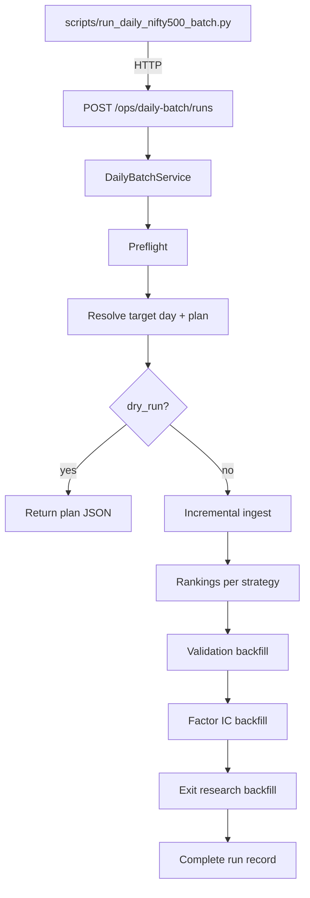

# Daily NIFTY 500 Batch — Implementation Plan (API-First)

**Status:** Implemented on `feature/sprint-8.6-daily-ingestion` (rev 3)  
**Authoring date:** 2026-06-02 (rev 2)  
**Implementation:** `app/services/daily_batch_service.py`, `/api/v1/ops/daily-batch`, `scripts/run_daily_nifty500_batch.py`  
**Runbook:** `docs/daily-nifty500-batch-runbook.md`  
**Not yet implemented:** `force_ingest` on daily batch body; async `202` polling  
**Related:** `app/services/market_data_service.py`, `app/backtest/trading_calendar.py`, factor/exit analytics APIs

---

## 1. Objective

Deliver an **API-orchestrated daily batch** with a **thin CLI client script** that:

1. Resolves the **effective last trading day** (NSE session-aware).
2. Detects gaps vs target for: **market data → rankings → validation → factor IC → exit research**.
3. Runs **delta work** by default; supports **`force_from_date`** to reprocess from a given date through target.
4. Is triggerable **manually**, via **cron**, or by **POST to the API** (same code path as cron).
5. Persists **run state** in DB for polling, audit, and SQL monitoring.

**Architecture choice:** Business logic lives in `DailyBatchService` behind REST. The script **only calls HTTP** (local or remote API) — no duplicate orchestration in scripts.

**Out of scope (V1):** TARC committee review, paper trade placement, in-API background workers (V1 uses sync run or FastAPI `BackgroundTasks` with DB status).

**In scope:** Full **traceability of the current load** — every child job (ingest batches, ranking runs, validation reports, factor IC runs, exit research runs) linked to the parent daily batch run, queryable via API and SQL while the job is running and after completion.

---

## 2. Revised Pipeline



| Phase | Service | Notes |
|-------|---------|-------|
| Ingest | `MarketDataService` | `ingestion_mode=incremental`; optional `force_ingest_from_date` |
| Rankings | `BacktestService.generate_rankings` | Gap days only unless `force_from_date` |
| Validation | `SignalValidationService.backfill` | Honors `force_recompute` |
| Factor IC | `FactorPredictivePowerService.backfill` | Per strategy; `force_recompute` |
| Exit research | `ExitResearchService.backfill` | Per strategy; `force_recompute` |

**Optional Phase 7 (config flag):** `ResearchIntelligenceService.generate_executive_pack` — off by default for daily (heavier).

---

## 3. Force / Date Options

| Flag (API + CLI) | Behavior |
|------------------|----------|
| `target_date` | Override resolved last trading day (end of window) |
| `from_date` | Explicit start of processing window (skips auto gap for start) |
| `force_from_date` | **Alias / mode:** set `from_date` and enable force flags for downstream phases (recompute, not only gap-fill) |
| `assume_session_done` | Treat today as tradeable after close |
| `force` | Pre-close bypass for resolver only |
| `force_recompute` | Validation + factor IC + exit research ignore reuse |
| `force_regenerate_rankings` | Skip ranking idempotent reuse for days in window (new runs or explicit invalidate — see §8.3) |
| `force_ingest` | Use `incremental` but also re-fetch from `from_date` (provider `fetch_history_since`) |
| `dry_run` | Plan only; persist run row with status `planned` |

**Example:** Data through 29-May-2026, want full refresh from 01-Jan-2026 through 30-May-2026:

```json
{
  "from_date": "2026-01-01",
  "target_date": "2026-05-30",
  "force_from_date": true,
  "force_recompute": true,
  "force_regenerate_rankings": true
}
```

**Example:** Normal daily delta (auto gaps):

```json
{
  "assume_session_done": true,
  "dry_run": false
}
```

---

## 4. API Design

**Prefix:** `/api/v1/ops/daily-batch`  
**Tag:** `ops-daily-batch`

### 4.1 `POST /api/v1/ops/daily-batch/runs`

Start a batch run. **V1:** executes synchronously in request thread (long timeout); returns final status when complete. **V1.1:** return `202` + `status=running` and poll.

**Request body:**

```json
{
  "universe_code": "NIFTY_500",
  "benchmark_symbol": "^NSEI",
  "strategies": [
    {"strategy_name": "breakout_v1", "strategy_version": "1.0.0"},
    {"strategy_name": "momentum_v1", "strategy_version": "1.0.0"}
  ],
  "target_date": null,
  "from_date": null,
  "force_from_date": false,
  "assume_session_done": true,
  "force": false,
  "force_recompute": false,
  "force_regenerate_rankings": false,
  "force_ingest": false,
  "dry_run": false,
  "phases": {
    "ingest": true,
    "rankings": true,
    "validation": true,
    "factor_ic": true,
    "exit_research": true,
    "research_intelligence": false
  },
  "holdout_start_date": "2025-01-01",
  "ingest_batch_size": 25,
  "allow_partial_ingest": false,
  "idempotency_key": "daily-2026-05-30-nifty500"
}
```

**Response `201` / `200`:**

```json
{
  "run_id": "7c9e6679-7425-40de-944b-e07fc1f90ae7",
  "status": "completed",
  "target_trading_day": "2026-05-30",
  "from_date": "2026-05-30",
  "resolution_reason": "benchmark_bar_through_2026-05-30",
  "already_current": false,
  "plan": {
    "needs_ingest": true,
    "ranking_gap_days": 1,
    "validation_gap_count": 1,
    "factor_ic_needed": true,
    "exit_research_needed": true
  },
  "phases": {
    "ingest": {"rows_inserted": 498, "rows_updated": 2, "symbols_failed": 0},
    "rankings": {
      "breakout_v1": {"runs_created": 1, "runs_reused": 0, "runs_failed": 0},
      "momentum_v1": {"runs_created": 1, "runs_reused": 0, "runs_failed": 0}
    },
    "validation": {"validated": 2, "reused": 0, "failed": 0},
    "factor_ic": {
      "breakout_v1": {"metrics_written": 448, "run_id": "..."},
      "momentum_v1": {"metrics_written": 448, "run_id": "..."}
    },
    "exit_research": {
      "breakout_v1": {"metrics_written": 1200, "run_id": "..."}
    }
  },
  "started_at": "2026-05-30T13:00:00Z",
  "completed_at": "2026-05-30T13:45:00Z",
  "duration_seconds": 2700,
  "error_message": null
}
```

**Idempotency:** If `idempotency_key` matches a completed run within TTL (e.g. 24h), return existing run (`200`) unless `force_from_date=true`.

### 4.2 `GET /api/v1/ops/daily-batch/runs/{run_id}`

Poll run status + phase progress (required for long runs / future async).

**Response:**

```json
{
  "run_id": "...",
  "status": "running",
  "current_phase": "factor_ic",
  "target_trading_day": "2026-05-30",
  "from_date": "2026-05-29",
  "percent_complete": 72.5,
  "phase_progress": {
    "ingest": {"status": "completed", "symbols_failed": 0},
    "rankings": {"status": "completed"},
    "validation": {"status": "completed"},
    "factor_ic": {"status": "running", "strategy": "breakout_v1"},
    "exit_research": {"status": "pending"}
  },
  "report": null
}
```

### 4.3 `GET /api/v1/ops/daily-batch/runs`

List recent runs. Query: `status`, `universe_code`, `limit`, `since`.

### 4.4 `GET /api/v1/ops/daily-batch/runs/{run_id}/trace`

**Traceability of the current load** — everything this batch has created or is using.

**Response:**

```json
{
  "run_id": "...",
  "status": "running",
  "current_phase": "factor_ic",
  "target_trading_day": "2026-05-30",
  "from_date": "2026-05-29",
  "lineage": {
    "ingestion_batch_ids": ["batch-uuid-1", "batch-uuid-2"],
    "ranking_run_ids": ["run-uuid-a", "run-uuid-b"],
    "validation_report_ids": ["val-uuid-1"],
    "factor_performance_run_ids": ["fic-uuid-1"],
    "exit_research_run_ids": ["exit-uuid-1"]
  },
  "current_load": {
    "phase": "factor_ic",
    "strategy": "breakout_v1",
    "started_at": "2026-05-30T13:22:00Z",
    "message": "Factor IC backfill in progress"
  },
  "data_freshness": {
    "benchmark_symbol": "^NSEI",
    "benchmark_last_date": "2026-05-30",
    "universe_symbols_behind": 3
  }
}
```

Delegates to `daily_batch_run_artifacts` + `run_lineage_records` (see §7).

### 4.5 `GET /api/v1/ops/daily-batch/runs/{run_id}/lineage`

Graph view compatible with existing observability:

Same shape as `GET /api/v1/observability/lineage/daily_batch_run/{run_id}` — list of `{parent, child, relationship_type}` edges for drill-down in UI or scripts.

### 4.6 `GET /api/v1/ops/daily-batch/plan` (optional convenience)

**Query-only dry-run** without creating a full run record:

`GET /ops/daily-batch/plan?universe_code=NIFTY_500&assume_session_done=true`

Returns same `plan` object as dry-run POST.

### 4.7 OpenAPI

Register schemas in `app/schemas/daily_batch.py`; document in `docs/API_REFERENCE.md`.

---

## 5. Traceability of the Current Load

### 5.1 Goals

| Goal | How |
|------|-----|
| Know **what is running now** | `current_phase` + `current_load` JSON on `daily_batch_runs` |
| Know **what was produced** | Append child IDs to `daily_batch_run_artifacts` as each sub-job completes |
| **Audit / reproduce** | `run_lineage_records` link children → parent daily batch |
| **Reuse existing tools** | `GET /observability/lineage/{entity_type}/{entity_id}` works for any child ID |
| **SQL ops** | Single query: “show me today’s batch and all ranking runs it created” |

### 5.2 Lineage extensions

Add to `app/core/constants.py`:

```python
class LineageEntityType(StrEnum):
    ...
    DAILY_BATCH_RUN = "daily_batch_run"

class LineageRelationshipType(StrEnum):
    ...
    DAILY_BATCH_INGESTION = "daily_batch_ingestion"
    DAILY_BATCH_RANKING = "daily_batch_ranking"
    DAILY_BATCH_VALIDATION = "daily_batch_validation"
    DAILY_BATCH_FACTOR_IC = "daily_batch_factor_ic"
    DAILY_BATCH_EXIT_RESEARCH = "daily_batch_exit_research"
```

**Edges recorded (parent = daily batch, child = artifact):**

| Phase | Child entity_type | Child id |
|-------|-------------------|----------|
| Ingest (per batch) | `ingestion_batch` | `ingestion_batch_runs.id` |
| Rankings (per run) | `ranking_run` | `ranking_runs.id` |
| Validation (per report) | `validation_report` | `ranking_validation_reports.id` |
| Factor IC | new or reuse `factor_performance_runs` | run id |
| Exit research | `exit_research_runs` (add lineage type) | run id |

Existing edges remain: `ingestion_batch` → `ingestion_symbol`, `validation_report` → `ranking_run`, `ranking_run` → `ingestion_symbol` (Sprint 7).

### 5.3 Table: `daily_batch_run_artifacts`

Normalized index of children (in addition to JSONB `phase_results` for fast API).

| Column | Type | Notes |
|--------|------|-------|
| `id` | UUID PK | |
| `daily_batch_run_id` | UUID FK → `daily_batch_runs` ON DELETE CASCADE | |
| `artifact_type` | VARCHAR(32) | `ingestion_batch`, `ranking_run`, `validation_report`, `factor_performance_run`, `exit_research_run` |
| `artifact_id` | UUID | |
| `strategy_name` | VARCHAR(64) NULL | For ranking/factor/exit |
| `as_of_date` | DATE NULL | For ranking runs |
| `status` | VARCHAR(16) | `running`, `completed`, `failed` |
| `created_at` | TIMESTAMPTZ | |

**Unique:** `(daily_batch_run_id, artifact_type, artifact_id)`  
**Index:** `(daily_batch_run_id, artifact_type)`

Updated **during** each phase (not only at end) so `/trace` reflects the **current load**.

### 5.4 `current_load` column on `daily_batch_runs`

| Column | Type | Notes |
|--------|------|-------|
| `current_load` | JSONB NULL | Live pointer updated every sub-step |

**Example while running:**

```json
{
  "phase": "ingest",
  "ingest_batch_index": 12,
  "ingest_batches_total": 20,
  "symbols_in_batch": 25,
  "last_symbol": "TCS.NS",
  "rows_inserted_session": 5840,
  "started_at": "2026-05-30T13:05:00Z"
}
```

**Example during exit research:**

```json
{
  "phase": "exit_research",
  "strategy_name": "breakout_v1",
  "exit_research_run_id": "...",
  "persistence_phase": "persisting_policy_metrics",
  "persistence_processed": 120,
  "persistence_total": 1200
}
```

Reuse exit research phase fields when delegating to `ExitResearchService` (read-through from `exit_research_runs` if needed).

### 5.5 `phase_results` JSONB (completed summary)

Snapshot at end; mirrors artifacts with counts:

```json
{
  "ingest": {
    "batch_ids": ["..."],
    "rows_inserted": 498,
    "rows_updated": 2,
    "symbols_failed": 0
  },
  "rankings": {
    "breakout_v1": {"run_ids": ["..."], "created": 1, "reused": 0, "failed": 0}
  },
  "validation": {"validated": 2, "reused": 0, "failed": 0, "report_ids": ["..."]},
  "factor_ic": {"breakout_v1": {"run_id": "...", "metrics_written": 448}},
  "exit_research": {"breakout_v1": {"run_id": "...", "metrics_written": 1200}}
}
```

### 5.6 Traceability service hook

`DailyBatchTraceabilityRecorder` in `app/ops/daily_batch/traceability.py`:

```python
def record_ingestion_batch(self, daily_batch_id, batch_id, *, status): ...
def record_ranking_run(self, daily_batch_id, ranking_run_id, strategy, as_of_date): ...
def update_current_load(self, daily_batch_id, payload: dict): ...
```

Called from phase executors **immediately after** each child run is created (before long work finishes where possible).

### 5.7 CLI / cron visibility

`run_daily_nifty500_batch.py` flags:

```
--trace          Poll GET /runs/{id}/trace every N seconds (live table)
--trace-output   Write trace JSON on each poll
```

**Example terminal output:**

```
[ingest] batch 12/20 | +245 rows | failed=0
[rankings] breakout_v1 2026-05-30 created run_id=...
[factor_ic] breakout_v1 running metrics_written=120/448
```

### 5.8 SQL: “what is the current load?”

```sql
SELECT id, status, current_phase, current_load, percent_complete, started_at
FROM daily_batch_runs
WHERE status = 'running'
ORDER BY started_at DESC
LIMIT 1;

SELECT artifact_type, artifact_id, strategy_name, as_of_date, status
FROM daily_batch_run_artifacts
WHERE daily_batch_run_id = :run_id
ORDER BY created_at;

SELECT parent_entity_type, child_entity_type, child_entity_id, relationship_type
FROM run_lineage_records
WHERE parent_entity_type = 'daily_batch_run'
  AND parent_entity_id = :run_id;
```

### 5.9 Observability integration

Register `daily_batch_run` in `ObservabilityService.get_lineage()` so existing endpoint works:

`GET /api/v1/observability/lineage/daily_batch_run/{daily_batch_run_id}`

Returns full tree: batch → ingestion batches → symbol runs → ranking runs → validation reports → factor/exit runs.

---

## 6. CLI Script (API Client Only)

**Script:** `scripts/run_daily_nifty500_batch.py`

Does **not** import `DailyBatchService` directly. Calls API via `httpx`.

```
usage: run_daily_nifty500_batch.py [-h] --api-base URL
       [--dry-run] [--assume-session-done] [--force]
       [--from-date YYYY-MM-DD] [--target-date YYYY-MM-DD]
       [--force-from-date] [--force-recompute]
       [--force-regenerate-rankings]
       [--skip-ingest] [--skip-rankings] [--skip-validation]
       [--skip-factor-ic] [--skip-exit-research]
       [--poll-interval SEC] [--timeout SEC] [--idempotency-key KEY]
       [--output PATH] [--verbose]

Examples:
  # Plan only
  python scripts/run_daily_nifty500_batch.py --api-base http://localhost:8000 --dry-run

  # Normal post-close daily
  python scripts/run_daily_nifty500_batch.py --api-base http://localhost:8000 --assume-session-done

  # Force rebuild from Jan 1
  python scripts/run_daily_nifty500_batch.py --api-base http://localhost:8000 \
    --from-date 2026-01-01 --target-date 2026-05-30 --force-from-date --force-recompute

  # Cron
  0 18 * * 1-5 cd /path/pi-pm && .venv/bin/python scripts/run_daily_nifty500_batch.py \
    --api-base http://127.0.0.1:8000 --assume-session-done >> docs/logs/daily-batch.log 2>&1
```

**Behavior:**

1. `POST /api/v1/ops/daily-batch/runs` with mapped flags.
2. If response `status=running`, poll `GET .../runs/{id}` every `--poll-interval` (default 15s).
3. Write `--output` JSON; exit `0` on `completed`, `1` on `failed`, `2` on connection/HTTP errors.

**Env:** `PIPM_API_BASE` default `http://localhost:8000`.

**Why API-first:**

| Benefit | Explanation |
|---------|-------------|
| Single orchestration path | Cron, humans, future UI use same logic |
| Remote execution | Script on laptop, API in Docker |
| Testability | Integration tests hit FastAPI TestClient |
| Audit | All runs in `daily_batch_runs` |

**Local dev without API:** Optional `scripts/daily_nifty500_batch_direct.py` for debugging only (not scheduled) — **not V1**.

---

## 7. Service Architecture

```
app/ops/daily_batch/
  trading_day_resolver.py
  batch_planner.py
  phase_executors.py      # thin wrappers calling existing services
  models.py               # DailyBatchPlan, PhaseResult dataclasses

app/services/
  daily_batch_service.py  # orchestration + persistence

app/db/repositories/
  daily_batch_run_repository.py

app/models/
  daily_batch.py          # ORM

app/schemas/
  daily_batch.py          # API contracts

app/api/v1/
  daily_batch.py          # router
```

### 6.1 `DailyBatchService` (core)

```python
class DailyBatchService:
    def create_and_execute(self, request: DailyBatchRunRequest) -> DailyBatchRunResult: ...
    def get_run(self, run_id: UUID) -> DailyBatchRunDetail: ...
    def list_runs(self, filters) -> list[DailyBatchRunSummary]: ...
    def build_plan(self, request) -> DailyBatchPlan: ...
```

Executes phases in order; updates `daily_batch_runs.current_phase` and `percent_complete` after each sub-step (same pattern as exit research persistence).

### 6.2 Phase executors

| Executor | Delegates to |
|----------|----------------|
| `IngestPhaseExecutor` | `MarketDataService.ingest(..., INCREMENTAL)` |
| `RankingsPhaseExecutor` | `BacktestService.generate_rankings` |
| `ValidationPhaseExecutor` | `SignalValidationService.backfill` |
| `FactorIcPhaseExecutor` | `FactorPredictivePowerService.backfill` per strategy |
| `ExitResearchPhaseExecutor` | `ExitResearchService.backfill` per strategy |

**Factor IC window:** `from_date` → `target_trading_day` (calendar dates, not trading-day count).

**Exit research window:** same; uses validated ranking signals in range.

---

## 8. Database Design

### 7.1 `daily_batch_runs`

| Column | Type | Notes |
|--------|------|-------|
| `id` | UUID PK | |
| `idempotency_key` | VARCHAR(64) UNIQUE NULL | |
| `status` | VARCHAR(16) | pending, running, completed, failed, planned |
| `universe_code` | VARCHAR(64) | |
| `benchmark_symbol` | VARCHAR(32) | |
| `target_trading_day` | DATE | |
| `from_date` | DATE | |
| `force_from_date` | BOOLEAN | |
| `force_recompute` | BOOLEAN | |
| `force_regenerate_rankings` | BOOLEAN | |
| `dry_run` | BOOLEAN | |
| `current_phase` | VARCHAR(32) | ingest, rankings, validation, factor_ic, exit_research, ... |
| `percent_complete` | NUMERIC(8,4) | |
| `parameter_set` | JSONB | full request snapshot |
| `plan_snapshot` | JSONB | dry-run / pre-exec plan |
| `phase_results` | JSONB | per-phase counters |
| `error_message` | TEXT | |
| `started_at` | TIMESTAMPTZ | |
| `completed_at` | TIMESTAMPTZ NULL | |
| `duration_seconds` | NUMERIC(12,2) | |
| `current_load` | JSONB NULL | Live sub-step pointer (§5.4) |

**Indexes:** `(status, started_at DESC)`, `(idempotency_key)`, `(target_trading_day)`

**Migration:** `20260607_0015_daily_batch_runs.py` (+ `20260607_0016_daily_batch_run_artifacts.py` or combined)

---

## 9. Execution Phase Details

### 8.1 Resolve + plan

Unchanged from rev 1: `TradingDayResolver` + `DailyBatchPlanner`.

**Extended plan fields:**

```python
@dataclass
class DailyBatchPlan:
    target_trading_day: date
    from_date: date
    needs_ingest: bool
    ranking_gaps: dict[str, list[date]]
    validation_gap_count: int
    factor_ic_needed: bool      # any strategy behind
    exit_research_needed: bool
```

`from_date` = `request.from_date` or `(latest_benchmark_date + 1 day)` or `force_from_date` start.

### 8.2 Ingest

- Default: incremental all universe symbols.
- `force_ingest` + `from_date`: for each symbol, fetch from `from_date` (may use `fetch_history_since` even if latest exists — **implementation:** temporary `IngestionMode` extension or per-symbol override in executor).

### 8.3 Rankings

- Normal: only `missing_days` in `[from_date, target]`.
- `force_regenerate_rankings`: all trading days in range for each strategy.
  - **Implementation option A:** add `force_recompute` to `RankingReplayer` / `run_ranking_with_outcome` to bypass reuse.
  - **Option B (avoid):** delete runs in range — breaks lineage.

Prefer **option A** (small ranking service flag).

### 8.4 Validation

```python
validation_service.backfill(from_date, target_trading_day, force_recompute=request.force_recompute)
```

### 8.5 Factor IC

For each strategy:

```python
factor_service.backfill(
    strategy_name=...,
    universe_code=...,
    start_date=from_date,
    end_date=target_trading_day,
    holdout_start_date=request.holdout_start_date,
    force_recompute=request.force_recompute,
)
```

Skip if `factor_ic_needed=False` and not `force_from_date`.

### 8.6 Exit research

For each strategy (typically `breakout_v1` first; config lists all):

```python
exit_service.backfill(
    strategy_name=...,
    universe_code=...,
    start_date=from_date,
    end_date=target_trading_day,
    holdout_start_date=...,
    force_recompute=request.force_recompute,
)
```

**Note:** Exit backfill is CPU-heavy — log phase transitions; commit progress on `daily_batch_runs` every phase boundary.

### 8.7 Percent complete (weights)

| Phase | Weight |
|-------|--------|
| ingest | 15% |
| rankings | 20% |
| validation | 15% |
| factor_ic | 25% |
| exit_research | 25% |

---

## 10. Target Last Trading Day Resolution

(Same algorithm as rev 1 — see §6 in prior revision; kept in implementation.)

- Timezone `Asia/Kolkata`, market close `15:35`
- Benchmark `^NSEI` anchor
- Flags: `assume_session_done`, `force`, `target_date` override

---

## 10. Scheduling

| Trigger | Mechanism |
|---------|-----------|
| Manual | `run_daily_nifty500_batch.py` |
| cron / launchd | Same script against `http://127.0.0.1:8000` |
| Direct API | `curl -X POST .../ops/daily-batch/runs` |

**Requirement:** API container must be up before cron (docker compose `api` service).

---

## 12. Observability (logs)

### Log events

`daily_batch_started`, `daily_batch_phase_completed`, `daily_batch_factor_ic`, `daily_batch_exit_research`, `daily_batch_completed`

### SQL monitor

```sql
SELECT id, status, current_phase, percent_complete, target_trading_day, from_date, started_at
FROM daily_batch_runs
ORDER BY started_at DESC LIMIT 5;
```

---

## 13. Phased Implementation Tasks (Revised)

| Phase | Days | Deliverable |
|-------|------|-------------|
| **A** | 2 | `daily_batch_runs` + `daily_batch_run_artifacts` migration + lineage constants |
| **A2** | 0.5 | `DailyBatchTraceabilityRecorder` |
| **B** | 1.5 | `TradingDayResolver`, `DailyBatchPlanner` (+ factor/exit gap flags) |
| **C** | 2 | `DailyBatchService` + phase executors (ingest → validation) |
| **D** | 1 | Factor IC + exit research executors + progress updates |
| **E** | 1.5 | REST API + schemas + deps + API_REFERENCE |
| **F** | 0.5 | `scripts/run_daily_nifty500_batch.py` (httpx client) |
| **G** | 1 | Tests (unit plan + API integration); runbook + HANDOFF |
| **H** | 0.5 | Ranking `force_regenerate` flag (if not exists) |

**Total:** ~9 engineering days.

### Phase H detail — ranking force

Add to `GenerateRankingsRequest` / `RankingRunRequest`:

```python
force_regenerate: bool = False
```

When true, `run_ranking_with_outcome` skips idempotent reuse for that `as_of_date`.

---

## 14. Testing Plan

| Layer | Tests |
|-------|-------|
| Unit | Resolver, planner with `force_from_date`, percent weights |
| API | `TestClient` POST dry-run, POST with mocked executors |
| Integration | End-to-end on PI_PM_CORE small universe fixture |
| Script | Mock httpx responses; exit codes |

---

## 15. Success Criteria

| Criterion | Measure |
|-----------|---------|
| Daily delta | Ingest + rank + validate through target day |
| Analytics | Factor IC + exit research run for same window |
| Force rebuild | `--force-from-date 2026-01-01` recomputes all phases |
| API + script | Cron uses script; script only talks HTTP |
| Idempotent daily | Second run same day → `already_current` or idempotency hit |
| Observable | `daily_batch_runs` row + phase_results JSON |
| Traceable current load | `/trace` + `current_load` + `daily_batch_run_artifacts` while running |

---

## 16. Resolved / Default Decisions (pending your override)

| Question | Default |
|----------|---------|
| Post-close include today? | Yes when `assume_session_done=true` (default for scheduled) |
| Partial ingest abort? | Abort if failure rate > 5% unless `allow_partial_ingest` |
| Strategies | breakout_v1 + momentum_v1 |
| Research intelligence daily? | **Off** by default (`phases.research_intelligence=false`) |
| Sync vs async API | **Sync V1** (long request); poll fields ready for V1.1 async |

---

## 17. Example Commands

```bash
# 1. Start API
docker compose -f docker/docker-compose.yml up -d api

# 2. Dry-run plan
python scripts/run_daily_nifty500_batch.py --api-base http://localhost:8000 --dry-run -o /tmp/plan.json

# 3. Daily run with live trace in terminal
python scripts/run_daily_nifty500_batch.py --api-base http://localhost:8000 --assume-session-done --trace

# 4. Inspect current load while running (another terminal)
curl -s http://localhost:8000/api/v1/ops/daily-batch/runs/{run_id}/trace | jq

# 4. Force from date (API equivalent)
curl -X POST http://localhost:8000/api/v1/ops/daily-batch/runs \
  -H "Content-Type: application/json" \
  -d '{
    "universe_code": "NIFTY_500",
    "from_date": "2026-01-01",
    "target_date": "2026-05-30",
    "force_from_date": true,
    "force_recompute": true,
    "force_regenerate_rankings": true,
    "assume_session_done": true
  }'
```

---

*End of implementation plan (rev 2 — API-first, includes factor IC + exit research + force_from_date).*
