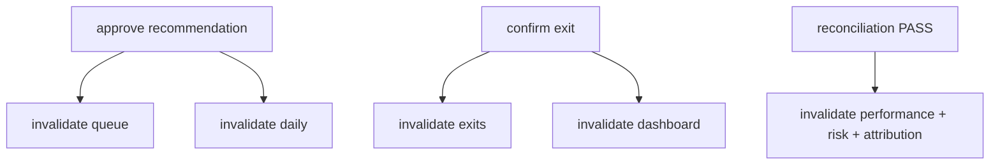

# Pi-PM Frontend — API Integration Plan

**Track:** D — Frontend Architecture & React Native Web Foundation  
**Version:** 1.0  
**Date:** 2026-06-05  
**Base URL:** `/api/v1`

---

## 1. Overview

The API layer lives in `frontend/packages/api/` with React Query hooks in `frontend/packages/hooks/`. All types originate from `frontend/packages/types/` mirroring backend contracts documented in [docs/mobile/MOBILE_API_MAPPING.md](../mobile/MOBILE_API_MAPPING.md).

**Rule:** Frontend displays API values. No derived financial metrics.

---

## 2. Package Structure

```
packages/api/src/
├── client.ts                 # Base HTTP client
├── errors.ts                 # ApiError, ReconciliationGateError
├── stockCache.ts             # ID → symbol resolution helper
├── recommendations.ts        # recommendationsApi
├── portfolio.ts              # portfolioApi
├── committee.ts              # committeeApi
├── analytics.ts              # analyticsApi
├── copilot.ts                # copilotApi
├── stocks.ts                 # stocksApi (enrichment)
└── index.ts
```

---

## 3. Base Client Design

```typescript
// packages/api/src/client.ts (interface sketch)

interface ApiClientConfig {
  baseUrl: string;
  getAccessToken?: () => string | null;
  onUnauthorized?: () => void;
}

interface RequestOptions {
  params?: Record<string, string | number | undefined>;
  signal?: AbortSignal;
}

class ApiClient {
  get<T>(path: string, options?: RequestOptions): Promise<T>;
  post<T>(path: string, body?: unknown, options?: RequestOptions): Promise<T>;
}

export function createApiClient(config: ApiClientConfig): ApiClient;
```

### Error normalization

```typescript
// packages/api/src/errors.ts

export class ApiError extends Error {
  constructor(
    public status: number,
    public code: string,
    message: string,
    public details?: Record<string, unknown>,
  ) { super(message); }
}

export class ReconciliationGateError extends ApiError {
  constructor(details?: Record<string, unknown>) {
    super(409, 'RECONCILIATION_GATE', 'Analytics unavailable — reconciliation failed', details);
  }
}

export function normalizeError(status: number, body: unknown): ApiError;
```

| HTTP Status | `code` | Hook behavior |
|-------------|--------|---------------|
| 404 | `NOT_FOUND` | Empty state |
| 409 | `RECONCILIATION_GATE` | `isGated: true` in view model |
| 401 | `UNAUTHORIZED` | Trigger `onUnauthorized` |
| 422 | `VALIDATION_ERROR` | Form error display |
| 5xx | `SERVER_ERROR` | Retry + toast |

---

## 4. Domain API Clients

### 4.1 Recommendations API

```typescript
// packages/api/src/recommendations.ts

export const recommendationsApi = {
  getDaily(params: { asOfDate: string; action?: Action }): Promise<DailyRecommendationsRead>;
  getLatest(params: { strategyName: string; asOfDate?: string }): Promise<RecommendationRunRead>;
  getRunResults(runId: string, action?: Action): Promise<RecommendationResultRead[]>;
  getStockResult(runId: string, symbol: string): Promise<RecommendationResultRead>;
  getWhyNot(symbol: string, strategyName: string): Promise<WhyNotResponse>;
  getQueue(): Promise<RecommendationResultRead[]>;
  approve(resultId: string, body: ApproveRequest): Promise<{ status: string; decision: string }>;
  reject(resultId: string, params?: { note?: string; actorId?: string }): Promise<{ status: string }>;
};
```

### 4.2 Portfolio API

```typescript
export const portfolioApi = {
  getDashboard(): Promise<PortfolioDashboardResponse>;
  getSummary(asOfDate?: string): Promise<PortfolioSummary>;
  getPositions(): Promise<PortfolioPosition[]>;
  getLimits(asOfDate?: string): Promise<RegimeLimits>;
  getPerformance(range?: DateRange): Promise<PerformanceMetrics>;
  getRisk(): Promise<RiskMetrics>;
  getAttribution(range?: DateRange): Promise<AttributionReport>;
  getBenchmark(params?: BenchmarkParams): Promise<BenchmarkComparison>;
  getNavHistory(range?: DateRange): Promise<NavHistoryPoint[]>;
  getReconciliation(): Promise<ReconciliationReport>;
  getExits(asOfDate?: string): Promise<ExitRecommendation[]>;
  confirmExit(exitId: string): Promise<{ id: string; status: string }>;
  rejectExit(exitId: string, reason?: string): Promise<{ id: string; status: string }>;
};
```

### 4.3 Investment Committee API

```typescript
export const committeeApi = {
  getLatest(universeCode?: string): Promise<CommitteeReviewSummary>;
  getReview(reviewId: string): Promise<CommitteeReviewDetail>;
  getPackets(reviewId: string, symbol?: string): Promise<CommitteePacket[]>;
  getReport(reviewId: string): Promise<CommitteeReportResponse>;
  getExplain(reviewId: string): Promise<CommitteeExplainResponse>;
  getMembers(): Promise<CommitteeMembersResponse>;
};
```

### 4.4 Analytics API

```typescript
export const analyticsApi = {
  getTrustMetrics(params?: AnalyticsWindow): Promise<TrustMetricsDTO>;
  getRecommendationSummary(params?: AnalyticsWindow): Promise<RecommendationSummaryDTO>;
  getConvictionPerformance(params?: AnalyticsWindow): Promise<ConvictionPerformanceDTO>;
  getCommitteePerformance(params?: AnalyticsWindow): Promise<CommitteePerformanceDTO>;
  getSymbolAnalytics(symbol: string, params?: AnalyticsWindow): Promise<SymbolAnalyticsDTO>;
};
```

### 4.5 Copilot API

```typescript
export const copilotApi = {
  ask(body: { question: string; sessionId?: string }): Promise<AskResponse>;
  getAudit(limit?: number): Promise<AuditLogRead[]>;
};
```

### 4.6 Stocks API (enrichment)

```typescript
export const stocksApi = {
  getBySymbol(symbol: string): Promise<StockRead>;
  // Future: getByIds(ids: string[]): Promise<StockRead[]>
};
```

---

## 5. React Query Hooks

### 5.1 Query key factory

```typescript
// packages/hooks/src/queryKeys.ts

export const queryKeys = {
  dashboard: () => ['portfolio', 'dashboard'] as const,
  trust: (params?: AnalyticsWindow) => ['analytics', 'trust', params] as const,
  recommendations: {
    daily: (date: string, action?: string) => ['recommendations', 'daily', date, action] as const,
    queue: () => ['recommendations', 'queue'] as const,
    detail: (runId: string, symbol: string) => ['recommendations', 'detail', runId, symbol] as const,
  },
  portfolio: {
    positions: () => ['portfolio', 'positions'] as const,
    performance: (range?: DateRange) => ['portfolio', 'performance', range] as const,
    exits: () => ['portfolio', 'exits'] as const,
  },
  committee: {
    latest: () => ['committee', 'latest'] as const,
    packets: (id: string) => ['committee', 'packets', id] as const,
  },
  copilot: {
    audit: (limit: number) => ['copilot', 'audit', limit] as const,
  },
};
```

### 5.2 Composite hooks

| Hook | Parallel queries | Output |
|------|------------------|--------|
| `useDashboard()` | dashboard + trust + daily BUY preview | `DashboardViewModel` |
| `useRecommendationCards()` | daily + committee packets + stock cache | `RecommendationCardModel[]` |
| `usePortfolioScreen()` | summary + positions + performance + risk + reconciliation | `PortfolioViewModel` |
| `useRecommendationDetail()` | detail + packet + report + symbol analytics | `RecommendationDetailViewModel` |

### 5.3 Mutation hooks

```typescript
export function useApproveRecommendation() {
  const qc = useQueryClient();
  return useMutation({
    mutationFn: ({ resultId, body }) => recommendationsApi.approve(resultId, body),
    onSuccess: () => {
      qc.invalidateQueries({ queryKey: ['recommendations', 'queue'] });
      qc.invalidateQueries({ queryKey: ['recommendations', 'daily'] });
    },
  });
}

export function useAskCopilot() {
  return useMutation({
    mutationFn: copilotApi.ask,
    // Optimistic append handled in useCopilotStore
  });
}
```

---

## 6. Caching Strategy

| Data type | `staleTime` | `gcTime` | Refetch trigger |
|-----------|-------------|----------|-----------------|
| Dashboard | 2 min | 15 min | Tab focus, pull-to-refresh |
| Recommendations daily | 5 min | 30 min | Tab change, date change |
| Positions | 2 min | 15 min | Tab focus |
| Committee (completed) | 30 min | 2 hr | Manual refresh |
| Committee (running) | 0 | 5 min | Poll 30s |
| Trust metrics | 15 min | 1 hr | Dashboard load |
| Copilot audit | 0 | 10 min | On demand |
| Stock cache | 24 hr | 48 hr | Persisted Zustand |

### Cache invalidation graph



---

## 7. Retry Policy

```typescript
function shouldRetry(failureCount: number, error: ApiError): boolean {
  if (error.status === 409) return false;  // reconciliation gate — don't retry
  if (error.status === 404) return false;
  if (error.status === 401 || error.status === 403) return false;
  if (error.status >= 500) return failureCount < 3;
  return false;
}

// exponential backoff: 1s, 2s, 4s
retryDelay: (attempt) => Math.min(1000 * 2 ** attempt, 8000),
```

---

## 8. Mock Strategy (Development)

| Tool | Use |
|------|-----|
| MSW (Mock Service Worker) | Web dev without backend |
| Fixture JSON | `packages/api/src/__fixtures__/` from backend response samples |
| `EXPO_PUBLIC_API_BASE_URL` | Point to local FastAPI |

Phase 1 scaffold includes MSW handlers for dashboard + recommendations happy path.

---

## 9. Type Generation (Future)

Optional OpenAPI → TypeScript codegen from FastAPI `/openapi.json`:

```
pnpm generate:types  # openapi-typescript → packages/types/src/api/generated.ts
```

Manual types for MVP; codegen when backend OpenAPI stabilizes.

---

## 10. API Endpoint Coverage Matrix

| Screen | Endpoints | Hook(s) |
|--------|-----------|---------|
| Dashboard | dashboard, trust, daily | `useDashboard` |
| Recommendations | daily, run, packets, stocks | `useRecommendationCards`, `useRecommendationDetail` |
| Portfolio | summary, positions, performance, risk, attribution, nav-history, reconciliation | `usePortfolioScreen` |
| Exit Queue | exits | `usePendingExits` |
| Copilot | ask, audit | `useAskCopilot`, `useCopilotAudit` |
| Committee | latest, packets, report, explain, members | `useCommitteeScreen` |
| Analytics | trust, summary, committee | `useAnalyticsScreen` |

Full endpoint list: [MOBILE_API_MAPPING.md](../mobile/MOBILE_API_MAPPING.md) §6.

---

## 11. Known Backend Gaps (Client Workarounds)

| Gap | Workaround | Future |
|-----|------------|--------|
| No `symbol` on recommendation results | Stock cache + lookup | Backend adds field |
| Dashboard missing `trust_score` | Parallel trust query | Wire in dashboard |
| No mobile daily aggregate | Client join rec + committee | `GET /recommendations/mobile/daily` |
| EXIT_APPROVED not in daily filter | Extra run fetch | Backend filter update |

See [DTO_GAP_ANALYSIS.md](../mobile/DTO_GAP_ANALYSIS.md).

---

## 12. Revision History

| Version | Date | Change |
|---------|------|--------|
| 1.0 | 2026-06-05 | Initial API integration plan |
