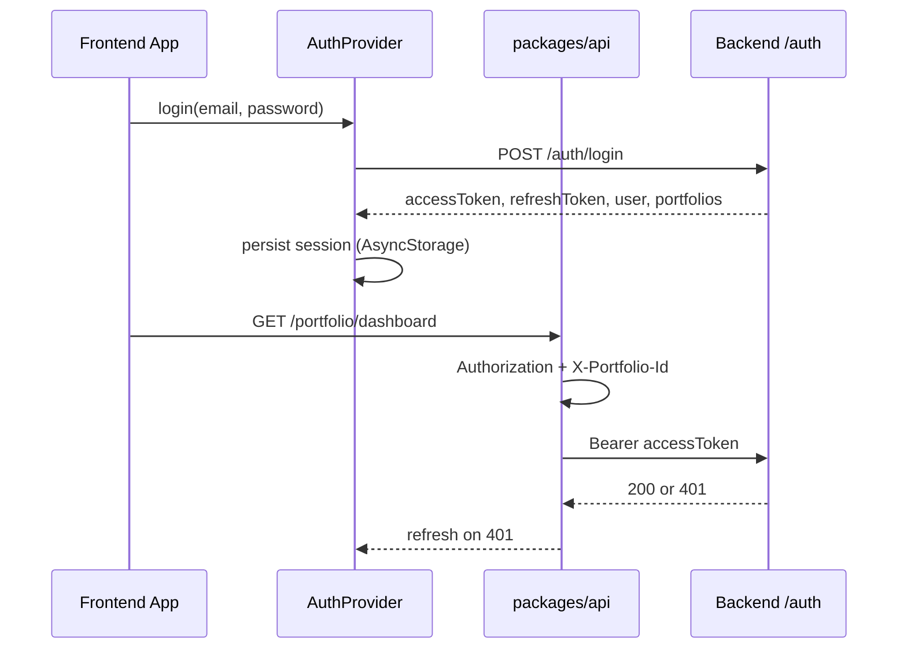

# Pi-PM Frontend — Authentication

**Track:** D — Frontend Architecture & React Native Web Foundation  
**Version:** 2.0  
**Date:** 2026-06-05  
**Status:** **Implemented** (backend ADR-027 + frontend auth layer shipped)

**Supersedes:** v1.0 architecture-only draft. See also [`frontend/docs/FEATURE_INTEGRATION_REPORT.md`](../../frontend/docs/FEATURE_INTEGRATION_REPORT.md) Phase 1.

---

## 1. What is implemented

| Capability | Backend | Frontend |
|------------|---------|----------|
| JWT access tokens (15 min) | `app/auth/jwt.py` | `packages/api/src/auth.ts` |
| Refresh token rotation | `app/services/auth_service.py` | `refreshAccessToken.ts` |
| Login / logout / me | `POST /auth/login`, `/logout`, `GET /me` | `AuthProvider`, `LoginScreen` |
| Portfolio-scoped tenancy | `X-Portfolio-Id` + `assert_portfolio_access` | `client.ts` header, Settings picker |
| RBAC roles | ADMIN / OWNER / VIEWER | UI hides owner actions; server enforces |
| Protected routes | `get_current_user` on domain routers | `AuthGate` → `/login` |
| Session persistence | `refresh_tokens` table | `sessionStorage.ts` (AsyncStorage) |
| Dev bypass | `auth_enabled=false`, `auth_bypass_for_tests` | `EXPO_PUBLIC_AUTH_BYPASS=true` |

---

## 2. Frontend auth flow

---

## 3. Key files

| Layer | Path |
|-------|------|
| API client | `frontend/packages/api/src/auth.ts`, `client.ts` |
| Provider | `frontend/packages/hooks/src/auth/AuthProvider.tsx` |
| Route guard | `frontend/packages/hooks/src/auth/AuthGate.tsx` |
| Token refresh | `frontend/packages/hooks/src/auth/refreshAccessToken.ts` |
| Login UI | `frontend/packages/ui/src/screens/LoginScreen.tsx` |
| App wiring | `frontend/apps/web/app/_layout.tsx`, `apps/mobile/app/_layout.tsx` |

---

## 4. Environment variables

| Variable | Platform | Purpose |
|----------|----------|---------|
| `EXPO_PUBLIC_API_BASE_URL` | Frontend | API base (default `http://localhost:8000/api/v1`) |
| `EXPO_PUBLIC_AUTH_BYPASS` | Frontend | Skip login UI when `true` |
| `JWT_SECRET_KEY` | Backend | **Must be set in production** (not default) |
| `AUTH_ENABLED` | Backend | `true` in production |
| `AUTH_BYPASS_FOR_TESTS` | Backend | `false` in production |

---

## 5. Remaining gaps (post-implementation)

| Gap | Priority | Notes |
|-----|----------|-------|
| OAuth 2.0 / SSO | P2 | Not in ADR-027 v1 |
| Login rate limiting | P1 | Documented in security review |
| Fine-grained permissions in UI | P2 | Backend enforces on execution; recommendations use role only |
| RS256 asymmetric JWT | P3 | ADR-027 deferred |

---

## 6. Threat model (unchanged principles)

| Threat | Mitigation |
|--------|------------|
| Token in localStorage XSS | Access token in memory; refresh persisted in AsyncStorage |
| Token leakage in logs | Never log tokens |
| Stale session | Proactive refresh + 401 handler in `ApiProvider` |
| Unauthorized API access | 401 → refresh or redirect login |
| Role escalation | RBAC checked server-side; frontend hides UI only |

---

## 7. References

- ADR-027: `docs/architecture/ADR-027-Authentication-And-MultiTenant-Architecture.md`
- Security audit: `docs/audit/SECURITY_AUDIT_REPORT.md`
- Backend routes: `app/api/v1/auth.py`, `app/api/auth_deps.py`
