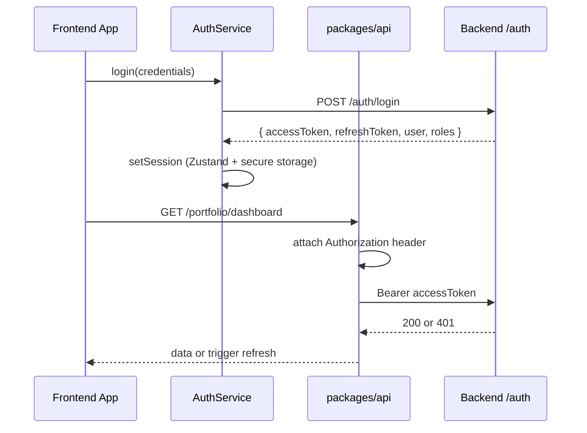
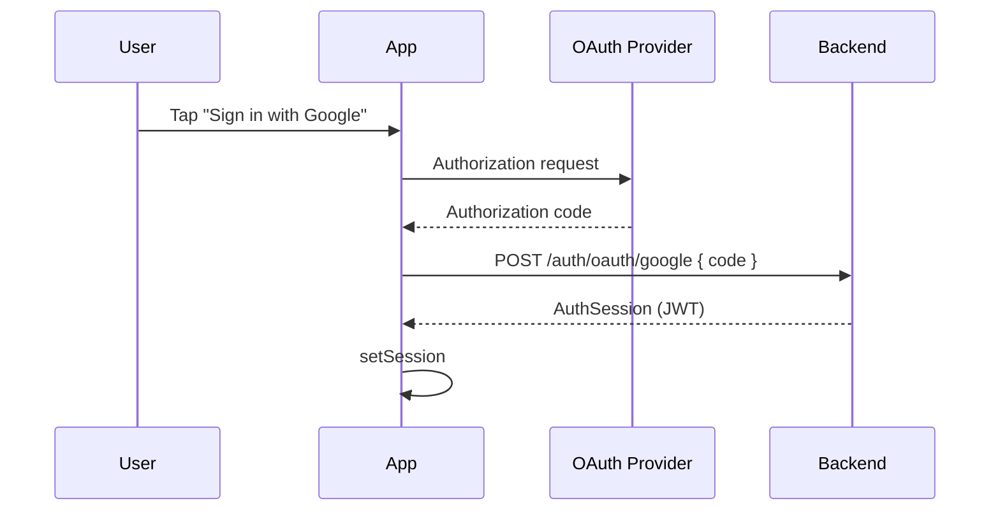

# Pi-PM Frontend — Authentication Preparation

**Track:** D — Frontend Architecture & React Native Web Foundation  
**Version:** 1.0  
**Date:** 2026-06-05

**Status:** Architecture only — **not implemented**. Backend auth does not exist today ([docs/mobile/DTO_GAP_ANALYSIS.md](../mobile/DTO_GAP_ANALYSIS.md) G-09).

---

## 1. Objectives

Prepare frontend for future:

| Capability | Timeline |
|------------|----------|
| JWT bearer authentication | Post-MVP |
| OAuth 2.0 (Google / enterprise SSO) | Post-MVP |
| Multi-user portfolios | Post-MVP |
| Role-based access control (RBAC) | Post-MVP |

MVP ships with **auth bypass** (dev API key in env or open local backend) while store and interceptor shapes are implemented.

---

## 2. Threat Model (Frontend)

| Threat | Mitigation |
|--------|------------|
| Token in localStorage XSS | Memory-first access token; refresh in httpOnly cookie (web) or secure store (native) |
| Token leakage in logs | Never log tokens; redact in error reports |
| Stale session | Proactive refresh before expiry |
| Unauthorized API access | 401 → clear session → redirect login |
| Role escalation | RBAC checked server-side; frontend hides UI only |

---

## 3. Auth Architecture



---

## 4. Proposed Backend Endpoints (Future)

| Method | Path | Purpose |
|--------|------|---------|
| POST | `/auth/login` | Email/password or API key |
| POST | `/auth/oauth/{provider}` | OAuth code exchange |
| POST | `/auth/refresh` | Refresh access token |
| POST | `/auth/logout` | Revoke refresh token |
| GET | `/auth/me` | Current user profile + roles |

Frontend types prepared in `packages/types/src/api/auth.ts`.

---

## 5. Zustand Auth Store

```typescript
// packages/hooks/src/stores/authStore.ts (sketch)

interface UserProfile {
  id: string;
  email: string;
  displayName: string;
}

type Role = 'owner' | 'viewer' | 'ops_admin';

interface AuthState {
  status: 'unknown' | 'authenticated' | 'unauthenticated';
  accessToken: string | null;
  refreshToken: string | null;
  expiresAt: number | null;       // Unix ms
  user: UserProfile | null;
  roles: Role[];

  setSession: (session: AuthSession) => void;
  clearSession: () => void;
  hasRole: (role: Role) => boolean;
}

interface AuthSession {
  accessToken: string;
  refreshToken: string;
  expiresIn: number;              // seconds
  user: UserProfile;
  roles: Role[];
}
```

### MVP stub

```typescript
// Development bypass until backend auth ships
const DEV_BYPASS = process.env.EXPO_PUBLIC_AUTH_BYPASS === 'true';

export const useAuthStore = create<AuthState>((set, get) => ({
  status: DEV_BYPASS ? 'authenticated' : 'unknown',
  accessToken: DEV_BYPASS ? 'dev-token' : null,
  // ...
}));
```

---

## 6. Token Storage Strategy

| Token | Web | Native (iOS/Android) |
|-------|-----|------------------------|
| Access token | Memory (Zustand) | Memory (Zustand) |
| Refresh token | httpOnly secure cookie (preferred) or `expo-secure-store` | `expo-secure-store` |
| User profile | Memory | Memory |

**Never** store access token in `localStorage` on web.

---

## 7. API Client Integration

```typescript
// packages/api/src/client.ts

export function createApiClient(config: ApiClientConfig): ApiClient {
  async function request<T>(method, path, body?, options?) {
    const token = config.getAccessToken?.();
    const headers: Record<string, string> = {
      'Content-Type': 'application/json',
      ...(token ? { Authorization: `Bearer ${token}` } : {}),
    };

    const response = await fetch(`${config.baseUrl}${path}`, { method, headers, body });

    if (response.status === 401) {
      const refreshed = await config.onUnauthorized?.();
      if (refreshed) return request(method, path, body, options);
      throw new ApiError(401, 'UNAUTHORIZED', 'Session expired');
    }

    // ...
  }
}
```

### Refresh flow

```typescript
// packages/api/src/authInterceptor.ts

let refreshPromise: Promise<boolean> | null = null;

export async function handleUnauthorized(): Promise<boolean> {
  if (!refreshPromise) {
    refreshPromise = refreshAccessToken().finally(() => { refreshPromise = null; });
  }
  return refreshPromise;
}

async function refreshAccessToken(): Promise<boolean> {
  const { refreshToken, setSession, clearSession } = useAuthStore.getState();
  if (!refreshToken) { clearSession(); return false; }

  try {
    const session = await authApi.refresh(refreshToken);
    setSession(session);
    return true;
  } catch {
    clearSession();
    return false;
  }
}
```

### Token refresh timing

- Refresh when `expiresAt - now < 5 minutes`
- Background interval check every 60s while app active
- On 401: single-flight refresh → retry original request once

---

## 8. Protected Routes

```typescript
// apps/web/app/_layout.tsx

function AuthGate({ children }: { children: React.ReactNode }) {
  const status = useAuthStore((s) => s.status);
  const router = useRouter();

  useEffect(() => {
    if (status === 'unauthenticated') {
      router.replace('/login');
    }
  }, [status]);

  if (status === 'unknown') return <SplashScreen />;
  if (status === 'unauthenticated') return null;
  return children;
}
```

### Route protection matrix

| Route | Auth required | Roles (future) |
|-------|---------------|----------------|
| Dashboard | ✅ | owner, viewer |
| Recommendations | ✅ | owner, viewer |
| HITL approve/reject | ✅ | **owner only** |
| Exit confirm/reject | ✅ | **owner only** |
| Copilot | ✅ | owner, viewer |
| Settings | ✅ | owner |
| Analytics | ✅ | owner, viewer |

Frontend hides action buttons when `!hasRole('owner')` — **server must enforce** on mutations.

---

## 9. OAuth Flow (Future)



Use `expo-auth-session` for native + web OAuth redirect.

---

## 10. Multi-User Portfolios (Future)

| Concern | Frontend approach |
|---------|-------------------|
| Portfolio scope | `X-Portfolio-Id` header or JWT claim |
| Portfolio switcher | Settings dropdown → invalidate all queries |
| Query keys | Include `portfolioId`: `['portfolio', portfolioId, 'dashboard']` |

```typescript
interface AuthState {
  // future extension
  activePortfolioId: string | null;
  portfolios: PortfolioSummary[];
  setActivePortfolio: (id: string) => void;
}
```

---

## 11. RBAC UI Gating

| Role | Capabilities |
|------|--------------|
| `owner` | Full read + HITL + exit confirm + settings |
| `viewer` | Read-only all screens; copilot allowed |
| `ops_admin` | Batch status, no portfolio mutations (future ops screens) |

```typescript
// packages/hooks/src/usePermission.ts
export function usePermission(action: Permission): boolean {
  const roles = useAuthStore((s) => s.roles);
  return checkPermission(roles, action);
}

// Usage
const canApprove = usePermission('recommendation:approve');
{canApprove && <ApproveButton />}
```

---

## 12. Session Lifecycle

| Event | Action |
|-------|--------|
| App launch | Restore refresh token → silent refresh → set status |
| Login success | setSession → navigate to Dashboard |
| Logout | clearSession → invalidate React Query cache → /login |
| 401 unrecoverable | clearSession → /login with toast |
| Token refresh success | Update access token silently |
| App background (native) | No action; refresh on foreground if near expiry |

---

## 13. Implementation Checklist (When Backend Ready)

- [ ] `packages/types/src/api/auth.ts`
- [ ] `packages/api/src/auth.ts`
- [ ] `useAuthStore` with secure persistence
- [ ] `AuthGate` in root layout
- [ ] `/login` screen (minimal)
- [ ] API client 401 interceptor + refresh
- [ ] `usePermission` hook
- [ ] Query key portfolio scoping
- [ ] E2E test: login → dashboard → logout

---

## 14. Revision History

| Version | Date | Change |
|---------|------|--------|
| 1.0 | 2026-06-05 | Initial auth preparation |
