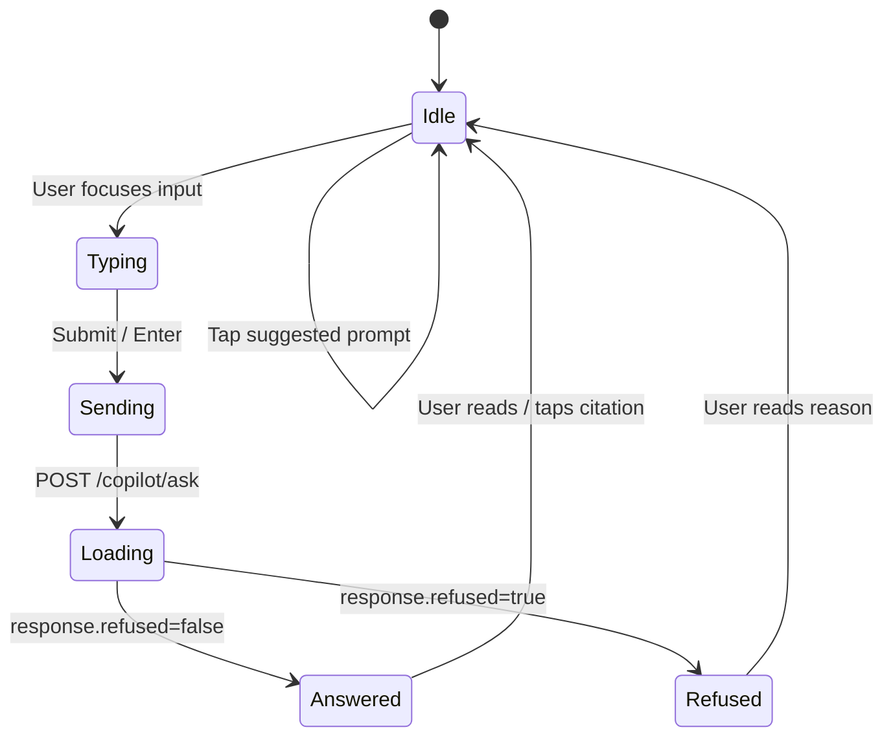

# Pi-PM Frontend — Copilot Experience Design

**Track:** D — Frontend Architecture & React Native Web Foundation  
**Version:** 1.0  
**Date:** 2026-06-05

Grounded Q&A UI over Pi-PM data. Copilot **explains** — never decides. Aligns with [docs/product-next/10_AI_COPILOT_PRD.md](../product-next/10_AI_COPILOT_PRD.md) and backend intents in `app/copilot/intent.py`.

---

## 1. Experience Principles

| ID | Principle |
|----|-----------|
| CX-01 | Every numeric claim has a tappable citation |
| CX-02 | Refused questions show governance reason — no retry loop |
| CX-03 | Suggested prompts are contextual to current screen |
| CX-04 | Machine action and copilot answer may coexist — copilot does not override |
| CX-05 | Latency is expected — show typing indicator, never fake streaming |
| CX-06 | Uncited claims trigger visible warning |

---

## 2. Supported Question Categories

| Category | Example prompts | Backend intent |
|----------|-------------------|----------------|
| Why recommended? | "Why is RELIANCE a BUY today?" | `why_recommended` |
| Why not recommended? | "Why is TCS only WATCH?" | `why_not_recommended` |
| Why exit? | "Why should I exit SBIN?" | `explain_exit` |
| Portfolio health? | "How is my portfolio doing?" | `explain_portfolio` |
| Risk explanation? | "What are my biggest risk exposures?" | `explain_risk` |
| Performance? | "Explain my alpha this month" | `explain_performance` |
| Committee? | "What did the committee say about INFY?" | `explain_committee` |
| Conviction? | "Why is conviction 82 for HDFC?" | `explain_conviction` |
| Rank (supplementary) | "Why is ITC ranked 3?" | `explain_rank` |
| Validation (supplementary) | "Is momentum validated?" | `explain_validation` |
| Ops (supplementary) | "Did yesterday's batch complete?" | `ops_status` |

---

## 3. Interaction Model



### 3.1 Entry points

| Entry | Behavior |
|-------|----------|
| Copilot tab / sidebar | Full chat view |
| Desktop side panel (`Cmd+K`) | Panel opens over current screen |
| "Ask Copilot" on RecommendationCard | Panel opens with prefill |
| "Explain" on ExitApprovalCard | Prefill: "Why exit {symbol}?" |
| Dashboard risk tap | Prefill: "Explain my portfolio risk" |

### 3.2 Prefill mechanism

```typescript
useCopilotStore.getState().openPanel({
  prefillQuestion: `Why is ${symbol} a ${action}?`,
  sourceScreen: 'recommendations',
});
```

Input is pre-filled but **not auto-sent** — user confirms (prevents accidental API calls).

---

## 4. UI Layout

### 4.1 Message thread

```
┌─────────────────────────────────────────┐
│ Suggested: [Why RELIANCE BUY?] [Risk?]  │
├─────────────────────────────────────────┤
│                              ┌────────┐ │
│                              │ User   │ │
│                              │ msg    │ │
│                              └────────┘ │
│ ┌────────────────────────┐              │
│ │ Assistant              │              │
│ │ Answer text with refs  │              │
│ │ [rec_results/abc] [→]  │              │
│ │ intent: why_recommended│              │
│ └────────────────────────┘              │
│ ┌────────────────────────┐              │
│ │ ⚠ Refused              │              │
│ │ Trade execution not... │              │
│ └────────────────────────┘              │
├─────────────────────────────────────────┤
│ [Ask about your portfolio...]    [Send] │
└─────────────────────────────────────────┘
```

### 4.2 Assistant message anatomy

| Element | Source field | Display |
|---------|--------------|---------|
| Body | `answer` | Markdown-lite (bold, lists) |
| Citations | `citations[]` | `CitationPanel` chips below body |
| Uncited warning | `uncited_claims[]` | Amber banner if non-empty |
| Intent badge | `intent` | Subtle monospace tag |
| Metadata | `latency_ms`, `model` | Collapsed footer (debug) |
| Refused styling | `refused: true` | Red left border + icon |

### 4.3 Citation chip

```
┌──────────────────────────────┐
│ 📎 recommendation_results    │
│ conviction_score = 82        │
└──────────────────────────────┘
```

Tap → `navigateToCitation(citation)` → source screen.

---

## 5. Contextual Suggested Prompts

| `sourceScreen` | Prompts |
|----------------|---------|
| `dashboard` | "What is my portfolio risk today?", "How is my alpha?", "Summarize pending exits" |
| `recommendations` | "Why is {symbol} a {action}?", "What stocks are on WATCH?", "Explain conviction bands" |
| `recommendation_detail` | "Break down conviction for {symbol}", "What did committee say about {symbol}?" |
| `portfolio` | "Explain my performance", "What is my sector exposure?", "Why is reconciliation failing?" |
| `exits` | "Why exit {symbol}?", "What triggers fired for {symbol}?" |
| `committee` | "Explain HIGH_CONCERN on {symbol}", "What is CRO advisory?" |

Prompts are **static strings** with variable interpolation — not LLM-generated.

---

## 6. Refusal UX

When `refused: true`:

```
┌────────────────────────────────────────┐
│ 🚫 Request not supported               │
│                                        │
│ Trade execution is not supported.      │
│ Use the HITL approval queue.           │
│                                        │
│ [Go to HITL Queue]  [Dismiss]          │
└────────────────────────────────────────┘
```

| Refuse type | CTA |
|-------------|-----|
| Trade execution | Link to HITL queue |
| Stock picking | Link to Recommendations |
| Override validation | None — informational only |
| Prompt injection | None — no detail |

**No auto-retry.** User must rephrase.

---

## 7. Session Model

| Field | Storage | Purpose |
|-------|---------|---------|
| `sessionId` | Zustand + UUID v4 on first message | Backend `copilot_query_logs.session_id` |
| `messages` | Zustand (in-memory) | Current thread |
| History | `GET /copilot/audit` | Cross-session audit (owner) |

### Session lifecycle

1. First message → generate `sessionId` if null
2. Include `sessionId` in `POST /copilot/ask`
3. "New conversation" → `resetSession()` → new UUID
4. App reload → session lost (MVP); future: restore from audit

---

## 8. Loading & Error States

| State | UI |
|-------|-----|
| Loading | Typing indicator (3 dots) + "Searching Pi-PM data..." |
| Success | Append assistant `CopilotMessage` |
| Refused | Append with refused styling |
| Network error | Toast + "Retry" on failed user message |
| Timeout (>30s) | "Taking longer than usual" + cancel option |

No fake token streaming — backend returns complete answer.

---

## 9. Citation → Navigation Map

| `source_table` | User sees | Navigates to |
|----------------|-----------|--------------|
| `recommendation_results` | "Recommendation: conviction 82" | Recommendation detail |
| `investment_review_packets` | "Committee packet: INFY" | Committee detail |
| `portfolio_positions` | "Position: RELIANCE" | Position detail |
| `portfolio_exit_recommendations` | "Exit: SBIN" | Exit detail |
| `portfolio_nav_history` | "NAV: 2026-06-05" | Portfolio performance |
| `ranking_results` | "Rank: ITC #3" | Recommendation detail |
| `ranking_validation_reports` | "Validation: momentum" | Info modal |
| `daily_batch_runs` | "Batch: 2026-06-04" | Ops info modal |

Implementation: `packages/navigation/src/citationNavigation.ts`

---

## 10. Desktop Side Panel vs Mobile Full Screen

| Aspect | Desktop panel | Mobile full screen |
|--------|---------------|-------------------|
| Width | 360px fixed right | 100% |
| Overlay | Content shrinks or overlays | N/A |
| Keyboard | `Cmd+K` toggle | Standard input |
| Context | User sees underlying data | Navigate back to return |
| Persist | Stays open across routes | Per-route |

```typescript
// Desktop: panel persists
const isPanel = useBreakpoint() !== 'mobile' && useCopilotStore((s) => s.isPanelOpen);

// Mobile: route-based
router.push('/copilot');
```

---

## 11. Accessibility

| Requirement | Implementation |
|-------------|----------------|
| Screen reader | Citations announced as links |
| Keyboard | Enter to send; Tab through citations |
| Contrast | Refused banner meets WCAG AA |
| Focus | Return focus to input after send |

---

## 12. Analytics (Frontend Events — Future)

| Event | Payload |
|-------|---------|
| `copilot_question_sent` | intent, sourceScreen, sessionId |
| `copilot_citation_tapped` | sourceTable, ref |
| `copilot_refused` | intent, refuseReason |
| `copilot_suggested_prompt_tapped` | promptTemplate |

No PII in events. Backend audit log is authoritative.

---

## 13. Component Mapping

| UI element | Component |
|------------|-----------|
| Message bubble | `CopilotMessage` |
| Citation chips | `CitationPanel` |
| Suggested prompts | `SuggestedPromptChips` |
| Input area | `CopilotInput` |
| Refusal block | `RefusalBanner` |
| Uncited warning | `UncitedClaimsWarning` |
| Full chat | `CopilotChat` organism |
| Side panel shell | `CopilotPanel.web.tsx` |

---

## 14. Revision History

| Version | Date | Change |
|---------|------|--------|
| 1.0 | 2026-06-05 | Initial copilot experience design |
