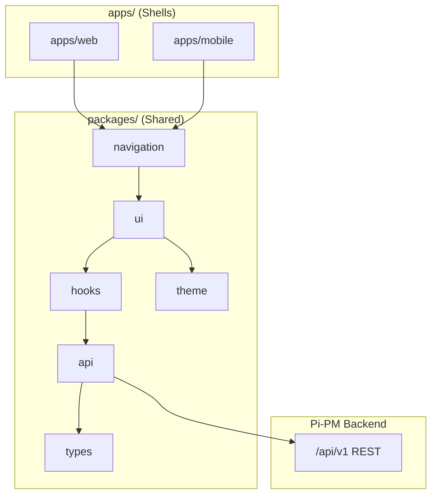
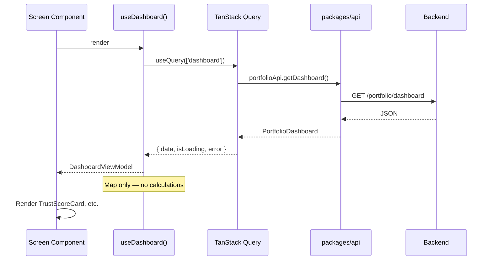
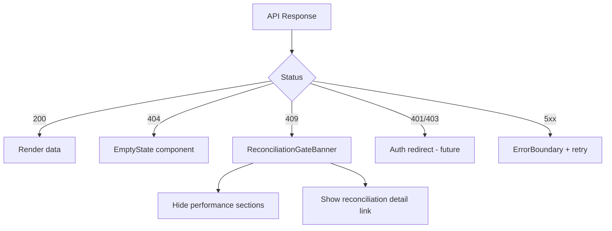

# Pi-PM Frontend — System Architecture

**Track:** D — Frontend Architecture & React Native Web Foundation  
**Version:** 1.0  
**Date:** 2026-06-05

---

## 1. Architecture Overview



---

## 2. Layer Responsibilities

| Layer | Responsibility | Must NOT |
|-------|----------------|----------|
| **apps/** | Entry points, layout shells, platform config, env | Contain business components |
| **packages/ui** | Presentational components, compound screens | Fetch data directly |
| **packages/hooks** | React Query hooks, Zustand selectors, view-model mappers | Compute financial metrics |
| **packages/api** | HTTP client, typed endpoints, error normalization | Store UI state |
| **packages/types** | API response types, screen models, enums | Runtime logic |
| **packages/theme** | Colors, typography, spacing, breakpoints | Component implementations |
| **packages/navigation** | Route definitions, deep links, layout switching | API calls |

---

## 3. Data Flow



### View-model mapping rules

| Allowed in mapper | Forbidden |
|-------------------|-----------|
| Field rename (`today_change_pct` → `todayChangePct`) | `conviction * 1.1` |
| Unit suffix preparation (`12.5` → display `"12.5%"`) | Alpha from two NAV points |
| Array sort by API-provided fields | Re-sort conviction bands by client rules |
| Client join (symbol from stock cache) | Merge committee into action decision |
| Filter/tab (BUY vs WATCH) | Allocation weight recompute |

---

## 4. Platform Strategy

### 4.1 Single codebase, dual shell

```
frontend/
├── apps/
│   ├── web/          # Expo Web — primary
│   └── mobile/       # Expo native — Phase 4
└── packages/         # 100% shared product code
```

### 4.2 Platform extension pattern

Use only when web and native behavior genuinely differs:

```
packages/ui/src/components/DataTable/
├── DataTable.tsx         # shared interface
├── DataTable.web.tsx     # HTML table semantics, hover
└── DataTable.native.tsx  # FlashList rows
```

**Default:** one `.tsx` file using RN primitives (works on web via RN Web).

### 4.3 Responsive vs native

| Concern | Mechanism |
|---------|-----------|
| Breakpoint layout | `useBreakpoint()` hook from `packages/theme` |
| Navigation chrome | `packages/navigation` — Sidebar (desktop) vs TabBar (mobile) |
| Native-only features | `Platform.OS` checks in `apps/mobile` only |

---

## 5. Visual Language — Bloomberg Terminal Lite

| Element | Specification |
|---------|---------------|
| Theme default | Dark (`#0a0e14` background) |
| Typography | Sans for UI; monospace for numbers (`JetBrains Mono` / `Roboto Mono`) |
| Density | Compact row height (36–40px table rows) |
| Color semantics | Green/red for P&L only; amber for WATCH; red border for HIGH_CONCERN |
| Cards | Minimal borders; no heavy shadows |
| Data refresh | Subtle timestamp + pull-to-refresh |

---

## 6. Error & Gating Architecture



Central error type: `ApiError` in `packages/api` with `code`, `message`, `status`.

---

## 7. Cross-Cutting Concerns

### 7.1 Stock symbol resolution

`RecommendationResultRead` returns `stock_id` not `symbol`. Architecture:

```
packages/api/src/stockCache.ts   # id → symbol map
packages/hooks/src/useStockSymbol.ts
```

Batch prefetch after recommendation fetch. No backend change in Track D.

### 7.2 Committee + recommendation join

```
packages/hooks/src/useRecommendationCards.ts
  - parallel: daily recs + committee packets
  - merge on symbol (display only)
```

### 7.3 Date handling

- API returns ISO dates
- Display in `Asia/Kolkata` (owner locale — configurable in Settings P2)
- `as_of_date` shown on every recommendation screen

---

## 8. Development Tooling

| Tool | Purpose |
|------|---------|
| pnpm workspaces | Monorepo package linking |
| Turborepo | Build cache, `turbo dev` |
| Expo | Web + native bundler |
| TypeScript project references | `packages/*` → `apps/*` |
| ESLint + Prettier | Shared config at `frontend/` root |
| Storybook (RN Web) | Component catalog in `packages/ui` |

---

## 9. Deployment Architecture

| Target | Build | Host |
|--------|-------|------|
| Web | `pnpm --filter web build` | Static CDN or Expo EAS Web |
| Android | `pnpm --filter mobile build:android` | EAS Build → Play Store |
| iOS | `pnpm --filter mobile build:ios` | EAS Build → App Store |

Environment variables:

```
EXPO_PUBLIC_API_BASE_URL=https://api.pipm.local/api/v1
EXPO_PUBLIC_DEFAULT_STRATEGY=momentum_sqe
```

---

## 10. Security Boundaries

| Concern | Approach |
|---------|----------|
| API keys / JWT | `packages/api` auth interceptor (future) |
| Copilot audit | No PII in client logs |
| Local storage | Settings only; no portfolio data persisted offline (MVP) |
| CORS | Backend config for web origin |

---

## 11. Testing Strategy (Implementation Phases)

| Level | Scope |
|-------|-------|
| Unit | View-model mappers, API client, Zustand stores |
| Component | Storybook snapshots per `packages/ui` component |
| Integration | MSW mock API + hook tests |
| E2E | Playwright (web) — dashboard load, recommendation filter |

---

## 12. Revision History

| Version | Date | Change |
|---------|------|--------|
| 1.0 | 2026-06-05 | Initial system architecture |
