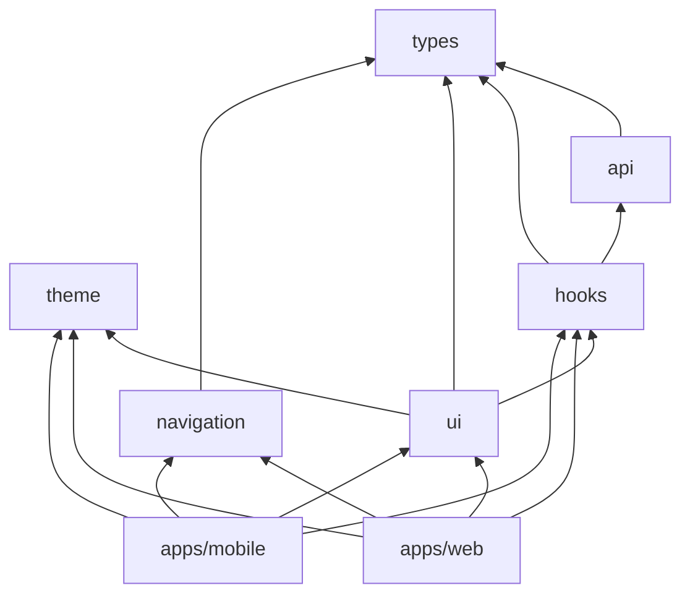

# Pi-PM Frontend — Monorepo Structure

**Track:** D — Frontend Architecture & React Native Web Foundation  
**Version:** 1.0  
**Date:** 2026-06-05

Proposed directory tree and package responsibilities. **Not scaffolded yet** — blueprint only.

---

## 1. Repository Layout

```
pi-pm/
├── app/                          # Existing Python backend (unchanged)
├── docs/
│   ├── frontend/                 # Track D docs (this folder)
│   ├── mobile/                   # Track B API contracts
│   └── architecture/
│       └── ADR-026-Frontend-Architecture.md
└── frontend/                     # NEW — entire frontend monorepo root
    ├── package.json              # Workspace root
    ├── pnpm-workspace.yaml
    ├── turbo.json
    ├── tsconfig.base.json
    ├── .eslintrc.js
    ├── apps/
    │   ├── web/
    │   └── mobile/
    └── packages/
        ├── ui/
        ├── api/
        ├── hooks/
        ├── types/
        ├── theme/
        └── navigation/
```

---

## 2. Workspace Configuration

### `pnpm-workspace.yaml`

```yaml
packages:
  - "apps/*"
  - "packages/*"
```

### `turbo.json` (pipeline sketch)

```json
{
  "pipeline": {
    "build": { "dependsOn": ["^build"], "outputs": ["dist/**"] },
    "dev": { "cache": false, "persistent": true },
    "lint": { "dependsOn": ["^build"] },
    "typecheck": { "dependsOn": ["^build"] },
    "storybook": { "cache": false }
  }
}
```

---

## 3. Apps

### 3.1 `apps/web` — Primary deployment target

| Responsibility | Detail |
|----------------|--------|
| Entry point | `expo-router` app root |
| Layout shells | `DesktopLayout` (sidebar), `TabletLayout`, `MobileWebLayout` |
| Route files | Thin wrappers importing screen composites from `packages/ui` |
| Web config | `app.json` web section, favicon, meta |
| Env | `EXPO_PUBLIC_*` variables |

```
apps/web/
├── app/                          # Expo Router file-based routes
│   ├── _layout.tsx               # Root: providers, auth gate
│   ├── (desktop)/                # Layout group — sidebar
│   │   ├── _layout.tsx
│   │   ├── index.tsx             # Dashboard
│   │   ├── recommendations/
│   │   ├── portfolio/
│   │   ├── exits/
│   │   ├── copilot/
│   │   └── committee/
│   └── (mobile)/                 # Layout group — bottom tabs (web narrow)
│       └── ...
├── app.json
├── package.json
└── tsconfig.json
```

**Dependencies:** `@pipm/ui`, `@pipm/hooks`, `@pipm/navigation`, `@pipm/theme`, `@pipm/types`

**Must NOT contain:** Reusable components, API client code, business view-models.

---

### 3.2 `apps/mobile` — Future native shell (Phase 4)

| Responsibility | Detail |
|----------------|--------|
| Native entry | Expo native `app/` mirror of web routes |
| Native-only | Push notification hooks (future), haptics, safe area |
| Build | EAS Build profiles for Android/iOS |

```
apps/mobile/
├── app/                          # Same route structure as web
│   ├── _layout.tsx               # Native: TabBar layout
│   └── ...
├── app.json                      # ios/android bundle IDs
├── eas.json
└── package.json
```

**Strategy:** Route files are **thin re-exports** — maximum parity with `apps/web`. Layout differs; screens identical.

---

## 4. Packages

### 4.1 `packages/types` — Shared TypeScript contracts

| Responsibility | Detail |
|----------------|--------|
| API response types | Mirror backend Pydantic/dataclass shapes |
| Screen view models | `DashboardViewModel`, `RecommendationCardModel` |
| Enums | `Action`, `ConvictionBand`, `RiskLevel`, `CopilotIntent` |
| Error types | `ApiError`, `ReconciliationGateError` |

```
packages/types/
├── src/
│   ├── api/                      # Raw API shapes
│   │   ├── recommendations.ts
│   │   ├── portfolio.ts
│   │   ├── committee.ts
│   │   ├── analytics.ts
│   │   └── copilot.ts
│   ├── models/                   # View models
│   │   ├── dashboard.ts
│   │   ├── recommendations.ts
│   │   └── ...
│   └── index.ts
├── package.json                  # name: @pipm/types
└── tsconfig.json
```

**No runtime dependencies.** Pure types + const enums.

---

### 4.2 `packages/api` — Typed HTTP client layer

| Responsibility | Detail |
|----------------|--------|
| Base client | `createApiClient({ baseUrl, getToken })` |
| Domain clients | `recommendationsApi`, `portfolioApi`, `committeeApi`, `analyticsApi`, `copilotApi` |
| Error normalization | Map HTTP status → `ApiError` |
| Request interceptors | Auth header (future), request ID |
| Response validation | Optional Zod parse at boundary |

```
packages/api/
├── src/
│   ├── client.ts                 # fetch wrapper
│   ├── errors.ts
│   ├── stockCache.ts             # stock_id → symbol cache
│   ├── recommendations.ts
│   ├── portfolio.ts
│   ├── committee.ts
│   ├── analytics.ts
│   ├── copilot.ts
│   └── index.ts
└── package.json                  # name: @pipm/api
```

**Dependencies:** `@pipm/types` only.

---

### 4.3 `packages/hooks` — Data hooks + view-model mappers

| Responsibility | Detail |
|----------------|--------|
| TanStack Query hooks | `useDashboard`, `useRecommendations`, etc. |
| View-model mappers | API → screen model (rename only, no math) |
| Client joins | `useRecommendationCards` (rec + committee) |
| Query key factory | `queryKeys.dashboard()`, etc. |

```
packages/hooks/
├── src/
│   ├── queryKeys.ts
│   ├── mappers/
│   │   ├── dashboard.ts
│   │   ├── recommendations.ts
│   │   └── ...
│   ├── queries/
│   │   ├── useDashboard.ts
│   │   ├── useRecommendations.ts
│   │   ├── usePortfolio.ts
│   │   ├── useCommittee.ts
│   │   ├── useCopilot.ts
│   │   └── useExits.ts
│   ├── mutations/
│   │   ├── useApproveRecommendation.ts
│   │   ├── useRejectRecommendation.ts
│   │   ├── useConfirmExit.ts
│   │   └── useAskCopilot.ts
│   └── index.ts
└── package.json                  # name: @pipm/hooks
```

**Dependencies:** `@pipm/api`, `@pipm/types`, `@tanstack/react-query`, `zustand`

---

### 4.4 `packages/ui` — Shared component library

| Responsibility | Detail |
|----------------|--------|
| Atoms | `Badge`, `Text`, `MetricValue`, `Spinner` |
| Molecules | `ConvictionBadge`, `RecommendationCard`, `TrustScoreCard` |
| Organisms | `RecommendationList`, `PortfolioPositionsTable`, `CopilotChat` |
| Screens | `DashboardScreen`, `RecommendationsScreen` (compose organisms) |
| Feedback | `EmptyState`, `ErrorState`, `ReconciliationBanner` |

```
packages/ui/
├── src/
│   ├── atoms/
│   ├── molecules/
│   ├── organisms/
│   ├── screens/
│   ├── feedback/
│   └── index.ts
├── .storybook/
└── package.json                  # name: @pipm/ui
```

**Dependencies:** `@pipm/types`, `@pipm/theme`, `@pipm/hooks` (screens only)

**Rule:** Molecules and below are **presentational** — receive props, no `useQuery`.

---

### 4.5 `packages/theme` — Design tokens & breakpoints

| Responsibility | Detail |
|----------------|--------|
| Colors | Dark terminal palette, semantic colors |
| Typography | Font families, sizes, weights |
| Spacing | 4px grid |
| Breakpoints | `mobile`, `tablet`, `desktop`, `wide` |
| Hooks | `useBreakpoint()`, `useTheme()` |

```
packages/theme/
├── src/
│   ├── colors.ts
│   ├── typography.ts
│   ├── spacing.ts
│   ├── breakpoints.ts
│   ├── ThemeProvider.tsx
│   └── index.ts
└── package.json                  # name: @pipm/theme
```

---

### 4.6 `packages/navigation` — Routing & deep links

| Responsibility | Detail |
|----------------|--------|
| Route constants | `Routes.DASHBOARD`, `Routes.RECOMMENDATION_DETAIL` |
| Deep link parser | `pipm://recommendations/{symbol}` |
| Layout switcher | `useNavigationLayout()` → sidebar vs tabs |
| Navigation helpers | `navigateToCitation(sourceTable, ref)` |

```
packages/navigation/
├── src/
│   ├── routes.ts
│   ├── deepLinks.ts
│   ├── citationNavigation.ts
│   ├── useNavigationLayout.ts
│   └── index.ts
└── package.json                  # name: @pipm/navigation
```

**Dependencies:** `@pipm/types`, `expo-router` (peer)

---

## 5. Dependency Graph



**Forbidden edges:**
- `types` → anything (leaf)
- `api` → `hooks` or `ui` (inversion)
- `apps/*` → direct `fetch` (must use `@pipm/api`)

---

## 6. Package Naming Convention

| Package | npm name |
|---------|----------|
| types | `@pipm/types` |
| api | `@pipm/api` |
| hooks | `@pipm/hooks` |
| ui | `@pipm/ui` |
| theme | `@pipm/theme` |
| navigation | `@pipm/navigation` |
| web app | `@pipm/web` |
| mobile app | `@pipm/mobile` |

---

## 7. Import Rules (ESLint enforced)

```typescript
// ✅ apps/web/app/index.tsx
import { DashboardScreen } from '@pipm/ui';
import { useDashboard } from '@pipm/hooks';

// ❌ Forbidden
import { getDashboard } from '@pipm/api';  // apps must not call API directly
import { RecommendationCard } from '../../packages/ui/...';  // no relative cross-package
```

---

## 8. Revision History

| Version | Date | Change |
|---------|------|--------|
| 1.0 | 2026-06-05 | Initial monorepo structure |
