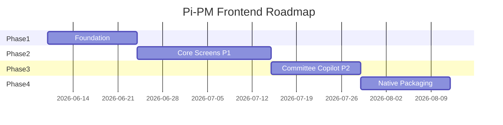
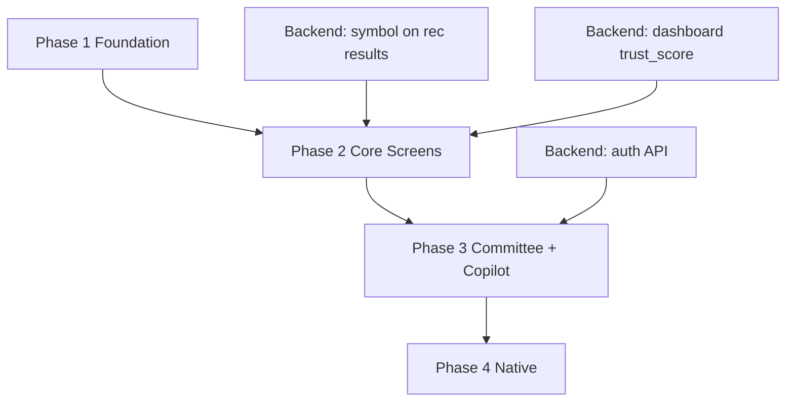

# Pi-PM Frontend — Implementation Roadmap

**Track:** D — Frontend Architecture & React Native Web Foundation  
**Version:** 1.0  
**Date:** 2026-06-05

Phased delivery plan. **Track D delivers documentation only.** Phases 1–4 are implementation work following this blueprint.

---

## Overview

*Dates are illustrative planning estimates.*

---

## Phase 1 — Frontend Foundation

**Goal:** Runnable monorepo skeleton with typed API layer, theme, and one proof-of-concept screen.

### Deliverables

| # | Task | Package | Done when |
|---|------|---------|-----------|
| 1.1 | Initialize pnpm workspace + Turborepo | `frontend/` | `pnpm dev` starts |
| 1.2 | Expo app scaffold (web) | `apps/web` | Blank app renders |
| 1.3 | Expo app scaffold (native stub) | `apps/mobile` | Builds but not shipped |
| 1.4 | Theme tokens (dark terminal) | `packages/theme` | `ThemeProvider` works |
| 1.5 | API types from backend contracts | `packages/types` | All 5 domains typed |
| 1.6 | API client + error normalization | `packages/api` | Integration test vs local backend |
| 1.7 | React Query setup + query keys | `packages/hooks` | Provider in root layout |
| 1.8 | Zustand UI stores (stub auth) | `packages/hooks` | Stores export |
| 1.9 | Atoms: MetricValue, Badge, ActionBadge | `packages/ui` | Storybook stories |
| 1.10 | Responsive layout shells | `apps/web/layouts` | Sidebar + mobile tabs switch at 1024px |
| 1.11 | MSW mock handlers | `packages/api` | Dashboard mock works offline |
| 1.12 | CI: lint + typecheck + turbo pipeline | `frontend/` | GitHub Action green |

### Exit criteria

- [ ] `pnpm --filter web dev` renders themed shell with sidebar/tabs
- [ ] `GET /portfolio/dashboard` callable from `useDashboard` hook
- [ ] Storybook shows 3+ atom components
- [ ] Zero financial calculations in frontend code (lint rule / review)

### Estimated effort: **2 weeks**

---

## Phase 2 — Core Screens (P1)

**Goal:** Ship responsive web MVP with Dashboard, Recommendations, Portfolio, Exit Queue.

### 2.1 Dashboard

| Task | Components |
|------|------------|
| `useDashboard` composite hook | trust + dashboard + daily preview |
| `DashboardScreen` | MetricStrip, TrustScoreCard, RiskIndicator |
| Reconciliation banner | ReconciliationBanner |
| Responsive layouts | mobile stack / desktop panels |

### 2.2 Recommendations

| Task | Components |
|------|------------|
| `useRecommendationCards` join hook | rec + committee + stock cache |
| `RecommendationsScreen` | RecommendationList, ActionTabs |
| `RecommendationDetailScreen` | conviction breakdown, reason list |
| HITL queue modal | approve/reject mutations |
| Master-detail (desktop) | selectedSymbol in Zustand |

### 2.3 Portfolio

| Task | Components |
|------|------------|
| `usePortfolioScreen` hook | 409 gate handling |
| `PortfolioScreen` | summary, positions, performance, risk |
| `PortfolioPositionsTable` | DataTable.web + cards mobile |
| `NavSparkline` | chart from nav-history API |
| Attribution section | AttributionBreakdown |

### 2.4 Exit Approval Queue

| Task | Components |
|------|------------|
| `usePendingExits` + mutations | confirm/reject |
| `ExitApprovalScreen` | ExitApprovalCard list |
| Dashboard badge integration | pending_exits count |

### Exit criteria (Phase 2)

- [ ] All P1 screens render real backend data
- [ ] Responsive at 375px, 768px, 1024px, 1440px
- [ ] HITL approve/reject works end-to-end
- [ ] Exit confirm/reject works end-to-end
- [ ] 409 reconciliation gate shows degraded portfolio
- [ ] No client-side financial calculations
- [ ] Playwright E2E: dashboard load + recommendation filter

### Estimated effort: **3 weeks**

---

## Phase 3 — Committee, Copilot, Analytics (P2)

**Goal:** Complete owner workflow with advisory review and grounded Q&A.

### 3.1 Copilot

| Task | Detail |
|------|--------|
| `useCopilotStore` + `useAskCopilot` | Session + mutation |
| `CopilotChat` organism | Messages + citations |
| Desktop side panel | `CopilotPanel.web.tsx`, Cmd+K |
| Citation navigation | `citationNavigation.ts` |
| Contextual suggested prompts | Per screen |
| Refusal + uncited UX | RefusalBanner |

### 3.2 Investment Committee

| Task | Detail |
|------|--------|
| `useCommitteeScreen` + polling | 30s while running |
| `CommitteeScreen` | packet list, HIGH_CONCERN filter |
| `CommitteeDetailScreen` | markdown narrative |
| `CommitteeAdvisoryCard` | action grid |
| Committee tab in nav | P2 activation |

### 3.3 Performance Analytics

| Task | Detail |
|------|--------|
| `useAnalyticsScreen` | trust, summary, committee metrics |
| `AnalyticsScreen` | TrustScoreCard breakdown, band table |
| Link from dashboard trust widget | Navigate to analytics |

### 3.4 Settings

| Task | Detail |
|------|--------|
| `useSettingsStore` + persist | theme, strategy, API URL |
| `SettingsScreen` | minimal form |

### Exit criteria (Phase 3)

- [ ] Copilot ask → cited answer → citation navigates correctly
- [ ] Copilot refusal displays with correct CTA
- [ ] Committee review polls until complete
- [ ] HIGH_CONCERN filter works
- [ ] Analytics trust breakdown renders
- [ ] Settings persist across reload

### Estimated effort: **2 weeks**

---

## Phase 4 — Native Packaging

**Goal:** Android and iOS builds from same codebase.

### Tasks

| # | Task | Detail |
|---|------|--------|
| 4.1 | `apps/mobile` route parity | Mirror web routes |
| 4.2 | Native tab bar layout | `TabLayout.native.tsx` |
| 4.3 | Platform-specific components | DataTable.native, NavSparkline.native |
| 4.4 | Secure storage for auth tokens | expo-secure-store |
| 4.5 | EAS Build configuration | `eas.json` profiles |
| 4.6 | App icons + splash | Terminal aesthetic |
| 4.7 | Deep linking on native | `pipm://` scheme |
| 4.8 | TestFlight / internal APK | Owner distribution |

### Exit criteria (Phase 4)

- [ ] iOS simulator build runs all P1 screens
- [ ] Android emulator build runs all P1 screens
- [ ] Shared `packages/ui` components render on both
- [ ] No web-only imports in shared packages

### Estimated effort: **2 weeks**

---

## Cross-Phase Dependencies

| Backend dependency | Unblocks | Workaround until shipped |
|--------------------|----------|--------------------------|
| Symbol on recommendation results | Rec list cards | Stock cache N+1 |
| Dashboard trust_score | Single-call dashboard | Parallel trust query |
| Auth API | Production deploy | `AUTH_BYPASS` dev flag |
| Slim committee packets | Committee list perf | Full packet fetch |

---

## Team & Ownership

| Phase | Primary owner | Review |
|-------|---------------|--------|
| Phase 1 | Frontend lead | Product architect |
| Phase 2 | Frontend + design | Product owner |
| Phase 3 | Frontend + ARGS familiarity | Product owner |
| Phase 4 | Mobile engineer | Frontend lead |

---

## Quality Gates (Every Phase)

| Gate | Requirement |
|------|-------------|
| TypeScript | `strict: true`, zero `any` in packages |
| Lint | ESLint + no direct fetch in apps |
| Tests | Hooks unit tested; MSW integration |
| No financial math | Code review checklist |
| Storybook | New molecules have stories |
| Accessibility | Keyboard nav on web screens |

---

## Risk Register

| Risk | Impact | Mitigation |
|------|--------|------------|
| RN Web bundle size | Slow first load | Route code splitting |
| Committee packet size | Slow list | Slim endpoint request (backend) |
| No backend auth | Blocks production | Phase 3 auth prep + backend parallel |
| Copilot latency | Poor UX | Loading states, no fake streaming |
| Master-detail complexity | Desktop/mobile divergence | `useBreakpoint` + shared view models |

---

## Acceptance Criteria Mapping

| ID | Criterion | Delivered in |
|----|-----------|--------------|
| AC-FE-01 | Single codebase | Phase 1 + ADR-026 |
| AC-FE-02 | Web and mobile layouts | Phase 1 shells + Phase 2 responsive |
| AC-FE-03 | Shared components | Phase 1–2 `packages/ui` |
| AC-FE-04 | API integration | Phase 1 `packages/api` + hooks |
| AC-FE-05 | Screen specs | Track D docs + Phase 2 build |
| AC-FE-06 | Auth preparation | Track D docs + Phase 1 stub |
| AC-FE-07 | Copilot UX | Track D docs + Phase 3 build |
| AC-FE-08 | Roadmap | This document |

---

## Document Index

| Document | Path |
|----------|------|
| ADR | [ADR-026](../architecture/ADR-026-Frontend-Architecture.md) |
| PRD | [FRONTEND_PRD.md](./FRONTEND_PRD.md) |
| Architecture | [FRONTEND_ARCHITECTURE.md](./FRONTEND_ARCHITECTURE.md) |
| Monorepo | [FRONTEND_MONOREPO_STRUCTURE.md](./FRONTEND_MONOREPO_STRUCTURE.md) |
| State | [STATE_MANAGEMENT_DECISION.md](./STATE_MANAGEMENT_DECISION.md) |
| API | [API_INTEGRATION_PLAN.md](./API_INTEGRATION_PLAN.md) |
| Screens | [SCREEN_SPECIFICATIONS.md](./SCREEN_SPECIFICATIONS.md) |
| Components | [COMPONENT_LIBRARY.md](./COMPONENT_LIBRARY.md) |
| Layouts | [RESPONSIVE_LAYOUT_GUIDE.md](./RESPONSIVE_LAYOUT_GUIDE.md) |
| Navigation | [NAVIGATION_ARCHITECTURE.md](./NAVIGATION_ARCHITECTURE.md) |
| Auth | [AUTHENTICATION_PREPARATION.md](./AUTHENTICATION_PREPARATION.md) |
| Copilot | [COPILOT_EXPERIENCE.md](./COPILOT_EXPERIENCE.md) |
| Backend contracts | [docs/mobile/](../mobile/) |

---

## Revision History

| Version | Date | Change |
|---------|------|--------|
| 1.0 | 2026-06-05 | Initial implementation roadmap |
