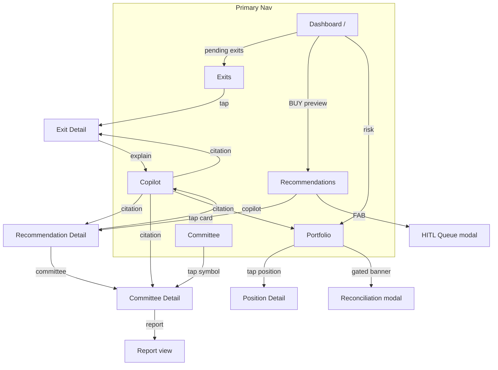

# Pi-PM Frontend — Navigation Architecture

**Track:** D — Frontend Architecture & React Native Web Foundation  
**Version:** 1.0  
**Date:** 2026-06-05

---

## 1. Navigation Stack

| Layer | Technology | Scope |
|-------|------------|-------|
| Router | **Expo Router** (file-based) | Shared route definitions |
| Web layout | Sidebar (desktop) / tabs (mobile web) | `apps/web` |
| Native layout | Bottom tabs | `apps/mobile` |
| Deep links | `pipm://` scheme + web URLs | `packages/navigation` |
| Citation routing | Source table → screen map | `packages/navigation` |

---

## 2. Route Table

| Route | Screen | Priority | Layout group |
|-------|--------|----------|--------------|
| `/` | Dashboard | P1 | all |
| `/recommendations` | Recommendations list | P1 | all |
| `/recommendations/[symbol]` | Recommendation detail | P1 | stack push |
| `/recommendations/queue` | HITL queue | P1 | modal |
| `/portfolio` | Portfolio | P1 | all |
| `/portfolio/positions/[symbol]` | Position detail | P1 | stack push |
| `/exits` | Exit approval queue | P1 | all |
| `/exits/[id]` | Exit detail | P1 | stack push |
| `/copilot` | Copilot (full screen) | P1 | mobile / fallback |
| `/committee` | Committee review | P2 | all |
| `/committee/[symbol]` | Committee detail | P2 | stack push |
| `/analytics` | Performance analytics | P2 | all |
| `/settings` | Settings | P2 | all |
| `/login` | Login (future) | — | auth gate |

---

## 3. Navigation Chrome by Breakpoint

### 3.1 Mobile (<768px) — Bottom tabs

```
┌─────────────────────────────────┐
│         Screen content          │
├─────────────────────────────────┤
│ 🏠  💡  📊  👥  💬              │
│ Home Rec  Port Com  Copilot     │
└─────────────────────────────────┘
```

| Tab | Route | Badge |
|-----|-------|-------|
| Home | `/` | `pending_exits` |
| Ideas | `/recommendations` | `buy_count` |
| Portfolio | `/portfolio` | — |
| Committee | `/committee` | `high_concern_count` (P2) |
| Copilot | `/copilot` | — |

**Note:** Committee tab hidden until P2 — 4 tabs in Phase 2.

### 3.2 Desktop (≥1024px) — Sidebar

```
┌──────────┬──────────────────────────┐
│ Pi-PM    │                          │
│──────────│                          │
│ Dashboard│      Content area        │
│ Recs  (5)│                          │
│ Portfolio│                          │
│ Exits (3)│                          │
│ Committee│                          │
│ Analytics│                          │
│──────────│                          │
│ Copilot ▶│  (opens side panel)      │
│ Settings │                          │
└──────────┴──────────────────────────┘
```

- Sidebar width: 240px (desktop), 200px (tablet collapsed)
- Badges on nav items from React Query cache
- Copilot opens **side panel** — does not navigate away
- Active route highlighted

---

## 4. Navigation Graph



---

## 5. Stack & Modal Hierarchy

```
RootStack
├── Main (tabs or sidebar layout)
│   ├── Dashboard
│   ├── RecommendationsStack
│   │   ├── List
│   │   └── [symbol] Detail
│   ├── PortfolioStack
│   │   ├── Overview
│   │   └── positions/[symbol]
│   ├── ExitsStack
│   ├── CommitteeStack (P2)
│   └── AnalyticsStack (P2)
└── Modals
    ├── HitlQueue
    ├── CopilotPanel (desktop only)
    ├── ReconciliationDetail
    └── AuthLogin (future)
```

### Modal presentation

| Modal | Web desktop | Web mobile | Native |
|-------|-------------|------------|--------|
| HITL Queue | Center modal 600px | Full screen | Full screen |
| Copilot | Side panel 360px | Full screen route | Full screen |
| Reconciliation | Center modal | Bottom sheet | Bottom sheet |

---

## 6. Deep Linking

### 6.1 URL scheme

| Scheme | Example |
|--------|---------|
| Web | `https://app.pipm.io/recommendations/RELIANCE` |
| App | `pipm://recommendations/RELIANCE` |

### 6.2 Route parser (`packages/navigation/src/deepLinks.ts`)

```typescript
export const deepLinkRoutes = {
  dashboard: '/',
  recommendations: '/recommendations',
  recommendationDetail: (symbol: string) => `/recommendations/${symbol}`,
  portfolio: '/portfolio',
  positionDetail: (symbol: string) => `/portfolio/positions/${symbol}`,
  exits: '/exits',
  exitDetail: (id: string) => `/exits/${id}`,
  committee: '/committee',
  committeeDetail: (symbol: string) => `/committee/${symbol}`,
  copilot: (question?: string) =>
    question ? `/copilot?q=${encodeURIComponent(question)}` : '/copilot',
  analytics: '/analytics',
  settings: '/settings',
};
```

### 6.3 Expo Router linking config

```typescript
// apps/web/app.json (sketch)
{
  "expo": {
    "scheme": "pipm",
    "web": { "bundler": "metro" }
  }
}
```

### 6.4 Query param conventions

| Param | Route | Purpose |
|-------|-------|---------|
| `?tab=BUY` | `/recommendations` | Active filter |
| `?q=...` | `/copilot` | Pre-filled question |
| `?section=risk` | `/portfolio` | Active section |
| `?filter=high_concern` | `/committee` | Advisory filter |

---

## 7. Citation Navigation

When user taps a copilot citation, `citationNavigation.ts` resolves:

| `source_table` | Navigate to | Params |
|----------------|-------------|--------|
| `recommendation_results` | `/recommendations/[symbol]` | parse symbol from `source_value` |
| `recommendation_runs` | `/recommendations` | — |
| `investment_review_packets` | `/committee/[symbol]` | symbol |
| `committee_reviews` | `/committee/[symbol]` | symbol |
| `cro_reviews` | `/committee/[symbol]` | symbol, scroll to rationale |
| `portfolio_positions` | `/portfolio/positions/[symbol]` | symbol |
| `portfolio_exit_recommendations` | `/exits/[id]` | id from `source_value` |
| `portfolio_nav_history` | `/portfolio?section=performance` | — |
| `ranking_results` | `/recommendations/[symbol]` | supplementary |

---

## 8. Cross-Screen Transitions

| From | To | Transition | Pass params |
|------|-----|------------|-------------|
| Dashboard | Recommendations | Tab / sidebar | `tab: 'BUY'` |
| Dashboard | Exits | Tab / sidebar | — |
| Recommendation card | Detail | Push / master-detail | `symbol`, `runId` |
| Recommendation detail | Committee | Push | `symbol`, `reviewId` |
| Any screen | Copilot | Panel / push | `prefillQuestion` |
| Exit card | Copilot | Panel | `"Why exit {symbol}?"` |
| Citation tap | Source screen | Push | parsed from citation |
| HITL approve success | Queue → List | Pop modal + invalidate | — |

### Master-detail (desktop)

On `desktop` and `wide` breakpoints, Recommendations and Committee use **inline detail panel** instead of stack push:

```typescript
const { isDesktop } = useBreakpoint();
if (isDesktop) {
  setSelectedSymbol(symbol);  // Zustand UI state
} else {
  router.push(`/recommendations/${symbol}`);
}
```

---

## 9. Auth Gate (Future)

```
RootLayout
└── AuthGate
    ├── if unauthenticated → /login
    └── if authenticated → Main navigator
```

See [AUTHENTICATION_PREPARATION.md](./AUTHENTICATION_PREPARATION.md).

---

## 10. Navigation State (Zustand)

```typescript
interface NavigationUiState {
  selectedRecommendationSymbol: string | null;  // desktop master-detail
  selectedCommitteeSymbol: string | null;
  sidebarCollapsed: boolean;
  copilotPanelOpen: boolean;
}
```

Store: `useNavigationUiStore` in `packages/navigation` or merged into `useUiStore`.

---

## 11. Revision History

| Version | Date | Change |
|---------|------|--------|
| 1.0 | 2026-06-05 | Initial navigation architecture |
