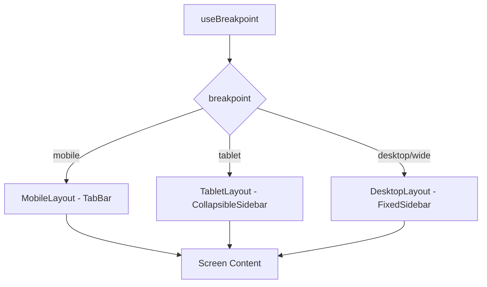

# Pi-PM Frontend — Responsive Layout Guide

**Track:** D — Frontend Architecture & React Native Web Foundation  
**Version:** 1.0  
**Date:** 2026-06-05

Same data, different presentation. Layout shells live in `apps/`; data components in `packages/ui`.

---

## 1. Breakpoints

| Token | Min width | Target device | Navigation |
|-------|-----------|---------------|------------|
| `mobile` | 0 | Phone (portrait) | Bottom tabs |
| `tablet` | 768px | Tablet, phone landscape | Collapsible sidebar |
| `desktop` | 1024px | Laptop | Fixed sidebar |
| `wide` | 1440px | Large monitor | Sidebar + multi-panel |

```typescript
// packages/theme/src/breakpoints.ts
export const breakpoints = {
  mobile: 0,
  tablet: 768,
  desktop: 1024,
  wide: 1440,
} as const;

export function useBreakpoint(): 'mobile' | 'tablet' | 'desktop' | 'wide';
```

---

## 2. Layout Shell Architecture



| Shell | File | Navigation |
|-------|------|------------|
| `MobileLayout` | `apps/web/layouts/MobileLayout.tsx` | Bottom tabs (5) |
| `TabletLayout` | `apps/web/layouts/TabletLayout.tsx` | Hamburger sidebar |
| `DesktopLayout` | `apps/web/layouts/DesktopLayout.tsx` | 240px fixed sidebar |
| `NativeTabLayout` | `apps/mobile/layouts/TabLayout.tsx` | React Navigation tabs |

**Expo Router:** layout groups `(desktop)` and `(mobile)` selected by breakpoint in root `_layout.tsx`.

---

## 3. Screen Layouts

### 3.1 Dashboard

#### Mobile (<768px)

```
┌─────────────────────────┐
│ ⚠ Reconciliation Banner │
├─────────────────────────┤
│ NAV        +1.2%        │
│ ₹ 12,45,000             │
├─────────────────────────┤
│ Alpha    Cash    Risk   │
│ +3.2%   15.2%   MEDIUM  │
├─────────────────────────┤
│ Trust Score    0.78     │
├─────────────────────────┤
│ Pending Exits (3)    →  │
├─────────────────────────┤
│ Today's BUY (5)         │
│ ┌─────────────────────┐ │
│ │ RELIANCE  BUY  HIGH │ │
│ └─────────────────────┘ │
│ ┌─────────────────────┐ │
│ │ INFY      BUY  MED  │ │
│ └─────────────────────┘ │
├─────────────────────────┤
│ Risk Alerts             │
│ • Sector concentration  │
└─────────────────────────┘
```

- Single column, vertical scroll
- Cards for recommendations
- Metrics in 3-column mini-grid

#### Tablet (768–1024px)

```
┌──────┬──────────────────────────────────┐
│ Nav  │  MetricStrip (4 cols)            │
│      ├──────────────────────────────────┤
│ Side │  Trust + Risk  │  Pending Exits  │
│ bar  ├────────────────┴─────────────────┤
│      │  BUY preview (2-col grid)        │
│      ├──────────────────────────────────┤
│      │  Risk Alerts                     │
└──────┴──────────────────────────────────┘
```

- Collapsible 200px sidebar
- 2-column content grid

#### Desktop (>1024px)

```
┌────────┬────────────────────────────────────────────────────┐
│        │ NAV │ Δ% │ Alpha │ Cash │ Positions │ Exits      │
│ Side   ├────────────────────────────────────────────────────┤
│ bar    │ Trust Score │ Risk Level │ Reconciliation         │
│ 240px  ├──────────────────────────┬─────────────────────────┤
│        │  BUY Preview Table       │  Risk Alerts Panel      │
│        │  sym│act│conv│committee  │  • alert 1              │
│        │  REL│BUY│ 82 │ APPROVE   │  • alert 2              │
│        ├──────────────────────────┴─────────────────────────┤
│        │  NAV Sparkline (30d)                               │
└────────┴────────────────────────────────────────────────────┘
```

- Dense `MetricStrip` single row
- Recommendations as table rows (`layout='row'`)
- Side-by-side panels on `wide`

**Data source (all breakpoints):** `useDashboard()` — identical view model.

---

### 3.2 Recommendations

#### Mobile

```
┌─────────────────────────┐
│ [BUY] [WATCH] [EXIT]    │
├─────────────────────────┤
│ ┌─ RecommendationCard ─┐│
│ │ symbol, badges       ││
│ │ reason chips         ││
│ │ committee overlay    ││
│ └──────────────────────┘│
│ ...                     │
│ [FAB: HITL Queue]       │
└─────────────────────────┘
```

- Stacked cards (`layout='card'`)
- FAB for HITL queue
- Tab bar filter

#### Desktop

```
┌────────┬────────────────────────────────────────────────────┐
│        │ [BUY] [WATCH] [EXIT]  Sort▾  HIGH_CONCERN ☐       │
│ Side   ├────────────────────────────────────────────────────┤
│ bar    │ Symbol │Act│Rank│Conv│Band│Reasons│CRO│Concern    │
│        │ REL    │BUY│  3 │ 82 │HIGH│ ...  │APP│           │
│        │ INFY   │BUY│  7 │ 71 │MED │ ...  │WAT│ ⚠         │
│        ├────────────────────────────────────────────────────┤
│        │ Detail panel (selected row) ───────────────────── │
│        │ conviction components │ committee │ narrative      │
└────────┴────────────────────────────────────────────────────┘
```

- Master-detail: table left, detail panel right (no navigation on row select)
- Sortable columns (client sort on API fields)
- HITL queue in sidebar badge + keyboard shortcut

**Data source:** `useRecommendationCards()` — identical joined data.

---

### 3.3 Portfolio

#### Mobile

- Section tabs: Summary | Positions | Performance | Risk
- One section visible at a time
- Positions as cards
- Attribution as vertical bar list

#### Desktop

```
┌────────┬────────────────────────────────────────────────────┐
│        │ PortfolioSummaryCard                                │
│ Side   ├──────────────────────────┬─────────────────────────┤
│ bar    │  Positions Table         │  Performance Metrics    │
│        │  (sortable)              │  CAGR, Sharpe, Alpha    │
│        ├──────────────────────────┴─────────────────────────┤
│        │  NAV Sparkline                                       │
│        ├──────────────────────────┬─────────────────────────┤
│        │  Attribution (tabs)      │  Risk Panel + Alerts    │
└────────┴──────────────────────────┴─────────────────────────┘
```

- All sections visible simultaneously
- 409 gate: performance/attribution panels show `GatedPanel` placeholder

---

### 3.4 Committee (P2)

#### Mobile

- Review header card (status, date)
- Symbol list as cards with `CommitteeAdvisoryCard`
- HIGH_CONCERN filter toggle
- Tap → full-screen narrative

#### Desktop

```
┌────────┬────────────────────────────────────────────────────┐
│        │ Review: completed │ 2026-06-05 │ 20 candidates   │
│ Side   ├──────────────────────────┬─────────────────────────┤
│ bar    │  Symbol list + filters   │  Governance Narrative   │
│        │  ⚠ HIGH_CONCERN (3)     │  (markdown rendered)    │
│        │  committee action grid  │  CRO rationale          │
└────────┴──────────────────────────┴─────────────────────────┘
```

- Master-detail with markdown panel
- `CommitteeActionGrid` shows all 5 committees + CRO

---

### 3.5 Copilot

#### Mobile

- Full-screen chat
- Suggested prompts as horizontal chips
- Citations below each assistant message
- Input fixed at bottom

#### Desktop

```
┌────────────────────────────────────────────┬───────────────┐
│  Main screen content                       │ Copilot Panel │
│  (Dashboard / Rec / etc.)                  │  360px wide   │
│                                            │  suggested    │
│                                            │  messages     │
│                                            │  citations    │
│                                            │  [input]      │
└────────────────────────────────────────────┴───────────────┘
```

- **Side panel** (not modal) — owner can see data + ask questions
- Opened via `useCopilotStore.openPanel()`
- Panel persists across navigation within session
- `Cmd+K` keyboard shortcut (web only)

**Data source:** `useCopilotStore` + `useAskCopilot` — same on all layouts.

---

## 4. Responsive Component Props

| Component | Mobile | Desktop |
|-----------|--------|---------|
| `RecommendationCard` | `layout='card'` | `layout='row'` |
| `RecommendationList` | `layout='card'` | `layout='table'` |
| `PortfolioPositionsTable` | Hidden; use cards | Full table |
| `MetricStrip` | Scroll horizontal | Single row |
| `CopilotChat` | Full screen | Panel width 360px |
| `AttributionBreakdown` | `variant='bar'` | `variant='table'` |
| `CommitteeAdvisoryCard` | `compact={false}` | `compact={true}` in table |

---

## 5. Spacing & Density

| Breakpoint | Base padding | Table row height | Card gap |
|------------|--------------|------------------|----------|
| mobile | 16px | N/A (cards) | 12px |
| tablet | 20px | 40px | 16px |
| desktop | 24px | 36px | 8px (dense) |
| wide | 32px | 36px | 8px |

Terminal aesthetic: **prefer density on desktop**, **breathing room on mobile**.

---

## 6. Touch vs Pointer

| Interaction | Mobile | Desktop |
|-------------|--------|---------|
| Primary action | Tap | Click |
| Row select | Navigate push | Inline detail panel |
| Copilot | Full screen | Side panel |
| HITL approve | Swipe or button | Button + `Enter` |
| Sort | Dropdown | Column header click |
| Hover states | None | Row highlight, tooltip on reason codes |

Platform-specific via `Platform.select` or `useBreakpoint` — not separate components unless necessary.

---

## 7. Revision History

| Version | Date | Change |
|---------|------|--------|
| 1.0 | 2026-06-05 | Initial responsive layout guide |
