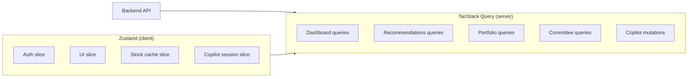

# Pi-PM Frontend — State Management Decision

**Track:** D — Frontend Architecture & React Native Web Foundation  
**Version:** 1.0  
**Date:** 2026-06-05

---

## 1. Decision

| Concern | Choice |
|---------|--------|
| **Server/async state** | **TanStack Query (React Query) v5** |
| **Client/UI state** | **Zustand v5** |
| **Rejected for global state** | Redux Toolkit, React Context |

**Primary answer to "choose one":** **Zustand** for client state, with TanStack Query as the complementary server-state layer (industry-standard split; not a second global store).

---

## 2. Evaluation Matrix

| Criterion | Zustand | Redux Toolkit | React Context |
|-----------|---------|---------------|---------------|
| Boilerplate | Low | High | Medium |
| DevTools | Good | Excellent | Poor |
| Re-render control | Selector-based | Selector-based | Provider re-render issues |
| Async/server state | Needs React Query | RTK Query (overlap) | Manual |
| Learning curve | Low | Medium | Low |
| Bundle size | ~1KB | ~15KB+ | 0 |
| RN Web compatibility | ✅ | ✅ | ✅ |
| Persistence middleware | `zustand/middleware` | redux-persist | Manual |

---

## 3. Rationale

### 3.1 Why Zustand (client state)

Pi-PM client state is **moderate complexity** — auth session, UI preferences, active filters, copilot session ID, stock symbol cache. It does not need Redux's action/reducer ceremony.

```typescript
// Example: recommendation filter state
const useUiStore = create<UiState>((set) => ({
  recommendationTab: 'BUY',
  setRecommendationTab: (tab) => set({ recommendationTab: tab }),
}));
```

- Selective subscriptions prevent dashboard re-renders when copilot input changes
- No provider nesting (Context hell with 6+ domains)
- `persist` middleware for Settings (theme, default strategy)

### 3.2 Why NOT Redux Toolkit

| Reason | Detail |
|--------|--------|
| Over-engineering | Owner app, single user, ~6 state domains |
| RTK Query overlap | Would duplicate TanStack Query patterns |
| Verbosity | Slices + actions for `recommendationTab` is wasteful |
| Migration cost | No existing Redux codebase to justify RTK |

RTK is the right choice for large teams with complex undo/redo or time-travel debugging requirements. Pi-PM MVP does not have these.

### 3.3 Why NOT React Context for global state

| Reason | Detail |
|--------|--------|
| Re-render performance | Portfolio + recommendations on same dashboard → context updates cascade |
| No middleware | Auth token refresh, persistence require custom hooks |
| Testing | Harder to isolate vs Zustand `createStore` |

Context remains appropriate for **theme** (`ThemeProvider`) and **React Query client** — localized provider scope, not app-wide data.

### 3.4 Why TanStack Query for server state

All financial data is **backend-owned** and **fetched**. React Query provides:

- Stale-while-revalidate caching
- Parallel query deduplication (dashboard 3-call pattern)
- Mutation invalidation (approve → refresh queue)
- Retry with backoff
- 409 gate as query error state

**Server state does not belong in Zustand** — avoids sync bugs between cache and store.

---

## 4. State Domain Map



---

## 5. Domain Specifications

### 5.1 Authentication state (Zustand — future-ready)

```typescript
interface AuthState {
  status: 'unknown' | 'authenticated' | 'unauthenticated';
  accessToken: string | null;
  refreshToken: string | null;
  user: UserProfile | null;
  roles: Role[];
  expiresAt: number | null;

  setSession: (session: AuthSession) => void;
  clearSession: () => void;
}
```

| Field | Source | Persist |
|-------|--------|---------|
| `accessToken` | Login response | Secure storage (native) / memory (web MVP) |
| `refreshToken` | Login response | Secure storage |
| `user`, `roles` | JWT claims or `/me` | Memory |
| `status` | Derived | No |

**MVP:** `status: 'authenticated'` hardcoded until backend auth ships. Store shape implemented for drop-in.

Store name: `useAuthStore`

---

### 5.2 Portfolio state

**Server (React Query):**

| Query key | Hook | Endpoint |
|-----------|------|----------|
| `['portfolio', 'dashboard']` | `useDashboard` | `GET /portfolio/dashboard` |
| `['portfolio', 'summary']` | `usePortfolioSummary` | `GET /portfolio/summary` |
| `['portfolio', 'positions']` | `usePositions` | `GET /portfolio/positions` |
| `['portfolio', 'performance']` | `usePerformance` | `GET /portfolio/performance` |
| `['portfolio', 'risk']` | `useRisk` | `GET /portfolio/risk` |
| `['portfolio', 'attribution']` | `useAttribution` | `GET /portfolio/attribution` |
| `['portfolio', 'nav-history', range]` | `useNavHistory` | `GET /portfolio/nav-history` |
| `['portfolio', 'exits']` | `usePendingExits` | `GET /portfolio/exits` |
| `['portfolio', 'reconciliation']` | `useReconciliation` | `GET /portfolio/reconciliation` |

**Client (Zustand):**

```typescript
interface PortfolioUiState {
  performanceRange: { from: string; to: string } | null;
  portfolioSection: 'summary' | 'positions' | 'performance' | 'attribution' | 'risk';
  setPerformanceRange: (range) => void;
  setPortfolioSection: (section) => void;
}
```

Store name: `usePortfolioUiStore`

**No portfolio financial data in Zustand.**

---

### 5.3 Recommendation state

**Server (React Query):**

| Query key | Hook | Endpoint |
|-----------|------|----------|
| `['recommendations', 'daily', date, action]` | `useDailyRecommendations` | `GET /recommendations/daily` |
| `['recommendations', 'run', runId, action]` | `useRunResults` | `GET /recommendations/{run_id}` |
| `['recommendations', 'detail', runId, symbol]` | `useRecommendationDetail` | `GET /.../stocks/{symbol}` |
| `['recommendations', 'queue']` | `useHitlQueue` | `GET /recommendations/queue` |
| `['recommendations', 'why-not', symbol]` | `useWhyNot` | `GET /recommendations/why-not/{symbol}` |

**Mutations:**

| Mutation | Invalidates |
|----------|-------------|
| `useApproveRecommendation` | `queue`, `daily` |
| `useRejectRecommendation` | `queue`, `daily` |

**Client (Zustand):**

```typescript
interface RecommendationUiState {
  activeTab: 'BUY' | 'WATCH' | 'EXIT_APPROVED';
  asOfDate: string;
  strategyName: string;
  sortBy: 'conviction' | 'rank' | 'symbol';
  highConcernFirst: boolean;
  setActiveTab: (tab) => void;
  // ...
}
```

Store name: `useRecommendationUiStore`

**Client join hook:** `useRecommendationCards()` — React Query `useQueries` for daily + committee packets; mapper merges on symbol.

---

### 5.4 Committee state

**Server (React Query):**

| Query key | Hook | Endpoint |
|-----------|------|----------|
| `['committee', 'latest']` | `useLatestCommitteeReview` | `GET /investment-committee/latest` |
| `['committee', 'review', id]` | `useCommitteeReview` | `GET /investment-committee/{id}` |
| `['committee', 'packets', id]` | `useCommitteePackets` | `GET /.../packets` |
| `['committee', 'report', id]` | `useCommitteeReport` | `GET /.../report` |
| `['committee', 'members']` | `useCommitteeMembers` | `GET /committees/members` |

**Polling:** `refetchInterval: 30_000` when `status !== 'completed'`.

**Client (Zustand):**

```typescript
interface CommitteeUiState {
  filter: 'all' | 'high_concern';
  selectedSymbol: string | null;
  setFilter: (filter) => void;
}
```

Store name: `useCommitteeUiStore`

---

### 5.5 Copilot state

**Server (React Query):**

| Query key | Hook | Endpoint |
|-----------|------|----------|
| `['copilot', 'audit', limit]` | `useCopilotAudit` | `GET /copilot/audit` |

**Mutations:**

| Mutation | Endpoint |
|----------|----------|
| `useAskCopilot` | `POST /copilot/ask` |

**Client (Zustand):**

```typescript
interface CopilotState {
  sessionId: string | null;
  messages: CopilotMessage[];       // optimistic UI append
  isPanelOpen: boolean;             // desktop side panel
  prefillQuestion: string | null;
  sourceScreen: string | null;      // for suggested prompts

  openPanel: (opts?: { prefill?: string; source?: string }) => void;
  closePanel: () => void;
  appendMessage: (msg: CopilotMessage) => void;
  resetSession: () => void;
}
```

Store name: `useCopilotStore`

**Flow:** User sends message → append user msg to Zustand → mutate `useAskCopilot` → append assistant response with citations.

---

### 5.6 Analytics state (P2)

**Server only (React Query):**

| Hook | Endpoint |
|------|----------|
| `useTrustMetrics` | `GET /analytics/recommendations/trust` |
| `useRecommendationAnalyticsSummary` | `GET /analytics/recommendations/summary` |
| `useCommitteeAnalytics` | `GET /analytics/recommendations/committee` |

Merged into dashboard via `useDashboard` composite hook.

---

### 5.7 Stock symbol cache (Zustand)

```typescript
interface StockCacheState {
  byId: Record<string, { symbol: string; name?: string; sector?: string }>;
  setStock: (id: string, stock: StockInfo) => void;
  setBatch: (stocks: StockInfo[]) => void;
}
```

Store name: `useStockCacheStore`

Populated by `useStockSymbol` hook after recommendation fetch.

---

## 6. Provider Setup

```typescript
// apps/web/app/_layout.tsx (sketch)
<QueryClientProvider client={queryClient}>
  <ThemeProvider>
    <AuthGate>           {/* reads useAuthStore */}
      <Slot />           {/* expo-router */}
    </AuthGate>
  </ThemeProvider>
</QueryClientProvider>
```

**QueryClient defaults:**

```typescript
const queryClient = new QueryClient({
  defaultOptions: {
    queries: {
      staleTime: 5 * 60 * 1000,      // 5 min
      gcTime: 30 * 60 * 1000,
      retry: (count, error) => error.status >= 500 && count < 3,
      refetchOnWindowFocus: true,
    },
  },
});
```

---

## 7. Revision History

| Version | Date | Change |
|---------|------|--------|
| 1.0 | 2026-06-05 | Zustand + TanStack Query decision |
