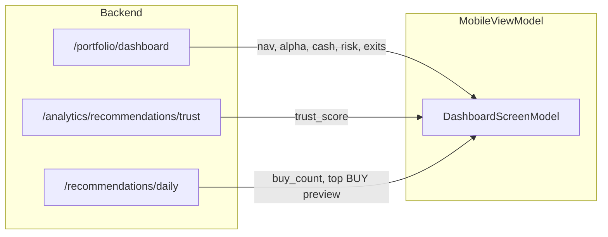

# Pi-PM Mobile — API Mapping

**Track:** B — Mobile Readiness & API Productization  
**Version:** 1.0  
**Date:** 2026-06-05  
**Base URL:** `/api/v1`

This document maps every Mobile MVP screen and UI component to backend APIs. **No backend logic modifications** — client aggregation patterns documented where a single endpoint does not exist.

---

## 1. API Domain Overview

| Domain | Router prefix | Mobile relevance |
|--------|---------------|------------------|
| Recommendations | `/recommendations` | Primary — daily actions |
| Portfolio | `/portfolio` | Primary — positions, dashboard |
| Investment Committee | `/investment-committee` | Primary — advisory overlay |
| Analytics (Recommendations) | `/analytics/recommendations` | Dashboard trust score |
| Copilot | `/copilot` | Q&A layer |
| Stocks | `/stocks` | Symbol enrichment (client join) |
| Observability | `/observability` | Regime badge (supplementary) |

**Excluded from mobile MVP:** `/rankings`, `/validation`, `/factor-analytics`, `/exit-analytics`, `/research-intelligence`, `/backtest`, `/daily-batch` (ops only).

---

## 2. Screen → API Matrix

### 2.1 Dashboard (Home)

| UI Component | Primary API | Fallback / Join | Response fields |
|--------------|-------------|-----------------|-----------------|
| NAV | `GET /portfolio/dashboard` | `GET /portfolio/nav-history` (last row) | `nav` |
| Today change % | `GET /portfolio/dashboard` | `nav-history[-1].day_return_pct` | `today_change_pct` |
| Alpha | `GET /portfolio/dashboard` | `GET /portfolio/benchmark` | `alpha_pct` |
| Cash % | `GET /portfolio/dashboard` | `GET /portfolio/summary` | `cash_pct` |
| Risk level | `GET /portfolio/dashboard` | `GET /portfolio/risk` | `risk_level` |
| Risk alerts (top 3) | `GET /portfolio/dashboard` | `GET /portfolio/risk` | `risk_alerts[]` |
| Trust Score | `GET /analytics/recommendations/trust` | — | `overall_trust_score` |
| Pending exits badge | `GET /portfolio/dashboard` | `GET /portfolio/exits` (count) | `pending_exits` |
| Active positions count | `GET /portfolio/dashboard` | `GET /portfolio/summary` | `active_positions` |
| Reconciliation badge | `GET /portfolio/dashboard` | `GET /portfolio/reconciliation` | `reconciliation_status` |
| Regime posture (optional) | `GET /observability/regime/current` | `summary.regime_posture` | `regime_label` |

**MVP load pattern (3 calls):**

```
Parallel:
  1. GET /portfolio/dashboard
  2. GET /analytics/recommendations/trust
  3. GET /recommendations/daily?as_of_date={today}&action=BUY  (preview strip)
```

---

### 2.2 Recommendations List

| UI Component | Primary API | Query params | Notes |
|--------------|-------------|--------------|-------|
| BUY tab | `GET /recommendations/daily` | `as_of_date`, `action=BUY` | Per-strategy grouping |
| WATCH tab | `GET /recommendations/daily` | `action=WATCH` | |
| EXIT tab | `GET /recommendations/{run_id}` | `action=EXIT_APPROVED` | Not in daily filter enum; use run results |
| Count badges | `GET /recommendations/daily` | — | `buy_count`, `watch_count` |
| Conviction | Same response | — | `conviction_score`, `conviction_band` |
| Rationale chips | Same response | — | `reason_codes[]` |
| Committee advisory | `GET /investment-committee/latest` + `GET /{id}/packets` | `symbol` filter | Client join on `symbol` |
| Symbol display | `GET /stocks/{symbol}` | — | **Gap:** results have `stock_id` only |

**EXIT_APPROVED load pattern:**

```
1. GET /recommendations/latest?strategy_name={default}
2. GET /recommendations/{run_id}?action=EXIT_APPROVED
3. GET /investment-committee/latest → packets for advisory join
```

---

### 2.3 Recommendation Detail

| UI Section | API | Path / params |
|------------|-----|---------------|
| Header (action, conviction) | `GET /recommendations/{run_id}/stocks/{symbol}` | — |
| Conviction breakdown | Same | `conviction_components` |
| Reason codes | Same | `reason_codes` |
| Why-not (if WATCH/REJECT) | `GET /recommendations/why-not/{symbol}` | `strategy_name` |
| Committee advisory | `GET /investment-committee/{review_id}/packets?symbol={symbol}` | `payload.committee_advisory` |
| Machine recommendation block | Same packet | `payload.recommendation` |
| Governance narrative | `GET /investment-committee/{review_id}/report` | Filter `reports[]` by symbol |
| Symbol analytics (optional) | `GET /analytics/recommendations/symbol/{symbol}` | Historical context |
| Copilot shortcut | `POST /copilot/ask` | Pre-fill: "Why is {symbol} a {action}?" |

---

### 2.4 HITL Approval Queue

| UI Component | API | Method |
|--------------|-----|--------|
| Queue list | `GET /recommendations/queue` | GET |
| Approve | `POST /recommendations/{result_id}/approve` | POST |
| Reject | `POST /recommendations/{result_id}/reject` | POST |

**Payload (approve):** `{ approval_type, decision, actor_id, note, idempotency_key }`

---

### 2.5 Portfolio — Overview

| UI Component | API | Fields |
|--------------|-----|--------|
| Summary card | `GET /portfolio/summary` | `total_equity`, `cash_available`, `unrealized_pnl`, `regime_posture` |
| Limits / slots | `GET /portfolio/limits` | `slots_available`, `can_add_position`, `block_reason` |
| NAV chart | `GET /portfolio/nav-history` | `as_of_date`, `total_equity`, `day_return_pct`, `alpha_pct` |
| Performance | `GET /portfolio/performance` | `total_return_pct`, `cagr_pct`, `alpha_pct`, `sharpe_ratio`, `max_drawdown_pct` |
| Benchmark compare | `GET /portfolio/benchmark` | `alpha_pct`, `outperformance_pct` |
| Reconciliation | `GET /portfolio/reconciliation` | `status`, `discrepancy_pct` |

**Gate:** Performance, risk, attribution, benchmark return **409** when reconciliation FAIL.

---

### 2.6 Portfolio — Positions

| UI Component | API | Fields |
|--------------|-----|--------|
| Position list | `GET /portfolio/positions` | `symbol`, `quantity`, `avg_cost`, `market_value`, `unrealized_pnl`, `weight_pct`, `conviction_band`, `sector` |
| Position detail | Same row + `GET /analytics/recommendations/symbol/{symbol}` | Enrichment |
| Allocation preview | `GET /portfolio/allocation` | Requires `conviction_band`, `last_price` query params |

---

### 2.7 Portfolio — Attribution & Risk

| UI Component | API | Fields |
|--------------|-----|--------|
| By strategy | `GET /portfolio/attribution` | `by_strategy[]` |
| By conviction | Same | `by_conviction_band[]` |
| By sector | Same | `by_sector[]` |
| By committee advisory | Same | `by_committee_advisory[]` |
| Total alpha | Same | `total_alpha_pct` |
| Risk metrics | `GET /portfolio/risk` | `gross_exposure_pct`, `sector_exposures`, `alerts[]`, `risk_level` |

**AttributionBucket fields:** `label`, `count`, `total_return_pct`, `avg_alpha_pct`, `win_rate`, `contribution_pct`

---

### 2.8 Pending Exits

| UI Component | API | Method |
|--------------|-----|--------|
| Exit list | `GET /portfolio/exits` | GET |
| Confirm exit | `POST /portfolio/exits/{exit_id}/confirm` | POST |
| Reject exit | `POST /portfolio/exits/{exit_id}/reject` | POST |
| Explain | `POST /copilot/ask` | Intent `explain_exit` |

**Exit row fields:** `symbol`, `status`, `urgency`, `triggers[]`, `days_held`, `unrealized_pnl_pct`, `current_rank`

**Note:** `portfolio_exit_recommendations` (pending human confirm) ≠ `EXIT_APPROVED` on `recommendation_results`. Mobile must treat these as separate concepts.

---

### 2.9 Committee Screen

| UI Component | API | Fields |
|--------------|-----|--------|
| Latest review header | `GET /investment-committee/latest` | `run_id`, `status`, `as_of_date`, `candidates_reviewed` |
| Review detail | `GET /investment-committee/{review_id}` | `governance_reports[]` summary |
| Symbol packets | `GET /investment-committee/{review_id}/packets` | `symbol`, `payload` |
| HIGH_CONCERN filter | Client filter on packets | `payload.committee_advisory.high_concern` |
| Committee actions | Same | `committee_advisory.committee_actions` |
| CRO advisory | Same | `committee_advisory.cro_advisory_action` |
| Full report | `GET /investment-committee/{review_id}/report` | `reports[].narrative` (markdown) |
| Explainability | `GET /investment-committee/{review_id}/explain` | `cro_reviews[].rationale` |
| Committee roster | `GET /investment-committee/committees/members` | `committees[]`, `advisory_actions[]` |

**Poll pattern (run in progress):**

```
Every 30s: GET /investment-committee/{review_id}
Until status == "completed" || "failed"
```

---

### 2.10 Copilot Screen

| UI Component | API | Fields |
|--------------|-----|--------|
| Ask input | `POST /copilot/ask` | `{ question, session_id? }` |
| Answer | Response | `answer`, `citations[]`, `intent`, `refused` |
| Citation chips | Response | `CitationRead: ref, source_table, source_field, source_value` |
| Uncited claims warning | Response | `uncited_claims[]` |
| History (MVP limited) | `GET /copilot/audit` | `limit=20` — owner audit, not true session history |

**Mobile-relevant intents:**

| Intent | Mobile use |
|--------|------------|
| `why_recommended` | Recommendation detail |
| `why_not_recommended` | WATCH/REJECT explanation |
| `explain_conviction` | Conviction breakdown |
| `explain_exit` | Pending exit / EXIT_APPROVED |
| `explain_committee` | Committee advisory |
| `explain_portfolio` | Portfolio overview |
| `explain_risk` | Risk screen |
| `explain_performance` | Performance screen |
| `explain_rank` | Supplementary |
| `explain_validation` | Supplementary |
| `refused` | Governance block |

---

### 2.11 Analytics (Dashboard supplement)

| UI Component | API | Fields |
|--------------|-----|--------|
| Trust score | `GET /analytics/recommendations/trust` | `overall_trust_score`, `calibration`, `stability`, `reliability` |
| Rec quality summary | `GET /analytics/recommendations/summary` | `quality.win_rate`, `quality.avg_alpha_pct` |
| Top conviction buys | Same | `top_conviction_buys[]` |
| Exit candidates | Same | `exit_candidates[]` |
| Committee effectiveness | `GET /analytics/recommendations/committee` | `advisories[]` |

---

## 3. Aggregation Model — Mobile Dashboard

The backend provides a partial aggregate at `GET /portfolio/dashboard`. Mobile MVP composes the full dashboard as follows:



### Target unified model (`DashboardScreenModel`)

| Field | Source today | Target source |
|-------|--------------|---------------|
| `nav` | `/portfolio/dashboard` | Same |
| `today_change_pct` | `/portfolio/dashboard` | Same |
| `alpha_pct` | `/portfolio/dashboard` | Same |
| `cash_pct` | `/portfolio/dashboard` | Same |
| `risk_level` | `/portfolio/dashboard` | Same |
| `risk_alerts` | `/portfolio/dashboard` | Same |
| `pending_exits` | `/portfolio/dashboard` | Same |
| `active_positions` | `/portfolio/dashboard` | Same |
| `reconciliation_status` | `/portfolio/dashboard` | Same |
| `trust_score` | `/analytics/recommendations/trust` | **Future:** `/portfolio/dashboard` |
| `top_contributors` | Not returned | **Gap** — see DTO_GAP_ANALYSIS |
| `worst_contributors` | Not returned | **Gap** |
| `buy_count` | `/recommendations/daily` | Optional merge |
| `regime_posture` | `/portfolio/summary` or observability | Optional merge |

Reference DTO (defined, not fully wired): `PortfolioDashboardDTO` in `app/portfolio/dtos.py`.

---

## 4. Cross-Domain Join — Recommendation + Committee

No single endpoint returns recommendation + committee advisory. Mobile **must join client-side**:

```
1. review = GET /investment-committee/latest
2. packets = GET /investment-committee/{review.run_id}/packets
3. recs = GET /recommendations/daily?as_of_date={review.as_of_date}

Join key: symbol
  - packets[].symbol
  - recs: resolve stock_id → symbol via GET /stocks lookup or batch

Merged card fields:
  - action, conviction_score, conviction_band, reason_codes  (from rec)
  - cro_advisory_action, high_concern, committee_actions      (from packet.committee_advisory)
```

**Proposed future endpoint:** `GET /recommendations/mobile/daily` — see DTO_GAP_ANALYSIS.

---

## 5. HTTP Status Handling

| Status | Endpoint context | Mobile action |
|--------|------------------|---------------|
| 200 | Success | Render |
| 404 | No run/review | Empty state |
| 409 | Portfolio analytics gate | Show reconciliation warning; hide gated sections |
| 422 | Invalid request | Form validation |
| 503 | Health | Maintenance banner |

---

## 6. Endpoint Inventory (Mobile MVP subset)

### Recommendations (8 read + 2 write)

| Method | Path | Screen |
|--------|------|--------|
| GET | `/recommendations/daily` | Recommendations, Dashboard preview |
| GET | `/recommendations/latest` | EXIT tab bootstrap |
| GET | `/recommendations/{run_id}` | EXIT filter |
| GET | `/recommendations/{run_id}/stocks/{symbol}` | Detail |
| GET | `/recommendations/why-not/{symbol}` | Detail |
| GET | `/recommendations/queue` | HITL |
| POST | `/recommendations/{result_id}/approve` | HITL |
| POST | `/recommendations/{result_id}/reject` | HITL |

### Portfolio (12 read + 2 write for MVP)

| Method | Path | Screen |
|--------|------|--------|
| GET | `/portfolio/dashboard` | Dashboard |
| GET | `/portfolio/summary` | Portfolio |
| GET | `/portfolio/positions` | Portfolio |
| GET | `/portfolio/limits` | Portfolio |
| GET | `/portfolio/performance` | Portfolio |
| GET | `/portfolio/risk` | Portfolio, Dashboard |
| GET | `/portfolio/attribution` | Portfolio |
| GET | `/portfolio/benchmark` | Portfolio |
| GET | `/portfolio/nav-history` | Portfolio chart |
| GET | `/portfolio/reconciliation` | Portfolio, Dashboard |
| GET | `/portfolio/exits` | Exits, Dashboard |
| POST | `/portfolio/exits/{id}/confirm` | Exits |
| POST | `/portfolio/exits/{id}/reject` | Exits |

### Investment Committee (6)

| Method | Path | Screen |
|--------|------|--------|
| GET | `/investment-committee/latest` | Committee, Rec join |
| GET | `/investment-committee/{id}` | Committee |
| GET | `/investment-committee/{id}/packets` | Committee, Rec join |
| GET | `/investment-committee/{id}/report` | Committee detail |
| GET | `/investment-committee/{id}/explain` | Committee detail |
| GET | `/investment-committee/committees/members` | Committee |

### Analytics (4)

| Method | Path | Screen |
|--------|------|--------|
| GET | `/analytics/recommendations/trust` | Dashboard |
| GET | `/analytics/recommendations/summary` | Dashboard supplement |
| GET | `/analytics/recommendations/symbol/{symbol}` | Rec/Portfolio detail |
| GET | `/analytics/recommendations/committee` | Committee analytics |

### Copilot (2)

| Method | Path | Screen |
|--------|------|--------|
| POST | `/copilot/ask` | Copilot |
| GET | `/copilot/audit` | Copilot history (limited) |

### Supporting (2)

| Method | Path | Screen |
|--------|------|--------|
| GET | `/stocks/{symbol}` | Symbol enrichment |
| GET | `/observability/regime/current` | Regime badge |

**Total MVP endpoints: 34** (read-heavy; 4 write actions for HITL + exits)

---

## 7. Revision History

| Version | Date | Change |
|---------|------|--------|
| 1.0 | 2026-06-05 | Initial API mapping for Track B |
