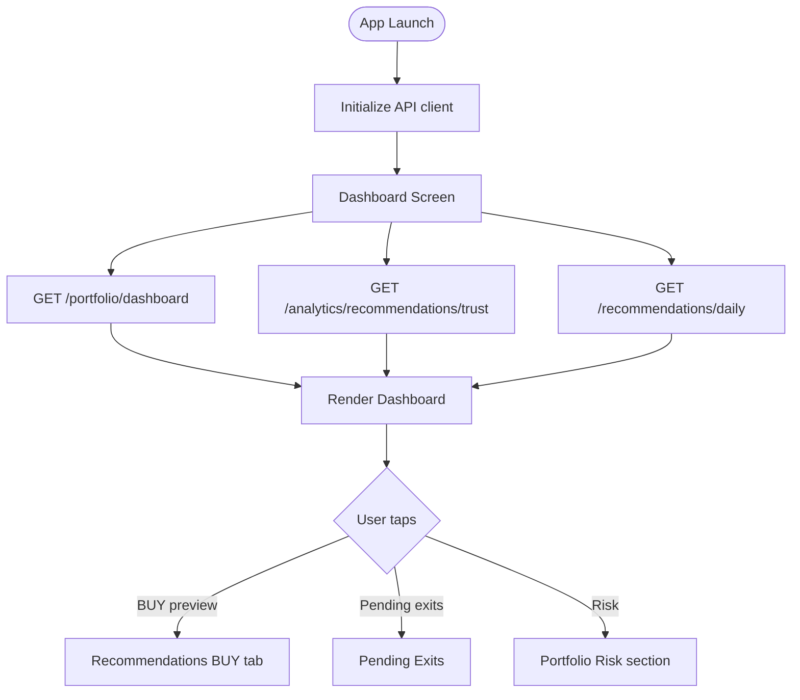
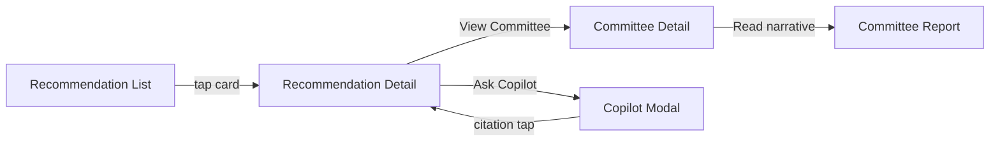
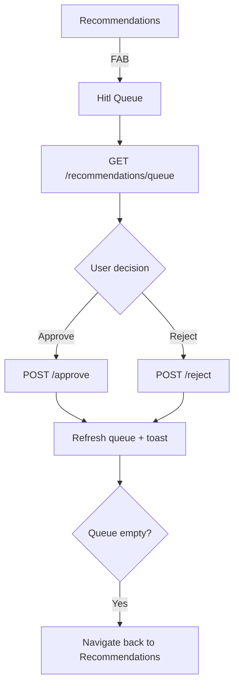
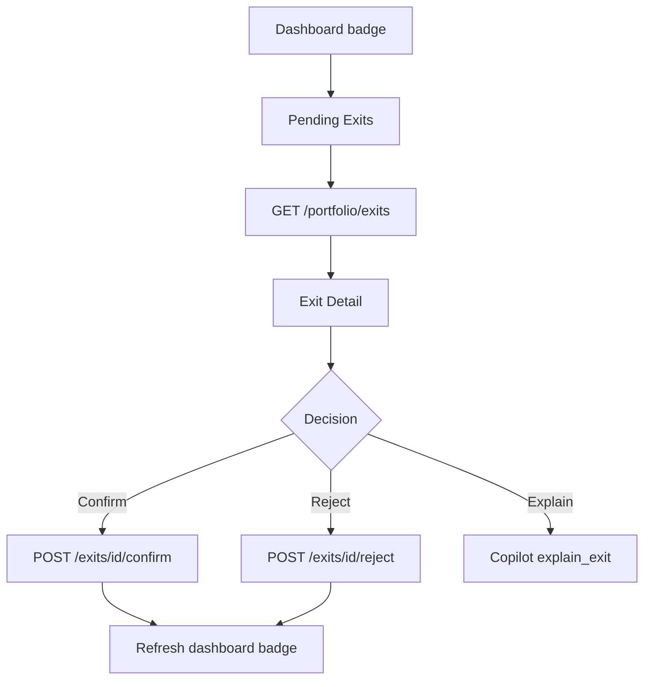
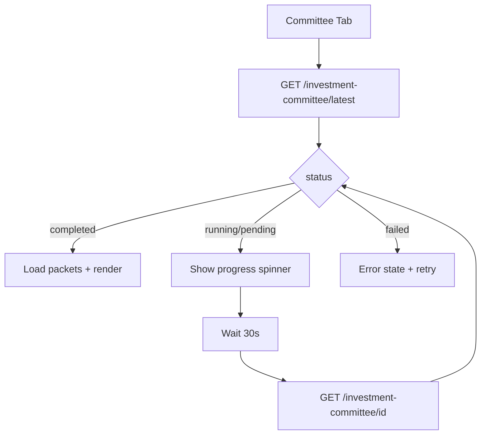

# Pi-PM Mobile — Navigation Flow

**Track:** B — Mobile Readiness & API Productization  
**Version:** 1.0  
**Date:** 2026-06-05

Navigation architecture, tab structure, deep links, and cross-screen flows for the React Native MVP.

---

## 1. Navigation Architecture

### 1.1 Pattern

**Bottom tab navigator** (5 tabs) + **stack navigators** per tab for drill-down.

```
RootNavigator
├── TabNavigator
│   ├── HomeStack        (Dashboard)
│   ├── RecommendationsStack
│   ├── PortfolioStack
│   ├── CommitteeStack
│   └── CopilotStack
└── ModalNavigator
    ├── HitlQueueModal
    ├── CopilotAskModal (contextual)
    └── ReconciliationDetailModal
```

### 1.2 Tab Bar

| Tab | Icon | Root screen | Badge source |
|-----|------|-------------|--------------|
| Home | house | Dashboard | `pending_exits` |
| Ideas | lightbulb | Recommendations (BUY) | `buy_count` |
| Portfolio | pie-chart | Portfolio summary | — |
| Committee | users | Committee review | `high_concern_count` |
| Copilot | message | Copilot chat | — |

---

## 2. Route Map

### 2.1 Home Stack

| Route name | Path | Params |
|------------|------|--------|
| `Dashboard` | `/` | — |
| `PendingExits` | `/exits` | — |
| `ExitDetail` | `/exits/:exitId` | `exitId` |

### 2.2 Recommendations Stack

| Route name | Path | Params |
|------------|------|--------|
| `RecommendationList` | `/recommendations` | `tab?: BUY\|WATCH\|EXIT` |
| `RecommendationDetail` | `/recommendations/:symbol` | `symbol`, `runId?`, `strategyName?` |
| `HitlQueue` | `/recommendations/queue` | — |

### 2.3 Portfolio Stack

| Route name | Path | Params |
|------------|------|--------|
| `PortfolioOverview` | `/portfolio` | `section?: summary\|positions\|performance\|attribution\|risk` |
| `PositionDetail` | `/portfolio/positions/:symbol` | `symbol`, `positionId?` |

### 2.4 Committee Stack

| Route name | Path | Params |
|------------|------|--------|
| `CommitteeReview` | `/committee` | — |
| `CommitteeSymbolList` | `/committee/symbols` | `filter?: all\|high_concern` |
| `CommitteeDetail` | `/committee/:symbol` | `symbol`, `reviewId?` |
| `CommitteeReport` | `/committee/:symbol/report` | `symbol`, `reviewId` |

### 2.5 Copilot Stack

| Route name | Path | Params |
|------------|------|--------|
| `CopilotChat` | `/copilot` | — |
| `CopilotHistory` | `/copilot/history` | — |

---

## 3. Primary User Flows

### 3.1 App Launch → Morning Review



### 3.2 Recommendation → Committee → Copilot



### 3.3 HITL Approval Flow



### 3.4 Exit Confirmation Flow



### 3.5 Committee Poll Flow (async review)



---

## 4. Cross-Tab Deep Links

Citation and notification targets (future push) use this routing table:

| Deep link | Route | Required params |
|-----------|-------|-----------------|
| `pipm://dashboard` | `Dashboard` | — |
| `pipm://recommendations` | `RecommendationList` | `tab` |
| `pipm://recommendations/{symbol}` | `RecommendationDetail` | `symbol` |
| `pipm://portfolio` | `PortfolioOverview` | — |
| `pipm://portfolio/positions/{symbol}` | `PositionDetail` | `symbol` |
| `pipm://exits` | `PendingExits` | — |
| `pipm://exits/{id}` | `ExitDetail` | `exitId` |
| `pipm://committee` | `CommitteeReview` | — |
| `pipm://committee/{symbol}` | `CommitteeDetail` | `symbol`, `reviewId` |
| `pipm://copilot?q={encoded}` | `CopilotChat` | pre-filled question |

### Copilot Citation → Screen routing

| `source_table` in citation | Navigate to |
|----------------------------|-------------|
| `recommendation_results` | `RecommendationDetail` (resolve symbol from `source_value`) |
| `recommendation_runs` | `RecommendationList` |
| `investment_review_packets` | `CommitteeDetail` |
| `committee_reviews` | `CommitteeDetail` |
| `cro_reviews` | `CommitteeReport` |
| `portfolio_positions` | `PositionDetail` |
| `portfolio_exit_recommendations` | `ExitDetail` |
| `portfolio_nav_history` | `PortfolioOverview` section=performance |
| `ranking_results` | `RecommendationDetail` (supplementary) |

---

## 5. Screen Transition Data Passing

Minimize re-fetch by passing IDs on navigation:

| From | To | Pass params |
|------|-----|-------------|
| Dashboard BUY preview | RecommendationDetail | `symbol`, `runId`, `strategyName` |
| RecommendationList | RecommendationDetail | `symbol`, `resultId`, `runId` |
| RecommendationDetail | CommitteeDetail | `symbol`, `reviewId` |
| RecommendationDetail | CopilotModal | `prefillQuestion` |
| CommitteeSymbolList | CommitteeDetail | `symbol`, `reviewId`, `packetId` |
| Portfolio positions | PositionDetail | `symbol`, `positionId` |
| PendingExits | ExitDetail | `exitId` |
| Any screen | Copilot | `prefillQuestion`, `sessionId` |

---

## 6. Back Stack Behavior

| Screen | Back action |
|--------|-------------|
| RecommendationDetail | → RecommendationList (preserve tab) |
| CommitteeDetail | → CommitteeSymbolList |
| CommitteeReport | → CommitteeDetail |
| HitlQueue | → RecommendationList (modal dismiss) |
| CopilotModal | Dismiss modal; preserve underlying screen |
| ExitDetail | → PendingExits |

---

## 7. State Management Recommendations

### 7.1 Global store (Zustand / Redux)

| Slice | Contents | Refresh trigger |
|-------|----------|-----------------|
| `dashboard` | `DashboardScreenModel` | App foreground, pull-to-refresh |
| `recommendations` | keyed by `as_of_date` + `tab` | Tab switch, pull-to-refresh |
| `committee` | `reviewId`, packets cache | Poll while running |
| `portfolio` | summary, positions | Tab focus |
| `copilot` | messages[], `sessionId` | On send |
| `settings` | `apiBaseUrl`, `defaultStrategy` | User prefs (local only) |

### 7.2 Cache TTL (MVP polling)

| Data | TTL | Stale action |
|------|-----|--------------|
| Dashboard | 5 min | Background refresh on tab focus |
| Recommendations daily | 15 min | Pull-to-refresh |
| Committee (completed) | 24h | Manual refresh |
| Committee (running) | 30s poll | Auto |
| Portfolio positions | 5 min | Tab focus |
| Copilot audit | On demand | — |

---

## 8. Error Navigation

| Error | Screen behavior |
|-------|-----------------|
| 404 no recommendation run | Recommendations → empty state with date picker |
| 404 no committee review | Committee → "No review yet" + link to ops docs |
| 409 analytics gated | Portfolio → show reconciliation banner; link to `ReconciliationDetailModal` |
| Copilot refused | Stay on Copilot; show refuse message inline |
| Network error | Global toast + retry button per screen |

---

## 9. ASCII Navigation Map

```
                    ┌─────────────┐
                    │  Dashboard  │◄────────────────┐
                    └──────┬──────┘                 │
           ┌───────────────┼───────────────┐        │
           ▼               ▼               ▼        │
    ┌────────────┐  ┌────────────┐  ┌──────────┐   │
    │   Exits    │  │    Recs    │  │ Portfolio│   │
    └─────┬──────┘  └─────┬──────┘  └────┬─────┘   │
          │               │               │        │
          ▼               ▼               ▼        │
    ┌────────────┐  ┌────────────┐  ┌──────────┐   │
    │Exit Detail │  │ Rec Detail │  │ Position │   │
    └────────────┘  └─────┬──────┘  └──────────┘   │
                          │                        │
              ┌───────────┼───────────┐            │
              ▼           ▼           ▼            │
       ┌──────────┐ ┌──────────┐ ┌─────────┐      │
       │ Committee│ │ Copilot  │ │  HITL   │      │
       │  Detail  │ │  (modal) │ │  Queue  │      │
       └──────────┘ └──────────┘ └─────────┘      │
              │                                     │
              ▼                                     │
       ┌──────────┐                                │
       │  Report  │────────────────────────────────┘
       └──────────┘         (citation deep link)
```

---

## 10. MVP vs Post-MVP Navigation

| Feature | MVP | Post-MVP |
|---------|-----|----------|
| 5-tab bottom nav | ✅ | — |
| Deep links | ✅ URL scheme | Universal links |
| Push → screen | ❌ | Notification routing |
| Auth gate / login stack | ❌ | Login → TabNavigator |
| Onboarding | ❌ | Strategy/universe picker |
| Search (global symbol) | ❌ | Search tab |

---

## 11. Revision History

| Version | Date | Change |
|---------|------|--------|
| 1.0 | 2026-06-05 | Initial navigation flow |
