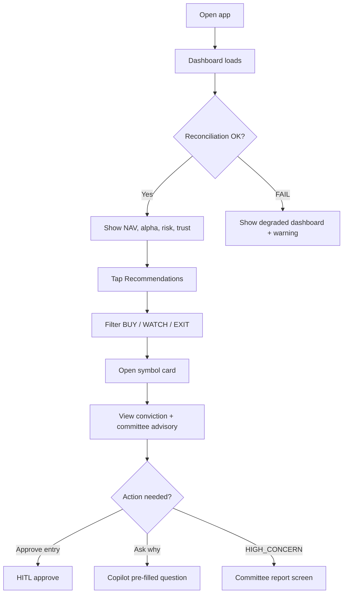
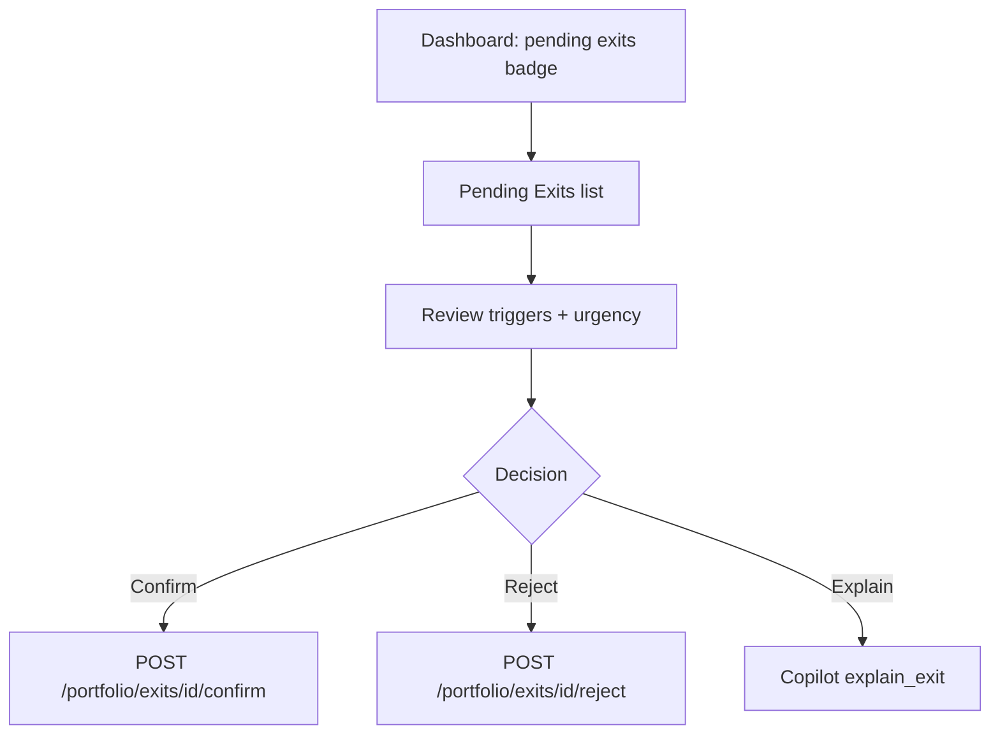
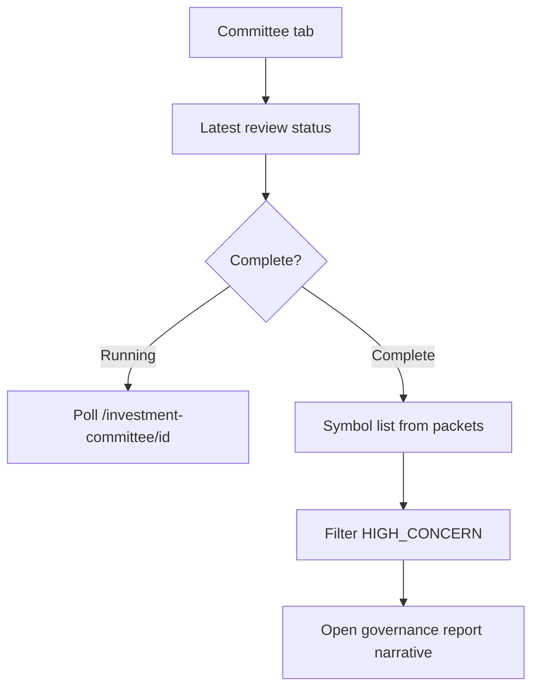
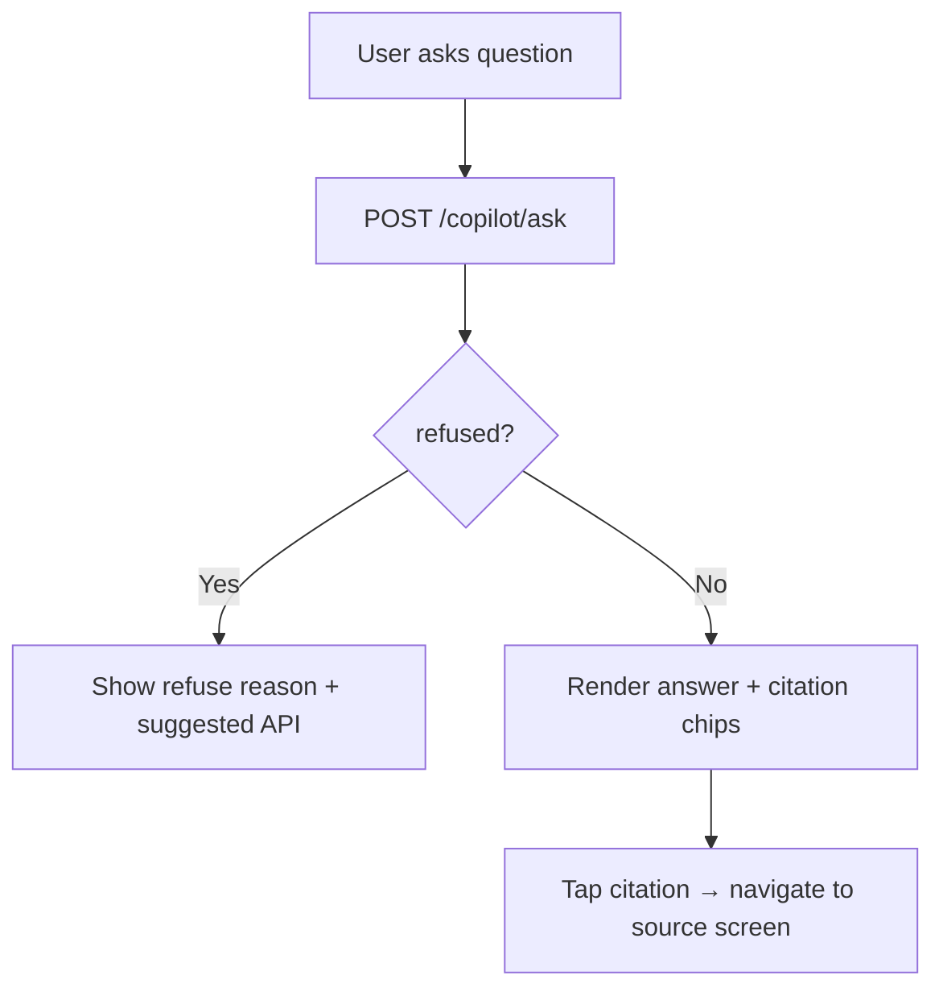

# Pi-PM Mobile — Product Requirements Document

**Track:** B — Mobile Readiness & API Productization  
**Version:** 1.0  
**Date:** 2026-06-05  
**Author:** Product Architect  
**Constraint:** Backend API contracts only — **no mobile client code** in this track.

---

## 1. Executive Summary

Pi-PM is a deterministic investment operations platform with rich backend APIs across recommendations, portfolio, investment committee (ARGS), analytics, and copilot. This PRD defines the **Mobile MVP** for a React Native owner app that surfaces daily decision support: what to buy/watch/exit, portfolio health, committee advisory, and grounded Q&A.

The backend is **API-ready at ~65%** for mobile consumption. Core read paths exist; gaps are concentrated in **mobile-optimized DTOs**, **cross-domain aggregation**, **symbol enrichment**, and **authentication**. No changes to ranking, validation, recommendation, or portfolio calculation logic are in scope.

---

## 2. Problem Statement

The owner currently reviews Pi-PM via CLI, API clients, and documentation. Daily workflows — checking NAV, reviewing BUY/WATCH lists, reading committee HIGH_CONCERN flags, confirming pending exits, and asking "why this conviction?" — require multiple disconnected API calls and heavy JSON payloads unsuitable for mobile screens.

A mobile app must deliver **one-glance portfolio health** and **actionable recommendation cards** with conviction, rationale, and committee advisory, backed by the same deterministic engine outputs.

---

## 3. Target User & Personas

| Persona | Role | Primary mobile jobs |
|---------|------|---------------------|
| **Owner** | Single-user portfolio operator | Morning dashboard, approve/reject HITL queue, review exits |
| **Research reviewer** (same person, different mode) | Deep-dive on symbols | Committee report, copilot Q&A, attribution |

**MVP assumption:** Single-owner deployment (no multi-tenant). Auth is a **blocker for production** but out of backend-logic scope; mobile MVP can use API-key proxy during development.

---

## 4. Product Principles

| ID | Principle |
|----|-----------|
| P-01 | **Deterministic first** — Mobile displays engine outputs; never recomputes conviction, ranking, or portfolio math |
| P-02 | **Advisory separation** — Committee labels are display-only; machine `action` is source of truth |
| P-03 | **Grounded copilot** — Every numeric claim cited; refused intents surfaced clearly |
| P-04 | **Reconciliation gate** — Performance/risk/attribution blocked when reconciliation FAIL (409); mobile shows degraded state |
| P-05 | **Thin client** — Prefer backend aggregation; client fans out only where no aggregate exists |

---

## 5. MVP Scope

### 5.1 In Scope (Mobile MVP v1)

| Screen | MVP capability |
|--------|----------------|
| **Dashboard** | NAV, daily change, alpha, cash %, risk level, trust score, pending exit count, reconciliation badge |
| **Recommendations** | Daily BUY / WATCH / EXIT_APPROVED lists with conviction, reason codes, committee advisory (joined client-side) |
| **Recommendation Detail** | Full conviction breakdown, why-not, committee narrative |
| **Portfolio** | Positions, allocation summary, performance metrics, attribution buckets, risk alerts |
| **Committee** | Latest review status, per-symbol packets (slim view), HIGH_CONCERN flags, governance report |
| **Copilot** | Grounded Q&A with citations; recommendation/portfolio/risk/performance explanation intents |
| **Pending Exits** | List, confirm/reject actions |
| **HITL Queue** | View approval queue; approve/reject entry recommendations |

### 5.2 Out of Scope (MVP)

| Item | Rationale |
|------|-----------|
| Trade execution UX beyond paper-trade API | HITL-only; no broker integration |
| Push notifications | No backend push infrastructure |
| Offline mode / local cache sync | Polling-only MVP |
| Factor analytics deep-dive | Research tooling; not owner daily path |
| Exit analytics / research intelligence reports | Batch analytics; web/research only |
| Multi-user / roles | Single owner |
| Charting / market data candles | Client renders from `/market-data` if added later |
| Modifying ranking, validation, recommendation, or portfolio logic | Explicit constraint |

### 5.3 Post-MVP (v1.1+)

- Auth (JWT / API key per device)
- `GET /portfolio/dashboard` completion (trust score, contributors)
- `GET /recommendations/mobile/daily` slim aggregate
- Copilot async + session history
- WebSocket/SSE for batch completion
- Watchlist entity

---

## 6. User Journeys

### 6.1 Morning Review (Primary)

### 6.2 Exit Workflow

### 6.3 Committee Review

### 6.4 Copilot Explain

---

## 7. Functional Requirements

### 7.1 Dashboard

| ID | Requirement | Acceptance |
|----|-------------|------------|
| FR-D-01 | Display NAV and today % change | From `/portfolio/dashboard` or `/nav-history` |
| FR-D-02 | Display alpha vs benchmark | `alpha_pct` on dashboard |
| FR-D-03 | Display cash % | `cash_pct` on dashboard |
| FR-D-04 | Display risk level + top alerts | `risk_level`, `risk_alerts` |
| FR-D-05 | Display trust score | From `/analytics/recommendations/trust` (client merge until dashboard includes it) |
| FR-D-06 | Display pending exit count | `pending_exits` on dashboard; tap navigates to exits |
| FR-D-07 | Reconciliation badge | `reconciliation_status` — WARN/FAIL shows banner |

### 7.2 Recommendations

| ID | Requirement | Acceptance |
|----|-------------|------------|
| FR-R-01 | List daily BUY recommendations | `GET /recommendations/daily?action=BUY` |
| FR-R-02 | List WATCH and EXIT_APPROVED | Filter `action=WATCH`, `action` includes EXIT_APPROVED via run results |
| FR-R-03 | Show conviction score + band | `conviction_score`, `conviction_band` on each card |
| FR-R-04 | Show rationale | `reason_codes` rendered as human labels |
| FR-R-05 | Show committee advisory | Join from `/investment-committee/{id}/packets` `committee_advisory` block |
| FR-R-06 | HIGH_CONCERN visual treatment | `high_concern: true` on packet |
| FR-R-07 | Approve/reject HITL | `GET /queue`, `POST /{id}/approve`, `POST /{id}/reject` |

### 7.3 Portfolio

| ID | Requirement | Acceptance |
|----|-------------|------------|
| FR-P-01 | Position list with P&L | `GET /portfolio/positions` |
| FR-P-02 | Allocation / limits | `GET /portfolio/limits`, weights on positions |
| FR-P-03 | Performance summary | `GET /portfolio/performance` (gated) |
| FR-P-04 | Attribution breakdown | `GET /portfolio/attribution` by strategy, conviction, sector |
| FR-P-05 | Risk detail | `GET /portfolio/risk` |
| FR-P-06 | NAV history sparkline | `GET /portfolio/nav-history` |

### 7.4 Committee

| ID | Requirement | Acceptance |
|----|-------------|------------|
| FR-C-01 | Latest review metadata | `GET /investment-committee/latest` |
| FR-C-02 | Per-symbol advisory packets | `GET /{id}/packets` |
| FR-C-03 | Committee actions map | `committee_advisory.committee_actions` |
| FR-C-04 | HIGH_CONCERN escalation | `high_concern`, `high_concern_committees` |
| FR-C-05 | Governance narrative | `GET /{id}/report` per symbol |
| FR-C-06 | Committee roster | `GET /committees/members` |

### 7.5 Copilot

| ID | Requirement | Acceptance |
|----|-------------|------------|
| FR-CP-01 | Free-text Q&A | `POST /copilot/ask` |
| FR-CP-02 | Recommendation explanation | Intents: `why_recommended`, `why_not_recommended`, `explain_conviction` |
| FR-CP-03 | Portfolio explanation | Intents: `explain_portfolio`, `explain_risk`, `explain_performance` |
| FR-CP-04 | Committee explanation | Intent: `explain_committee` |
| FR-C-05 | Citation display | `citations[]` with `ref`, `source_table` |
| FR-CP-06 | Refusal handling | `refused: true` with answer text as reason |

---

## 8. Non-Functional Requirements

| ID | Requirement | Target |
|----|-------------|--------|
| NFR-01 | Dashboard load | ≤ 3 parallel API calls for MVP |
| NFR-02 | Polling interval (batch status) | 30s while committee run in progress |
| NFR-03 | Payload size (recommendation list) | Target < 50KB per strategy after slim DTO (gap) |
| NFR-04 | Copilot latency | Show loading; typical < 15s |
| NFR-05 | Error handling | 409 reconciliation gate → user message, not crash |

---

## 9. Data Health & Gating

| Gate | Trigger | Mobile behavior |
|------|---------|-----------------|
| Reconciliation FAIL | `GET /portfolio/reconciliation` status | Hide performance/attribution; show banner on portfolio + dashboard |
| No recommendation run | 404 on `/latest` | Empty state with ops link |
| Committee run in progress | `status != completed` | Poll review endpoint; show progress |
| Copilot refused | `refused: true` | Show governance message; no retry loop |

---

## 10. Success Metrics (MVP)

| Metric | Definition |
|--------|------------|
| Screen coverage | 100% of MVP screens mapped to ≥1 backend API |
| API fan-out | Dashboard ≤ 3 calls (target 1 after DTO completion) |
| DTO gaps documented | All gaps in `DTO_GAP_ANALYSIS.md` with priority |
| Zero logic changes | No PRs touching ranking/validation/recommendation/portfolio engines |

---

## 11. Dependencies & Blockers

| Dependency | Status | Owner |
|------------|--------|-------|
| Portfolio APIs | ✅ Implemented | Backend |
| Recommendation APIs | ✅ Implemented | Backend |
| Investment Committee APIs | ✅ Implemented | Backend |
| Copilot API | ✅ Implemented | Backend |
| Analytics trust score | ✅ Implemented | Backend |
| Mobile slim DTOs | ❌ Gap | Backend (Track B follow-up) |
| Authentication | ❌ Blocker for production | Backend + mobile |
| Dashboard trust_score field | ❌ Partial (DTO defined, not returned) | Backend |

---

## 12. Related Documents

| Document | Purpose |
|----------|---------|
| [MOBILE_API_MAPPING.md](./MOBILE_API_MAPPING.md) | Endpoint-to-screen mapping |
| [SCREEN_SPECIFICATIONS.md](./SCREEN_SPECIFICATIONS.md) | Per-screen data contracts |
| [MOBILE_NAVIGATION_FLOW.md](./MOBILE_NAVIGATION_FLOW.md) | Navigation graph and deep links |
| [DTO_GAP_ANALYSIS.md](./DTO_GAP_ANALYSIS.md) | Missing DTOs and proposed shapes |

---

## 13. Revision History

| Version | Date | Change |
|---------|------|--------|
| 1.0 | 2026-06-05 | Initial Track B mobile PRD |
