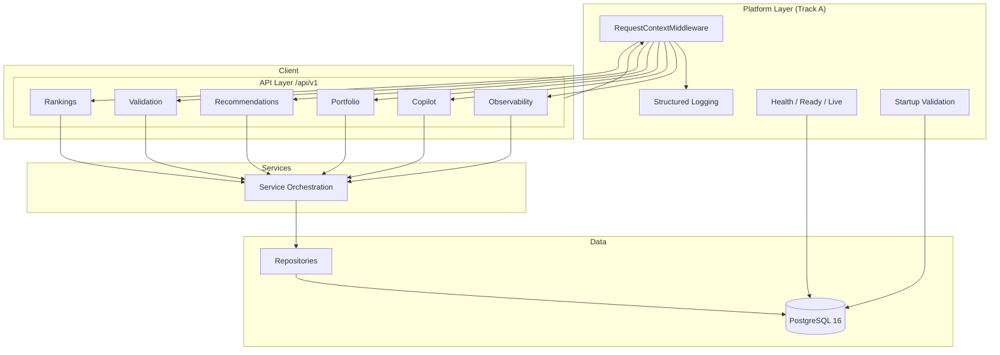

# Pi-PM Architecture Review — Platform Hardening (Track A)

**Date:** 2026-06-05  
**Scope:** Platform quality, CI/CD, observability, operational readiness  
**Out of scope:** Ranking, Validation, Recommendation, Portfolio, Investment Committee business logic

---

## Executive Summary

Pi-PM is a FastAPI + PostgreSQL backend with a layered architecture: API routes → services → repositories → SQLAlchemy models. Deterministic engines (ranking, validation, recommendations) sit behind service boundaries with traceability hooks. This review assesses production readiness from a platform engineering perspective.

**Verdict:** Platform hardening complete for Track A. CI/CD, observability, and ops documentation are in place. Migration graph is linear with head `20260609_0024`.

---

## System Architecture

---

## Layer Assessment

| Layer | Status | Notes |
|-------|--------|-------|
| **API (`app/api/v1/`)** | Good | Consistent `/api/v1` prefix; OpenAPI tags added for major domains |
| **Services (`app/services/`)** | Good | Clear orchestration; heavy DI via `deps.py` |
| **Repositories (`app/db/repositories/`)** | Good | Data access isolated from business rules |
| **Models (`app/models/`)** | Good | SQLAlchemy 2.0 mapped columns; Alembic-managed |
| **Core (`app/core/`)** | Improved | Added context, middleware, startup validation, structured logging |
| **Migrations** | Good | Linear chain; head `20260609_0024`; duplicate revision resolved |

---

## API Quality Review

### Versioning

- All routes mounted under `/api/v1` — consistent and correct
- Deprecated route group tagged `research-deprecated` in router
- Recommendation: maintain v1 until breaking changes require v2

### OpenAPI

- FastAPI auto-generates schema at `/docs`
- Added domain-level `openapi_tags` for health, rankings, validation, recommendations, portfolio, copilot
- Health endpoints use Pydantic response models (`HealthResponse`)

### Error Handling

| Exception | HTTP | error_code |
|-----------|------|------------|
| `NotFoundError` | 404 | `not_found` |
| `InvalidSymbolError` | 422 | `invalid_symbol` |
| `ProviderError` | 502 | `provider_error` |
| `StrategyNotFoundError` | 422 | `strategy_not_found` |
| `RankingError` | 500 | `ranking_error` |
| `ValidationError` | 422 | `validation_error` |
| `PiPMError` | 400 | `application_error` |
| `RequestValidationError` | 422 | `validation_error` |

Application errors now include machine-readable `error_code` fields. Pydantic validation errors preserve standard `detail` array format.

### Route Consistency

- Resource paths use kebab-case (`/market-data`, `/regime-policy`, `/investment-committee`)
- Ops routes grouped under `/ops/daily-batch`
- Analytics routes under `/analytics/*`

---

## Observability (Implemented)

| Capability | Implementation |
|------------|----------------|
| Liveness probe | `GET /api/v1/health/live` |
| Readiness probe | `GET /api/v1/health/ready` (503 on DB failure) |
| Detailed health | `GET /api/v1/health` (backward compatible) |
| Startup validation | DB connectivity + production config checks |
| Structured logging | JSON in production/staging/test |
| Correlation IDs | `X-Correlation-ID` header propagated |
| Request tracing | `X-Request-ID` per request; access logs with duration |

---

## CI/CD (Implemented)

| Workflow | Trigger | Jobs |
|----------|---------|------|
| `pr-validation.yml` | Pull requests | lint, test+coverage, migrations |
| `main.yml` | Push to main | lint, test+coverage, migrations, summary |

Tools: pytest (537 tests), ruff (lint + format), pytest-cov, Alembic against PostgreSQL 16 service container.

---

## Risks & Recommendations

| Risk | Severity | Recommendation |
|------|----------|----------------|
| Duplicate migration revision `20260606_0021` | Medium | Rename copilot migration revision in future maintenance window |
| No auth middleware | Medium | Add API key / OAuth before external exposure |
| Benchmark test flakiness | Low | Mark timing tests with `@pytest.mark.flaky` or increase threshold |
| E501 line-length debt | Low | Gradually shorten lines or adopt 120-char limit |
| F841 unused variables | Low | Clean up incrementally; currently ignored in ruff |

---

## Protected Boundaries (Unchanged)

The following modules were not modified for business logic:

- `app/ranking/` — Ranking Engine
- `app/validation/` — Validation Engine
- `app/recommendation/` — Recommendation Engine
- `app/portfolio/` — Portfolio Engine business rules
- `app/args/`, `app/workspace_args/` — Investment Committee logic

Platform changes were limited to `app/core/`, `app/main.py`, `app/api/v1/health.py`, CI workflows, and ops documentation.
