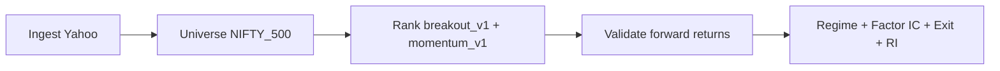
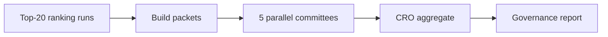

# Product Current State

**Date:** 2026-06-05  
**Branch (per handover):** `feature/see-v2`  
**Migration head:** `20260609_0018`  
**App version:** `0.4.1` (`app/main.py`)

---

## Capability inventory

| Capability | Status | Implementation | API / entry | Notes |
|------------|--------|----------------|-------------|-------|
| Health check | **Implemented** | `app/api/v1/health.py` | `GET /api/v1/health` | DB connectivity |
| Stock catalog | **Implemented** | `app/services/stock_service.py` | `GET /api/v1/stocks` | Symbol lookup + market data |
| Yahoo market data ingest | **Implemented** | `app/providers/yahoo/`, `app/services/market_data_service.py` | `POST /api/v1/market-data/ingest` | Default period 1y |
| Universe filter (NIFTY_500, PI_PM_CORE) | **Implemented** | `app/universe/filter_engine.py` | Via ranking/batch params | CSV: `data/nifty500_constituents.csv` |
| Ranking `momentum_v1` | **Implemented** | `app/ranking/strategies/momentum_v1.py` | `POST /api/v1/rankings/run` | Frozen |
| Ranking `breakout_v1` | **Implemented** | `app/ranking/strategies/breakout_v1.py` | Same | Frozen |
| Ranking top-N read | **Implemented** | `app/db/repositories/ranking_result_repository.py` | `GET /api/v1/rankings/{id}/top` | |
| Backtest ranking replay | **Implemented** | `app/backtest/` | `POST /api/v1/backtest/generate-rankings` | Historical replay |
| Per-run validation | **Implemented** | `app/validation/` | `POST /api/v1/validation/runs/{id}/compute` | IC, deciles, regimes |
| Validation summary / backfill | **Implemented** | `app/services/signal_validation_service.py` | `GET/POST /api/v1/validation/*` | |
| Full-universe validation | **Implemented** | `app/models/full_universe_validation.py` | `/api/v1/validation/full-universe/*` | Campaign model |
| Platform traceability | **Implemented** | `app/models/platform_traceability.py` | `/api/v1/observability/*` | Sprint 7 |
| Score reconstruction | **Implemented** | Traceability service | `GET .../score-reconstruction` | Factor contributions |
| Regime policy configs | **Implemented** | `app/regime_policy/` | `/api/v1/regime-policy/*` | Research replay |
| Factor IC analytics | **Implemented** | `app/factor_analytics/` | `/api/v1/analytics/factors/*` | Daily upsert + reports |
| Exit research | **Implemented** | `app/workspace_exit_research/` | `/api/v1/analytics/exit/*` | Phased backfill |
| Research intelligence | **Implemented** | `app/services/research_intelligence_service.py` | `/api/v1/analytics/research-intelligence/*` | Executive reports |
| Daily NIFTY 500 batch | **Implemented** | `app/services/daily_batch_service.py` | `POST /api/v1/ops/daily-batch/runs` | 8 phases |
| ARGS research runs | **Implemented** | `app/args/`, `app/services/` (research) | `POST /api/v1/research/run` | Top-20 default |
| Investment review packets | **Implemented** | `app/args/builders/investment_review_packet_builder.py` | `GET .../packet` | Deterministic JSON |
| 5 committees + CRO | **Implemented** | `app/args/plugins/`, `app/args/graph/workflow.py` | Via research run | TARC,FRC,QRC,NRCC,RC |
| Committee packet views (Phase 2) | **Implemented** | `app/args/committee_packet_views.py` | Internal to plugins | Per-committee evidence slices |
| SEE v2 stock setup | **Implemented** | `app/stock_setup_evidence/` | `/api/v1/research/stock-setup/*` | Migration 0018 |
| SQE packet enrichment | **Implemented** | `app/args/plugins/stock_quality_evidence.py` | On packet build | Observability |
| QRC SQE brief path | **Partial / experimental** | `app/args/plugins/qrc_sqe_brief.py` | Flag-gated | `ARGS_QRC_USE_SQE=false` |
| Quant research brief (QRC default) | **Implemented** | `app/args/plugins/quant_research_brief.py` | Deterministic | Production QRC path |
| Outcome attribution | **Implemented (analytics)** | `app/outcome_attribution/` | Script only | No HTTP API |
| Ranking calibration research | **Partial (research only)** | `app/ranking_research/` | Scripts | Not in prod registry |
| Rank ordering monotonicity | **Missing (product)** | Documented failure | N/A | Bucket alpha partial |
| Paper trading | **Missing (services)** | `app/models/paper_trade.py` only | No API | Stub |
| Portfolio positions | **Missing (services)** | `app/models/portfolio_position.py` only | No API | Stub |
| Live broker execution | **Missing** | `app/execution/__init__.py` placeholder | N/A | Out of scope per PRD |
| Mobile app | **Missing** | No codebase | N/A | |
| User auth / multi-tenant | **Missing** | No auth in `app/main.py` | N/A | **Assumption:** single-user research |
| CI pipeline | **Missing** | No workflow in repo | N/A | Per TEST_GAPS |
| Buy / hold / exit signals | **Missing (product)** | Exit analytics = research reports | Read-only APIs | Not actionable signals |
| Committee Phase 3 | **Missing** | Design TBD | N/A | Per handover |

---

## Primary workflows

### 1. Daily operations (production)

- **Trigger:** `POST /api/v1/ops/daily-batch/runs` or `scripts/run_daily_nifty500_batch.py`
- **Evidence:** `app/services/daily_batch_service.py`, `app/ops/daily_batch/batch_planner.py`

### 2. Research review (ARGS)

- **Trigger:** `POST /api/v1/research/run` or `scripts/run_args_top20.py`
- **Evidence:** `app/args/graph/workflow.py`, `app/workspace_args/constants.py`

### 3. Analytics consumption (read-only)

- Factor IC, exit policy comparison, research intelligence — HTTP GET under `/api/v1/analytics/*`
- Outcome attribution — `scripts/generate_outcome_attribution_report.py` → markdown

---

## Status definitions

| Label | Meaning |
|-------|---------|
| **Implemented** | Production code path + tests and/or operational runbook |
| **Partial** | Exists but gated, research-only, or blocked on data/PO |
| **Missing** | No service/API or explicit out-of-scope |

---

## Known partial states (verified)

| Item | Detail | Evidence |
|------|--------|----------|
| Validation recency | As-of ~2026-06-04 → `insufficient_data` | `docs/dailyruns/04-jun-2026/03-validation.md` |
| Rank calibration | Alpha in top-20 buckets; rank order inverted | `docs/ranking-calibration-root-cause.md` |
| Exit research scale | Phased backfill; not full NIFTY_500 in all envs | `app/services/exit_research_service.py` |
| QRC SQE | Enriched packets; default QRC uses `quant_research_brief` | `app/core/config.py:79` |

---

## Discrepancies (doc vs code)

| Source | Claim | Code truth |
|--------|-------|------------|
| `docs/AI/01_PRODUCT/PRD.md` | Sprint 8.4 AI research agent | **Not found** in `app/` — plan only per PRODUCT_STATUS |
| Default universe `PI_PM_CORE` | Config default | Ops use `NIFTY_500` per PLATFORM-HANDOFF — config at `app/core/config.py:24` |

---

## References

- [02_ARCHITECTURE_CURRENT_STATE.md](./02_ARCHITECTURE_CURRENT_STATE.md)
- [04_API_CATALOG.md](./04_API_CATALOG.md)
- [docs/AI/01_PRODUCT/PRODUCT_STATUS.md](../AI/01_PRODUCT/PRODUCT_STATUS.md)
