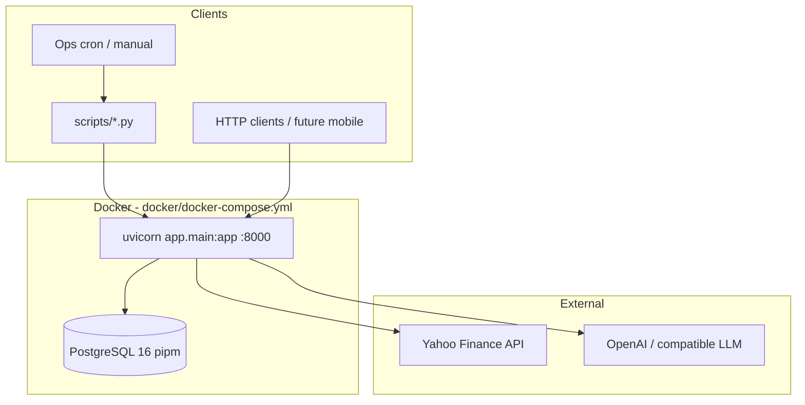
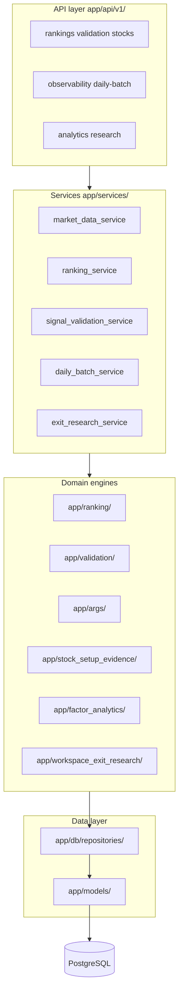
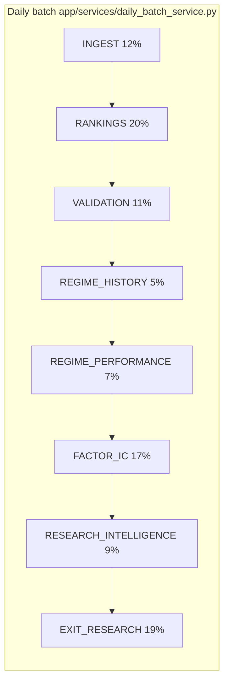
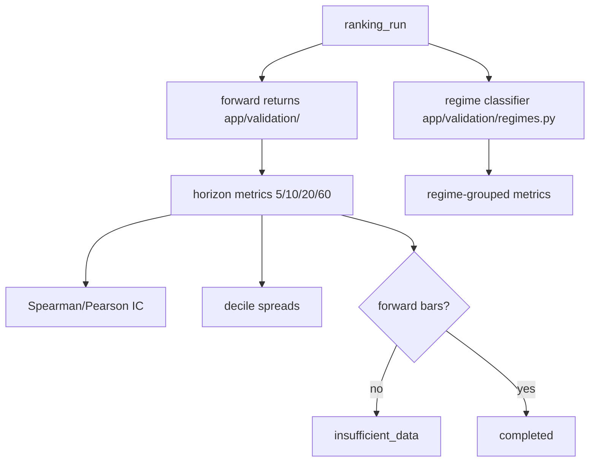
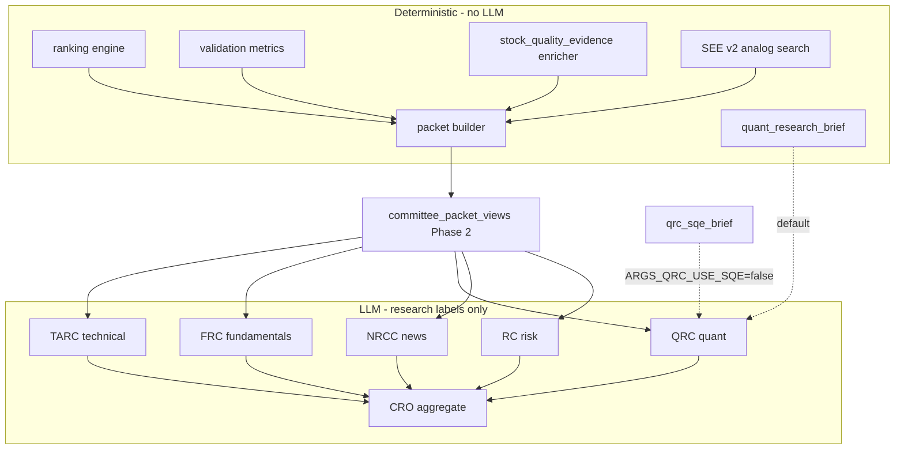
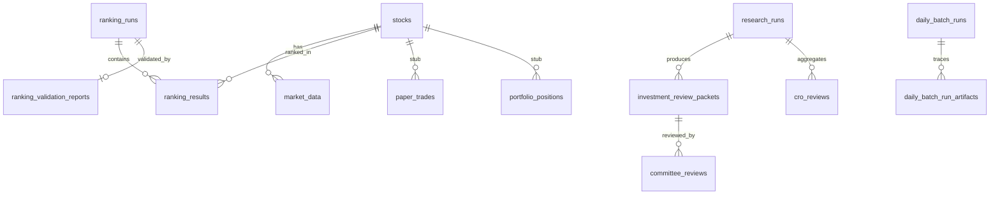

# Architecture Current State

**Date:** 2026-06-05  
**Stack:** FastAPI 0.4.1, PostgreSQL 16, SQLAlchemy, Alembic, LangGraph (ARGS workflow)

---

## Runtime topology

**Evidence:** `docker/docker-compose.yml`, `app/main.py`, `app/providers/yahoo/client.py`, `app/args/llm/`

---

## Application layers

---

## Batch pipeline architecture

**Planner:** `app/ops/daily_batch/batch_planner.py` — gap detection, `already_current`, reuses `insufficient_data` validation reports.

---

## Validation architecture

**Tail behavior:** Recent as-of dates lack ≥5 forward trading days → `insufficient_data` (`app/validation/constants.py`).

---

## AI / ARGS architecture

**Committee registry:** `app/args/plugins/registry.py` — 5 plugins, no stubs in production registry.

**Workflow:** `app/args/graph/workflow.py` — LangGraph parallel committees → CRO.

---

## Storage model (PostgreSQL)

**Migration chain:** 18 versions, head `20260609_0018_see_v2_metrics.py`.

---

## Research modules (read-only analytics)

| Module | Path | Wired to batch? |
|--------|------|-----------------|
| Outcome attribution | `app/outcome_attribution/` | No (scripts) |
| Ranking research | `app/ranking_research/` | No (scripts) |
| Committee effectiveness | `app/args/analytics/committee_effectiveness.py` | No (scripts) |

---

## Security & boundaries

| Boundary | Implementation |
|----------|----------------|
| No LLM ranking | Rankings only in `app/ranking/` |
| No auth middleware | `app/main.py` — open API (**assumption:** trusted network) |
| Frozen ranking/validation math | Documented in handover; golden tests |

---

## Discrepancies

| Item | Note |
|------|------|
| `app/portfolio/`, `app/execution/` | Placeholder packages only — not in architecture diagram as active |
| `docs/architecture.md` | Legacy; prefer code paths cited here |

---

## References

- [03_DOMAIN_MODEL.md](./03_DOMAIN_MODEL.md)
- [05_DATA_PIPELINE_INVENTORY.md](./05_DATA_PIPELINE_INVENTORY.md)
- [06_AI_AND_AGENT_INVENTORY.md](./06_AI_AND_AGENT_INVENTORY.md)
- [`docs/AI/02_ARCHITECTURE/SYSTEM_ARCHITECTURE.md`](../AI/02_ARCHITECTURE/SYSTEM_ARCHITECTURE.md)
