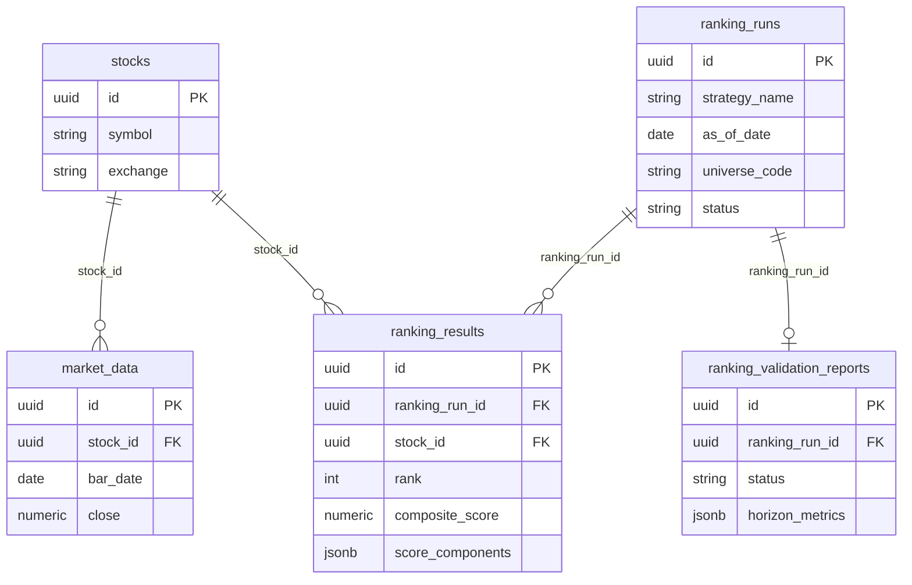
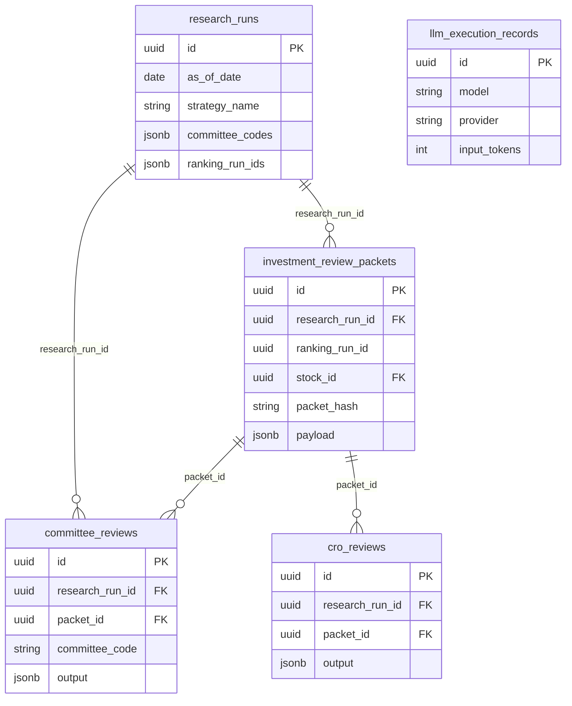
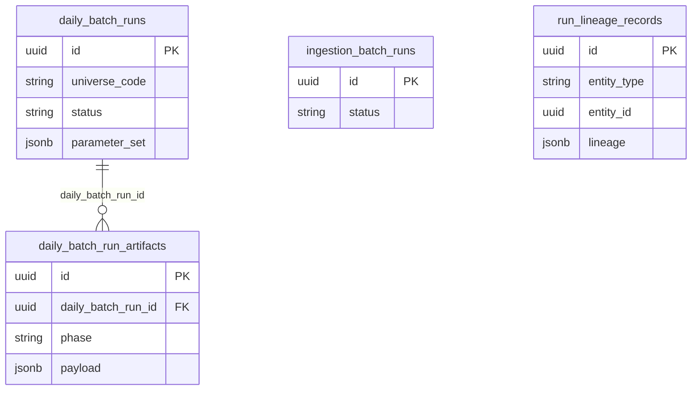
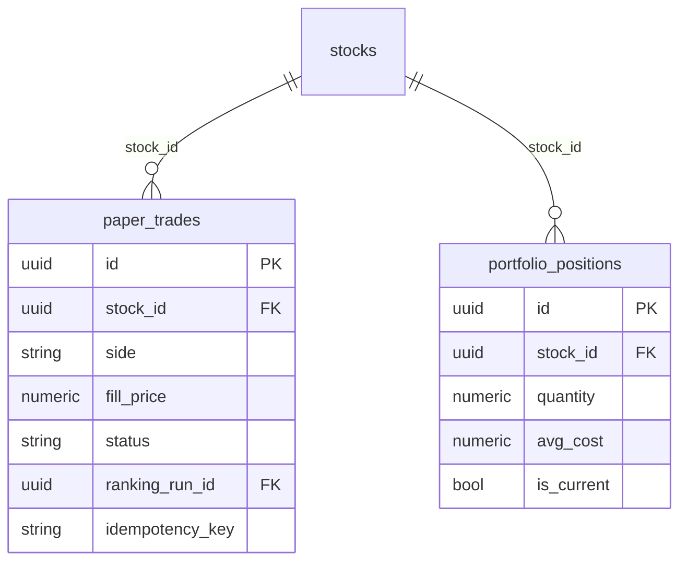

# Domain Model

**Date:** 2026-06-05  
**Source:** `app/models/*.py`, `app/models/__init__.py`, Alembic migrations

---

## Entity catalog

| Entity | Table | Model file | Purpose |
|--------|-------|------------|---------|
| Stock | `stocks` | `app/models/stock.py` | NSE symbol master |
| MarketData | `market_data` | `app/models/market_data.py` | OHLCV bars |
| StockUniverse | `stock_universes` | `app/models/stock_universe.py` | Universe definitions |
| UniverseMembership | `universe_memberships` | `app/models/universe_membership.py` | Stock ↔ universe |
| MarketDataIngestionRun | `market_data_ingestion_runs` | `app/models/market_data_ingestion_run.py` | Ingest audit |
| RankingRun | `ranking_runs` | `app/models/ranking_run.py` | Single as-of ranking execution |
| RankingResult | `ranking_results` | `app/models/ranking_result.py` | Per-stock rank/score |
| RankingPerformanceSnapshot | `ranking_performance_snapshots` | `app/models/ranking_performance_snapshot.py` | Performance snapshots |
| RankingValidationReport | `ranking_validation_reports` | `app/models/ranking_validation_report.py` | Per-run validation |
| ResearchReport | `research_reports` | `app/models/research_report.py` | Legacy research reports |
| PaperTrade | `paper_trades` | `app/models/paper_trade.py` | **Stub** — no service |
| PortfolioPosition | `portfolio_positions` | `app/models/portfolio_position.py` | **Stub** — no service |
| FullUniverseValidation* | 4 tables | `app/models/full_universe_validation.py` | Campaign validation |
| IngestionBatchRun | `ingestion_batch_runs` | `app/models/platform_traceability.py` | Sprint 7 trace |
| RankingFactorContribution | `ranking_factor_contributions` | same | Factor lineage |
| ValidationHorizonMetric | `validation_horizon_metrics` | same | Horizon IC |
| ValidationDecileMetric | `validation_decile_metrics` | same | Decile stats |
| RunLineageRecord | `run_lineage_records` | same | Entity lineage |
| ExperimentRun | `experiment_runs` | same | A/B experiments |
| RegimeHistory | `regime_history` | same | Regime time series |
| StrategyRegimePerformance | `strategy_regime_performance` | same | Strategy × regime |
| RegimePolicyConfig | `regime_policy_configs` | `app/models/regime_policy.py` | Policy configs |
| RegimePolicyDecision | `regime_policy_decisions` | same | Daily decisions |
| RegimeBacktestRun | `regime_backtest_runs` | same | Backtest runs |
| FactorPerformanceRun | `factor_performance_runs` | `app/models/factor_analytics.py` | Factor IC runs |
| FactorPerformanceMetric | `factor_performance_metrics` | same | Aggregated IC |
| FactorDailyMetric | `factor_daily_metrics` | same | Daily factor stats |
| ExitResearchRun | `exit_research_runs` | `app/models/exit_research.py` | Exit sim runs |
| ExitResearchPolicyMetric | `exit_research_policy_metrics` | same | Policy comparison |
| ExitResearchAlphaDecayPoint | `exit_research_alpha_decay_points` | same | Alpha decay curve |
| ResearchIntelligenceRun | `research_intelligence_runs` | `app/models/research_intelligence.py` | RI batch |
| ResearchIntelligenceReport | `research_intelligence_reports` | same | Executive MD JSON |
| DailyBatchRun | `daily_batch_runs` | `app/models/daily_batch.py` | Batch orchestration |
| DailyBatchRunArtifact | `daily_batch_run_artifacts` | same | Phase artifacts |
| ResearchRun | `research_runs` | `app/models/args.py` | ARGS execution |
| InvestmentReviewPacket | `investment_review_packets` | same | Deterministic packet JSON |
| CommitteeReview | `committee_reviews` | same | Per-committee output |
| CroReview | `cro_reviews` | same | CRO synthesis |
| GovernanceResearchReport | `governance_research_reports` | same | Final governance MD |
| GovernanceResearchReportEvidence | `governance_research_report_evidence` | same | Evidence refs |
| PromptVersion | `prompt_versions` | same | Prompt templates |
| LlmExecutionRecord | `llm_execution_records` | same | Token/cost audit |
| StockSetupResearch | `stock_setup_research` | `app/models/stock_setup_research.py` | SEE v2 runs |
| StockSetupResearchMetric | `stock_setup_research_metrics` | same | Analog metrics |

**Total ORM modules:** 22 files under `app/models/`.

---

## Core market & ranking ER

---

## ARGS governance ER

**Default committees:** `TARC`, `FRC`, `QRC`, `NRCC`, `RC` — `app/workspace_args/constants.py:5`

---

## Daily batch & traceability ER

---

## Portfolio stub ER (schema only)

**Created in:** `migrations/versions/20260530_0001_initial_schema.py`  
**Services:** None — `app/portfolio/__init__.py` is a placeholder.

---

## Key enums / constants (not separate tables)

| Concept | Location |
|---------|----------|
| TradeStatus | `app/core/constants.py` → `paper_trades.status` |
| Validation statuses | `app/validation/constants.py` — includes `insufficient_data` |
| Committee codes | `app/workspace_args/constants.py` |
| Daily batch phases | `app/core/constants.py` → `DailyBatchPhase` |

---

## Discrepancies

| Doc | Code |
|-----|------|
| `docs/DATABASE_SCHEMA.md` may lag ARGS tables | ARGS in migration `20260608_0016_args_phase1.py` |
| Packet version `1.0.0` | `app/workspace_args/constants.py:3` |

---

## References

- [`docs/AI/08_DATA_MODEL/DATABASE_SCHEMA.md`](../AI/08_DATA_MODEL/DATABASE_SCHEMA.md)
- [`docs/AI/08_DATA_MODEL/ENTITY_RELATIONSHIP_GUIDE.md`](../AI/08_DATA_MODEL/ENTITY_RELATIONSHIP_GUIDE.md)
- [04_API_CATALOG.md](./04_API_CATALOG.md)
