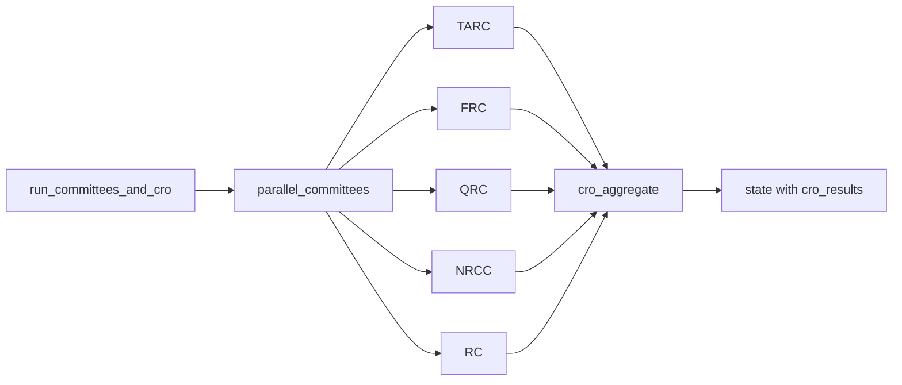

# AI and Agent Inventory

**Date:** 2026-06-05  
**Principle:** LLMs produce **research labels only** — never rankings, sizing, or trade approval (PRD G8).

---

## LLM configuration

| Setting | Default | File |
|---------|---------|------|
| `args_llm_provider` | `mock` | `app/core/config.py:34` |
| `args_llm_default_model` | `gpt-4o-mini` | `:35` |
| `args_llm_timeout_seconds` | `60` | `:40` |
| Per-agent overrides | TARC, FRC, QRC, NRCC, RC, CRO | `:41-76` |
| **`args_qrc_use_sqe`** | **`false`** | `:79` |

**Providers:** `app/args/llm/providers/` — mock, OpenAI, OpenAI-compatible  
**Registry:** `app/args/llm/registry.py` — `ALL_COMMITTEE_LLM_CODES`

---

## Committee agents (5 + CRO)

| Code | Plugin | Packet view | Mandate (from views/plugins) |
|------|--------|-------------|------------------------------|
| TARC | `app/args/plugins/tarc.py` | `build_tarc_view` | Technical factors, ranking attribution |
| FRC | `app/args/plugins/frc.py` | `build_frc_view` | Fundamentals (LLM) |
| QRC | `app/args/plugins/qrc.py` | `build_qrc_view` | Quant validation, IC, SEE/SQE summaries |
| NRCC | `app/args/plugins/nrcc.py` | `build_nrcc_view` | News / narrative |
| RC | `app/args/plugins/rc.py` | `build_rc_view` | Risk veto paths |
| CRO | `app/args/agents/cro_agent.py` | N/A (aggregate) | Synthesizes committee outputs |

**Registry (production):** `app/args/plugins/registry.py` — uses real plugins, not stubs.

**Stub plugins exist for tests:** `rc_stub.py`, `nrcc_stub.py`, `frc_stub.py` — not registered in production registry.

**Default committee set:** `("TARC", "FRC", "QRC", "NRCC", "RC")` — `app/workspace_args/constants.py:5`

---

## Workflow graph

**File:** `app/args/graph/workflow.py` — LangGraph  
**Research labels:** `CommitteeResearchLabel` — supportive / neutral / cautious (`app/workspace_args/constants.py:15`)

---

## Deterministic (non-LLM) AI-adjacent components

| Component | Path | Role |
|-----------|------|------|
| Investment review packet builder | `app/args/builders/investment_review_packet_builder.py` | Deterministic JSON packet |
| Quant research brief | `app/args/plugins/quant_research_brief.py` | **Production QRC confidence path** |
| Quant payload builder | `app/args/plugins/quant_payload.py` | Structured quant evidence |
| Stock quality evidence (SQE) | `app/args/plugins/stock_quality_evidence.py` | A–F sections on packet |
| SEE v2 | `app/stock_setup_evidence/` | Strategy-aware analog search |
| Evidence validator | `app/workspace_args/evidence_validator.py` | Citation allowlist |
| Committee evidence enforcement | `app/args/committee_evidence_enforcement.py` | Repair retry on bad refs |
| Committee packet views | `app/args/committee_packet_views.py` | **Phase 2** — per-committee evidence isolation |

---

## QRC paths: production vs experimental

| Path | Flag | Status |
|------|------|--------|
| `quant_research_brief` | Always (default) | **Production** — deterministic confidence, handles `insufficient_data` |
| `qrc_sqe_brief` | `ARGS_QRC_USE_SQE=true` | **Experimental** — LLM payload from SQE sections |

**Evidence:** `app/args/plugins/qrc.py`, `app/args/plugins/qrc_sqe_brief.py`, tests in `tests/unit/args/test_qrc_sqe_flag.py`

**A/B script:** `scripts/qrc_sqe_ab_experiment.py`  
**Report:** `docs/qrc-sqe-ab-test-report.md` — recommendation to keep default `false`

---

## SQE on packets

| Item | Detail |
|------|--------|
| Enricher | `app/args/plugins/stock_quality_evidence.py` |
| On packet | Always attached for observability when built |
| Changes committee default? | **No** when `ARGS_QRC_USE_SQE=false` |
| Tests | `tests/unit/args/test_stock_quality_evidence.py`, `tests/integration/args/test_packet_sqe.py` |

---

## Prompts and audit

| Artifact | Table / model |
|----------|---------------|
| Prompt templates | `prompt_versions` — `app/models/args.py` |
| LLM execution audit | `llm_execution_records` — tokens, provider, model |
| Packet hash | `investment_review_packets.packet_hash` |

**Prompt execution base:** `app/args/plugins/committee_llm_base.py`

---

## Governance outputs

| Output | Model |
|--------|-------|
| Committee review JSON | `committee_reviews` |
| CRO synthesis | `cro_reviews` |
| Governance report | `governance_research_reports` + evidence rows |

**Export:** `scripts/export_args_research_run.py` → markdown for PO review

---

## Analytics (read-only, no agent changes)

| Tool | Path |
|------|------|
| Committee effectiveness | `app/args/analytics/committee_effectiveness.py` |
| Phase 2 result | ~79% effective independence — `docs/committee-independence-phase2-results.md` |
| Phase 3 | **Not started** — no code modules |

---

## Risk register

| Risk | Severity | Mitigation in code |
|------|----------|-------------------|
| LLM hallucination in committees | High | Evidence validator + enforcement + packet views |
| QRC SQE path quality | Medium | Flag off by default; A/B documented |
| Mock LLM in prod misconfig | High | Default `mock` — ops must set real provider for live committees |
| CRO timeout on large top-N | Medium | Configurable timeout; handover suggests 180–300s |
| Committee prompt drift | Medium | `prompt_versions` table; no auto-migration of prompts |
| SQE misleading QRC when flag on | Medium | Experimental only |
| No rate limiting on `/research/run` | Low | **Assumption:** single-user ops |

---

## What LLMs cannot do (verified)

- Rank stocks — only `app/ranking/` (deterministic)
- Set position sizes — no sizing module
- Approve trades — CRO outputs research labels, not orders
- Override validation math — frozen in `app/validation/`

---

## Test coverage (ARGS)

| Area | Tests |
|------|-------|
| unit/args | 63 |
| integration/args | 5 |
| Key files | `test_committee_packet_views.py`, `test_committee_evidence_enforcement.py`, `test_workflow_mock_llm.py` |

---

## Discrepancies

| Doc | Code |
|-----|------|
| Some ARGS exports reference "legacy" packets | Current packet version `1.0.0` in constants |
| HANDOVER "Phase 3 TBD" | Confirmed — no Phase 3 implementation |

---

## References

- [`docs/AI/03_DESIGN/ARGS_DESIGN.md`](../AI/03_DESIGN/ARGS_DESIGN.md)
- [`docs/AI/03_DESIGN/COMMITTEE_DESIGN.md`](../AI/03_DESIGN/COMMITTEE_DESIGN.md)
- [`docs/committee-independence-phase2-results.md`](../committee-independence-phase2-results.md)
- [06_AI_AND_AGENT_INVENTORY.md](./06_AI_AND_AGENT_INVENTORY.md) → see [10_RECOMMENDATION_ENGINE_GAP_ANALYSIS.md](./10_RECOMMENDATION_ENGINE_GAP_ANALYSIS.md)
