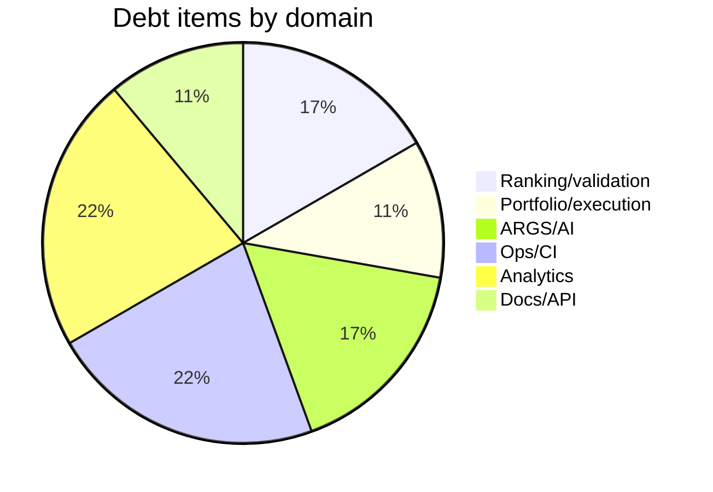

# Technical Debt Register

**Date:** 2026-06-05  
**Scan:** `grep -ri 'TODO|FIXME|HACK|XXX' app/ tests/ scripts/` — **no matches in Python code**

Debt below is **structural / architectural**, classified from code inspection and handover docs.

---

## Summary

| Severity | Count |
|----------|-------|
| Critical | 2 |
| High | 5 |
| Medium | 8 |
| Low | 6 |

---

## Critical

| ID | Item | Evidence | Impact |
|----|------|----------|--------|
| TD-C01 | **No CI gate** | No pytest workflow in repo; `docs/AI/09_TESTING/TEST_GAPS.md` | Regressions merge undetected |
| TD-C02 | **Rank ordering not calibrated in prod** | `app/ranking_research/calibration.py`; inverted Spearman in `docs/ranking-calibration-root-cause.md` | Top ranks may underperform lower ranks within top-20 |

---

## High

| ID | Item | Evidence | Impact |
|----|------|----------|--------|
| TD-H01 | Portfolio / paper trade schema without services | `app/portfolio/__init__.py`, `app/execution/__init__.py` placeholders | Dead tables; misleading maturity signal |
| TD-H02 | No API authentication | `app/main.py` — no auth middleware | Unsafe if exposed beyond trusted network |
| TD-H03 | Daily batch lacks E2E test | 1 planner unit test only | Phase orchestration regressions |
| TD-H04 | Validation tail `insufficient_data` | Recent dates in daily run logs | ARGS/QRC packets show pending validation |
| TD-H05 | Default universe config vs ops mismatch | `PI_PM_CORE` in config, `NIFTY_500` in ops | Misconfiguration risk |

---

## Medium

| ID | Item | Evidence | Impact |
|----|------|----------|--------|
| TD-M01 | Committee Phase 3 not implemented | Handover; no modules | Independence may plateau |
| TD-M02 | QRC SQE experimental path | `args_qrc_use_sqe=false`; `qrc_sqe_brief.py` | Confusion if enabled without PO gate |
| TD-M03 | Outcome attribution script-only | No HTTP API | PO cannot self-serve attribution |
| TD-M04 | Exit research backfill at scale incomplete | Phased progress in exit service | Incomplete analytics coverage |
| TD-M05 | Stub committee plugins coexist with real | `rc_stub.py`, `nrcc_stub.py`, `frc_stub.py` | Maintainer confusion (not used in prod registry) |
| TD-M06 | Research intelligence thin tests | 0 dedicated unit tests | Report quality unguarded |
| TD-M07 | SEE v2 quality validated manually | `generate_see_v2_validation_report.py` | Analog search regressions |
| TD-M08 | No OpenAPI contract tests | API catalog manual grep | Doc drift vs code |

---

## Low

| ID | Item | Evidence | Impact |
|----|------|----------|--------|
| TD-L01 | Legacy research_report model | `app/models/research_report.py` | Possible orphan table |
| TD-L02 | Recovery scripts untested | `scripts/run_recovery_batch.py`, etc. | Ops-only risk |
| TD-L03 | PDF guide generator untested | `scripts/generate_pi_pm_guide_pdf.py` | Low traffic |
| TD-L04 | Starlette/TestClient deprecation warning | pytest collect warning | Future test harness update |
| TD-L05 | `.tools/gh` untracked in git status | Workspace clutter | No product impact |
| TD-L06 | Sprint 8.4 AI research agent planned not built | `PRODUCT_STATUS.md` | Doc/code gap |

---

## Debt by domain

---

## Remediation priorities (PO view)

| Order | ID | Effort | Owner |
|-------|-----|--------|-------|
| 1 | TD-C01 | S | Eng — add GitHub Actions |
| 2 | TD-H04 | S | Ops — ingest forward bars |
| 3 | TD-C02 | L | PO + Eng — ranking v2 criteria |
| 4 | TD-H01 | M | Eng — implement or drop tables |
| 5 | TD-H02 | M | Eng — if mobile/external API planned |

---

## Code comment debt

**Finding:** Zero `TODO`/`FIXME` in `app/` Python — either clean codebase or debt tracked externally in docs/sprints.

**Doc placeholder only:** `docs/tarc-architecture-design.md` references `migrations/20260xxx_committee_tables.py` (template, not real file).

---

## References

- [13_ROADMAP_RECOMMENDATION.md](./13_ROADMAP_RECOMMENDATION.md)
- [`docs/AI/09_TESTING/TEST_GAPS.md`](../AI/09_TESTING/TEST_GAPS.md)
- [08_TECHNICAL_DEBT_REGISTER.md](./08_TECHNICAL_DEBT_REGISTER.md)
