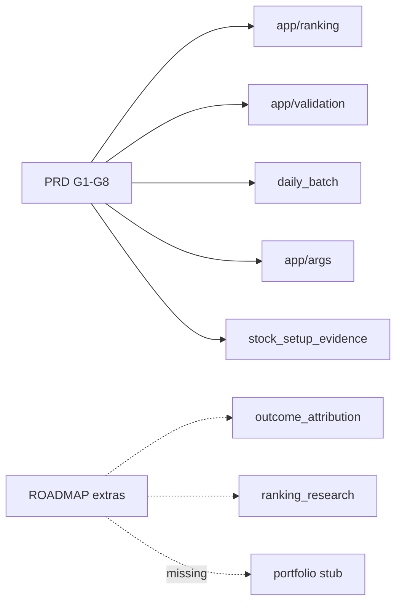

# Requirements Traceability Matrix

**Date:** 2026-06-05  
**Requirements source:** [`docs/AI/01_PRODUCT/PRD.md`](../AI/01_PRODUCT/PRD.md)  
**Verification:** Code modules + pytest paths

---

## PRD goals traceability

| Req ID | Requirement | Code implementation | Tests | Status |
|--------|-------------|---------------------|-------|--------|
| G1 | Deterministic ranking for named strategies | `app/ranking/registry.py`, `app/ranking/engine.py` | `tests/unit/ranking/test_golden_ranking.py`, `test_engine.py`, strategy tests | **Met** |
| G2 | Forward-return validation + regime splits + insufficient_data | `app/validation/`, `app/services/signal_validation_service.py` | `tests/unit/validation/*`, `tests/integration/api/test_validation_api.py` | **Met** (tail pending ops) |
| G3 | Full NIFTY 500 daily operations | `app/services/daily_batch_service.py`, `scripts/run_daily_nifty500_batch.py` | `tests/unit/ops/test_daily_batch_planner.py` only | **Partial** — no E2E |
| G4 | Audit traceability | `app/models/platform_traceability.py`, `app/api/v1/observability.py` | `tests/unit/services/test_sprint71_traceability.py`, `test_platform_traceability.py` | **Met** |
| G5 | Research analytics (factor IC, exit, RI) | `app/factor_analytics/`, `app/workspace_exit_research/`, research intelligence service | 27 + 25 + 2 integration | **Met** |
| G6 | ARGS governance — packets, 5 committees + CRO, lineage | `app/args/`, `app/api/v1/research.py` | 63 unit + 5 integration args | **Met** |
| G7 | SEE v2 strategy-aware analog search | `app/stock_setup_evidence/` | `tests/unit/stock_setup_evidence/*`, 1 API test | **Met** |
| G8 | Non-goals — no LLM ranking/sizing/trade approval | Boundaries in ranking vs args plugins | `test_qrc_sqe_flag.py`, workflow tests | **Met** |

---

## Functional scope (PRD shipped list)

| Feature | Code | Tests | Notes |
|---------|------|-------|-------|
| Universe NIFTY_500, PI_PM_CORE | `app/universe/` | `test_filter_engine.py`, `test_nifty500_loader.py` | ✓ |
| momentum_v1, breakout_v1 | `app/ranking/strategies/` | `test_momentum_v1.py`, `test_breakout_v1.py` | ✓ |
| Validation horizons 5/10/20/60 | `app/validation/` | `test_forward_returns.py` | ✓ |
| Daily batch pipeline | `app/services/daily_batch_service.py` | Planner only | Partial |
| ARGS Phase 1 + Phase 2 views | `app/args/committee_packet_views.py` | `test_committee_packet_views.py` | ✓ |
| SQE on packets | `app/args/plugins/stock_quality_evidence.py` | `test_stock_quality_evidence.py` | ✓ |

---

## Explicit out-of-scope (PRD) — confirmed absent

| Out-of-scope item | Code check | Status |
|-------------------|------------|--------|
| Live broker execution | `app/execution/` placeholder only | **Correctly absent** |
| LLM-generated rankings | Rankings only in `app/ranking/` | **Correctly absent** |
| Auto-promote ARGS_QRC_USE_SQE | Default `false` in config | **Correctly gated** |
| Ranking v2 in production | Only in `app/ranking_research/` | **Correctly absent** |

---

## Extended requirements (PLATFORM-HANDOFF, not in PRD table)

| Requirement | Code | Tests | Status |
|-------------|------|-------|--------|
| Outcome attribution analytics | `app/outcome_attribution/service.py` | `tests/unit/outcome_attribution/*` | Met (no API) |
| Ranking calibration research | `app/ranking_research/` | `tests/unit/ranking_research/*` | Met (research) |
| Regime policy replay | `app/regime_policy/` | `tests/unit/regime_policy/*` | Met (research API) |
| Committee effectiveness metrics | `app/args/analytics/committee_effectiveness.py` | `test_committee_effectiveness.py` | Met |
| Paper trading | Models only | None | **Orphan req** — tables without services |
| Portfolio construction | Not implemented | None | **Orphan req** |
| Mobile app | Not in repo | None | **Orphan req** |
| AI research agent Sprint 8.4 | Not in `app/` | None | **Orphan req** — doc only |

---

## Orphan code (no PRD requirement)

| Code | Notes |
|------|-------|
| `app/models/research_report.py` | Legacy; superseded by ARGS governance reports? |
| `app/models/ranking_performance_snapshot.py` | Validation snapshots — implicit req |
| Committee stub plugins | Test utilities |

---

## Orphan requirements (no code)

| Requirement (from docs/roadmap) | Source |
|---------------------------------|--------|
| Paper trading services | `PRODUCT_STATUS.md` "Not started" |
| Portfolio construction | `CURRENT_PRIORITIES.md` P2 |
| Live broker | PRD out-of-scope |
| Mobile consumer UX | Not documented in PRD — **assumption:** future |
| CI pipeline | `TEST_GAPS.md` |
| Buy/hold/exit product signals | Implied consumer PM — not in PRD explicitly |

---

## Traceability diagram

---

## Discrepancies

| Item | PRD/doc | Code |
|------|---------|------|
| Sprint 8.4 AI agent | Listed in PRODUCT_STATUS in progress | **No implementation found** — classify as doc-only |
| "312 tests" | Handover | 312 collected 2026-06-05 ✓ |

---

## References

- [`docs/AI/04_IMPLEMENTATION/IMPLEMENTATION_STATUS.md`](../AI/04_IMPLEMENTATION/IMPLEMENTATION_STATUS.md)
- [01_PRODUCT_CURRENT_STATE.md](./01_PRODUCT_CURRENT_STATE.md)
- [07_TEST_COVERAGE_ASSESSMENT.md](./07_TEST_COVERAGE_ASSESSMENT.md)
