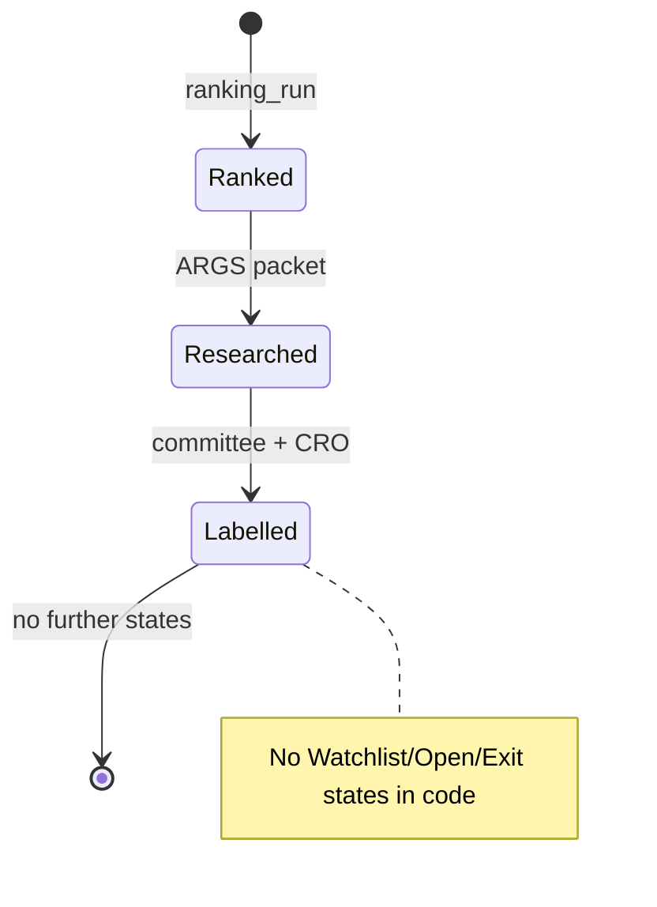

# Recommendation Engine Gap Analysis

> **⚠️ STALE (2026-06-05):** Phase 2 recommendation engine is **shipped** (`app/recommendation/`, `/api/v1/recommendations/*`).  
> **Current truth:** [`docs/IMPLEMENTATION_SUMMARY.md`](../IMPLEMENTATION_SUMMARY.md), [`docs/audit/REQUIREMENTS_TRACEABILITY_MATRIX.md`](../audit/REQUIREMENTS_TRACEABILITY_MATRIX.md).  
> Remaining gaps: API integration tests, formal lifecycle state machine, multi-tenant scoping.

**Date:** 2026-06-05 (snapshot before Phase 2 completion)  
**Scope:** Buy/hold/exit signals, conviction, lifecycle — what exists vs a consumer recommendation product

---

## Executive summary (historical)

Pi-PM has a **ranking engine** (deterministic top-N scores) and **validation analytics** (forward-return evidence), plus **ARGS research labels** (supportive/neutral/cautious). At time of writing it did **not** have a unified recommendation engine — **this is now implemented**.

| Capability | Status |
|------------|--------|
| Stock ranking (buy candidate pool) | **Implemented** |
| Bucket-level alpha evidence | **Implemented** (partial verdict) |
| Rank-order conviction | **Missing** (calibration research only) |
| Explicit buy signal | **Missing** |
| Hold / position lifecycle | **Missing** |
| Exit signal (product) | **Missing** (exit research = analytics) |
| Committee "stance" | **Implemented** (research labels, not trades) |

---

## Buy signal evidence

### What exists

| Artifact | Evidence | Limitation |
|----------|----------|------------|
| Daily rankings | `app/ranking/registry.py` — top-N by composite score | Rank order not monotonic |
| Top-20 API | `GET /api/v1/rankings/{run_id}/top` | No "buy" enum |
| Outcome attribution | `app/outcome_attribution/service.py` | Verdict `partial` — top-20 beats benchmark often |
| ARGS CRO output | `app/args/agents/cro_agent.py` | Research synthesis, not trade action |
| Regime policy evaluate | `app/regime_policy/engine.py` | Strategy gating research — not wired to live recs |

### Alpha vs rank calibration (verified)

| Finding | Source |
|---------|--------|
| Top-20 20d alpha positive (breakout ~1.12%, momentum ~0.83%) | `docs/outcome-attribution-report.md` |
| Rank 1–5 underperforms ranks 6–20 | `docs/ranking-calibration-root-cause.md` |
| Inverted Spearman(rank, α) at 20d | Same — breakout 0.623, momentum 0.376 |
| Score compression (Q1 < Q5 alpha) | `app/ranking_research/` reports |

**Conclusion:** **Selective alpha at bucket level — yes.** **Trust rank #1 > rank #10 — no (research gap).**

### Ranking calibration (research only)

| Component | Path | In production registry? |
|-----------|------|-------------------------|
| Isotonic calibration | `app/ranking_research/calibration.py` | **No** |
| Score compression analysis | `app/ranking_research/score_compression` logic | **No** |
| Calibrated backtest | `scripts/run_calibrated_ranking_backtest.py` | **No** |

---

## Hold signal evidence

| Expected capability | Code | Gap |
|---------------------|------|-----|
| Open position tracking | `portfolio_positions` table | No service/API |
| Hold vs add decision | — | **Missing** |
| Rank deterioration monitor | Exit research `rank-deterioration` report | Analytics API only — `GET /api/v1/analytics/exit/reports/rank-deterioration` |
| Regime shift hold rules | Regime policy decisions | Research API, not portfolio-linked |

**Packet context:** `portfolio_context.existing_position` defaults `false` in packet builder (`app/args/builders/investment_review_packet_builder.py:171`) — no live portfolio feed.

---

## Exit signal evidence

### Analytics (implemented)

| Report | API | Module |
|--------|-----|--------|
| Exit policy comparison | `/analytics/exit/reports/exit-policy-comparison` | `app/workspace_exit_research/reports.py` |
| Alpha decay | `.../alpha-decay` | same |
| Rank deterioration | `.../rank-deterioration` | same |
| Regime transition | `.../regime-transition` | same |
| Trend failure | `.../trend-failure` | same |
| Recommended exit policy | `.../recommended-exit-policy` | same |

**Simulators:** `app/workspace_exit_research/policy_simulators.py` — fixed hold, rank exit thresholds, ATR trail (`tests/unit/workspace_exit_research/test_constants.py`).

### Product gap

- No **`exit_signal`** entity or API
- No subscription from open positions → exit triggers
- Exit research is **historical simulation**, not live monitoring

---

## Conviction model evidence

| Layer | Conviction proxy | Deterministic? |
|-------|------------------|----------------|
| Composite score | 0–1 compressed | Yes — but poor rank separator |
| Validation IC / deciles | Per run | Yes |
| Quant research brief | QRC confidence fields | Yes — `app/args/plugins/quant_research_brief.py` |
| SQE sections A–F | Quality evidence scores | Yes (enrichment) |
| Committee labels | supportive/neutral/cautious | LLM (mock/live) |
| CRO aggregate | Final research stance | LLM |

**Gap:** No single **conviction score** combining rank + validation + committee for product UI.

**QRC with insufficient validation tail:**

When `database_status == insufficient_data`, quant brief notes pending forward validation (`app/args/plugins/quant_research_brief.py:369`, tests in `test_quant_research_brief.py`).

---

## Lifecycle evidence

| Lifecycle stage | Implemented? |
|-----------------|--------------|
| Universe scan | ✓ |
| Rank | ✓ |
| Validate | ✓ (tail pending) |
| Research review | ✓ ARGS |
| Paper buy | ✗ |
| Monitor hold | ✗ |
| Exit | ✗ |

---

## ARGS as pseudo-recommendation layer

| Output | Trade action? | Evidence |
|--------|---------------|----------|
| CommitteeResearchLabel | No — enum in `app/workspace_args/constants.py` | Design |
| CRO fields | Includes research stance; tests for no-trade fields | `test_cro_no_trade_fields.py` |
| Governance report | Markdown for PO | `governance_research_reports` |

**Risk:** Stakeholders may interpret CRO "supportive" as buy — **product gap** requires explicit UX/legal framing.

---

## Gap summary table

| Gap | Severity | Dependency to close |
|-----|----------|---------------------|
| Rank calibration in prod | Critical | PO approval + ranking v2 |
| Unified conviction score | High | Design + deterministic formula |
| Buy/hold/exit enum API | High | Product spec |
| Position-aware recommendations | High | Portfolio engine |
| Live exit monitoring | High | Portfolio + streaming ranks |
| Validation tail freshness | Medium | Ops ingest |
| Mobile presentation | Medium | Mobile app (see doc 12) |

---

## Recommendations (product, not code)

1. **Do not market rank #1 as "best buy"** until calibration promoted — evidence shows inversion.
2. **Treat ARGS output as research governance**, not recommendation — align with PRD G8.
3. **Use top-20 pool + bucket alpha** as current honest value prop.
4. **PO decision:** Define promotion criteria for `app/ranking_research/calibration.py` before any "conviction" feature.

---

## References

- [`docs/outcome-attribution-report.md`](../outcome-attribution-report.md)
- [`docs/ranking-calibration-root-cause.md`](../ranking-calibration-root-cause.md)
- [`docs/args-gap-analysis.md`](../args-gap-analysis.md)
- [06_AI_AND_AGENT_INVENTORY.md](./06_AI_AND_AGENT_INVENTORY.md)
