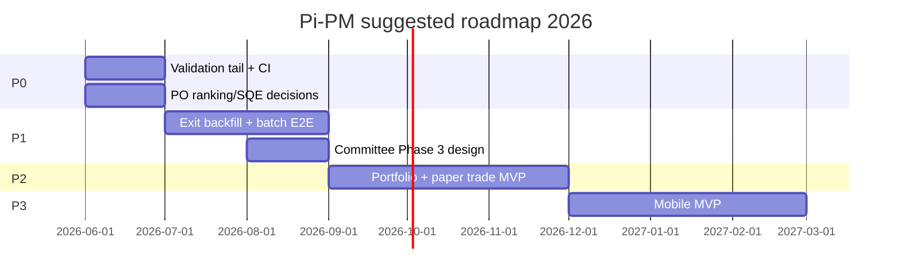

# Roadmap Recommendation

**Date:** 2026-06-05  
**Basis:** Code state, test gaps, handover docs, maturity scorecard  
**Aligned with:** [`docs/AI/11_ROADMAP/CURRENT_PRIORITIES.md`](../AI/11_ROADMAP/CURRENT_PRIORITIES.md)

---

## Priority framework

| Level | Meaning |
|-------|---------|
| **P0** | Blocks production ops or PO decisions — do now |
| **P1** | Next engineering slice — weeks |
| **P2** | Deferred until P0/P1 gates clear |
| **P3** | Future / optional |

---

## P0 — Immediate

| # | Item | Rationale | Evidence |
|---|------|-----------|----------|
| P0.1 | **Ingest validation tail** — forward bars through T+60 | Recent rankings `insufficient_data` | `docs/dailyruns/04-jun-2026/03-validation.md` |
| P0.2 | **Daily batch automation** post-close | Core ops value | `scripts/run_daily_nifty500_batch.py`, `--assume-session-done` |
| P0.3 | **PO: Ranking v2 promotion criteria** | Rank order inverted; bucket alpha partial | `docs/ranking-calibration-root-cause.md` |
| P0.4 | **PO: ARGS_QRC_USE_SQE decision** | Keep `false` until A/B signed off | `app/core/config.py:79`, `docs/qrc-sqe-ab-test-report.md` |
| P0.5 | **Merge/stabilize `feature/see-v2` → `main`** | Migration head `20260609_0018` | PLATFORM-HANDOFF |
| P0.6 | **Add CI** — pytest + alembic check | TD-C01 | TEST_GAPS |
| P0.7 | **Clean NIFTY_500 seed data** | Dummy tickers block ingest | CURRENT_PRIORITIES |

---

## P1 — Next engineering (4–8 weeks)

| # | Item | Rationale | Dependencies |
|---|------|-----------|--------------|
| P1.1 | **Exit research backfill at NIFTY_500 scale** | Informs exit policy PO decision | Batch capacity |
| P1.2 | **Daily batch E2E integration test** | TD-H03 | CI from P0.6 |
| P1.3 | **Committee Phase 3 design** | Phase 2 ~79% independence | PO sign-off Phase 2 |
| P1.4 | **Outcome attribution API** (read-only) | PO self-serve vs scripts | Low risk |
| P1.5 | **OpenAPI contract test** | API doc drift | CI |
| P1.6 | **AI research agent (Sprint 8.4)** | Doc planned — **not in code** | PO spec required |
| P1.7 | **Auth layer** (if external API/mobile) | TD-H02 | Product decision |

---

## P2 — Deferred

| # | Item | Blocker |
|---|------|---------|
| P2.1 | **Portfolio construction engine** | Exit framework + ranking calibration PO |
| P2.2 | **Paper trading services + API** | Portfolio spec; models exist |
| P2.3 | **Unified conviction / recommendation API** | Ranking v2 + product spec |
| P2.4 | **Ranking factor weight changes** | PO research gate — frozen today |
| P2.5 | **Live exit monitoring job** | Portfolio engine |
| P2.6 | **Regime-conditioned live strategy switch** | Research only today |

---

## P3 — Future

| # | Item | Notes |
|---|------|-------|
| P3.1 | **Mobile app (iOS/Android)** | 8/100 readiness — see doc 12 |
| P3.2 | **Live broker integration** | PRD out-of-scope |
| P3.3 | **Multi-tenant SaaS** | No user model |
| P3.4 | **Real-time streaming quotes** | Yahoo polling today |
| P3.5 | **Ranking v3+ / ML ranks** | Violates deterministic principle unless PO changes |

---

## Roadmap timeline (suggested)

**Note:** Timeline is **assumption** for PO planning — not committed schedule.

---

## Success metrics (near term)

| Metric | Target | Current |
|--------|--------|---------|
| Daily batch green NIFTY_500 | 5 consecutive sessions | **Unknown** — check dailyruns |
| Validation tail | No `insufficient_data` on T-5 sessions | **Fail** on 2026-06-04 |
| pytest in CI | Green on every PR | **Missing** |
| Committee independence | ≥40% effective | **~79%** Phase 2 |
| Rank monotonicity | PO-defined | **Fail** — research |

---

## What NOT to roadmap yet

- LLM ranking (violates architecture)
- Enable `ARGS_QRC_USE_SQE` globally without PO
- Production ranking v2 without walk-forward OOS (`docs/calibrated-ranking-research.md`)

---

## References

- [`docs/ROADMAP.md`](../ROADMAP.md)
- [PRODUCT_MATURITY_SCORECARD.md](./PRODUCT_MATURITY_SCORECARD.md)
- [14_PO_QUESTIONS_FOR_FOUNDER.md](./14_PO_QUESTIONS_FOR_FOUNDER.md)
