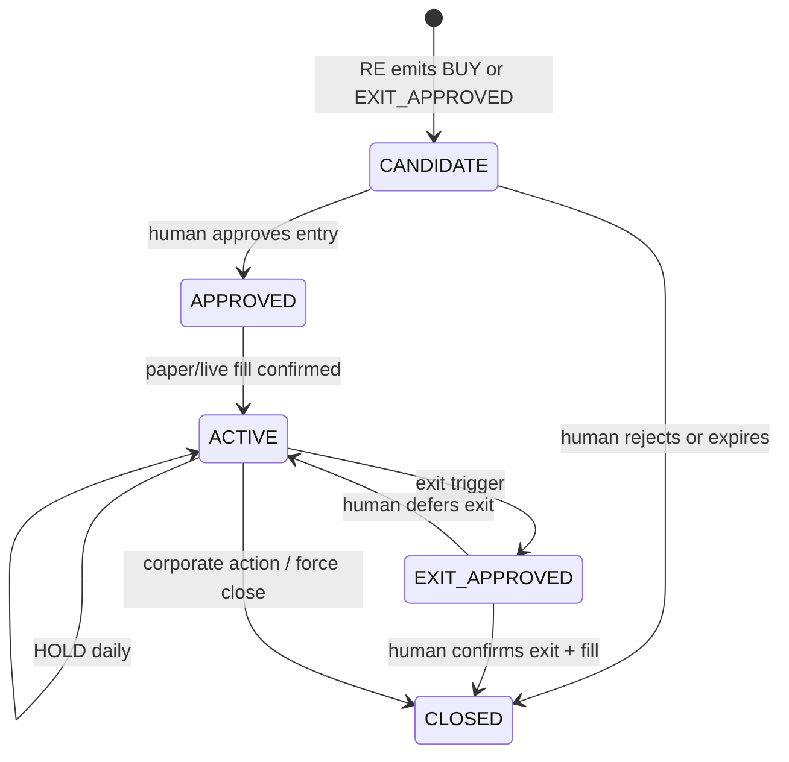
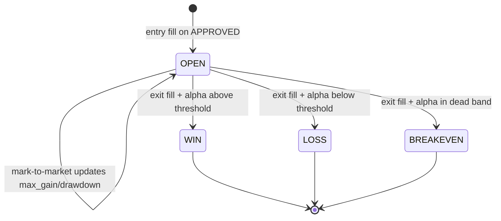

# Recommendation Lifecycle

**Version:** Phase 2.1 (PO sign-off 2026-06-04)  
**Date:** 2026-06-05  
**States:** `CANDIDATE` → `APPROVED` → `ACTIVE` → `EXIT_APPROVED` → `CLOSED`

Replaces the discovery finding that lifecycle ends at “Labelled” with no further states ([10_RECOMMENDATION_ENGINE_GAP_ANALYSIS.md](../po-discovery/10_RECOMMENDATION_ENGINE_GAP_ANALYSIS.md)).

---

## 1. State machine

---

## 2. State definitions

| State | Meaning | Who sets |
|-------|---------|----------|
| `CANDIDATE` | Machine proposed BUY or EXIT_APPROVED; awaiting human | Recommendation Engine |
| `APPROVED` | Human accepted entry; pending execution | Human ([11](./11_HUMAN_IN_LOOP_EXECUTION_PRD.md)) |
| `ACTIVE` | Position open in book (paper or live) | Portfolio engine on fill |
| `EXIT_APPROVED` | Machine exit trigger; human must confirm sell | Recommendation Engine |
| `CLOSED` | Position flat; recommendation archived | Fill + reconciliation |

**Non-lifecycle actions:** `WATCH`, `HOLD`, `REJECT` — `lifecycle_state` may remain null or `CLOSED` for REJECT on same-day scan.

---

## 3. Entry flow

| Step | Actor | System behavior |
|------|-------|-----------------|
| 1 | Batch | Ranking + validation complete |
| 2 | Recommendation Engine | Emits `action=BUY`, `lifecycle_state=CANDIDATE` for qualifying top-pool names |
| 3 | ARGS (optional) | Packet includes recommendation block; committees add research labels only |
| 4 | Human | Reviews queue: conviction, validation badge, ARGS summary |
| 5 | Human | `approve` → `APPROVED` + `recommendation_approvals` row |
| 6 | Portfolio | `POST /paper-trades` (or broker adapter) with `recommendation_result_id` |
| 7 | Portfolio | On fill → `ACTIVE`; create `recommendation_outcomes` row (`outcome_status=OPEN`); update `portfolio_context.existing_position=true` for future packets |

**Promotion rules:**

- Only `conviction_band` ≥ `MEDIUM` may enter queue (configurable).
- Max concurrent `CANDIDATE` BUYs = open slots ([05](./05_PORTFOLIO_ENGINE_PRD.md)).

---

## 4. Rejection flow

| Trigger | Result |
|---------|--------|
| Human reject | `CLOSED`, approval `REJECTED`, reason note |
| Auto `REJECT` from engine | No queue entry; audit `reason_codes` ([16_WHY_NOT_RECOMMENDED_FRAMEWORK.md](./16_WHY_NOT_RECOMMENDED_FRAMEWORK.md)) |
| Expiry | `CANDIDATE` older than 2 sessions → `CLOSED` `reason_codes=[STALE_CANDIDATE]` |
| Validation downgrade | Re-run may change `BUY`→`WATCH`; prior CANDIDATE auto-closed |

All rejections append-only in `recommendation_approvals` or `recommendation_results.reason_codes`.

---

## 5. Hold flow (ACTIVE)

| Step | Behavior |
|------|----------|
| Daily batch | Re-run recommendation for ACTIVE symbols |
| Default | `action=HOLD`, `lifecycle_state=ACTIVE` |
| ARGS | Optional lighter packet (PO: skip full committee if HOLD only) |

---

## 6. Exit flow

| Step | Actor | Behavior |
|------|-------|----------|
| 1 | Exit monitors | Rank deterioration / alpha decay / regime / time stop ([07](./07_EXIT_DECISION_FRAMEWORK.md)) |
| 2 | RE | `action=EXIT_APPROVED`, `lifecycle_state=EXIT_APPROVED` |
| 3 | Human | Confirms in queue |
| 4 | Execution | Sell paper/live fill |
| 5 | System | `CLOSED`; finalize `recommendation_outcomes` (`WIN`/`LOSS`/`BREAKEVEN`); attribution run ([06](./06_PAPER_TRADING_PRD.md)) |

**Human defer:** Stays `ACTIVE` with `advisory_flags` noting deferred exit.

---

## 7. Audit requirements

| Event | Required fields |
|-------|-----------------|
| State transition | `from_state`, `to_state`, `actor`, `timestamp`, `recommendation_result_id` |
| Machine transition | `reason_codes`, `input_hash` |
| Human transition | `approval_type`, `note`, `idempotency_key` |

Retention: minimum 7 years personal tax context (PO/legal confirm).

---

## 8. ARGS alignment

| Lifecycle | ARGS run policy |
|-----------|-----------------|
| CANDIDATE BUY | Full 5 committees + CRO |
| WATCH top-10 | Optional reduced committee set |
| HOLD ACTIVE | Packet update only if material change |
| EXIT_APPROVED | RC + CRO emphasis; no auto-sell |

Committee cannot skip human on `EXIT_APPROVED` → `CLOSED`.

---

## 9. Acceptance criteria

| ID | Criterion |
|----|-----------|
| AC-LC-01 | Illegal transitions rejected (e.g. CLOSED→ACTIVE without new CANDIDATE) |
| AC-LC-02 | Every ACTIVE has exactly one open `portfolio_positions.is_current=true` |
| AC-LC-03 | Human approval required for CANDIDATE→APPROVED and EXIT_APPROVED→CLOSED |
| AC-LC-04 | Lineage query returns full chain ranking_run → recommendation → paper_trade |

---

## 11. RecommendationOutcome lifecycle

| Event | `recommendation_outcomes` update |
|-------|----------------------------------|
| Entry fill | Insert row: `OPEN`, `entry_date`, `entry_price` |
| Daily while ACTIVE | Update `max_gain_pct`, `max_drawdown_pct` |
| Exit fill | Set `exit_date`, `exit_price`, `days_held`, `exit_reason`, `alpha_pct`, `target_hit`, `stop_hit`, final `outcome_status` |

**Linkage:** Exactly one outcome row per `recommendation_result_id` for entry recommendations; re-entry creates new `recommendation_results` chain via `prior_recommendation_id`.

---

## 12. References

- [01_RECOMMENDATION_ENGINE_PRD.md](./01_RECOMMENDATION_ENGINE_PRD.md)
- [03_RECOMMENDATION_DATA_MODEL.md](./03_RECOMMENDATION_DATA_MODEL.md) §3.4
- [16_RECOMMENDATION_PERFORMANCE_PRD.md](./16_RECOMMENDATION_PERFORMANCE_PRD.md)
- [11_HUMAN_IN_LOOP_EXECUTION_PRD.md](./11_HUMAN_IN_LOOP_EXECUTION_PRD.md)
