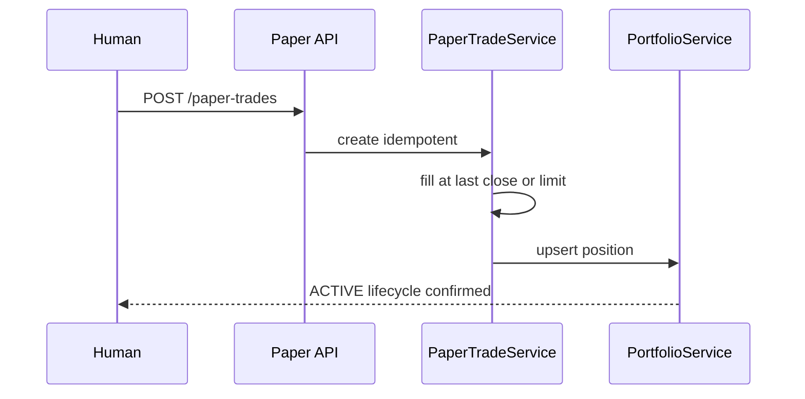

# Paper Trading — Product Requirements

**Version:** Phase 2.0  
**Date:** 2026-06-05  
**ORM baseline:** [`app/models/paper_trade.py`](../../app/models/paper_trade.py) — **no services/tests** per [11_PORTFOLIO](../po-discovery/11_PORTFOLIO_ENGINE_GAP_ANALYSIS.md)

---

## 1. Purpose

Simulate full **entry → hold → exit** lifecycle with performance attribution before live broker integration. Validates portfolio engine, recommendation lifecycle, and exit framework without capital risk.

---

## 2. Gap analysis (current model)

| Field (existing) | Used today | Product gap |
|------------------|------------|-------------|
| `stock_id` | ✓ | — |
| `side` | ✓ | Need BUY/SELL enum alignment with `TradeStatus` |
| `quantity`, `fill_price`, `fill_quantity` | ✓ | Need mark-to-market job |
| `status` | `TradeStatus` in [`app/core/constants.py`](../../app/core/constants.py) | Need state machine tests |
| `ranking_run_id` | Optional FK | **Unused** — must link `recommendation_result_id` |
| `idempotency_key` | Unique | ✓ for HITL retries |
| `metadata` JSONB | ✓ | Store conviction, reason_codes, strategy |
| `rejection_reason` | ✓ | Human/broker reject |

**Missing product fields (proposed via metadata or columns):**

- `recommendation_result_id` (FK)
- `approval_id` (FK → `recommendation_approvals`)
- `portfolio_snapshot_id` (optional)

---

## 3. Workflows

### 3.1 Entry (after human APPROVED)

### 3.2 Exit

- Triggered after human confirms `EXIT_APPROVED`.
- Sell side paper trade closes position → `lifecycle_state=CLOSED`.

### 3.3 Cancel / reject

- `status=rejected`, `rejection_reason` populated; CANDIDATE may return per [04](./04_RECOMMENDATION_LIFECYCLE.md).

---

## 4. Fill simulation rules (v1)

| Rule | Behavior |
|------|----------|
| Price | Last NSE close from `market_data` for `as_of_date` |
| Slippage | +5 bps on BUY, −5 bps on SELL (config) |
| Partial fills | Not supported v1 — full quantity or reject |
| Fees | Flat ₹20 per leg in attribution (config) |

---

## 5. Performance attribution

| Metric | Definition |
|--------|------------|
| Position P&L | `(exit_price - avg_cost) * quantity - fees` |
| Strategy attribution | Group by `metadata.strategy_name` |
| Ranking attribution | Group by `ranking_run_id` at entry |
| Conviction attribution | Bucket by `metadata.conviction_band` |
| Benchmark | NIFTY 50 or 500 total return same window |
| Holding period | Sessions ACTIVE → CLOSED |

**Reuse:** [`app/outcome_attribution/service.py`](../../app/outcome_attribution/service.py) patterns — extend for paper book ([outcome-attribution-report.md](../outcome-attribution-report.md)).

**Reports (proposed APIs):**

- `GET /api/v1/paper-trades/performance/summary`
- `GET /api/v1/paper-trades/performance/by-strategy`
- `GET /api/v1/paper-trades/performance/by-conviction`

---

## 6. APIs (proposed)

| Method | Path | Purpose |
|--------|------|---------|
| POST | `/api/v1/paper-trades` | Create/fill (idempotent) |
| GET | `/api/v1/paper-trades` | List with filters |
| GET | `/api/v1/paper-trades/{id}` | Detail |
| POST | `/api/v1/paper-trades/{id}/cancel` | Pending cancel |

**Router gap:** No paper routes in [`app/api/router.py`](../../app/api/router.py) today.

---

## 7. Daily batch hook

After recommendation + optional ARGS:

1. No auto paper trades — human gated only.
2. Nightly: mark-to-market all ACTIVE positions → update `portfolio_positions.market_value`, `weight_pct`.

---

## 8. Acceptance criteria

| ID | Criterion |
|----|-----------|
| AC-PT-01 | Duplicate `idempotency_key` returns same trade, no double fill |
| AC-PT-02 | Every filled BUY has `recommendation_result_id` + `ranking_run_id` |
| AC-PT-03 | Portfolio positions reconcile to paper trades within tolerance |
| AC-PT-04 | Attribution report matches manual spreadsheet on golden fixture |
| AC-PT-05 | Unit tests cover model + service (today **0** per po-discovery) |

---

## 9. Test plan (product)

| Story | Coverage |
|-------|----------|
| Idempotent entry | Integration |
| Sell closes position | Integration |
| Reject path | Unit |
| Attribution golden | Unit |

Aligns with [07_TEST_COVERAGE](../po-discovery/07_TEST_COVERAGE_ASSESSMENT.md) — zero portfolio tests today.

---

## 10. References

- [11_PORTFOLIO_ENGINE_GAP_ANALYSIS.md](../po-discovery/11_PORTFOLIO_ENGINE_GAP_ANALYSIS.md)
- [05_PORTFOLIO_ENGINE_PRD.md](./05_PORTFOLIO_ENGINE_PRD.md)
- [04_RECOMMENDATION_LIFECYCLE.md](./04_RECOMMENDATION_LIFECYCLE.md)
