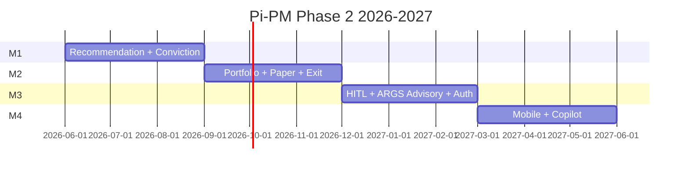

# Product Roadmap 2026–2027

**Version:** Phase 2.1 (PO sign-off 2026-06-04)  
**Date:** 2026-06-05  
**Note:** Planning artifact — not committed schedule. Aligns with [po-discovery 13](../po-discovery/13_ROADMAP_RECOMMENDATION.md).

---

## Implementation priority (PO P1–P7)

Engineering delivery order **within and across milestones** (see [13_PO_BACKLOG.md](./13_PO_BACKLOG.md)):

| Order | Deliverable | Target milestone |
|-------|-------------|------------------|
| **P1** | Recommendation tables, APIs, lifecycle states | M1 |
| **P2** | Recommendation engine rules + conviction v1.1 (no committee) | M1 |
| **P3** | `RecommendationOutcome`, performance APIs, trust metrics foundation | M1 schema → M2 analytics |
| **P4** | Portfolio engine (sizing, allocation, cash) | M2 |
| **P5** | Paper trading simulation + reconciliation | M2 |
| **P6** | Mobile screens (portfolio, recommendations, queue, research) | M4 |
| **P7** | Copilot grounded explainability + audit | M4 |

**Gate:** [PO_SIGNOFF_2026_06_04.md](./PO_SIGNOFF_2026_06_04.md), [ADR-021](../architecture/ADR-021-Recommendation-Platform-Architecture.md).

---

## Milestone overview

| Milestone | Window | Theme | Exit criteria |
|-----------|--------|-------|---------------|
| **M1** | Q3 2026 (Jun–Aug) | Recommendation core | BUY/WATCH/HOLD/EXIT/REJECT live in API + batch; conviction deterministic |
| **M2** | Q4 2026 (Sep–Nov) | Capital simulation | Portfolio + paper + exit monitors; truthful ARGS `portfolio_context` |
| **M3** | Q1 2027 (Dec–Feb) | Governance + HITL | ARGS advisory actions; approval + broker adapter contract; auth |
| **M4** | Q2 2027 (Mar–May) | Consumer surface | Mobile MVP + copilot grounded Q&A |

---

## M1 — Recommendation Core (Q3 2026)

### Objectives

1. Close recommendation lifecycle gap (25/100 → 70/100 target).
2. Insert Recommendation Engine **after validation, before ARGS**.
3. Conviction v1.1 — five deterministic factors; **committee removed** ([02](./02_CONVICTION_SCORING_PRD.md), [PO sign-off](./PO_SIGNOFF_2026_06_04.md)).

### Deliverables (product → engineering)

| # | Deliverable | PRD |
|---|-------------|-----|
| M1.1 | `recommendation_*` schema + migrations spec | [03](./03_RECOMMENDATION_DATA_MODEL.md) |
| M1.2 | Recommendation Engine v1 rules | [01](./01_RECOMMENDATION_ENGINE_PRD.md) |
| M1.3 | Conviction scoring v1 | [02](./02_CONVICTION_SCORING_PRD.md) |
| M1.4 | Lifecycle + approval audit | [04](./04_RECOMMENDATION_LIFECYCLE.md) |
| M1.5 | Packet `recommendation` block | [08](./08_AI_INVESTMENT_COMMITTEE_PRD.md) |
| M1.6 | Recommendation REST APIs + why-not | [01](./01_RECOMMENDATION_ENGINE_PRD.md) §9, [16_WHY_NOT](./16_WHY_NOT_RECOMMENDED_FRAMEWORK.md) |
| M1.7 | `recommendation_outcomes` schema | [03](./03_RECOMMENDATION_DATA_MODEL.md) §3.4 |

### Dependencies (must complete in M1)

| Dependency | Source |
|------------|--------|
| Validation tail ingest P0.1 | [po-discovery 13](../po-discovery/13_ROADMAP_RECOMMENDATION.md) |
| CI pytest gate P0.6 | TEST_GAPS |
| Ranking v2 PO criteria P0.3 | PO decision — gates HIGH band |

### M1 success metrics

| Metric | Target |
|--------|--------|
| Daily recommendation run per strategy | 100% green batch days |
| Deterministic replay tests | Pass |
| Zero LLM in conviction path | Lint + review |

---

## M2 — Capital Simulation (Q4 2026)

### Objectives

1. Portfolio engine 12/100 → 65/100.
2. Paper trading E2E with attribution.
3. Live exit monitors → `EXIT_APPROVED`.

### Deliverables

| # | Deliverable | PRD |
|---|-------------|-----|
| M2.1 | Portfolio service + APIs | [05](./05_PORTFOLIO_ENGINE_PRD.md) |
| M2.2 | Paper trade service | [06](./06_PAPER_TRADING_PRD.md) |
| M2.3 | Exit monitor job | [07](./07_EXIT_DECISION_FRAMEWORK.md) |
| M2.4 | Exit policy PO sign-off | [07](./07_EXIT_DECISION_FRAMEWORK.md) §8 |
| M2.5 | ARGS live `portfolio_context` | [08](./08_AI_INVESTMENT_COMMITTEE_PRD.md) |
| M2.6 | Outcome population + performance rollup (P3) | [16_RECOMMENDATION_PERFORMANCE](./16_RECOMMENDATION_PERFORMANCE_PRD.md) |

### Dependencies

| Dependency | Milestone |
|------------|-----------|
| M1 recommendation | Required |
| Exit research NIFTY_500 backfill P1.1 | po-discovery |

---

## M3 — Governance + HITL (Q1 2027)

### Objectives

1. ARGS advisory actions (`APPROVE`/`WATCH`/`REJECT`/`EXIT_APPROVED`).
2. Human approval APIs production-hardened.
3. Auth for external clients.
4. Broker adapter interface (paper impl + mock live).

### Deliverables

| # | Deliverable | PRD |
|---|-------------|-----|
| M3.1 | Committee advisory enum + prompts | [08](./08_AI_INVESTMENT_COMMITTEE_PRD.md) |
| M3.2 | HITL approval APIs | [11](./11_HUMAN_IN_LOOP_EXECUTION_PRD.md) |
| M3.3 | JWT/API key auth | [09](./09_MOBILE_APP_PRD.md) |
| M3.4 | Committee Phase 3 design start P1.3 | po-discovery |

---

## M4 — Consumer Surface (Q2 2027)

### Objectives

1. Mobile 8/100 → 60/100 backend readiness.
2. Copilot grounded Q&A with audit.

### Deliverables

| # | Deliverable | PRD |
|---|-------------|-----|
| M4.1 | Mobile 5 screens | [09](./09_MOBILE_APP_PRD.md) |
| M4.2 | Slim DTOs + watchlist | [09](./09_MOBILE_APP_PRD.md) |
| M4.3 | Copilot v1 | [10](./10_AI_COPILOT_PRD.md) |
| M4.4 | Push notifications (optional) | P3 |

---

## Parallel ops track (all milestones)

| Item | Priority | Source |
|------|----------|--------|
| Daily batch automation | P0 | po-discovery |
| `feature/see-v2` → `main` | P0 | PLATFORM-HANDOFF |
| `ARGS_QRC_USE_SQE` decision | P0 | config.py |
| NIFTY_500 seed cleanup | P0 | CURRENT_PRIORITIES |

---

## What we defer past 2027

- Live broker production (PRD out-of-scope)
- Multi-tenant SaaS
- LLM ranking / ML rank production
- Real-time streaming quotes

---

## Gantt (illustrative)

---

## References

- [15_EXECUTIVE_PRODUCT_STRATEGY.md](./15_EXECUTIVE_PRODUCT_STRATEGY.md)
- [13_PO_BACKLOG.md](./13_PO_BACKLOG.md)
- [14_ARCHITECTURE_IMPACT_ANALYSIS.md](./14_ARCHITECTURE_IMPACT_ANALYSIS.md)
