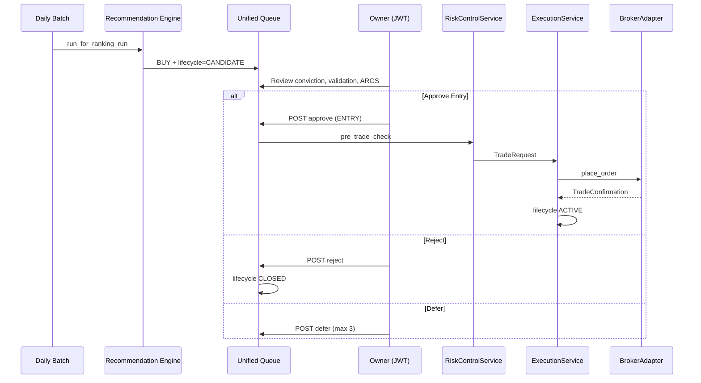
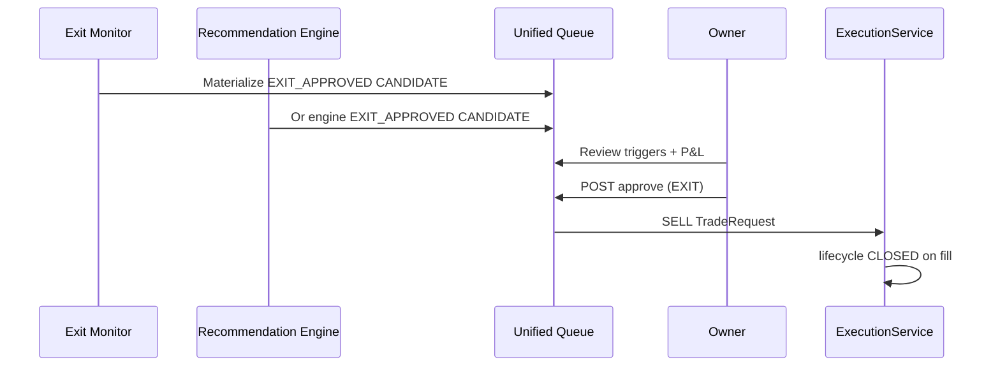
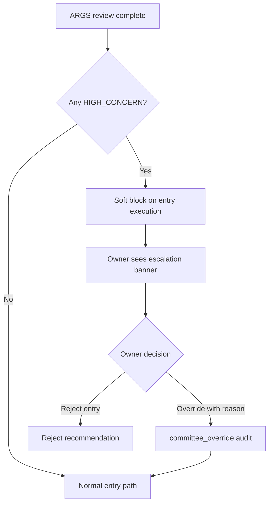

# Human-in-the-Loop Live Investing — Product Requirements

**Version:** Track I — Phase 3.0  
**Date:** 2026-06-05  
**Status:** Architecture approved (ADR-030)  
**Principle:** Machines recommend; **humans approve every capital action**; system records; broker executes only after approval.  
**Extends:** [11_HUMAN_IN_LOOP_EXECUTION_PRD.md](./11_HUMAN_IN_LOOP_EXECUTION_PRD.md), [04_RECOMMENDATION_LIFECYCLE.md](./04_RECOMMENDATION_LIFECYCLE.md)

---

## 1. Purpose

Define human approval workflows for the transition from **paper trading (S0)** to **human-approved live investing (S1)** without auto-trading or engine changes.

---

## 2. Problem statement

| Today (paper) | Gap for live |
|---------------|--------------|
| Approve then manually call `/trades/entry` | Approval and execution disconnected |
| Exit monitor confirm ≠ sell queue | Two exit UIs |
| ARGS HIGH_CONCERN advisory only | No explicit live override policy |
| Pilot auto-approve for unattended paper | Must never apply to live |
| actor_id from JWT | ✅ Ready (ADR-027) |

---

## 3. Maturity stages

| Stage | Human approval | Execution |
|-------|----------------|-----------|
| S0 Paper | Required (or pilot auto for research only) | Simulated |
| S1 Live | **Required for every entry and exit** | BrokerAdapter after risk gate |
| S2 Broker-integrated | Same | Automated placement post-approval |

---

## 4. Entry Approval Workflow

### Entry checklist (owner UI)

- [ ] Conviction band ≥ MEDIUM
- [ ] Validation badge green
- [ ] ARGS summary reviewed (disagreement noted, not blocking unless HIGH_CONCERN)
- [ ] Slot available under regime limits
- [ ] Risk controls green

---

## 5. Exit Approval Workflow

**Defer exit:** Max 3 per position; logged in approval trail. On 4th trigger, urgency escalates to CRITICAL.

---

## 6. Portfolio Review Workflow

Daily post-batch (no trade unless limits breached):

| Step | Owner action | System |
|------|--------------|--------|
| 1 | Open portfolio dashboard | NAV, positions, recon status |
| 2 | Review reconciliation | PASS / WARNING / FAIL |
| 3 | Review risk utilization | % of caps used |
| 4 | Sign-off or escalate | `portfolio_review_signoffs` audit row |

Analytics endpoints blocked on recon FAIL (existing ADR-024) — owner must resolve before new entries.

---

## 7. Risk Escalation Workflow

| Severity | Trigger | Owner action | System |
|----------|---------|--------------|--------|
| INFO | 80% of daily loss limit | Notification | Log only |
| WARN | Limit breached (soft) | Acknowledge within 1h | Block new entries |
| CRITICAL | Emergency stop or hard breach | Immediate review | Block all orders |
| RESOLVED | Owner acknowledges + plan | Resume or remain stopped | Audit close |

---

## 8. HIGH_CONCERN Escalation Workflow

Per ADR-023, committee cannot change conviction. For **live S1+**:

**Exit path:** HIGH_CONCERN does not block exits (capital protection priority).

---

## 9. Roles (ADR-027)

| Action | OWNER | VIEWER | ADMIN |
|--------|-------|--------|-------|
| View queue | ✅ | ✅ | ✅ |
| Approve entry/exit | ✅ | ❌ | ✅ |
| Defer | ✅ | ❌ | ✅ |
| HIGH_CONCERN override | ✅ | ❌ | ✅ |
| Portfolio review sign-off | ✅ | ❌ | ✅ |
| Emergency stop | ✅ | ❌ | ✅ |

---

## 10. Acceptance criteria

| ID | Criterion |
|----|-----------|
| AC-HITL-L01 | No live order without APPROVED approval row |
| AC-HITL-L02 | Entry and exit share unified queue by lifecycle=CANDIDATE |
| AC-HITL-L03 | HIGH_CONCERN soft-blocks entry until override or reject |
| AC-HITL-L04 | Pilot auto-approve disabled when execution_mode=LIVE |
| AC-HITL-L05 | Approval audit export includes actor_id, timestamp, decision |
| AC-HITL-L06 | Defer limited to 3 per recommendation/position |

---

## 11. References

- [ADR-030](../architecture/ADR-030-Live-Investing-Architecture.md)
- [21_EXECUTION_WORKFLOW_PRD.md](./21_EXECUTION_WORKFLOW_PRD.md)
- [20_RISK_CONTROL_PRD.md](./20_RISK_CONTROL_PRD.md)
