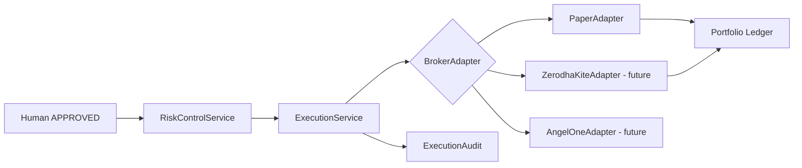

# Broker Adapter — Product Requirements

**Version:** Track I — Phase 3.0  
**Date:** 2026-06-05  
**Status:** Design only — **no broker implementation**  
**Principle:** One execution port; paper and live implement the same contract.  
**Related:** [ADR-030](../architecture/ADR-030-Live-Investing-Architecture.md), `app/execution/adapter.py`

---

## 1. Purpose

Define the broker abstraction layer so Pi-PM can swap paper simulation for live broker APIs without changing recommendation, approval, or portfolio calculation logic.

---

## 2. Problem statement

| Today | Target |
|-------|--------|
| `PaperTradeService` called directly from API | `ExecutionService` → `BrokerAdapter` |
| No order status polling | Normalized `OrderStatus` lifecycle |
| No broker reconciliation | `get_positions()` for recon |
| No idempotent client order IDs | Required on every request |

---

## 3. Architecture

---

## 4. Interface contract

Python protocol: `app/execution/adapter.py`

| Method | Direction | Purpose |
|--------|-----------|---------|
| `place_order(request)` | Outbound | Submit order after approval |
| `get_order_status(client_order_id)` | Inbound | Poll fill state |
| `cancel_order(client_order_id)` | Outbound | Cancel open order |
| `get_positions(portfolio_id)` | Inbound | Holdings for reconciliation |
| `get_cash_balance(portfolio_id)` | Inbound | Pre-trade cash check |
| `health_check()` | Inbound | Broker connectivity |

---

## 5. Data types

Defined in `app/execution/models.py`:

### TradeRequest (outbound)

| Field | Type | Required | Notes |
|-------|------|----------|-------|
| `client_order_id` | string | Yes | Idempotency key; UUID recommended |
| `portfolio_id` | UUID | Yes | Tenant scope |
| `recommendation_result_id` | UUID | Yes | Lineage |
| `approval_id` | UUID | Yes | HITL proof |
| `symbol` | string | Yes | NSE symbol e.g. `RELIANCE.NS` |
| `side` | BUY \| SELL | Yes | |
| `quantity` | Decimal | Yes | Full shares only v1 |
| `order_type` | MARKET \| LIMIT | Yes | Default MARKET |
| `limit_price` | Decimal | No | Required if LIMIT |
| `idempotency_key` | string | No | Duplicate-safe retries |

### TradeConfirmation (inbound)

| Field | Type | Notes |
|-------|------|-------|
| `client_order_id` | string | Echo |
| `broker_order_id` | string | Broker-native ID |
| `status` | OrderStatus | Normalized |
| `fill_quantity` | Decimal | |
| `fill_price` | Decimal | Average fill |
| `filled_at` | datetime | |
| `fees` | Decimal | Brokerage + taxes |
| `rejection_reason` | string | If REJECTED |

### OrderStatus (normalized)

`pending` → `submitted` → `partially_filled` → `filled` | `cancelled` | `rejected` | `expired`

### ExecutionAudit (compliance)

Immutable record linking: approval → request → confirmations → ledger entries.

---

## 6. Adapter implementations (planned)

| Adapter | Stage | Status |
|---------|-------|--------|
| `PaperAdapter` | S0 | Future refactor of `PaperTradeService` |
| `ZerodhaKiteAdapter` | S2 | PO TBD — not implemented |
| `AngelOneAdapter` | S2 | PO TBD — not implemented |
| `IciciDirectAdapter` | S2 | PO TBD — not implemented |
| `MockBrokerAdapter` | Test | Contract tests only |

---

## 7. Idempotency rules

| Rule | Behavior |
|------|----------|
| Same `client_order_id` + same payload | Return existing confirmation |
| Same `client_order_id` + different payload | Reject with conflict error |
| Retry after timeout | Safe — adapter must dedupe |

---

## 8. Reconciliation

Daily job compares:

| Source | Target |
|--------|--------|
| `BrokerAdapter.get_positions()` | `portfolio_positions` |
| `BrokerAdapter.get_cash_balance()` | `portfolio_cash_ledger` |
| Sum | `portfolio_nav_history` |

Mismatch → recon FAIL → block new entries (ADR-024).

---

## 9. Security

| Requirement | Implementation |
|-------------|----------------|
| API keys | Secret manager; never in repo |
| OAuth tokens | Encrypted at rest; refresh rotation |
| Order signing | Broker-specific; isolated in adapter |
| Audit | Every `place_order` → `execution_audits` |

---

## 10. Acceptance criteria

| ID | Criterion |
|----|-----------|
| AC-BRK-01 | `BrokerAdapter` protocol documented and typed |
| AC-BRK-02 | Mock adapter passes contract test suite |
| AC-BRK-03 | No direct broker calls outside adapter |
| AC-BRK-04 | `client_order_id` idempotency verified |
| AC-BRK-05 | Paper and live share identical `TradeRequest` shape |

---

## 11. Out of scope

- Broker vendor selection
- Live API credentials
- Partial fill handling v1
- Bracket orders / GTT / AMO
- Options or F&O
