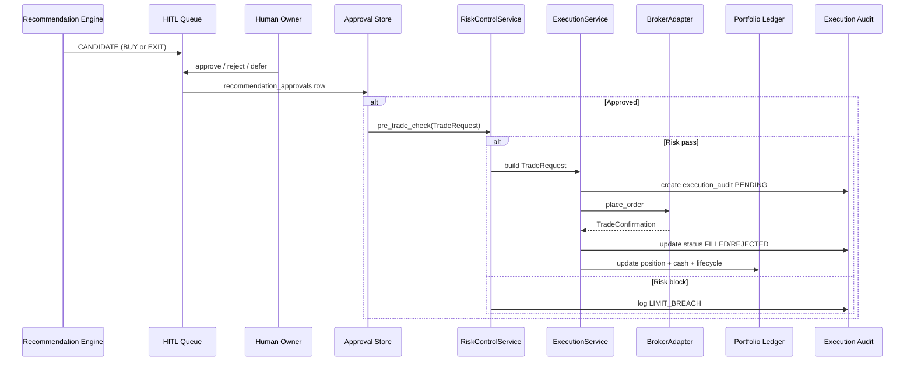

# Execution Workflow — Product Requirements

**Version:** Track I — Phase 3.0  
**Date:** 2026-06-05  
**Status:** Design approved (ADR-030)  
**Related:** [18_HUMAN_IN_LOOP_LIVE_INVESTING_PRD.md](./18_HUMAN_IN_LOOP_LIVE_INVESTING_PRD.md), [19_BROKER_ADAPTER_PRD.md](./19_BROKER_ADAPTER_PRD.md)

---

## 1. Purpose

Define end-to-end execution workflows from machine recommendation through human approval, risk gating, broker placement, and ledger update — for paper (S0) and live (S1+) modes.

---

## 2. Execution modes

| Mode | `execution_mode` | Adapter | Human approve |
|------|------------------|---------|---------------|
| Paper | `PAPER` | PaperAdapter | Required (pilot auto optional) |
| Live | `LIVE` | BrokerAdapter | **Always required** |

Set per portfolio in `portfolio_configs` or `user_preferences`.

---

## 3. Master execution sequence



---

## 4. Entry execution workflow

| Step | Component | Action |
|------|-----------|--------|
| 1 | Recommendation Engine | Emit `BUY`, `lifecycle=CANDIDATE` |
| 2 | Unified Queue | Surface to owner |
| 3 | Owner | Review + approve (`approval_type=ENTRY`) |
| 4 | Approval Store | `lifecycle=APPROVED`, audit row |
| 5 | ExecutionService | Build `TradeRequest` from allocation |
| 6 | RiskControlService | Pre-trade checks |
| 7 | BrokerAdapter | `place_order` |
| 8 | Portfolio Ledger | Open position, cash debit, `lifecycle=ACTIVE` |
| 9 | Outcome | Create `recommendation_outcomes` OPEN |

**Idempotency:** `client_order_id` = hash(approval_id + side).

---

## 5. Exit execution workflow

| Step | Component | Action |
|------|-----------|--------|
| 1 | Exit Monitor / RE | Materialize `EXIT_APPROVED`, `lifecycle=CANDIDATE` |
| 2 | Owner | Confirm exit (`approval_type=EXIT`) |
| 3 | ExecutionService | Build SELL `TradeRequest` |
| 4 | RiskControlService | Allow SELL even if entries blocked |
| 5 | BrokerAdapter | `place_order` SELL |
| 6 | Portfolio Ledger | Close position, cash credit, `lifecycle=CLOSED` |
| 7 | Outcome | Update outcome WIN/LOSS/BREAKEVEN |

---

## 6. Portfolio review workflow (non-trading)

Daily after batch — no `BrokerAdapter` call:

1. Reconciliation run
2. NAV snapshot
3. Risk utilization report
4. Owner sign-off → `portfolio_review_signoffs`

Blocks new entries if recon FAIL (existing).

---

## 7. Risk escalation workflow

See [20_RISK_CONTROL_PRD.md](./20_RISK_CONTROL_PRD.md). ExecutionService checks emergency state before every `place_order`.

---

## 8. HIGH_CONCERN escalation workflow

| Step | Behavior |
|------|----------|
| 1 | ARGS completes; any committee `HIGH_CONCERN` |
| 2 | Entry `TradeRequest` blocked at RiskControlService |
| 3 | UI shows escalation with committee details |
| 4 | Owner rejects → `lifecycle=CLOSED` |
| 5 | Owner overrides → `committee_override` audit → proceed |
| 6 | Exit orders unaffected |

---

## 9. Failure handling

| Failure | Behavior |
|---------|----------|
| Broker timeout | Retry with same `client_order_id`; poll `get_order_status` |
| Broker reject | Audit REJECTED; notify owner; lifecycle stays APPROVED |
| Partial fill v1 | Treat as reject; manual reconciliation |
| Risk block | No order sent; owner notified |

---

## 10. Lineage (compliance)

Every execution must trace:

```
ranking_run_id
  → recommendation_run_id
    → recommendation_result_id
      → recommendation_approval_id
        → execution_audit_id
          → paper_trade_id | broker_order_id
            → portfolio_position_id
              → recommendation_outcome_id
```

---

## 11. Acceptance criteria

| ID | Criterion |
|----|-----------|
| AC-EXEC-01 | Single ExecutionService entry point for all fills |
| AC-EXEC-02 | Paper and live share workflow; adapter differs only |
| AC-EXEC-03 | Full lineage on every execution_audit |
| AC-EXEC-04 | Risk gate runs before every place_order |
| AC-EXEC-05 | LIVE mode rejects pilot_auto_approve |
| AC-EXEC-06 | Exit and entry use same approval → execute pattern |

---

## 12. Implementation mapping (future)

| Component | Path (planned) |
|-----------|----------------|
| ExecutionService | `app/services/execution_service.py` |
| RiskControlService | `app/services/risk_control_service.py` |
| BrokerAdapter | `app/execution/adapter.py` |
| PaperAdapter | Refactor from `PaperTradeService` |

**No implementation in Track I-a** — design and PRD only.
